# Slide 10: Strategy Pattern

---

## 📖 Definição

> **"Define uma família de algoritmos, encapsula cada um deles e os torna intercambiáveis"**

**Problema:** Você tem múltiplas formas de fazer a mesma coisa e precisa escolher em runtime

---

## 🎯 Estrutura do Pattern


---

## 💡 Exemplo Real: Cálculo de Desconto

### Cenário:
- E-commerce com diferentes tipos de desconto
- VIP: 20% desconto
- Black Friday: 50% desconto
- Primeira Compra: 15% desconto
- Frete Grátis: sem desconto no valor, mas frete grátis

---

## ✅ Implementação

```java
// 1️⃣ Interface Strategy
public interface DiscountStrategy {
    BigDecimal calculate(BigDecimal price);
    String getDescription();
}

// 2️⃣ Estratégias Concretas
@Component("VIP")
public class VipDiscountStrategy implements DiscountStrategy {
    @Override
    public BigDecimal calculate(BigDecimal price) {
        return price.multiply(BigDecimal.valueOf(0.80)); // 20% off
    }
    
    @Override
    public String getDescription() {
        return "VIP - 20% de desconto";
    }
}

@Component("BLACK_FRIDAY")
public class BlackFridayDiscountStrategy implements DiscountStrategy {
    @Override
    public BigDecimal calculate(BigDecimal price) {
        return price.multiply(BigDecimal.valueOf(0.50)); // 50% off
    }
    
    @Override
    public String getDescription() {
        return "Black Friday - 50% de desconto";
    }
}

@Component("FIRST_PURCHASE")
public class FirstPurchaseDiscountStrategy implements DiscountStrategy {
    @Override
    public BigDecimal calculate(BigDecimal price) {
        return price.multiply(BigDecimal.valueOf(0.85)); // 15% off
    }
    
    @Override
    public String getDescription() {
        return "Primeira Compra - 15% de desconto";
    }
}

// 3️⃣ Context (usa as estratégias)
@Service
@RequiredArgsConstructor
public class PricingService {
    private final Map<String, DiscountStrategy> strategies;
    
    public BigDecimal calculateFinalPrice(BigDecimal price, String discountType) {
        DiscountStrategy strategy = strategies.get(discountType);
        return strategy != null ? strategy.calculate(price) : price;
    }
}
```

---

## 🔄 Fluxo de Execução


---

## 🎯 Uso em Controller

```java
@RestController
@RequestMapping("/api/pricing")
@RequiredArgsConstructor
public class PricingController {
    private final PricingService pricingService;
    private final Map<String, DiscountStrategy> strategies;
    
    @GetMapping("/calculate")
    public ResponseEntity<PriceResponse> calculate(
            @RequestParam BigDecimal price,
            @RequestParam String discountType) {
        
        BigDecimal finalPrice = pricingService.calculateFinalPrice(price, discountType);
        DiscountStrategy strategy = strategies.get(discountType);
        
        return ResponseEntity.ok(new PriceResponse(
            price,
            finalPrice,
            strategy.getDescription()
        ));
    }
    
    @GetMapping("/strategies")
    public ResponseEntity<List<String>> listStrategies() {
        return ResponseEntity.ok(new ArrayList<>(strategies.keySet()));
    }
}
```

---

## 📊 Comparação: Sem vs Com Strategy

```mermaid
graph TD
    subgraph "❌ Sem Strategy Pattern"
        A1[PricingService<br/>if/else gigante] -->|viola OCP| B1[Difícil adicionar<br/>novo tipo]
        A1 -->|viola SRP| C1[Muitas<br/>responsabilidades]
    end
    
    subgraph "✅ Com Strategy Pattern"
        A2[PricingService<br/>delega] -->|respeita OCP| B2[Fácil adicionar<br/>nova estratégia]
        A2 -->|respeita SRP| C2[Responsabilidade<br/>única]
        
        D2[VipStrategy]
        E2[BlackFridayStrategy]
        F2[NovaStrategy]
        
        A2 --> D2
        A2 --> E2
        A2 --> F2
    end
    
    style A1 fill:#f44336,stroke:#c62828,color:#fff
    style A2 fill:#4CAF50,stroke:#2E7D32,color:#fff
```



---

## 🎯 Vantagens


---

## 🚨 Quando Usar?

```mermaid
flowchart TD
    A[Problema] --> B{Tem múltiplas<br/>formas de fazer?}
    B -->|Não| X[Não use Strategy]
    B -->|Sim| C{Escolha em<br/>runtime?}
    C -->|Não| X
    C -->|Sim| D{Algoritmos<br/>intercambiáveis?}
    D -->|Sim| E[✅ Use Strategy]
    D -->|Não| F{Apenas implementação<br/>diferente?}
    F -->|Sim| E
    F -->|Não| X
    
    style E fill:#4CAF50,stroke:#2E7D32,color:#fff
    style X fill:#f44336,stroke:#c62828,color:#fff
```



---

## 🛠️ Variações do Pattern

### Com Enum

```java
public enum DiscountType {
    VIP(new VipDiscountStrategy()),
    BLACK_FRIDAY(new BlackFridayDiscountStrategy()),
    FIRST_PURCHASE(new FirstPurchaseDiscountStrategy());
    
    private final DiscountStrategy strategy;
    
    DiscountType(DiscountStrategy strategy) {
        this.strategy = strategy;
    }
    
    public BigDecimal calculate(BigDecimal price) {
        return strategy.calculate(price);
    }
}
```

### Com Factory

```java
@Component
public class DiscountStrategyFactory {
    public DiscountStrategy getStrategy(String type) {
        return switch(type) {
            case "VIP" -> new VipDiscountStrategy();
            case "BLACK_FRIDAY" -> new BlackFridayDiscountStrategy();
            default -> new NoDiscountStrategy();
        };
    }
}
```

---

## 💡 Dica do Instrutor

```
⚠️ Quando usar Strategy:
✅ Múltiplos if/else ou switch para escolher algoritmo
✅ Comportamentos que podem ser trocados dinamicamente
✅ Família de algoritmos relacionados
✅ Necessidade de testar algoritmos separadamente

❌ Quando NÃO usar:
- Apenas 1 ou 2 variações simples
- Lógica não muda em runtime
- Adiciona complexidade desnecessária
```
