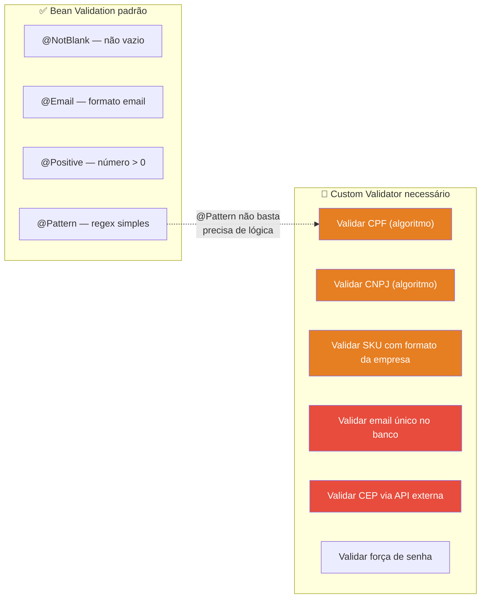
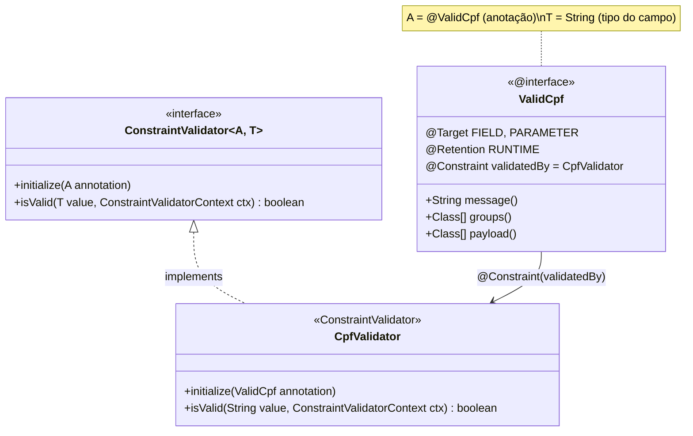
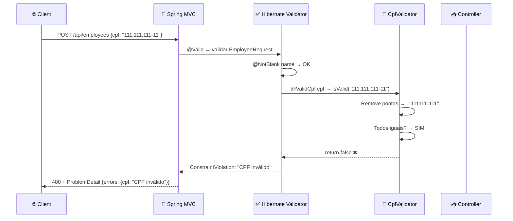
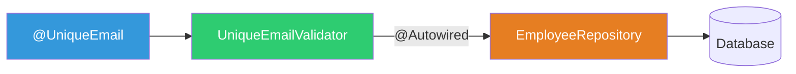
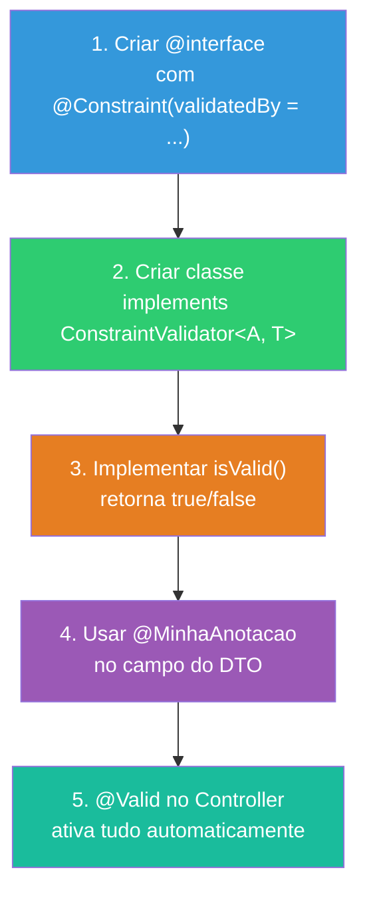

# Slide 11: Custom Validators

**Horário:** 11:50 - 12:00 (continuação)

---

## 🔧 Quando o Bean Validation não basta

`@NotBlank`, `@Email`, `@Positive` cobrem validações **genéricas**. Mas e quando você precisa de algo **específico do negócio**?



---

## Anatomia de um Custom Validator

Um Custom Validator tem **2 partes**: a **Anotação** e o **Validator**.



---

## Criando @ValidCpf — Passo a Passo

### Passo 1: Criar a Anotação

```java
@Target({ElementType.FIELD, ElementType.PARAMETER})  // Onde pode ser usada
@Retention(RetentionPolicy.RUNTIME)                   // Disponível em runtime
@Documented                                            // Aparece no Javadoc
@Constraint(validatedBy = CpfValidator.class)          // LIGA à classe validator
public @interface ValidCpf {
    String message() default "CPF inválido";           // Mensagem de erro padrão
    Class<?>[] groups() default {};                    // Grupos de validação
    Class<? extends Payload>[] payload() default {};   // Metadados (severidade)
}
```

> Esses 3 métodos (`message`, `groups`, `payload`) são **obrigatórios** pela especificação. Sem eles, o Hibernate Validator lança erro.

---

### Passo 2: Criar o Validator

```java
public class CpfValidator implements ConstraintValidator<ValidCpf, String> {

    @Override
    public void initialize(ValidCpf annotation) {
        // Pode ler parâmetros da anotação aqui (se houver)
    }

    @Override
    public boolean isValid(String cpf, ConstraintValidatorContext context) {
        if (cpf == null || cpf.isBlank()) return false;

        // Remove pontuação (aceita "123.456.789-09" e "12345678909")
        String digits = cpf.replaceAll("\\D", "");

        // Deve ter exatamente 11 dígitos
        if (digits.length() != 11) return false;

        // Não pode ser todos iguais (111.111.111-11, 222.222.222-22, etc.)
        if (digits.chars().distinct().count() == 1) return false;

        // Cálculo do PRIMEIRO dígito verificador
        int sum = 0;
        for (int i = 0; i < 9; i++) {
            sum += Character.getNumericValue(digits.charAt(i)) * (10 - i);
        }
        int firstDigit = 11 - (sum % 11);
        if (firstDigit >= 10) firstDigit = 0;
        if (Character.getNumericValue(digits.charAt(9)) != firstDigit) return false;

        // Cálculo do SEGUNDO dígito verificador
        sum = 0;
        for (int i = 0; i < 10; i++) {
            sum += Character.getNumericValue(digits.charAt(i)) * (11 - i);
        }
        int secondDigit = 11 - (sum % 11);
        if (secondDigit >= 10) secondDigit = 0;

        return Character.getNumericValue(digits.charAt(10)) == secondDigit;
    }
}
```

---

### Passo 3: Usar no DTO

```java
public record EmployeeRequest(
    @NotBlank(message = "Name is required")
    @Size(min = 3, max = 100)
    String name,

    @ValidCpf                                // ← Custom Validator!
    String cpf,

    @NotBlank
    @Email(message = "Invalid email")
    String email,

    @NotNull
    @Positive(message = "Salary must be positive")
    BigDecimal salary
) {}
```

> **Pronto!** Agora, ao usar `@Valid` no Controller, o `CpfValidator` é chamado automaticamente.

---

## Fluxo de Execução do Custom Validator



---

## Outro Exemplo: @ValidSku

```java
@Target({ElementType.FIELD, ElementType.PARAMETER})
@Retention(RetentionPolicy.RUNTIME)
@Constraint(validatedBy = SkuValidator.class)
public @interface ValidSku {
    String message() default "SKU must follow pattern: XXX-0000";
    Class<?>[] groups() default {};
    Class<? extends Payload>[] payload() default {};
}

public class SkuValidator implements ConstraintValidator<ValidSku, String> {
    // Regex compilado uma vez (performance)
    private static final Pattern SKU_PATTERN = Pattern.compile("^[A-Z]{3}-\\d{4}$");

    @Override
    public boolean isValid(String sku, ConstraintValidatorContext context) {
        if (sku == null || sku.isBlank()) return false;
        return SKU_PATTERN.matcher(sku).matches();
    }
}
```

> **Por que não usar `@Pattern(regexp = "^[A-Z]{3}-\\d{4}$")` diretamente?**  
> Pode usar! Mas um Custom Validator dá mais controle: mensagem customizada, lógica extra (consultar banco), reutilização com nome semântico (`@ValidSku` é mais legível que `@Pattern`).

---

## Advanced: Validator que acessa o Banco

```java
// ConstraintValidator PODE injetar @Autowired com Spring!
public class UniqueEmailValidator implements ConstraintValidator<UniqueEmail, String> {

    @Autowired // ← Spring injeta automaticamente!
    private EmployeeRepository repository;

    @Override
    public boolean isValid(String email, ConstraintValidatorContext context) {
        if (email == null) return true; // @NotBlank cuida do null
        return !repository.existsByEmail(email); // Consulta o banco!
    }
}
```



> **Cuidado:** Validators que acessam banco rodam a cada requisição. Considere performance e transactions.

---

## 📏 Receita para criar qualquer Custom Validator



---

## 🎯 Exercício Mental

> Que outros Custom Validators fariam sentido em uma aplicação empresarial?

| Validator | Lógica | Acessa banco? |
|-----------|--------|:-------------:|
| `@ValidCpf` | Algoritmo de dígitos verificadores | Não |
| `@ValidCnpj` | Algoritmo de dígitos verificadores (14 dígitos) | Não |
| `@ValidPhone` | Regex `(XX) XXXXX-XXXX` ou `(XX) XXXX-XXXX` | Não |
| `@UniqueEmail` | `repository.existsByEmail(email)` | ✅ Sim |
| `@ValidCep` | Formato + chamada a API ViaCEP | ✅ Sim (API externa) |
| `@StrongPassword` | Min 8 chars, maiúscula, número, especial | Não |
| `@ValidDateRange` | Data início < data fim (class-level validator) | Não |

---

## 💡 Dica do Instrutor

Criar um Custom Validator simples ao vivo (`@ValidSku` ou `@StrongPassword`). Mostrar que o erro aparece no ProblemDetail automaticamente, sem nenhum código extra no Controller.
