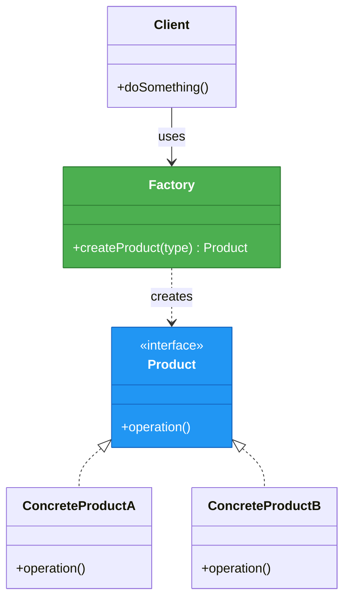
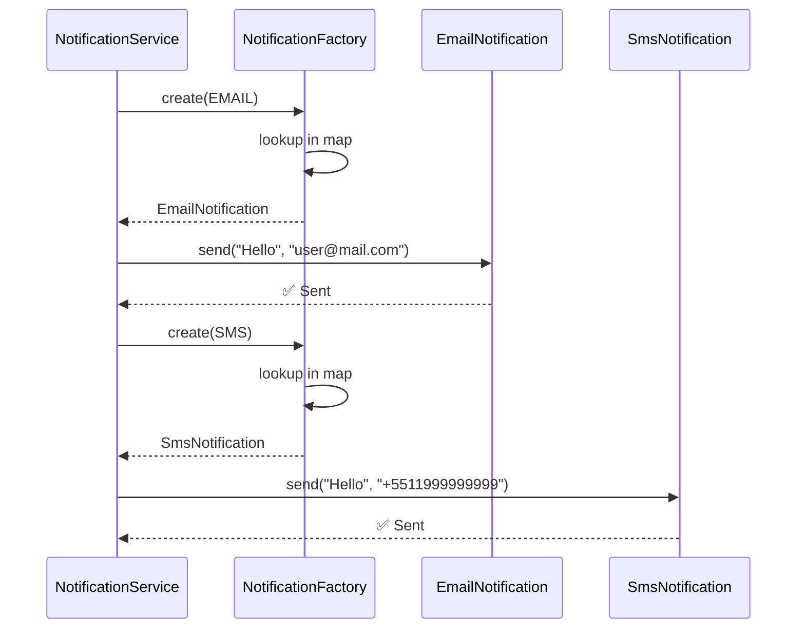
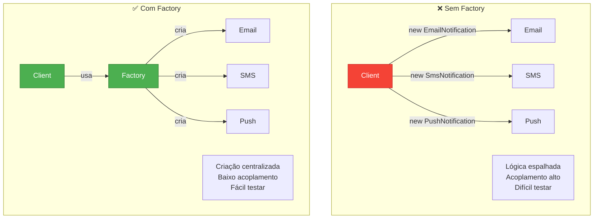
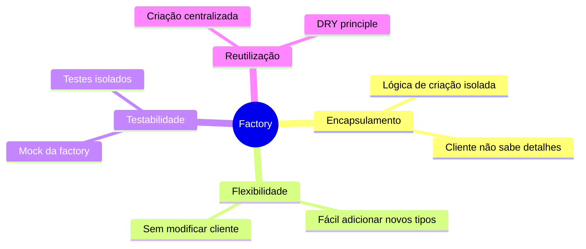
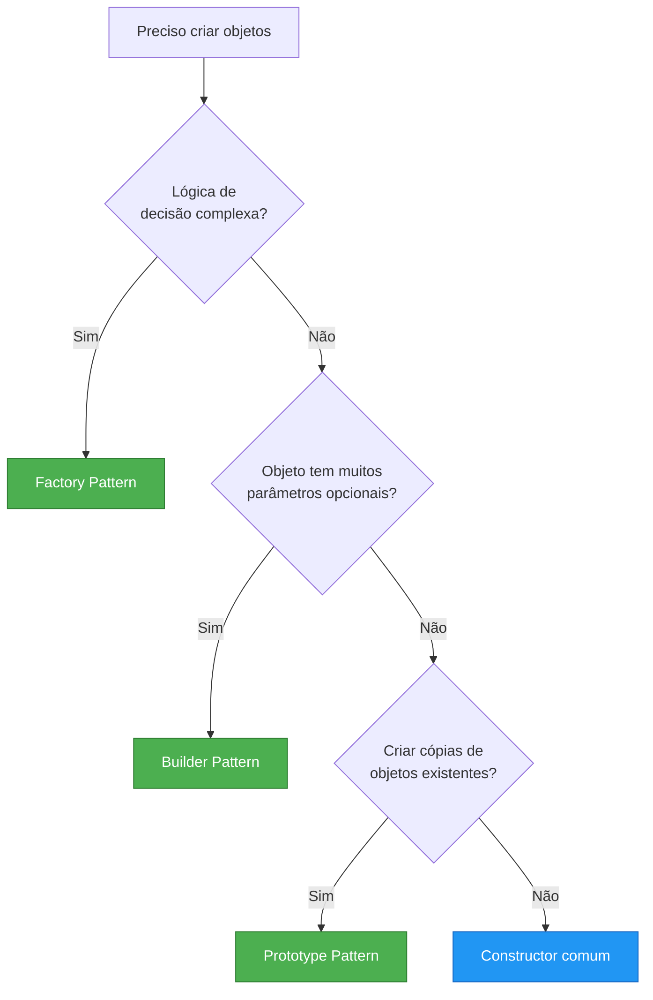

# Slide 11: Factory Pattern

---

## 📖 Definição

> **"Define uma interface para criar objetos, mas deixa as subclasses decidirem qual classe instanciar"**

**Problema:** Criação de objetos complexa ou com lógica de decisão

---

## 🎯 Estrutura do Pattern



---

## 💡 Exemplo Real: Sistema de Notificações

### Cenário:
- Enviar notificações por diferentes canais
- Email, SMS, Push, WhatsApp
- Lógica de criação centralizada

---

## ✅ Implementação

```java
// 1️⃣ Interface do Produto
public interface Notification {
    void send(String message, String recipient);
    NotificationType getType();
}

// 2️⃣ Produtos Concretos
@Component
public class EmailNotification implements Notification {
    @Override
    public void send(String message, String recipient) {
        System.out.println("Sending EMAIL to " + recipient + ": " + message);
        // Lógica de envio de email
    }
    
    @Override
    public NotificationType getType() {
        return NotificationType.EMAIL;
    }
}

@Component
public class SmsNotification implements Notification {
    @Override
    public void send(String message, String recipient) {
        System.out.println("Sending SMS to " + recipient + ": " + message);
        // Lógica de envio de SMS
    }
    
    @Override
    public NotificationType getType() {
        return NotificationType.SMS;
    }
}

@Component
public class PushNotification implements Notification {
    @Override
    public void send(String message, String recipient) {
        System.out.println("Sending PUSH to " + recipient + ": " + message);
        // Lógica de envio de Push
    }
    
    @Override
    public NotificationType getType() {
        return NotificationType.PUSH;
    }
}

// 3️⃣ Enum
public enum NotificationType {
    EMAIL, SMS, PUSH, WHATSAPP
}

// 4️⃣ Factory
@Component
public class NotificationFactory {
    private final Map<NotificationType, Notification> notifications;
    
    // Spring injeta todas as implementações de Notification
    public NotificationFactory(List<Notification> notificationList) {
        this.notifications = notificationList.stream()
            .collect(Collectors.toMap(
                Notification::getType,
                Function.identity()
            ));
    }
    
    public Notification create(NotificationType type) {
        Notification notification = notifications.get(type);
        if (notification == null) {
            throw new IllegalArgumentException("Notification type not supported: " + type);
        }
        return notification;
    }
}
```

---

## 🔄 Fluxo de Criação



---

## 🎯 Uso em Service

```java
@Service
@RequiredArgsConstructor
public class NotificationService {
    private final NotificationFactory factory;
    
    public void notify(String message, String recipient, NotificationType type) {
        Notification notification = factory.create(type);
        notification.send(message, recipient);
    }
    
    public void notifyAll(String message, String recipient) {
        // Enviar por todos os canais
        for (NotificationType type : NotificationType.values()) {
            try {
                Notification notification = factory.create(type);
                notification.send(message, recipient);
            } catch (IllegalArgumentException e) {
                // Log: tipo não suportado
            }
        }
    }
}
```

---

## 📊 Factory vs New



---

## 🏭 Variações do Factory Pattern

### 1️⃣ Simple Factory

```java
public class PaymentFactory {
    public static Payment create(PaymentType type) {
        return switch(type) {
            case CREDIT_CARD -> new CreditCardPayment();
            case PIX -> new PixPayment();
            case BOLETO -> new BoletoPayment();
        };
    }
}
```

### 2️⃣ Factory Method (GoF)

```java
public abstract class PaymentProcessor {
    public void process() {
        Payment payment = createPayment();  // Factory Method
        payment.validate();
        payment.execute();
    }
    
    protected abstract Payment createPayment();  // Subclass decide
}

public class CreditCardProcessor extends PaymentProcessor {
    @Override
    protected Payment createPayment() {
        return new CreditCardPayment();
    }
}
```

### 3️⃣ Abstract Factory (GoF)

```java
public interface UIFactory {
    Button createButton();
    TextField createTextField();
    Checkbox createCheckbox();
}

public class WindowsUIFactory implements UIFactory {
    public Button createButton() { return new WindowsButton(); }
    public TextField createTextField() { return new WindowsTextField(); }
    public Checkbox createCheckbox() { return new WindowsCheckbox(); }
}

public class MacUIFactory implements UIFactory {
    public Button createButton() { return new MacButton(); }
    public TextField createTextField() { return new MacTextField(); }
    public Checkbox createCheckbox() { return new MacCheckbox(); }
}
```

---

## 🎯 Vantagens



---

## 🔍 Factory vs Builder vs Prototype



---

## 🚨 Quando Usar?

**✅ Use Factory quando:**
- Lógica de criação é complexa
- Múltiplos tipos relacionados
- Cliente não deve conhecer classes concretas
- Criação depende de configuração/parâmetros

**❌ Não use quando:**
- Criação é trivial (`new` é suficiente)
- Apenas um tipo de objeto
- Adiciona complexidade desnecessária

---

## 💡 Dica do Instrutor

```
⚠️ Boas práticas:
1. Use Spring DI sempre que possível
2. Factory complementa, não substitui DI
3. Centralize lógica de criação
4. Retorne interfaces, não implementações
5. Considere cache se criação é cara

🎯 Factory + Spring:
- Use @Component nas implementações
- Injete List<Interface> para auto-discovery
- Map para lookup rápido
- Factory sem @Component se for static
```
