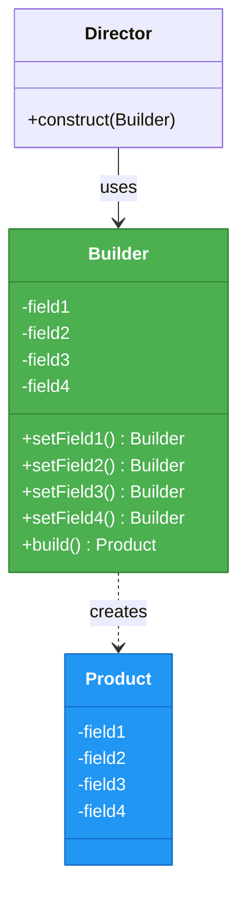
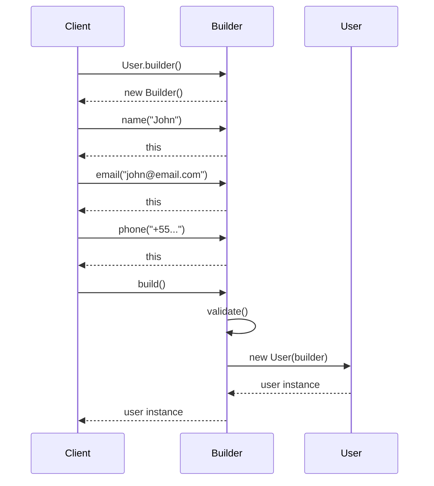
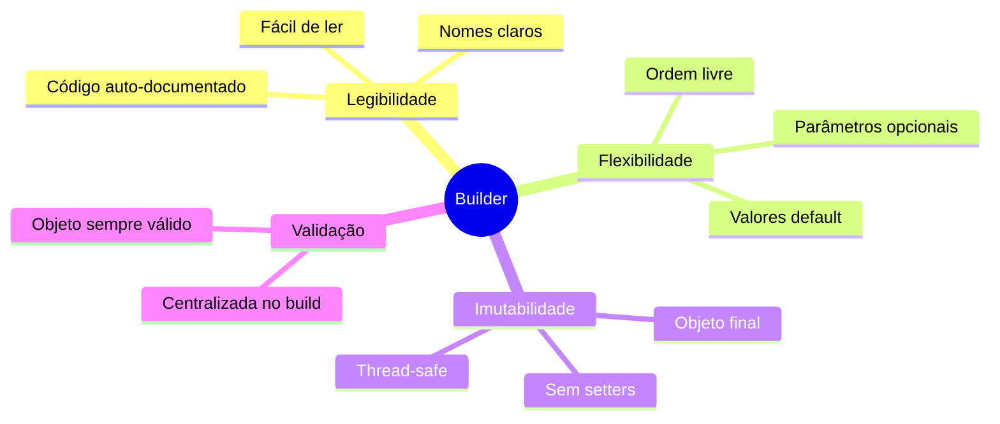
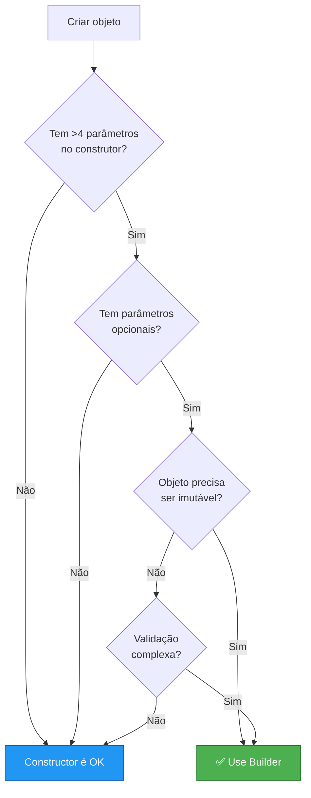

# Slide 12: Builder Pattern

---

## 📖 Definição

> **"Separa a construção de um objeto complexo de sua representação, permitindo criar diferentes representações usando o mesmo processo de construção"**

**Problema:** Objetos com muitos parâmetros, opcionais e obrigatórios

---

## 🎯 Estrutura do Pattern



---

## ❌ Problema: Constructor Hell

```java
// Construtor com muitos parâmetros
public class User {
    private Long id;
    private String name;
    private String email;
    private String phone;
    private String address;
    private String city;
    private String state;
    private String country;
    private String zipCode;
    private boolean active;
    private LocalDateTime createdAt;
    
    // 😱 11 parâmetros!
    public User(Long id, String name, String email, String phone, 
                String address, String city, String state, String country,
                String zipCode, boolean active, LocalDateTime createdAt) {
        // ...
    }
    
    // Ou múltiplos construtores (telescoping)
    public User(String name, String email) { }
    public User(String name, String email, String phone) { }
    public User(String name, String email, String phone, String address) { }
    // ... 20 construtores diferentes! 😱
}

// Chamada confusa
User user = new User(1L, "John", "john@email.com", null, 
                     null, null, null, null, null, true, LocalDateTime.now());
//                         ❌ Qual null é qual?
```

---

## ✅ Solução: Builder Pattern

```java
@Getter
public class User {
    private final Long id;
    private final String name;
    private final String email;
    private final String phone;
    private final String address;
    private final String city;
    private final String state;
    private final String country;
    private final String zipCode;
    private final boolean active;
    private final LocalDateTime createdAt;
    
    // Construtor privado - só Builder pode criar
    private User(Builder builder) {
        this.id = builder.id;
        this.name = builder.name;
        this.email = builder.email;
        this.phone = builder.phone;
        this.address = builder.address;
        this.city = builder.city;
        this.state = builder.state;
        this.country = builder.country;
        this.zipCode = builder.zipCode;
        this.active = builder.active;
        this.createdAt = builder.createdAt;
    }
    
    public static Builder builder() {
        return new Builder();
    }
    
    public static class Builder {
        private Long id;
        private String name;
        private String email;
        private String phone;
        private String address;
        private String city;
        private String state;
        private String country;
        private String zipCode;
        private boolean active = true;  // valor padrão
        private LocalDateTime createdAt = LocalDateTime.now();
        
        // Métodos fluent (retornam this)
        public Builder id(Long id) {
            this.id = id;
            return this;
        }
        
        public Builder name(String name) {
            this.name = name;
            return this;
        }
        
        public Builder email(String email) {
            this.email = email;
            return this;
        }
        
        public Builder phone(String phone) {
            this.phone = phone;
            return this;
        }
        
        // ... outros métodos
        
        public User build() {
            // Validações antes de criar
            if (name == null || email == null) {
                throw new IllegalStateException("Name and email are required");
            }
            return new User(this);
        }
    }
}
```

---

## 🎯 Uso do Builder

```java
// ✅ Legível e claro
User user = User.builder()
    .id(1L)
    .name("John Doe")
    .email("john@email.com")
    .phone("+5511999999999")
    .city("São Paulo")
    .state("SP")
    .build();

// ✅ Apenas campos necessários
User simpleUser = User.builder()
    .name("Jane Doe")
    .email("jane@email.com")
    .build();

// ✅ Encadeamento fluente
User complexUser = User.builder()
    .name("Bob")
    .email("bob@email.com")
    .phone("+5511888888888")
    .address("Rua A, 123")
    .city("Rio de Janeiro")
    .state("RJ")
    .country("Brasil")
    .zipCode("12345-678")
    .active(true)
    .build();
```

---

## 🔄 Fluxo de Construção



---

## 🎨 Builder com Lombok

```java
import lombok.Builder;
import lombok.Getter;

@Getter
@Builder
public class Product {
    private Long id;
    private String name;
    private String description;
    private BigDecimal price;
    private Integer stock;
    private String category;
    private boolean active;
    
    // Lombok gera automaticamente:
    // - Construtor privado
    // - Classe Builder interna
    // - Métodos fluent
    // - Método build()
}

// Uso
Product product = Product.builder()
    .id(1L)
    .name("Laptop")
    .price(BigDecimal.valueOf(2500))
    .stock(10)
    .active(true)
    .build();
```

---

## 📊 Comparação: Constructor vs Builder

| Aspecto | Constructor | Builder |
|---------|------------|---------|
| Legibilidade | ❌ Baixa (muitos params) | ✅ Alta (nomes claros) |
| Parâmetros opcionais | ❌ Múltiplos construtores | ✅ Apenas os necessários |
| Validação | ✅ No construtor | ✅ No build() |
| Imutabilidade | ✅ Possível | ✅ Possível |
| Facilidade de uso | ❌ Confuso | ✅ Fluente |
| Performance | ✅ Rápido | ⚠️ Overhead mínimo |

---

## 🎯 Variações do Builder

### 1️⃣ Builder com validação

```java
public User build() {
    validate();
    return new User(this);
}

private void validate() {
    if (name == null || name.isBlank()) {
        throw new IllegalStateException("Name is required");
    }
    if (email == null || !email.contains("@")) {
        throw new IllegalStateException("Valid email is required");
    }
    if (age != null && age < 0) {
        throw new IllegalStateException("Age must be positive");
    }
}
```

### 2️⃣ Builder com defaults

```java
public static class Builder {
    private boolean active = true;
    private LocalDateTime createdAt = LocalDateTime.now();
    private String role = "USER";
    
    // ...
}
```

### 3️⃣ Builder incremental (Director pattern)

```java
public class UserDirector {
    public User createAdminUser(String name, String email) {
        return User.builder()
            .name(name)
            .email(email)
            .role("ADMIN")
            .active(true)
            .permissions(List.of("READ", "WRITE", "DELETE"))
            .build();
    }
    
    public User createGuestUser(String name, String email) {
        return User.builder()
            .name(name)
            .email(email)
            .role("GUEST")
            .active(true)
            .permissions(List.of("READ"))
            .build();
    }
}
```

---

## 🎯 Vantagens



---

## 🚨 Quando Usar?



---

## 💡 Dica do Instrutor

```
⚠️ Use Builder quando:
✅ Classe tem muitos parâmetros (>4)
✅ Muitos parâmetros são opcionais
✅ Precisa de imutabilidade
✅ Quer API fluente
✅ Validação complexa

❌ Não use quando:
- Objeto simples (poucos campos)
- Todos campos são obrigatórios
- Performance é crítica (mínimo overhead)

🎯 Lombok @Builder:
- Reduz boilerplate drasticamente
- Mas perde controle fino de validação
- Combine com @NonNull para validação básica
```
