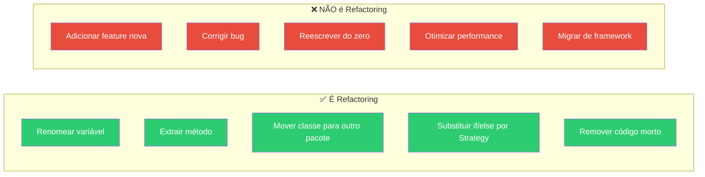
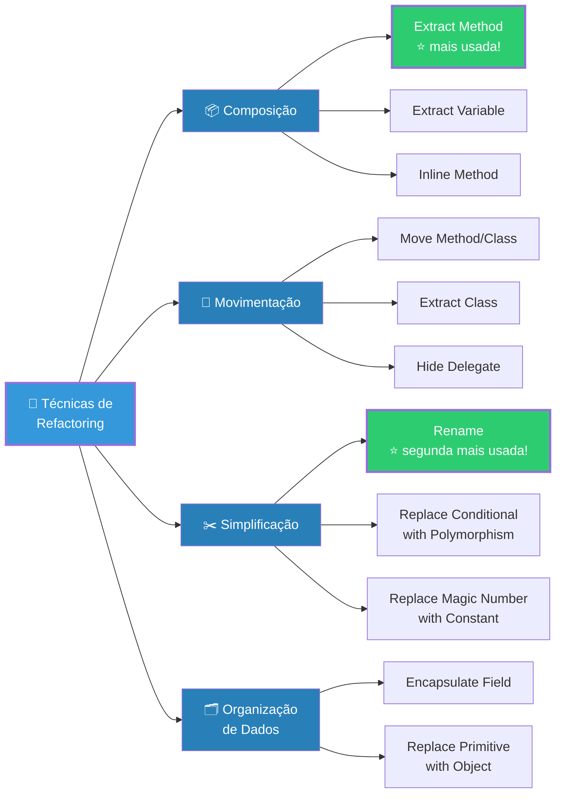
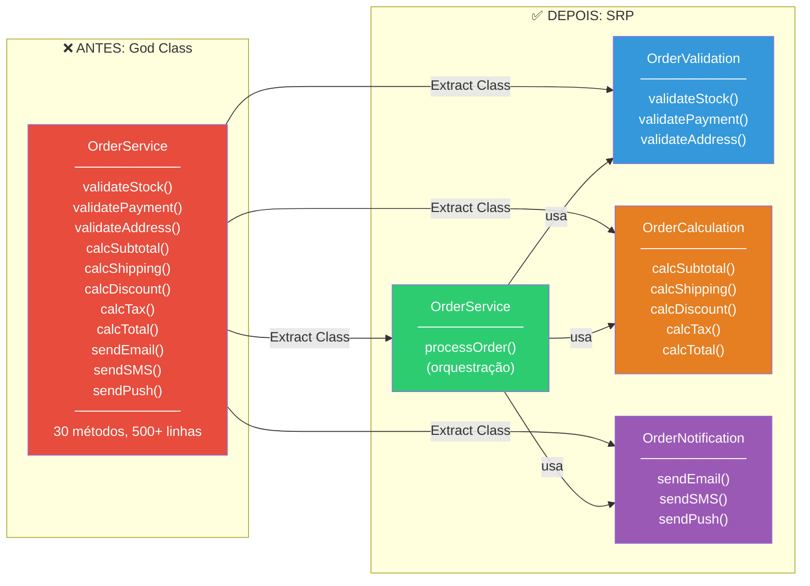
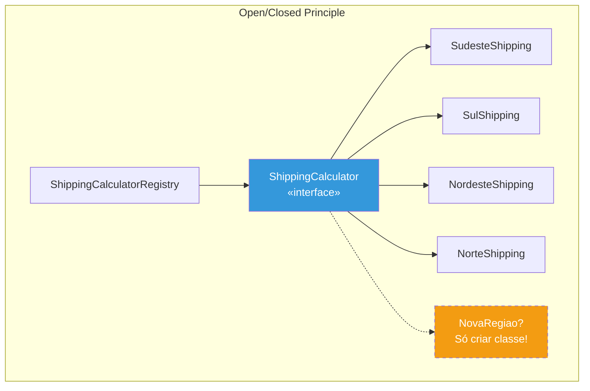
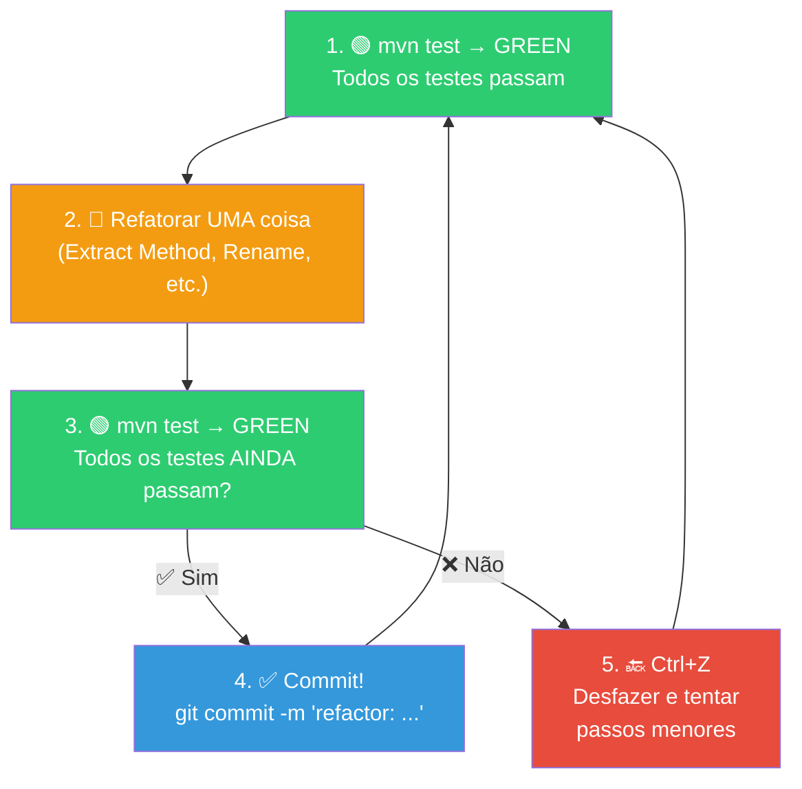

# Slide 12: Refactoring — Técnicas e Ferramentas

**Horário:** 13:00 - 13:30

---

## � O que é Refactoring?

> "Refactoring é a disciplina de **reestruturar** código existente, mudando sua **estrutura interna** sem alterar seu **comportamento externo**."
> — **Martin Fowler**, *Refactoring* (2018, 2ª edição)

Não é reescrever. Não é adicionar funcionalidade. É **melhorar a qualidade** do que já existe.

### O que refactoring NÃO é



---

## Catálogo de Técnicas de Refatoração

> Martin Fowler cataloga **mais de 60 técnicas** de refatoração. Veremos as mais usadas no dia a dia.



---

## Técnicas em Detalhe

### 1. Extract Method (mais usada!)

> **Quando usar:** Método longo, bloco de código com comentário explicando o que faz, código repetido.

```java
// ❌ ANTES: bloco de código com comentário explicando
public Order processOrder(OrderRequest request) {
    // Valida estoque de todos os itens
    for (var item : request.items()) {
        Product p = productRepo.findById(item.productId()).orElseThrow();
        if (p.getStock() < item.quantity()) {
            throw new InsufficientStockException(p.getName());
        }
    }
    // Calcula total do pedido
    BigDecimal total = BigDecimal.ZERO;
    for (var item : request.items()) {
        Product p = productRepo.findById(item.productId()).orElseThrow();
        total = total.add(p.getPrice().multiply(BigDecimal.valueOf(item.quantity())));
    }
    // ... mais 80 linhas
}

// ✅ DEPOIS: métodos com nomes descritivos (o comentário vira o nome!)
public Order processOrder(OrderRequest request) {
    validateStock(request.items());
    BigDecimal total = calculateTotal(request.items());
    // ... código limpo e legível
}

private void validateStock(List<OrderItemRequest> items) {
    for (var item : items) {
        Product p = productRepo.findById(item.productId()).orElseThrow();
        if (p.getStock() < item.quantity()) {
            throw new InsufficientStockException(p.getName());
        }
    }
}

private BigDecimal calculateTotal(List<OrderItemRequest> items) {
    return items.stream()
        .map(item -> {
            Product p = productRepo.findById(item.productId()).orElseThrow();
            return p.getPrice().multiply(BigDecimal.valueOf(item.quantity()));
        })
        .reduce(BigDecimal.ZERO, BigDecimal::add);
}
```

> **IntelliJ:** Selecione o bloco → `Ctrl+Alt+M` → digite o nome do método → Enter

---

### 2. Rename (segunda mais usada!)

> **Quando usar:** Nome não revela intenção, abreviações, nomes genéricos (`data`, `temp`, `result`).

```java
// ❌ ANTES
int d; // o que é "d"?
public void proc(List<String> l) { ... }
String aux = calculateSomething();
boolean f = checkCondition();

// ✅ DEPOIS
int daysSinceCreation;
public void processEmails(List<String> pendingEmails) { ... }
String formattedAddress = calculateFormattedAddress();
boolean isEligibleForDiscount = checkDiscountEligibility();
```

> **IntelliJ:** Cursor no nome → `Shift+F6` → novo nome → Enter  
> Renomeia em **TODOS** os lugares que usam (incluindo outros arquivos, testes, Javadoc).

---

### 3. Extract Class (separar responsabilidades)



---

### 4. Replace Conditional with Polymorphism (Strategy Pattern)

> **Quando usar:** Cadeia de `if/else` ou `switch` que tende a crescer com novas opções.

```java
// ❌ ANTES: cadeia de if/else que cresce a cada região nova
public BigDecimal calculateShipping(String region, BigDecimal weight) {
    if (region.equals("SUDESTE")) {
        return weight.multiply(new BigDecimal("5.00"));
    } else if (region.equals("SUL")) {
        return weight.multiply(new BigDecimal("7.00"));
    } else if (region.equals("NORDESTE")) {
        return weight.multiply(new BigDecimal("10.00"));
    } else if (region.equals("NORTE")) {
        return weight.multiply(new BigDecimal("12.00"));
    } else if (region.equals("CENTRO-OESTE")) {
        return weight.multiply(new BigDecimal("8.00"));
    } else {
        return weight.multiply(new BigDecimal("15.00"));
    }
}
```

```java
// ✅ DEPOIS: Strategy Pattern — adicionar região = criar classe, sem tocar no existente

// 1. Interface Strategy
public interface ShippingCalculator {
    BigDecimal calculate(BigDecimal weight);
    String getRegion();
}

// 2. Implementações
public class SudesteShipping implements ShippingCalculator {
    private static final BigDecimal RATE = new BigDecimal("5.00");
    public BigDecimal calculate(BigDecimal weight) { return weight.multiply(RATE); }
    public String getRegion() { return "SUDESTE"; }
}

// 3. Registry com Spring (ou Map)
@Component
public class ShippingCalculatorRegistry {
    private final Map<String, ShippingCalculator> calculators;

    public ShippingCalculatorRegistry(List<ShippingCalculator> list) {
        this.calculators = list.stream()
            .collect(Collectors.toMap(ShippingCalculator::getRegion, c -> c));
    }

    public ShippingCalculator getFor(String region) {
        return Optional.ofNullable(calculators.get(region))
            .orElseThrow(() -> new UnsupportedRegionException(region));
    }
}
```



---

### 5. Replace Magic Number with Named Constant

```java
// ❌ ANTES
if (order.getTotal().compareTo(new BigDecimal("100")) > 0) {
    discount = order.getTotal().multiply(new BigDecimal("0.1"));
}
if (items.size() > 5) { throw new TooManyItemsException(); }
if (salary.compareTo(new BigDecimal("1412.00")) < 0) { ... }

// ✅ DEPOIS
private static final BigDecimal MINIMUM_ORDER_FOR_DISCOUNT = new BigDecimal("100.00");
private static final BigDecimal DEFAULT_DISCOUNT_RATE = new BigDecimal("0.10");
private static final int MAX_ITEMS_PER_ORDER = 5;
private static final BigDecimal MINIMUM_WAGE = new BigDecimal("1412.00");

if (order.getTotal().compareTo(MINIMUM_ORDER_FOR_DISCOUNT) > 0) {
    discount = order.getTotal().multiply(DEFAULT_DISCOUNT_RATE);
}
if (items.size() > MAX_ITEMS_PER_ORDER) { throw new TooManyItemsException(); }
if (salary.compareTo(MINIMUM_WAGE) < 0) { ... }
```

> **IntelliJ:** Selecione o número → `Ctrl+Alt+C` → nome da constante

---

## ⌨️ Atalhos do IntelliJ — Refactoring

| Atalho | Ação | Quando usar |
|--------|------|-------------|
| `Ctrl+Alt+M` | **Extract Method** | Bloco de código → método |
| `Shift+F6` | **Rename** | Nome ruim → nome bom |
| `Ctrl+Alt+N` | **Inline** | Desfaz extract (variável, método) |
| `Ctrl+Alt+V` | **Extract Variable** | Expressão complexa → variável nomeada |
| `Ctrl+Alt+C` | **Extract Constant** | Magic number → constante |
| `Ctrl+Alt+F` | **Extract Field** | Variável local → campo da classe |
| `Ctrl+Alt+P` | **Extract Parameter** | Valor hardcoded → parâmetro do método |
| `F6` | **Move** | Mover para outra classe/pacote |
| `Ctrl+Shift+Alt+T` | **Refactor This** | Menu com TODAS as opções |

> **Dica:** `Ctrl+Shift+Alt+T` abre um menu com TODAS as refatorações disponíveis no contexto.

---

## 🔴🟢 Ciclo Seguro de Refatoração



> **Regra de ouro:** NUNCA refatore com testes quebrados. Se algo quebrar, desfaça (`Ctrl+Z`) e tente novamente com passos **menores**.

### Commits Semânticos para Refatoração

```bash
# Padrão Conventional Commits
git commit -m "refactor: extract validation logic to OrderValidationService"
git commit -m "refactor: rename proc() to processOrder()"
git commit -m "refactor: replace shipping if/else with Strategy pattern"
git commit -m "refactor: extract magic numbers to named constants"
```

---

## 📊 Resumo: Smell → Técnica

| Code Smell | Técnica de Refactoring | Atalho IntelliJ |
|-----------|------------------------|-----------------|
| **Long Method** | Extract Method | `Ctrl+Alt+M` |
| **Bad Name** | Rename | `Shift+F6` |
| **God Class** | Extract Class | `F6` (Move) |
| **Magic Number** | Extract Constant | `Ctrl+Alt+C` |
| **Duplicate Code** | Extract Method + reutilizar | `Ctrl+Alt+M` |
| **Feature Envy** | Move Method | `F6` |
| **Primitive Obsession** | Replace Primitive with Object | Manual |
| **if/else chain** | Replace Conditional with Polymorphism | Manual |

---

## 💡 Dica do Instrutor

Demonstrar Extract Method e Rename **AO VIVO** na IDE usando código do `03-bad-practices-lab`. Pedir para os alunos praticarem junto. Mostrar `Ctrl+Shift+Alt+T` como "menu mágico" de refactoring.
