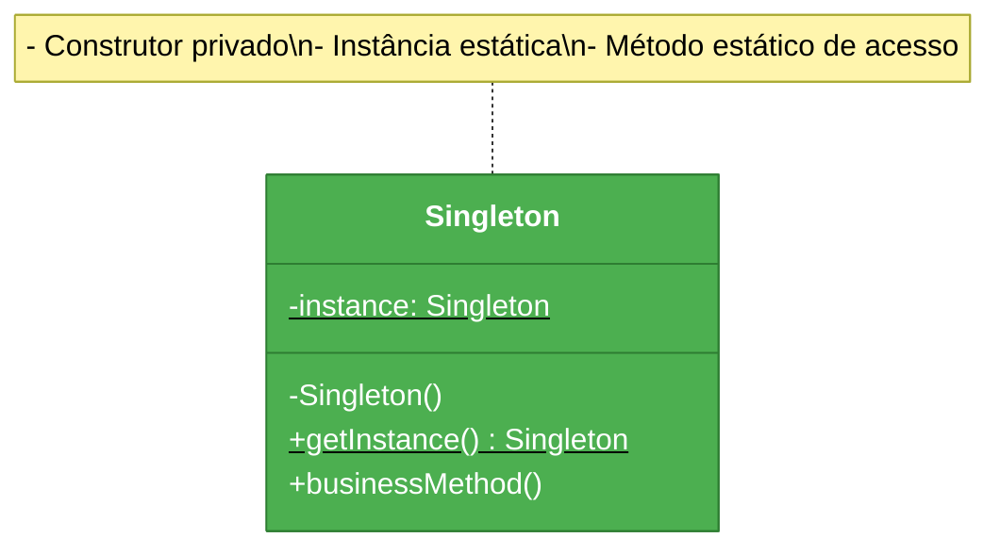
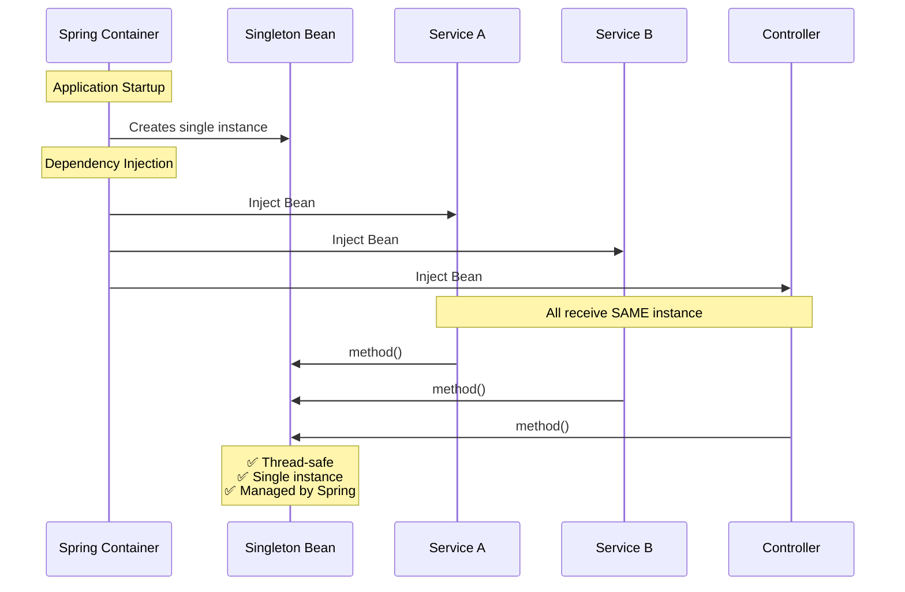
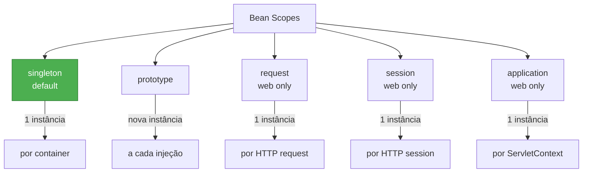
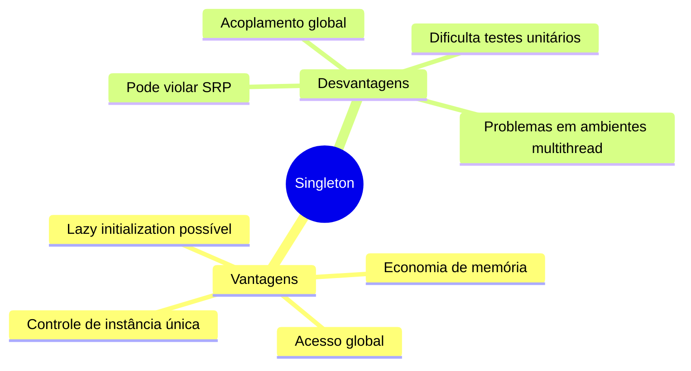
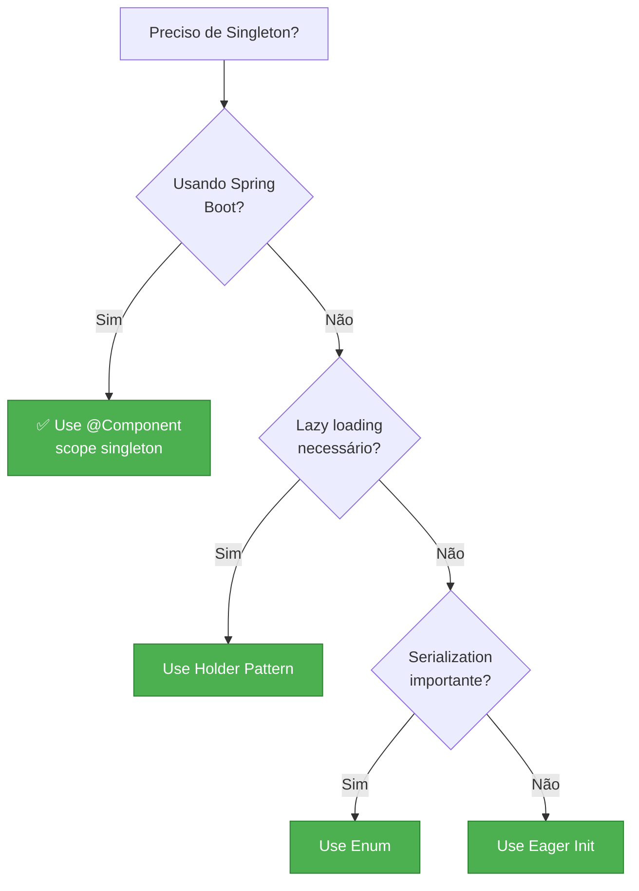

# Slide 13: Singleton Pattern

---

## 📖 Definição

> **"Garante que uma classe tenha apenas uma instância e fornece um ponto global de acesso a ela"**

**Problema:** Preciso garantir que existe apenas uma instância de uma classe no sistema

---

## 🎯 Estrutura do Pattern



---

## ✅ Implementações Clássicas

### 1️⃣ Eager Initialization (carregamento ansioso)

```java
public class DatabaseConnection {
    // Instância criada na carga da classe
    private static final DatabaseConnection INSTANCE = new DatabaseConnection();
    
    // Construtor privado - ninguém pode instanciar
    private DatabaseConnection() {
        System.out.println("Database connection initialized");
    }
    
    public static DatabaseConnection getInstance() {
        return INSTANCE;
    }
    
    public void query(String sql) {
        System.out.println("Executing: " + sql);
    }
}

// Uso
DatabaseConnection db = DatabaseConnection.getInstance();
db.query("SELECT * FROM users");
```

**Vantagens:** Thread-safe, simples  
**Desvantagens:** Criado mesmo se não usado

---

### 2️⃣ Lazy Initialization (carregamento preguiçoso)

```java
public class ConfigurationManager {
    private static ConfigurationManager instance;
    
    private ConfigurationManager() {
        // Leitura de arquivo de configuração (operação cara)
        System.out.println("Loading configuration...");
    }
    
    // ⚠️ NÃO É THREAD-SAFE!
    public static ConfigurationManager getInstance() {
        if (instance == null) {
            instance = new ConfigurationManager();
        }
        return instance;
    }
}
```

**Vantagens:** Criado apenas quando necessário  
**Desvantagens:** Não é thread-safe

---

### 3️⃣ Thread-Safe Lazy (double-checked locking)

```java
public class Logger {
    private static volatile Logger instance;
    
    private Logger() {
        System.out.println("Logger initialized");
    }
    
    public static Logger getInstance() {
        if (instance == null) {  // 1ª verificação (sem lock)
            synchronized (Logger.class) {
                if (instance == null) {  // 2ª verificação (com lock)
                    instance = new Logger();
                }
            }
        }
        return instance;
    }
    
    public void log(String message) {
        System.out.println("[LOG] " + message);
    }
}
```

**Vantagens:** Thread-safe e lazy  
**Desvantagens:** Complexo, verbose

---

### 4️⃣ Bill Pugh (Holder Pattern) ⭐ RECOMENDADO

```java
public class CacheManager {
    
    private CacheManager() {
        System.out.println("Cache manager initialized");
    }
    
    // Classe interna estática - lazy loading garantido pela JVM
    private static class Holder {
        private static final CacheManager INSTANCE = new CacheManager();
    }
    
    public static CacheManager getInstance() {
        return Holder.INSTANCE;
    }
    
    public void put(String key, Object value) {
        System.out.println("Caching: " + key);
    }
}
```

**Vantagens:** Thread-safe, lazy, simples, eficiente  
**Desvantagens:** Nenhuma significativa

---

### 5️⃣ Enum Singleton ⭐ MAIS SEGURO

```java
public enum DatabaseConfig {
    INSTANCE;
    
    private Properties properties;
    
    // Construtor do enum (executado uma vez)
    DatabaseConfig() {
        properties = new Properties();
        properties.setProperty("url", "jdbc:mysql://localhost:3306/db");
        properties.setProperty("user", "root");
        System.out.println("Database config loaded");
    }
    
    public String getProperty(String key) {
        return properties.getProperty(key);
    }
}

// Uso
DatabaseConfig config = DatabaseConfig.INSTANCE;
String url = config.getProperty("url");
```

**Vantagens:** Thread-safe, serialization-safe, proteção contra reflection  
**Desvantagens:** Não suporta herança

---

## 🍃 Singleton com Spring Boot

### ⭐ Forma Recomendada

```java
@Component  // ou @Service, @Repository, @Configuration
public class ApplicationCache {
    
    private final Map<String, Object> cache = new ConcurrentHashMap<>();
    
    // Spring garante que é Singleton por padrão!
    public ApplicationCache() {
        System.out.println("ApplicationCache initialized");
    }
    
    public void put(String key, Object value) {
        cache.put(key, value);
    }
    
    public Object get(String key) {
        return cache.get(key);
    }
}

// Uso (injeção de dependência)
@Service
@RequiredArgsConstructor
public class UserService {
    private final ApplicationCache cache;  // Spring injeta a MESMA instância
    
    public User getUser(Long id) {
        return (User) cache.get("user:" + id);
    }
}
```

---

## 🔄 Ciclo de Vida do Singleton no Spring



---

## 📊 Scopes no Spring



```java
@Component
@Scope("singleton")  // Default - não precisa declarar
public class SingletonBean { }

@Component
@Scope("prototype")  // Nova instância a cada injeção
public class PrototypeBean { }

@Component
@Scope(value = WebApplicationContext.SCOPE_REQUEST, proxyMode = ScopedProxyMode.TARGET_CLASS)
public class RequestScopedBean { }
```

---

## 🎯 Vantagens e Desvantagens



---

## 🚨 Anti-Patterns e Problemas

### ❌ Singleton como variável global

```java
// ❌ Mal uso - estado global mutável
public class GlobalState {
    private static final GlobalState INSTANCE = new GlobalState();
    
    public Map<String, Object> data = new HashMap<>();  // ⚠️ Público e mutável!
    
    public static GlobalState getInstance() {
        return INSTANCE;
    }
}
```

### ❌ Dificulta testes

```java
// ❌ Acoplamento com Singleton - difícil testar
public class OrderService {
    public void processOrder(Order order) {
        // Acoplamento direto - não pode mockar!
        Logger.getInstance().log("Processing order");
        DatabaseConnection.getInstance().save(order);
    }
}
```

### ✅ Solução: Dependency Injection

```java
// ✅ Testável
@Service
@RequiredArgsConstructor
public class OrderService {
    private final Logger logger;
    private final OrderRepository repository;
    
    public void processOrder(Order order) {
        logger.log("Processing order");
        repository.save(order);
    }
}
```

---

## 🧪 Testando Singletons

### ❌ Difícil com Singleton clássico

```java
@Test
public void testProcessOrder() {
    OrderService service = new OrderService();
    // 💥 Não consigo mockar Logger.getInstance()
    service.processOrder(order);
}
```

### ✅ Fácil com Spring DI

```java
@Test
public void testProcessOrder() {
    Logger mockLogger = mock(Logger.class);
    OrderRepository mockRepo = mock(OrderRepository.class);
    
    OrderService service = new OrderService(mockLogger, mockRepo);
    service.processOrder(order);
    
    verify(mockLogger).log(anyString());
    verify(mockRepo).save(order);
}
```

---

## 🚨 Quando Usar?



---

## 💡 Dica do Instrutor

```
⚠️ Regras práticas:

✅ FAÇA:
- Use Spring @Component (singleton é default)
- Prefira DI em vez de getInstance()
- Mantenha singleton imutável quando possível
- Use para recursos caros (conexões, caches)

❌ NÃO FAÇA:
- Singleton clássico em Spring Boot (desnecessário)
- Estado mutável compartilhado sem sincronização
- Lógica de negócio em singleton (use @Service)
- Acoplamento global (dificulta testes)

🎯 Spring Boot:
- Singleton é o scope padrão
- Thread-safe automático
- Gerenciado pelo container
- Suporta lifecycle callbacks (@PostConstruct, @PreDestroy)
```
