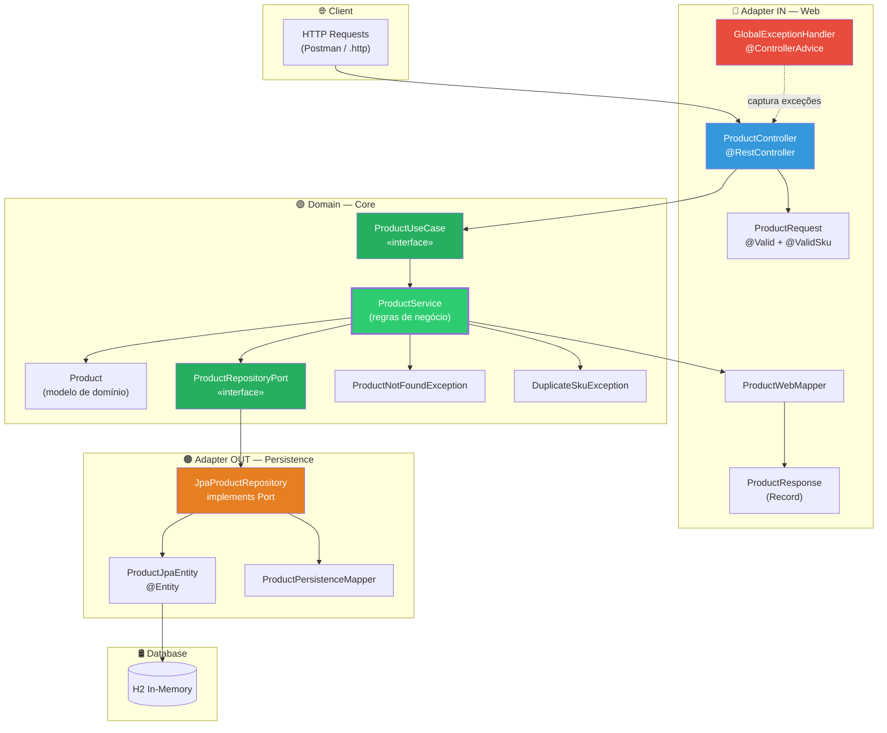
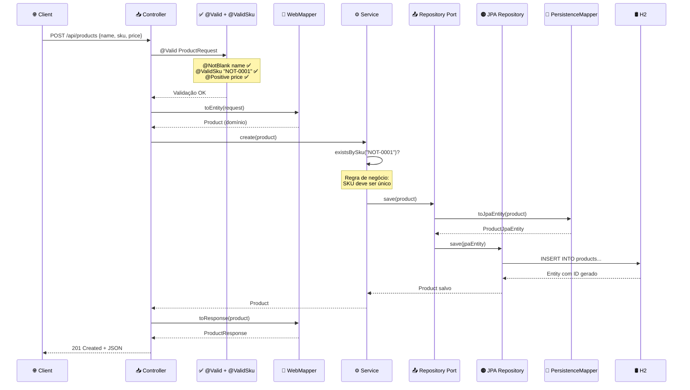
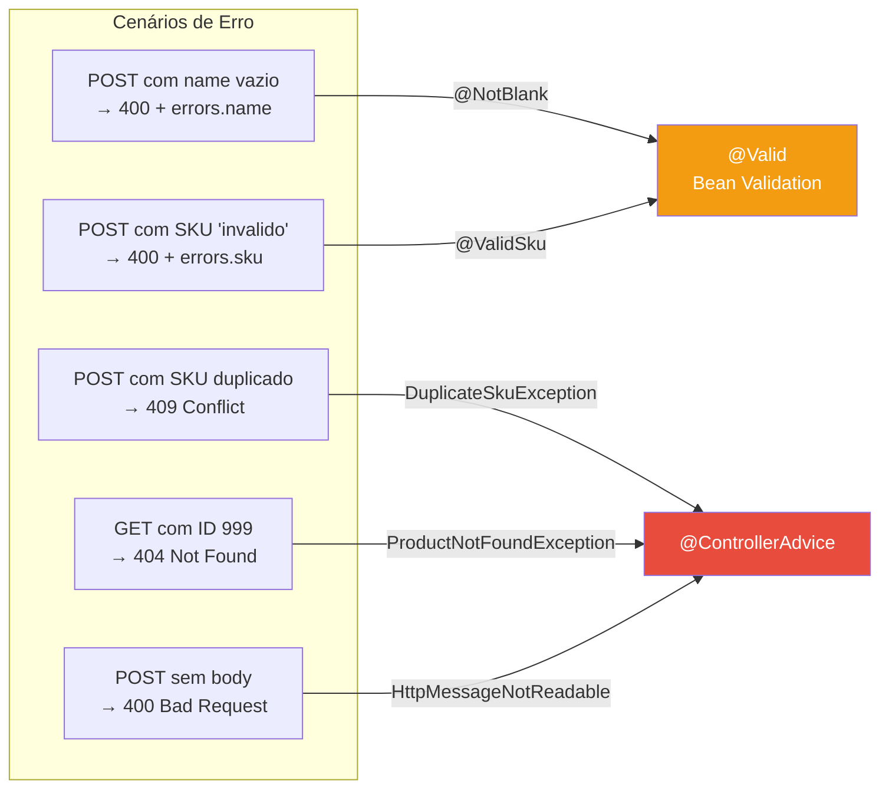
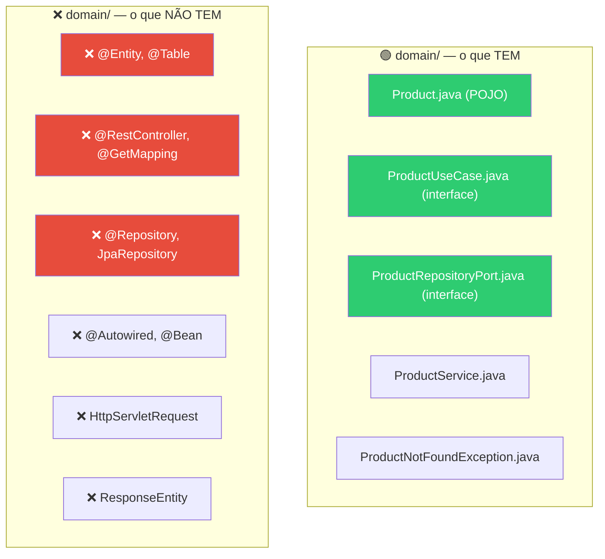

# Slide 13: Walkthrough — 03-clean-architecture-demo

**Horário:** 13:30 - 14:00

---

## 🎬 DEMO AO VIVO: API de Catálogo de Produtos

> Objetivo: mostrar na prática **tudo** que foi ensinado na manhã — Clean Code, DTOs, Hexagonal, @ControllerAdvice, @Valid, Custom Validator.

### Rodando o projeto

```bash
cd 03-clean-architecture-demo
mvn spring-boot:run
# Porta: 8083
# Banco: H2 em memória
# Console H2: http://localhost:8083/h2-console
```

---

## Arquitetura do Projeto — Mapa Visual



---

## Estrutura de Pacotes do Projeto

```
com.example.cleanarchitecture/
│
├── domain/                              ← 🟢 CORE (zero imports de Spring!)
│   ├── model/
│   │   └── Product.java                 (entidade de domínio)
│   ├── port/
│   │   ├── in/
│   │   │   └── ProductUseCase.java      (interface de entrada)
│   │   └── out/
│   │       └── ProductRepositoryPort.java (interface de saída)
│   ├── service/
│   │   └── ProductService.java          (regras de negócio)
│   └── exception/
│       ├── ProductNotFoundException.java
│       └── DuplicateSkuException.java
│
├── adapter/
│   ├── in/
│   │   └── web/
│   │       ├── ProductController.java   (REST API — chama UseCase)
│   │       ├── dto/
│   │       │   ├── ProductRequest.java  (DTO entrada com @Valid)
│   │       │   └── ProductResponse.java (DTO saída — Record)
│   │       ├── mapper/
│   │       │   └── ProductWebMapper.java (Request ↔ Domain)
│   │       └── handler/
│   │           └── GlobalExceptionHandler.java
│   └── out/
│       └── persistence/
│           ├── JpaProductRepository.java (implements RepositoryPort)
│           ├── ProductJpaEntity.java     (entidade JPA)
│           └── ProductPersistenceMapper.java (Domain ↔ JPA)
│
├── config/
│   └── BeanConfig.java                  (wiring via @Bean)
│
└── validation/
    ├── ValidSku.java                    (@interface)
    └── SkuValidator.java               (ConstraintValidator)
```

---

## O que Observar na Demo

### 1. Fluxo do POST /api/products — Passo a Passo



### 2. Cenários de Erro para Demonstrar



### 3. Custom Validator @ValidSku
- SKU deve seguir padrão `XXX-0000` (3 letras maiúsculas + hífen + 4 dígitos)
- Exemplos válidos: `NOT-0001`, `CEL-1234`, `MON-9999`
- Exemplos inválidos: `invalido`, `not-0001` (minúsculo), `NOTEBOOK-01`

---

## Testando com api-requests.http

```http
### ✅ Criar produto (esperar 201)
POST http://localhost:8083/api/products
Content-Type: application/json

{
    "name": "Notebook Dell",
    "sku": "NOT-0001",
    "price": 4500.00,
    "description": "Notebook Dell Inspiron 15"
}

### ✅ Buscar por ID (esperar 200)
GET http://localhost:8083/api/products/1

### ✅ Listar todos (esperar 200)
GET http://localhost:8083/api/products

### ❌ SKU duplicado (esperar 409 Conflict)
POST http://localhost:8083/api/products
Content-Type: application/json

{
    "name": "Outro Notebook",
    "sku": "NOT-0001",
    "price": 3500.00
}

### ❌ Dados inválidos (esperar 400 com errors map)
POST http://localhost:8083/api/products
Content-Type: application/json

{
    "name": "",
    "sku": "invalido",
    "price": -10
}

### ❌ ID inexistente (esperar 404 ProblemDetail)
GET http://localhost:8083/api/products/999

### ✅ Deletar (esperar 204 No Content)
DELETE http://localhost:8083/api/products/1
```

---

## 🔍 O que NÃO está no domain/



> **Teste rápido:** abra `ProductService.java` e olhe os `import`. Se tiver `org.springframework`, algo está errado!

---

## 💡 Roteiro para o Instrutor

1. **Abrir 3 arquivos lado a lado:** Controller, Service, Repository
2. **Seguir o fluxo** de uma requisição POST do início ao fim
3. Mostrar que o `domain/` **não importa nada** do Spring (verificar imports)
4. **Provocar CADA cenário de erro** e mostrar as respostas ProblemDetail
5. Mostrar o `BeanConfig.java` e explicar o wiring: "Quem conecta Port ↔ Adapter?"
6. Perguntar: "Se eu trocar H2 por PostgreSQL, quantos arquivos mudo?"  
   Resposta: **só o application.yml** (e adicionar driver no pom.xml)
