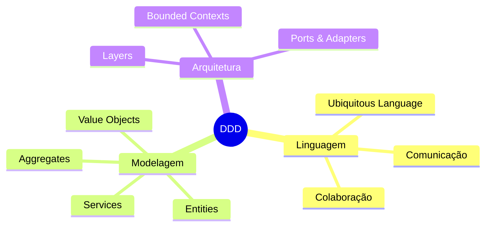
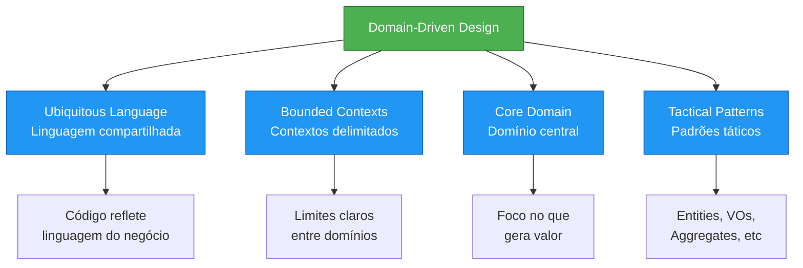
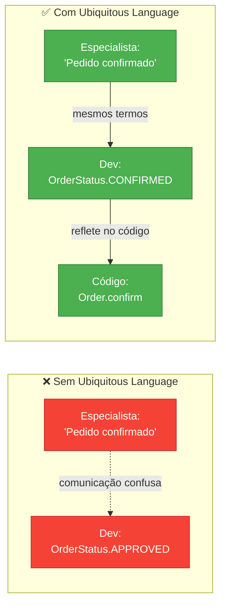
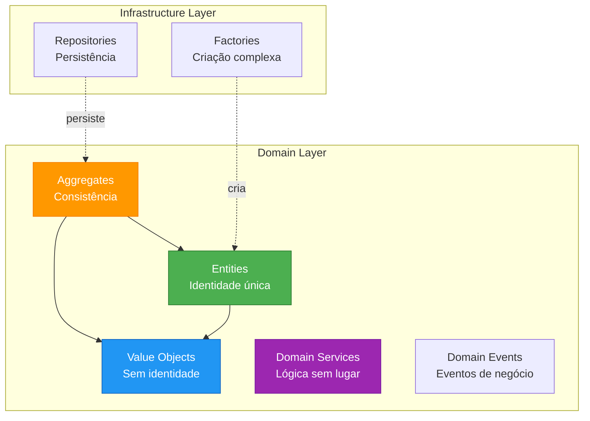
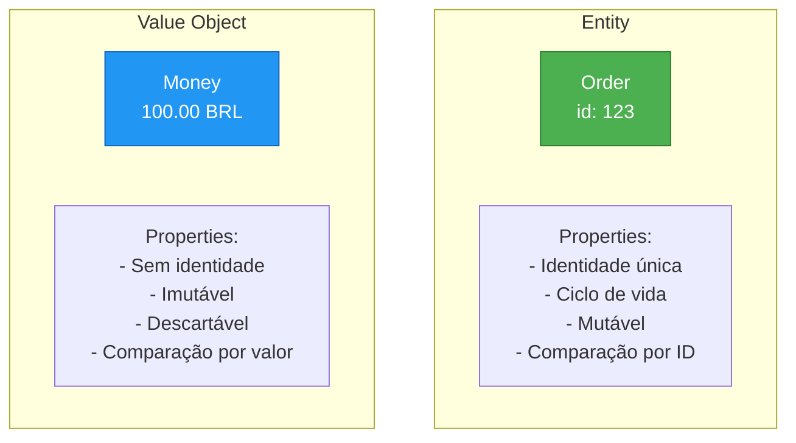
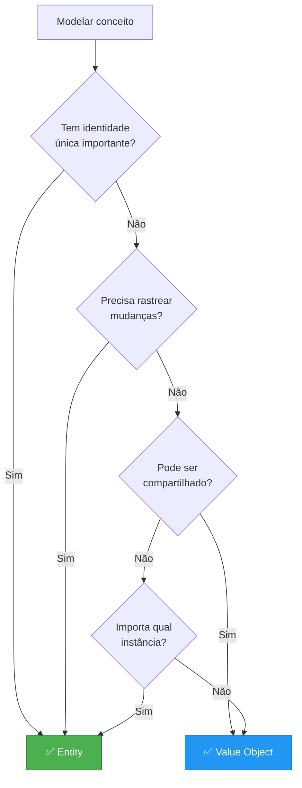

# Slide 14: Domain-Driven Design (DDD) - Introdução

**Horário:** 13:30 - 14:30

---

## 📖 O que é DDD?

> **"Domain-Driven Design é uma abordagem de desenvolvimento de software que coloca o domínio do negócio no centro do desenvolvimento"**
> 
> *— Eric Evans*



---

## 🎯 Pilares do DDD



---

## 🗣️ Ubiquitous Language

**Linguagem compartilhada entre desenvolvedores e especialistas do domínio**



### Exemplo

```java
// ❌ Linguagem técnica, não do negócio
public class Order {
    private int status;  // 0=new, 1=paid, 2=shipped...
    
    public void updateStatus(int newStatus) {
        this.status = newStatus;
    }
}

// ✅ Ubiquitous Language - reflete o domínio
public class Order {
    private OrderStatus status;
    
    public void confirm() {
        if (status != OrderStatus.PENDING) {
            throw new IllegalStateException("Only pending orders can be confirmed");
        }
        this.status = OrderStatus.CONFIRMED;
    }
    
    public void ship() {
        if (status != OrderStatus.CONFIRMED) {
            throw new IllegalStateException("Only confirmed orders can be shipped");
        }
        this.status = OrderStatus.SHIPPED;
    }
}

public enum OrderStatus {
    PENDING, CONFIRMED, SHIPPED, DELIVERED, CANCELLED
}
```

---

## 🧱 Building Blocks Táticos



---

## 🆔 Entities vs Value Objects



### Characteristics

| Aspecto | Entity | Value Object |
|---------|--------|--------------|
| Identidade | ✅ Tem ID único | ❌ Sem ID |
| Mutabilidade | ✅ Pode mudar | ❌ Imutável |
| Comparação | Por ID (equals) | Por valor (todos campos) |
| Ciclo de vida | Sim (created, modified) | Não |
| Exemplo | User, Order, Product | Money, Address, Email |

---

## 💡 Exemplo: Entity

```java
@Entity
@Getter
public class Order {
    @Id
    @GeneratedValue
    private Long id;  // ✅ Identidade
    
    private Customer customer;
    private List<OrderItem> items;
    private Money totalAmount;
    private OrderStatus status;
    private LocalDateTime createdAt;
    private LocalDateTime updatedAt;
    
    // Lógica de domínio
    public void addItem(Product product, int quantity) {
        if (status != OrderStatus.PENDING) {
            throw new IllegalStateException("Cannot add items to non-pending order");
        }
        
        OrderItem item = new OrderItem(product, quantity);
        items.add(item);
        recalculateTotal();
    }
    
    public void confirm() {
        if (items.isEmpty()) {
            throw new IllegalStateException("Cannot confirm empty order");
        }
        this.status = OrderStatus.CONFIRMED;
        this.updatedAt = LocalDateTime.now();
    }
    
    private void recalculateTotal() {
        this.totalAmount = items.stream()
            .map(OrderItem::getSubtotal)
            .reduce(Money.ZERO, Money::add);
    }
    
    // Comparação por ID
    @Override
    public boolean equals(Object o) {
        if (this == o) return true;
        if (!(o instanceof Order order)) return false;
        return id != null && id.equals(order.id);
    }
    
    @Override
    public int hashCode() {
        return getClass().hashCode();
    }
}
```

---

## 💎 Exemplo: Value Object

```java
// Value Object - Imutável, sem ID, comparação por valor
public record Money(BigDecimal amount, String currency) {
    
    public static final Money ZERO = new Money(BigDecimal.ZERO, "BRL");
    
    // Validação no construtor
    public Money {
        if (amount == null) {
            throw new IllegalArgumentException("Amount cannot be null");
        }
        if (currency == null || currency.isBlank()) {
            throw new IllegalArgumentException("Currency cannot be null or blank");
        }
    }
    
    // Operações retornam NOVOS objetos (imutabilidade)
    public Money add(Money other) {
        if (!this.currency.equals(other.currency)) {
            throw new IllegalArgumentException("Cannot add different currencies");
        }
        return new Money(this.amount.add(other.amount), this.currency);
    }
    
    public Money subtract(Money other) {
        if (!this.currency.equals(other.currency)) {
            throw new IllegalArgumentException("Cannot subtract different currencies");
        }
        return new Money(this.amount.subtract(other.amount), this.currency);
    }
    
    public Money multiply(BigDecimal multiplier) {
        return new Money(this.amount.multiply(multiplier), this.currency);
    }
    
    public boolean isGreaterThan(Money other) {
        if (!this.currency.equals(other.currency)) {
            throw new IllegalArgumentException("Cannot compare different currencies");
        }
        return this.amount.compareTo(other.amount) > 0;
    }
    
    // Record gera automaticamente:
    // - equals() por valor
    // - hashCode() por valor
    // - toString()
    // - Getters
    // - Constructor
}

// Uso
Money price = new Money(BigDecimal.valueOf(100), "BRL");
Money discount = new Money(BigDecimal.valueOf(10), "BRL");
Money finalPrice = price.subtract(discount);  // Nova instância!

// price ainda é 100 (imutável)
```

---

## 📊 Mais Value Objects

```java
// Email
public record Email(String value) {
    public Email {
        if (!value.matches("^[A-Za-z0-9+_.-]+@(.+)$")) {
            throw new IllegalArgumentException("Invalid email format");
        }
    }
}

// CPF
public record CPF(String value) {
    public CPF {
        String cleaned = value.replaceAll("[^0-9]", "");
        if (cleaned.length() != 11) {
            throw new IllegalArgumentException("CPF must have 11 digits");
        }
        // Validação de dígitos verificadores...
    }
    
    public String formatted() {
        return value.replaceAll("(\\d{3})(\\d{3})(\\d{3})(\\d{2})", "$1.$2.$3-$4");
    }
}

// Address
public record Address(
    String street,
    String number,
    String city,
    String state,
    String zipCode
) {
    public Address {
        if (street == null || street.isBlank()) {
            throw new IllegalArgumentException("Street is required");
        }
        if (zipCode == null || !zipCode.matches("\\d{5}-\\d{3}")) {
            throw new IllegalArgumentException("Invalid zip code format");
        }
    }
}
```

---

## 🎯 Quando usar Entity vs Value Object?



---

## 💡 Dica do Instrutor

```
⚠️ Regras práticas:

Entity:
✅ Tem ID único e importa qual é
✅ Ciclo de vida rastreável
✅ Pode mudar ao longo do tempo
✅ Exemplo: User, Order, Product

Value Object:
✅ Comparação por valor
✅ Imutável (thread-safe)
✅ Sem identidade própria
✅ Exemplo: Money, Email, Address, CPF

🎯 Dica:
- Use records para Value Objects (Java 17+)
- Validação no construtor
- Métodos que retornam novos objetos
- Equals/hashCode por valor
```
