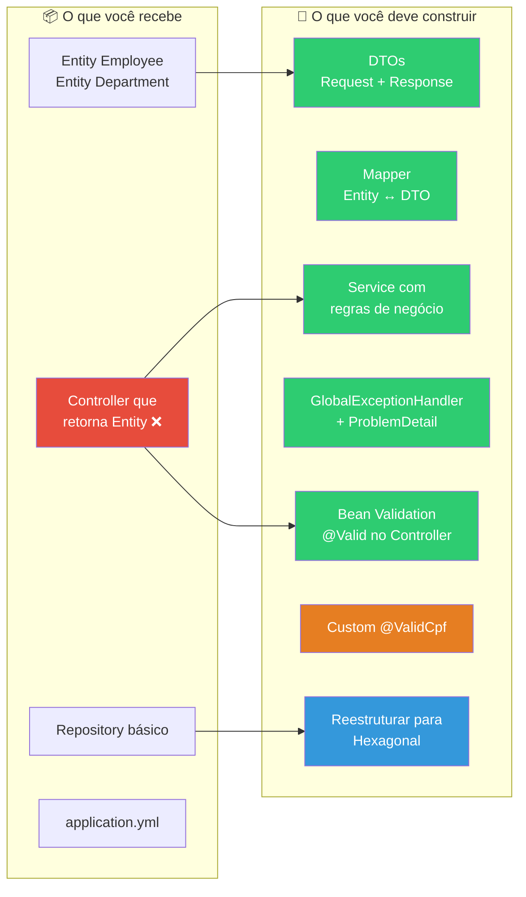
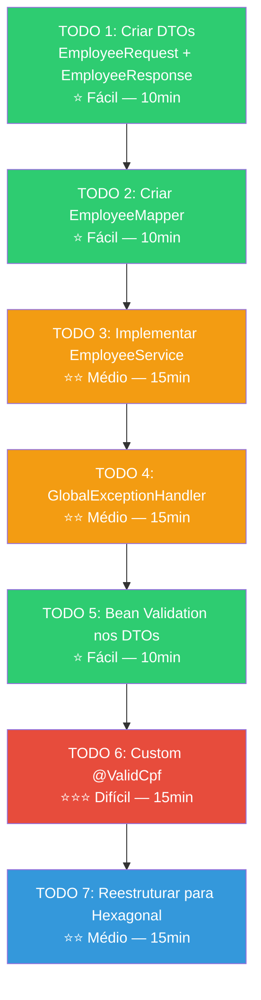
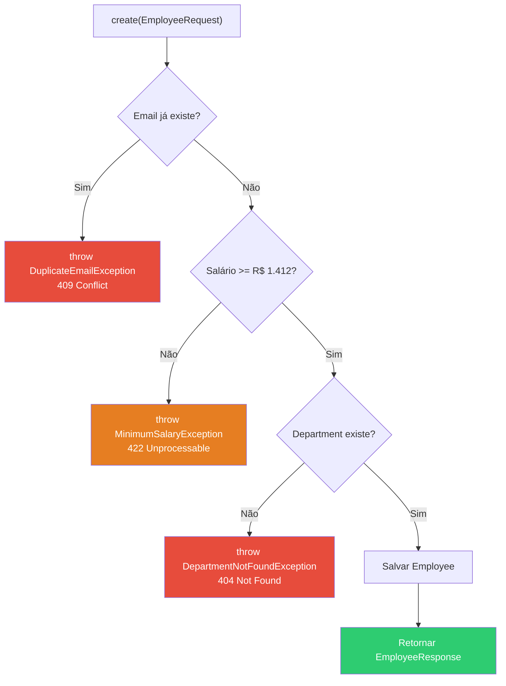
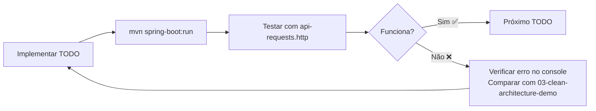

# Slide 14: Exercício — 03-employee-api

**Horário:** 14:00 - 15:30

---

## ✏️ Exercício: API de Gestão de Funcionários

Você recebe uma API básica que retorna a Entity diretamente. Sua missão é **profissionalizar** o código aplicando tudo que aprendemos.

```bash
cd 03-employee-api
mvn spring-boot:run
# Porta: 8084
```

---

## 📊 Visão Geral do Exercício



---

## O que já vem pronto

- ✅ Entidades `Employee` e `Department` (com `@ManyToOne`)
- ✅ `EmployeeRepository` e `DepartmentRepository`
- ✅ `application.yml` configurado (H2, porta 8084)
- ✅ Dependências no `pom.xml`
- ✅ `EmployeeController` básico (retorna Entity diretamente — com 7 TODOs)
- ✅ `api-requests.http` com requisições para testar

---

## TODOs (implemente na ordem!)

### Fluxo de Implementação



---

### TODO 1: Criar DTOs

```java
// EmployeeRequest (entrada — o que o cliente envia)
public record EmployeeRequest(
    String name,          // TODO 5: adicionar @NotBlank @Size(min=3, max=100)
    String email,         // TODO 5: adicionar @NotBlank @Email
    BigDecimal salary,    // TODO 5: adicionar @NotNull @Positive
    String cpf,           // TODO 6: adicionar @ValidCpf
    Long departmentId     // TODO 5: adicionar @NotNull
) {}

// EmployeeResponse (saída — o que o cliente recebe)
public record EmployeeResponse(
    Long id,
    String name,
    String email,
    BigDecimal salary,
    String cpf,
    String departmentName,   // ← nome do departamento, não o ID!
    LocalDateTime createdAt
) {}
```

### TODO 2: Criar EmployeeMapper

```java
public class EmployeeMapper {
    public static Employee toEntity(EmployeeRequest request, Department department) {
        Employee employee = new Employee();
        employee.setName(request.name());
        employee.setEmail(request.email());
        employee.setSalary(request.salary());
        employee.setCpf(request.cpf());
        employee.setDepartment(department);  // ← buscar pelo departmentId
        return employee;
    }

    public static EmployeeResponse toResponse(Employee entity) {
        return new EmployeeResponse(
            entity.getId(),
            entity.getName(),
            entity.getEmail(),
            entity.getSalary(),
            entity.getCpf(),
            entity.getDepartment().getName(),  // ← nome, não o ID!
            entity.getCreatedAt()
        );
    }
}
```

### TODO 3: Implementar EmployeeService



```java
// Regras de negócio do Service:
// 1. Salário não pode ser menor que R$ 1.412,00 (salário mínimo)
// 2. Email deve ser único (verificar no banco)
// 3. Department deve existir (buscar por departmentId)
private static final BigDecimal MINIMUM_SALARY = new BigDecimal("1412.00");
```

### TODO 4: GlobalExceptionHandler com Problem Details

```java
// Exceções para tratar:
// - MethodArgumentNotValidException → 400 (validação de campos)
// - EmployeeNotFoundException → 404
// - DepartmentNotFoundException → 404
// - DuplicateEmailException → 409
// - MinimumSalaryException → 422
// - Exception (catch-all) → 500
```

### TODO 5: Bean Validation nos DTOs

```java
// Voltar no EmployeeRequest e adicionar:
// @NotBlank @Size(min=3, max=100) no name
// @NotBlank @Email no email
// @NotNull @Positive no salary
// @NotNull no departmentId
```

### TODO 6: Custom Validator @ValidCpf

```java
// 1. Criar @interface ValidCpf com @Constraint(validatedBy = CpfValidator.class)
// 2. Criar CpfValidator implements ConstraintValidator<ValidCpf, String>
//    - Remover pontuação
//    - 11 dígitos
//    - Não todos iguais
//    - Algoritmo dos dígitos verificadores
// 3. Usar @ValidCpf no campo cpf do EmployeeRequest
```

### TODO 7: Refatorar para estrutura hexagonal

```
// ANTES (flat):
// com.example.employeeapi/
//   ├── Employee.java, Department.java
//   ├── EmployeeRepository.java
//   ├── EmployeeService.java
//   └── EmployeeController.java

// DEPOIS (hexagonal):
// com.example.employeeapi/
//   ├── domain/
//   │   ├── model/ → Employee.java, Department.java
//   │   ├── port/in/ → EmployeeUseCase.java
//   │   ├── port/out/ → EmployeeRepositoryPort.java
//   │   ├── service/ → EmployeeService.java
//   │   └── exception/ → *Exception.java
//   ├── adapter/
//   │   ├── in/web/ → Controller, DTOs, Mapper, Handler
//   │   └── out/persistence/ → JpaEmployeeRepository, Entity
//   └── config/
//       └── BeanConfig.java
```

---

## ⏱️ Tempo sugerido por TODO

| TODO | Tarefa | Tempo | Dificuldade | Conceito aplicado |
|:----:|--------|:-----:|:-----------:|-------------------|
| 1 | DTOs (Request + Response) | 10min | ⭐ | Records, separação Entity/DTO |
| 2 | Mapper | 10min | ⭐ | Conversão Entity ↔ DTO |
| 3 | Service com regras | 15min | ⭐⭐ | Lógica de negócio, Custom Exceptions |
| 4 | ExceptionHandler | 15min | ⭐⭐ | @ControllerAdvice, ProblemDetail |
| 5 | Validation | 10min | ⭐ | @Valid, @NotBlank, @Email, @Positive |
| 6 | Custom @ValidCpf | 15min | ⭐⭐⭐ | Custom Validator, @Constraint |
| 7 | Hexagonal | 15min | ⭐⭐ | Ports & Adapters, mover pacotes |
| **Total** | | **90min** | | |

---

## 🧪 Como validar seu trabalho



### Testes para cada TODO completo:

| Após TODO | Testar | Resultado esperado |
|:---------:|--------|-------------------|
| 1-2 | POST employee | Retorna EmployeeResponse (sem campos internos) |
| 3 | POST com email duplicado | 409 Conflict |
| 3 | POST com salário R$ 500 | 422 Unprocessable Entity |
| 4 | GET /employees/999 | 404 ProblemDetail JSON |
| 5 | POST com name="" | 400 ProblemDetail + errors map |
| 6 | POST com cpf="111.111.111-11" | 400 {cpf: "CPF inválido"} |

---

## 💡 Dica

Use o `03-clean-architecture-demo` como referência! A estrutura é a mesma, só muda o domínio (Products → Employees).

> **Se travar:** Abra o arquivo correspondente no demo e adapte para Employee/Department. Não reinvente — **adapte!**
