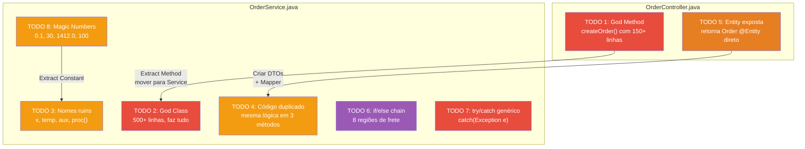
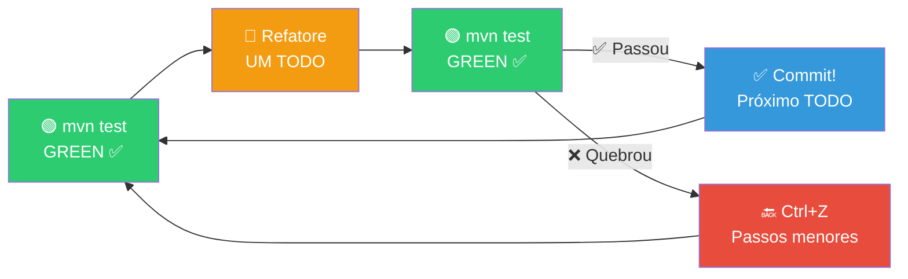
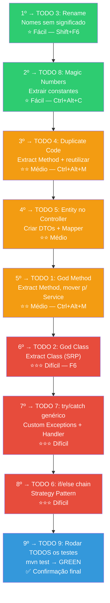
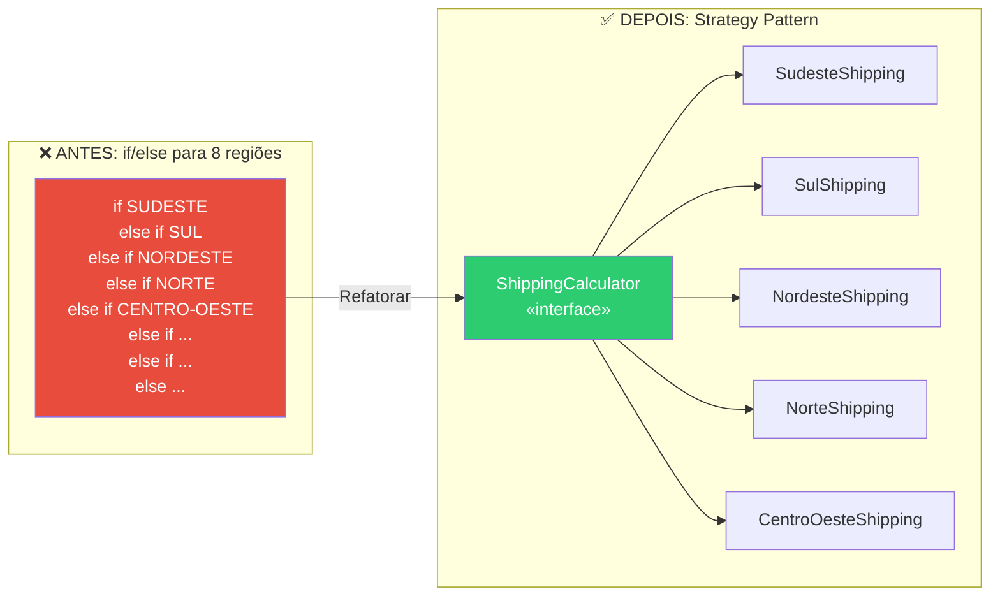

# Slide 15: Exercício — 03-bad-practices-lab

**Horário:** 15:30 - 16:30

---

## 🔧 Exercício: Refatoração de Código Ruim

Uma API de Pedidos que **funciona** mas é repleta de más práticas. Todos os testes passam. Seu desafio: **refatorar sem quebrar nada**.

```bash
cd 03-bad-practices-lab
mvn test           # Todos passam ✅ (29 testes)
mvn spring-boot:run
# Porta: 8085
```

---

## 📊 Mapa das Más Práticas no Código



---

## ⚠️ Regra de Ouro: O Ciclo Seguro



> **NUNCA** refatore dois TODOs de uma vez. Refatore UM, rode os testes, commite. Depois o próximo.

---

## TODOs — Do Mais Fácil ao Mais Difícil

### Ordem recomendada com técnicas e atalhos



---

## Detalhamento dos TODOs

### TODO 3: Rename — Nomes sem significado

```java
// ❌ ANTES — o que esse código faz? Impossível saber sem ler tudo
public void proc(Object d, int x, boolean f) {
    double t = 0;
    String aux = "";
    var lst = getAll();
    for (var o : lst) {
        if (o.getV() > x) {
            t += o.getV() * 0.1;
        }
    }
}

// ✅ DEPOIS — agora sabemos exatamente o que faz
public void processOrder(Order order, int minimumQuantity, boolean isExpress) {
    double totalDiscount = 0;
    String formattedAddress = "";
    var orders = findAllByCustomer();
    for (var currentOrder : orders) {
        if (currentOrder.getTotal() > minimumQuantity) {
            totalDiscount += currentOrder.getTotal() * DISCOUNT_RATE;
        }
    }
}
```

> **IntelliJ:** Cursor no nome → `Shift+F6` → novo nome → Enter (renomeia em TODOS os lugares)

---

### TODO 8: Magic Numbers — Extrair Constantes

```java
// ❌ ANTES — o que significam esses números?
if (order.getTotal().compareTo(new BigDecimal("100")) > 0) {
    discount = order.getTotal().multiply(new BigDecimal("0.1"));
}
if (items.size() > 5) { throw new RuntimeException("Too many items"); }
if (salary.compareTo(new BigDecimal("1412.00")) < 0) { throw new RuntimeException("Low salary"); }
if (daysToDeliver > 30) { throw new RuntimeException("Too long"); }

// ✅ DEPOIS — cada número tem um significado claro
private static final BigDecimal MINIMUM_ORDER_FOR_DISCOUNT = new BigDecimal("100.00");
private static final BigDecimal DEFAULT_DISCOUNT_RATE = new BigDecimal("0.10");
private static final int MAX_ITEMS_PER_ORDER = 5;
private static final BigDecimal MINIMUM_WAGE = new BigDecimal("1412.00");
private static final int MAX_DELIVERY_DAYS = 30;

if (order.getTotal().compareTo(MINIMUM_ORDER_FOR_DISCOUNT) > 0) {
    discount = order.getTotal().multiply(DEFAULT_DISCOUNT_RATE);
}
if (items.size() > MAX_ITEMS_PER_ORDER) { throw new TooManyItemsException(MAX_ITEMS_PER_ORDER); }
```

> **IntelliJ:** Selecione o número → `Ctrl+Alt+C` → nome da constante

---

### TODO 4: Código Duplicado — Extract Method

```java
// ❌ ANTES — mesma lógica copiada em 3 métodos
public BigDecimal processOrder(Order order) {
    // 10 linhas calculando desconto... (cópia 1)
}
public BigDecimal recalculateOrder(Order order) {
    // Mesmas 10 linhas calculando desconto... (cópia 2)
}
public BigDecimal previewOrder(Order order) {
    // Mesmas 10 linhas calculando desconto... (cópia 3)
}

// ✅ DEPOIS — extrair para UM método e reutilizar
private BigDecimal calculateDiscount(Order order) {
    // 10 linhas (UM lugar só!)
}

public BigDecimal processOrder(Order order) { return calculateDiscount(order); }
public BigDecimal recalculateOrder(Order order) { return calculateDiscount(order); }
public BigDecimal previewOrder(Order order) { return calculateDiscount(order); }
```

---

### TODO 7: try/catch Genérico → Custom Exceptions

```java
// ❌ ANTES — catch genérico engole todos os problemas
try {
    // ... toda a lógica
} catch (Exception e) {
    return ResponseEntity.status(500).body("Error: " + e.getMessage());
    // Não sabemos se foi 404, 409 ou 500!
    // Sempre retorna 500 independente do erro!
}

// ✅ DEPOIS — cada exceção com semântica clara
// Service lança exceções específicas:
throw new ProductNotFoundException(productId);     // → 404
throw new DuplicateSkuException(sku);             // → 409
throw new InsufficientStockException(name, qty);  // → 422

// @ControllerAdvice trata cada uma com o status correto
```

---

### TODO 6: if/else Chain → Strategy Pattern



---

## 📏 Tabela de Referência Rápida

| TODO | Code Smell | Técnica | Atalho IntelliJ | Dificuldade |
|:----:|-----------|---------|:---------------:|:-----------:|
| 3 | Bad Names | **Rename** | `Shift+F6` | ⭐ |
| 8 | Magic Numbers | **Extract Constant** | `Ctrl+Alt+C` | ⭐ |
| 4 | Duplicate Code | **Extract Method** | `Ctrl+Alt+M` | ⭐⭐ |
| 5 | Entity no Controller | **Create DTOs + Mapper** | Manual | ⭐⭐ |
| 1 | God Method (150 linhas) | **Extract Method** + mover | `Ctrl+Alt+M` | ⭐⭐ |
| 2 | God Class (500+ linhas) | **Extract Class** | `F6` (Move) | ⭐⭐⭐ |
| 7 | catch(Exception) | **Custom Exceptions + Handler** | Manual | ⭐⭐⭐ |
| 6 | if/else chain (8 cond.) | **Strategy Pattern** | Manual | ⭐⭐⭐ |
| 9 | Garantir testes | **mvn test** | | ✅ |

---

## 🧪 Testes existentes (29 testes)

O projeto vem com **29 testes** que devem continuar passando:

| Arquivo | Tipo | Testes | O que testa |
|---------|------|:------:|-------------|
| `OrderServiceUnitTest` | Unitário | 16 | Regras de negócio, cálculos, validações |
| `OrderControllerIntegrationTest` | Integração | 13 | Endpoints, HTTP status, JSON responses |

```bash
# Rodar testes a qualquer momento
mvn test

# Rodar apenas os unitários
mvn test -Dtest=OrderServiceUnitTest

# Rodar apenas os de integração
mvn test -Dtest=OrderControllerIntegrationTest
```

---

## 💡 Dicas

- Comece pelos TODOs mais simples (**3, 8**) para ganhar confiança
- Use os **atalhos da IDE** — não refatore manualmente (muito erro)
- **Ctrl+Z é seu amigo** — desfaça se algo quebrar
- Rode `mvn test` depois de **CADA TODO**
- Se travar: olhe o `03-clean-architecture-demo` como referência
- **Não precisa terminar todos!** O mais importante é praticar o ciclo seguro (test → refactor → test)
