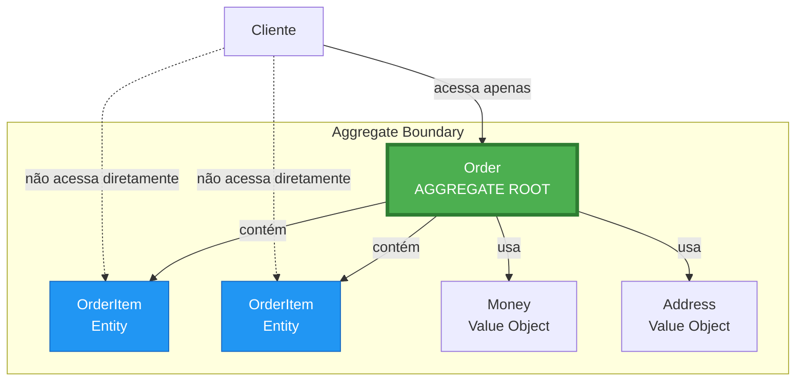
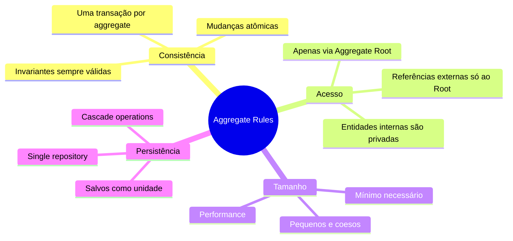
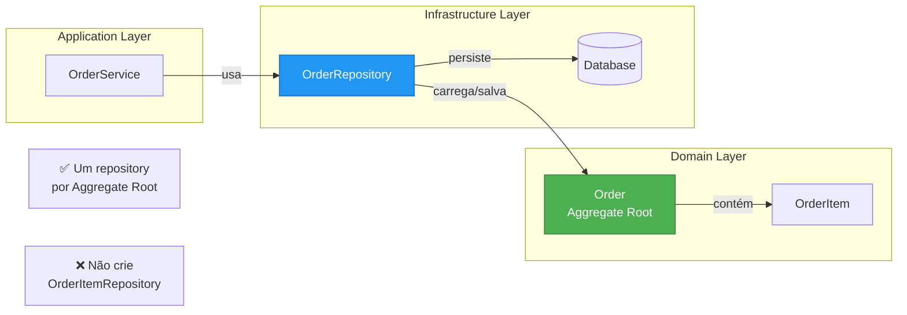
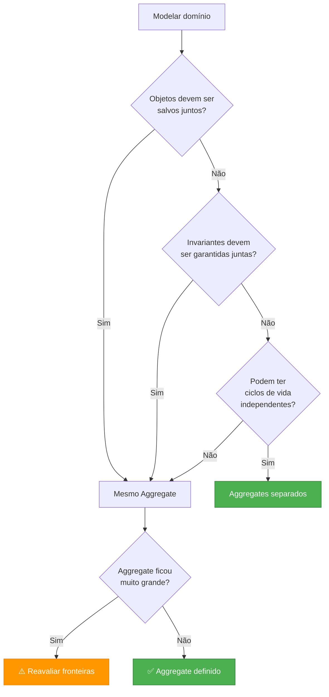
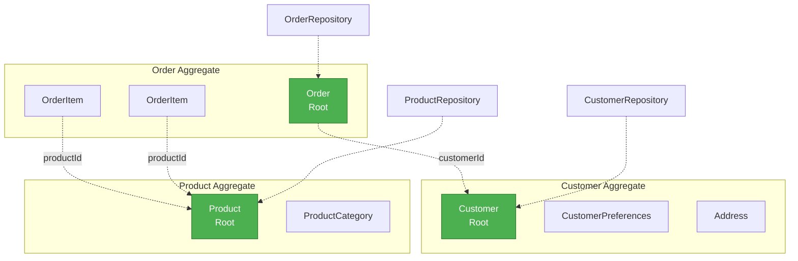

# Slide 15: Aggregates e Aggregate Roots

---

## 📖 Definição

> **"Aggregate é um cluster de objetos de domínio que podem ser tratados como uma única unidade"**

> **"Aggregate Root é a entidade principal que controla o acesso ao aggregate"**

---

## 🎯 Estrutura de um Aggregate



---

## 🔐 Regras de Aggregates



---

## ✅ Exemplo: Order Aggregate

```java
@Entity
@Getter
public class Order {  // 🟢 AGGREGATE ROOT
    
    @Id
    @GeneratedValue
    private Long id;
    
    @ManyToOne
    private Customer customer;
    
    // ⚠️ Entidades internas - acesso controlado
    @OneToMany(cascade = CascadeType.ALL, orphanRemoval = true)
    private List<OrderItem> items = new ArrayList<>();
    
    private Money totalAmount;
    private Address shippingAddress;
    private OrderStatus status;
    
    // ✅ Método público - único ponto de entrada
    public void addItem(Product product, int quantity) {
        validateCanAddItem();
        
        OrderItem item = new OrderItem(this, product, quantity);
        items.add(item);
        recalculateTotal();
    }
    
    // ✅ Método público - mantém invariantes
    public void removeItem(Long itemId) {
        validateCanModifyItems();
        
        items.removeIf(item -> item.getId().equals(itemId));
        recalculateTotal();
    }
    
    // ✅ Método público - transição de estado válida
    public void confirm() {
        if (status != OrderStatus.PENDING) {
            throw new IllegalStateException("Only pending orders can be confirmed");
        }
        if (items.isEmpty()) {
            throw new IllegalStateException("Cannot confirm empty order");
        }
        if (!totalAmount.isGreaterThan(Money.ZERO)) {
            throw new IllegalStateException("Order total must be greater than zero");
        }
        
        this.status = OrderStatus.CONFIRMED;
    }
    
    // 🔒 Métodos privados - lógica interna
    private void validateCanAddItem() {
        if (status != OrderStatus.PENDING) {
            throw new IllegalStateException("Cannot modify non-pending order");
        }
    }
    
    private void validateCanModifyItems() {
        if (status != OrderStatus.PENDING) {
            throw new IllegalStateException("Cannot modify non-pending order");
        }
    }
    
    private void recalculateTotal() {
        this.totalAmount = items.stream()
            .map(OrderItem::getSubtotal)
            .reduce(Money.ZERO, Money::add);
    }
}

// 🔵 Entidade interna - não é Aggregate Root
@Entity
@Getter
@NoArgsConstructor(access = AccessLevel.PROTECTED)  // JPA precisa
class OrderItem {
    
    @Id
    @GeneratedValue
    private Long id;
    
    @ManyToOne
    private Order order;  // Referência ao Aggregate Root
    
    @ManyToOne
    private Product product;
    
    private int quantity;
    private Money unitPrice;
    
    // Construtor package-private - só Order pode criar
    OrderItem(Order order, Product product, int quantity) {
        if (quantity <= 0) {
            throw new IllegalArgumentException("Quantity must be positive");
        }
        
        this.order = order;
        this.product = product;
        this.quantity = quantity;
        this.unitPrice = product.getPrice();
    }
    
    public Money getSubtotal() {
        return unitPrice.multiply(BigDecimal.valueOf(quantity));
    }
}
```

---

## 🚫 O que NÃO fazer

```java
// ❌ ERRADO: Acessar entidades internas diretamente
@Service
public class OrderService {
    
    public void updateItemQuantity(Long orderId, Long itemId, int newQuantity) {
        Order order = orderRepository.findById(orderId);
        
        // ❌ Acesso direto à entidade interna!
        OrderItem item = order.getItems().stream()
            .filter(i -> i.getId().equals(itemId))
            .findFirst()
            .orElseThrow();
        
        // ❌ Modificação direta!
        item.setQuantity(newQuantity);
        
        // ❌ Invariantes podem ser quebradas!
        // (total não foi recalculado)
    }
}

// ✅ CORRETO: Através do Aggregate Root
@Service
public class OrderService {
    
    public void updateItemQuantity(Long orderId, Long itemId, int newQuantity) {
        Order order = orderRepository.findById(orderId);
        
        // ✅ Através de método público do Aggregate Root
        order.updateItemQuantity(itemId, newQuantity);
        // Invariantes são mantidas automaticamente
    }
}
```

---

## 🔄 Agregados e Repositórios



---

## 📝 Repository Interface (no Domain)

```java
// Interface no domínio - abstração
public interface OrderRepository {
    Order findById(Long id);
    List<Order> findAll();
    List<Order> findByCustomer(Customer customer);
    Order save(Order order);  // Salva aggregate completo
    void delete(Order order);
}

// Implementação na infraestrutura
@Repository
public interface JpaOrderRepository 
    extends OrderRepository, JpaRepository<Order, Long> {
    
    @Query("SELECT o FROM Order o JOIN FETCH o.items WHERE o.id = :id")
    Order findById(@Param("id") Long id);  // Carrega aggregate completo
}
```

---

## 🎯 Definindo Fronteiras de Aggregates



---

## 🔗 Referências entre Aggregates

```java
// ✅ CORRETO: Referência por ID
@Entity
public class Order {
    @Id
    private Long id;
    
    // ✅ Referência por ID, não objeto direto
    private Long customerId;
    
    // Se precisar do objeto, carrega explicitamente
    @Transient
    private Customer customer;
}

// ❌ EVITE: Carregar aggregate inteiro
@Entity
public class Order {
    @Id
    private Long id;
    
    // ⚠️ Carrega Customer aggregate completo
    // Pode causar problemas de performance
    @ManyToOne(fetch = FetchType.EAGER)
    private Customer customer;
}

// ✅ ALTERNATIVA: Lazy loading quando necessário
@Entity
public class Order {
    @Id
    private Long id;
    
    @ManyToOne(fetch = FetchType.LAZY)
    private Customer customer;
    
    // Ou use ID e carregue apenas quando necessário
    public Customer getCustomer(CustomerRepository repository) {
        if (customer == null) {
            customer = repository.findById(customerId);
        }
        return customer;
    }
}
```

---

## 📊 Exemplo: Múltiplos Aggregates



---

## 💡 Dica do Instrutor

```
⚠️ Regras para Aggregates:

✅ FAÇA:
- Um repository por Aggregate Root
- Acesso apenas via Aggregate Root
- Mantenha aggregates pequenos
- Use IDs para referenciar outros aggregates
- Salve aggregate completo de uma vez

❌ NÃO FAÇA:
- Repository para entidades internas
- Acesso direto a entidades internas
- Aggregates muito grandes (>10 entidades)
- Referências bidirecionais entre aggregates
- Modificar entidades internas de fora do aggregate

🎯 Tamanho ideal:
- 1 Root + 2-5 entidades internas
- Se maior, considere dividir
- Performance: quanto menor, melhor
```
