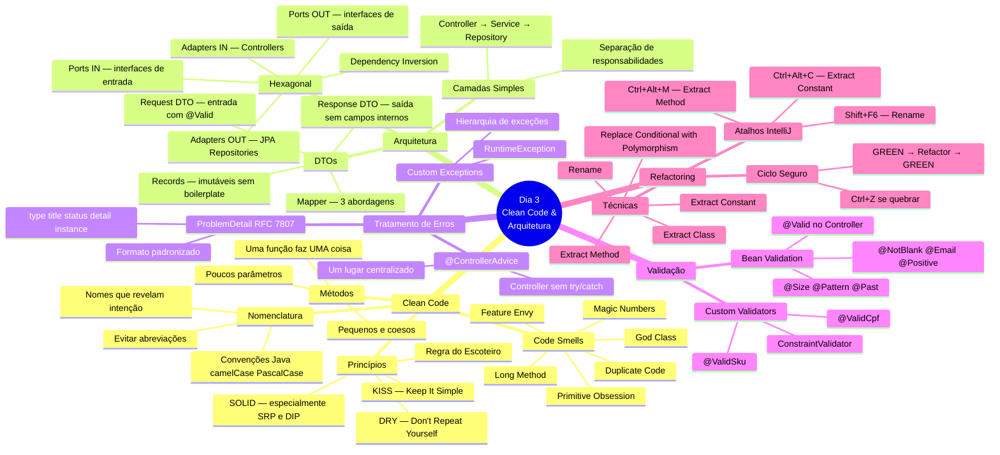
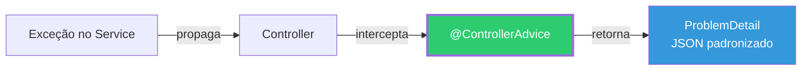
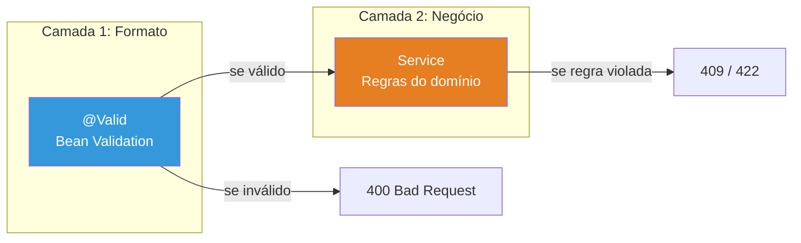
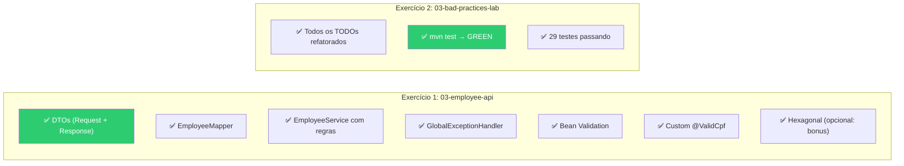
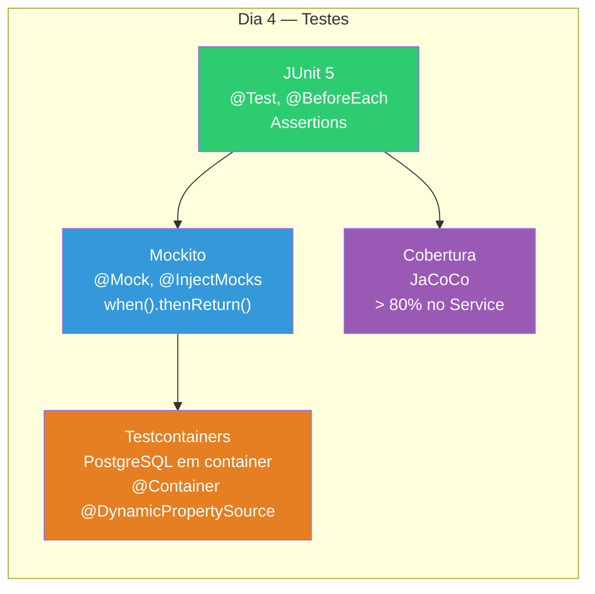

# Slide 16: Review e Q&A

**Horário:** 16:30 - 17:00

---

## 📋 Mapa Mental — Tudo que Aprendemos Hoje



---

## 📊 Resumo por Tema

### Clean Code

| Conceito | O que é | Exemplo |
|----------|---------|---------|
| **Nomenclatura** | Nomes que revelam intenção | `daysSinceCreation` em vez de `d` |
| **Métodos** | Pequenos, coesos, uma responsabilidade | `validateStock()` em vez de bloco com comentário |
| **DRY** | Não repetir lógica | Extract Method → reutilizar |
| **KISS** | Manter simples | Evitar abstrações desnecessárias |
| **SRP** | Uma classe = uma responsabilidade | `OrderService`, `OrderCalculation`, `OrderNotification` |
| **Code Smells** | Sinais de problemas no código | God Class, Long Method, Magic Numbers |

### Arquitetura

| Conceito | O que é | Quando usar |
|----------|---------|-------------|
| **Camadas** | Controller → Service → Repository | CRUDs simples, projetos pequenos |
| **DTOs** | Separar modelo de API vs banco | **Sempre!** Nunca expor Entity |
| **Hexagonal** | Ports (interfaces) & Adapters (implementações) | Domínio complexo, múltiplas fontes |

### Tratamento de Erros



### Validação



---

## 🧠 Quiz Final — Revisão

### 1. Clean Code
> O que é a "Regra do Escoteiro"?

**R:** "Deixe o código melhor do que encontrou." Se mexer em um arquivo, aproveite para renomear uma variável, extrair um método, etc.

### 2. DTOs
> Por que NUNCA devemos retornar a Entity JPA diretamente no Controller?

**R:** (1) Acoplamento API↔banco, (2) vazamento de dados sensíveis, (3) serialização circular, (4) impossível evoluir API independentemente.

### 3. Hexagonal
> Qual é a "Regra de Dependência" da Arquitetura Hexagonal?

**R:** Dependências apontam para **dentro** (para o domain). O domain nunca depende de adapters. Adapters implementam interfaces (ports) definidas pelo domain.

### 4. @ControllerAdvice
> O que acontece se você NÃO tiver um @ControllerAdvice?

**R:** O Spring retorna a Whitelabel Error Page (HTML) ou JSON genérico sem detalhes — péssima experiência para consumidores da API.

### 5. Bean Validation
> Qual a diferença entre @NotNull, @NotEmpty e @NotBlank?

**R:** `@NotNull`: ≠ null. `@NotEmpty`: ≠ null && tamanho > 0. `@NotBlank`: ≠ null && tamanho > 0 && não só espaços (mais restritivo para Strings).

### 6. Custom Validator
> Um ConstraintValidator pode acessar o banco de dados?

**R:** Sim! Pode usar `@Autowired` para injetar repositórios. Exemplo: `@UniqueEmail` verificando se o email já existe.

### 7. Refactoring
> Qual é o ciclo seguro de refatoração?

**R:** GREEN → Refatorar UMA coisa → GREEN → Commit. Se quebrou? `Ctrl+Z` e passos menores.

---

## 🤔 Perguntas para Reflexão

1. **Clean Code vs. Prazo**: Como equilibrar qualidade de código com deadlines apertados?
   > Dica: Regra do Escoteiro é incremental. Não precisa parar tudo para refatorar.

2. **Hexagonal overkill?**: Em que tipo de projeto vocês acham que vale a pena?
   > Dica: Se tiver 3 endpoints CRUD, camadas simples bastam. Se tiver 20 regras de negócio, hexagonal brilha.

3. **Custom Validators**: Que validações específicas do domínio de vocês fariam sentido?
   > Dica: Pense em CPF, CNPJ, CEP, placa de carro, código interno da empresa.

4. **Refatoração no dia a dia**: Como convencer o tech lead a alocar tempo para refatoração?
   > Dica: Mostrar dados — bugs, tempo de onboarding, custo de manutenção.

---

## 📌 Checklist de Entrega — Dia 3



---

## 📚 Referências para Estudo

| Livro | Autor | Capítulos relevantes |
|-------|-------|---------------------|
| **Clean Code** | Robert C. Martin | Cap. 2 (Nomes), 3 (Funções), 7 (Erros), 17 (Smells) |
| **Refactoring** | Martin Fowler | Cap. 3 (Bad Smells), 6 (Extract Method), 8 (Move) |
| **Effective Java** | Joshua Bloch | Item 1 (Factory), Item 15 (Immutability), Item 72 (Exceptions) |
| **Clean Architecture** | Robert C. Martin | Cap. 22 (Clean Architecture), Cap. 34 (Missing Chapter) |

---

## 🏠 Preparação para o Dia 4

O Dia 4 é sobre **Testes Automatizados**. Para se preparar:

### 1. Verificar Docker
```bash
docker --version      # Verificar instalação (necessário para Testcontainers)
docker info           # Verificar que está rodando
```

### 2. Conceitos para revisar



- **JUnit 5:** AAA pattern (Arrange, Act, Assert), `@Test`, `@BeforeEach`, `@DisplayName`
- **Mockito:** `@Mock`, `@InjectMocks`, `when(...).thenReturn(...)`, `verify(...)`
- **Testcontainers:** PostgreSQL em container Docker para testes de integração
- **Cobertura:** O que é, por que > 80% no Service é um bom alvo

### 3. Ler
- Diferença entre teste **unitário** vs. teste de **integração**
- Por que mockamos dependências externas

---

## 💡 Dica do Instrutor

Encerrar com uma refatoração ao vivo de um dos TODOs do `bad-practices-lab`, mostrando o ciclo completo ao vivo:

```
mvn test → GREEN ✅
Shift+F6 (rename "d" → "daysSinceCreation")  
mvn test → GREEN ✅
git commit -m "refactor: rename ambiguous variables in OrderService"
```

Perguntar: "Vocês viram como é simples e seguro quando se tem testes? Por isso o Dia 4 é sobre testes!"
