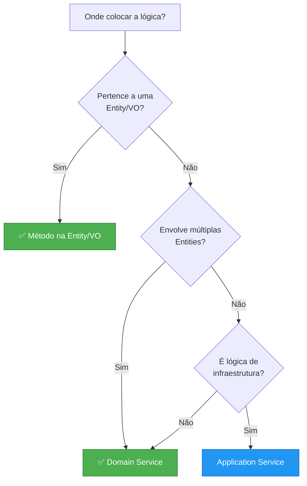
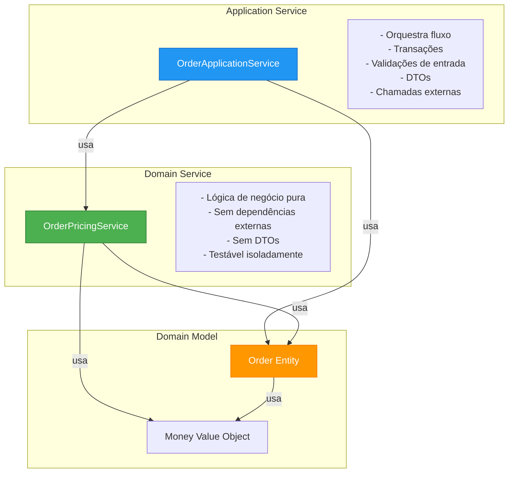
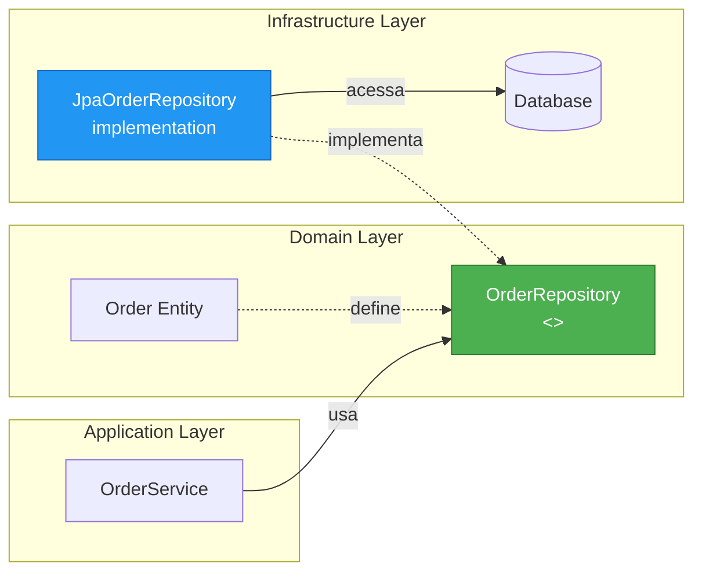
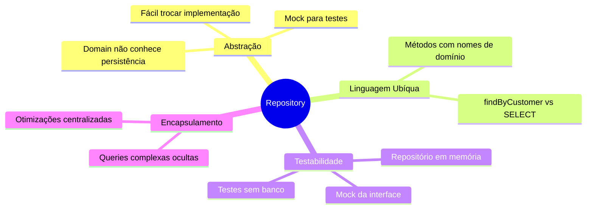
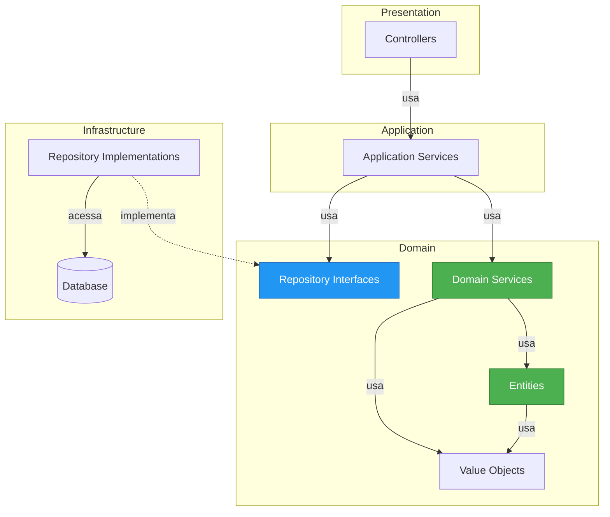

# Slide 16: Domain Services e Repositories

---

## 🎯 Domain Services

> **"Lógica de domínio que não pertence a nenhuma entidade ou value object específico"**



---

## 💡 Exemplo: Domain Service

```java
// Domain Service - operação que envolve múltiplas entidades
@Service
public class OrderPricingService {
    
    // Cálculo de preço envolve Order, Customer, Product
    public Money calculateTotalPrice(Order order, Customer customer) {
        Money subtotal = order.calculateSubtotal();
        
        // Desconto baseado no cliente
        Money discount = calculateCustomerDiscount(customer, subtotal);
        
        // Taxa de entrega baseada no endereço
        Money shipping = calculateShipping(order.getShippingAddress());
        
        // Impostos
        Money tax = calculateTax(subtotal, order.getShippingAddress());
        
        return subtotal
            .subtract(discount)
            .add(shipping)
            .add(tax);
    }
    
    private Money calculateCustomerDiscount(Customer customer, Money amount) {
        if (customer.isVip()) {
            return amount.multiply(BigDecimal.valueOf(0.10));
        }
        return Money.ZERO;
    }
    
    private Money calculateShipping(Address address) {
        // Lógica complexa de cálculo de frete
        return new Money(BigDecimal.valueOf(15.00), "BRL");
    }
    
    private Money calculateTax(Money amount, Address address) {
        // Cálculo de impostos por estado
        BigDecimal taxRate = getTaxRateForState(address.state());
        return amount.multiply(taxRate);
    }
    
    private BigDecimal getTaxRateForState(String state) {
        return switch(state) {
            case "SP" -> BigDecimal.valueOf(0.18);
            case "RJ" -> BigDecimal.valueOf(0.16);
            default -> BigDecimal.valueOf(0.12);
        };
    }
}
```

---

## 🔄 Domain Service vs Application Service



```java
// Application Service - orquestra
@Service
@RequiredArgsConstructor
public class OrderApplicationService {
    private final OrderRepository orderRepository;
    private final CustomerRepository customerRepository;
    private final OrderPricingService pricingService;  // Domain Service
    private final PaymentService paymentService;
    private final EmailService emailService;
    
    @Transactional
    public OrderDTO createOrder(CreateOrderRequest request) {
        // 1. Validação de entrada
        validateRequest(request);
        
        // 2. Carregar entidades
        Customer customer = customerRepository.findById(request.customerId());
        
        // 3. Criar order (lógica de domínio)
        Order order = Order.create(customer, request.items());
        
        // 4. Calcular preço (Domain Service)
        Money totalPrice = pricingService.calculateTotalPrice(order, customer);
        order.setTotalPrice(totalPrice);
        
        // 5. Salvar
        order = orderRepository.save(order);
        
        // 6. Processar pagamento (infraestrutura)
        paymentService.process(order);
        
        // 7. Enviar email (infraestrutura)
        emailService.sendOrderConfirmation(customer.getEmail(), order);
        
        // 8. Retornar DTO
        return OrderDTO.from(order);
    }
}
```

---

## 📦 Repositories

> **"Interface que abstrai a persistência de Aggregates"**



---

## ✅ Repository Interface (Domain)

```java
// Interface no pacote de domínio
package com.example.domain.order;

import java.util.List;
import java.util.Optional;

public interface OrderRepository {
    
    // Busca por ID
    Optional<Order> findById(Long id);
    
    // Busca por critérios de domínio
    List<Order> findByCustomer(Customer customer);
    List<Order> findByStatus(OrderStatus status);
    List<Order> findPendingOrders();
    
    // Salvar aggregate
    Order save(Order order);
    
    // Deletar aggregate
    void delete(Order order);
    
    // Queries específicas do domínio
    boolean existsByCustomerAndStatus(Customer customer, OrderStatus status);
    long countByStatus(OrderStatus status);
}
```

---

## ✅ Repository Implementation (Infrastructure)

```java
// Implementação no pacote de infraestrutura
package com.example.infrastructure.persistence;

import org.springframework.data.jpa.repository.JpaRepository;
import org.springframework.data.jpa.repository.Query;
import org.springframework.stereotype.Repository;

@Repository
public interface JpaOrderRepository 
    extends OrderRepository, JpaRepository<Order, Long> {
    
    // Spring Data JPA gera implementação automática
    
    @Override
    @Query("SELECT o FROM Order o JOIN FETCH o.items WHERE o.id = :id")
    Optional<Order> findById(Long id);
    
    @Override
    @Query("SELECT o FROM Order o WHERE o.customer = :customer")
    List<Order> findByCustomer(Customer customer);
    
    @Override
    @Query("SELECT o FROM Order o WHERE o.status = :status")
    List<Order> findByStatus(OrderStatus status);
    
    @Override
    @Query("SELECT o FROM Order o WHERE o.status = 'PENDING'")
    List<Order> findPendingOrders();
}
```

---

## 🎯 Repository Pattern Benefits



---

## 🧪 Testando com Repository Mock

```java
@Test
public void shouldCreateOrder() {
    // Arrange
    OrderRepository mockRepository = mock(OrderRepository.class);
    CustomerRepository mockCustomerRepo = mock(CustomerRepository.class);
    OrderPricingService pricingService = new OrderPricingService();
    
    OrderApplicationService service = new OrderApplicationService(
        mockRepository, 
        mockCustomerRepo, 
        pricingService
    );
    
    Customer customer = new Customer(1L, "John Doe");
    when(mockCustomerRepo.findById(1L)).thenReturn(Optional.of(customer));
    when(mockRepository.save(any(Order.class))).thenAnswer(i -> i.getArgument(0));
    
    // Act
    CreateOrderRequest request = new CreateOrderRequest(1L, List.of(...));
    OrderDTO result = service.createOrder(request);
    
    // Assert
    assertNotNull(result);
    verify(mockRepository).save(any(Order.class));
}
```

---

## 🔍 Repository vs DAO

| Aspecto | Repository | DAO (Data Access Object) |
|---------|-----------|--------------------------|
| Nível | Domain | Infraestrutura |
| Foco | Aggregate | Tabela/Entidade |
| Linguagem | Domínio (findByCustomer) | Técnica (SELECT) |
| Abstração | Alta | Baixa |
| Escopo | Aggregate completo | Operações CRUD |
| DDD | ✅ Sim | ❌ Não |

---

## ⚠️ Boas Práticas

```java
// ✅ FAÇA
public interface OrderRepository {
    // Nomes com linguagem de domínio
    List<Order> findByCustomer(Customer customer);
    List<Order> findPendingOrders();
    boolean hasCustomerPlacedOrderToday(Customer customer);
}

// ❌ EVITE
public interface OrderRepository {
    // Nomes técnicos
    List<Order> select(String sql);
    List<Order> executeQuery(Map params);
    List<Order> findByCriteria(Criteria criteria);
}

// ✅ FAÇA - Repository retorna Aggregates completos
public interface OrderRepository {
    Order findById(Long id);  // Carrega Order + Items
}

// ❌ EVITE - Repository para entidades internas
public interface OrderItemRepository {  // ❌ OrderItem faz parte do Order Aggregate
    OrderItem findById(Long id);
}
```

---

## 📊 Camadas e Responsabilidades



---

## 💡 Dica do Instrutor

```
⚠️ Domain Services:
✅ Lógica que envolve múltiplas entidades
✅ Operações complexas de domínio
✅ Stateless (sem estado)
✅ Testável sem infraestrutura

❌ Não é Domain Service:
- Orquestração de fluxo (Application Service)
- Acesso a banco de dados
- Envio de emails
- Chamadas HTTP

⚠️ Repositories:
✅ Interface no domínio
✅ Implementação na infraestrutura
✅ Um por Aggregate Root
✅ Métodos com linguagem de domínio
✅ Retorna Aggregates completos

❌ Evite:
- Repository genérico para tudo
- Métodos técnicos (executeQuery, etc)
- Repository para entidades internas
```
