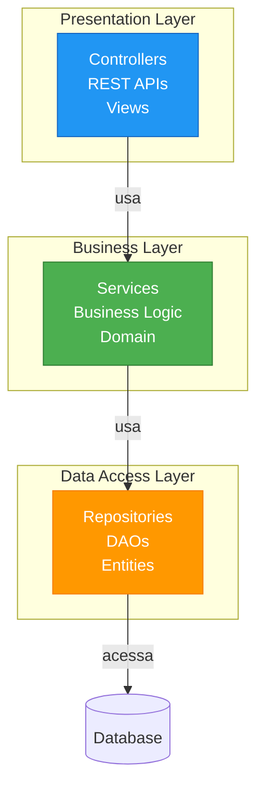
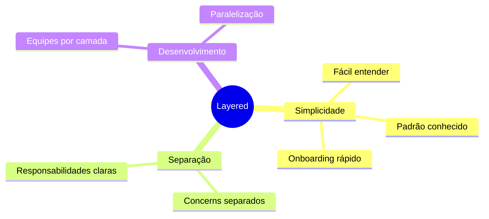
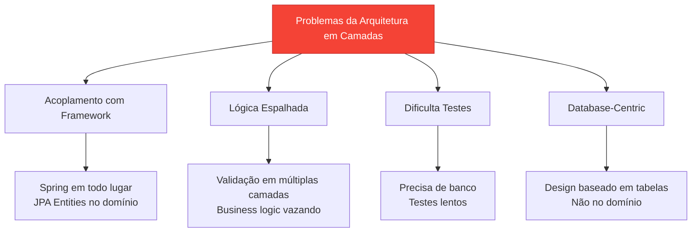
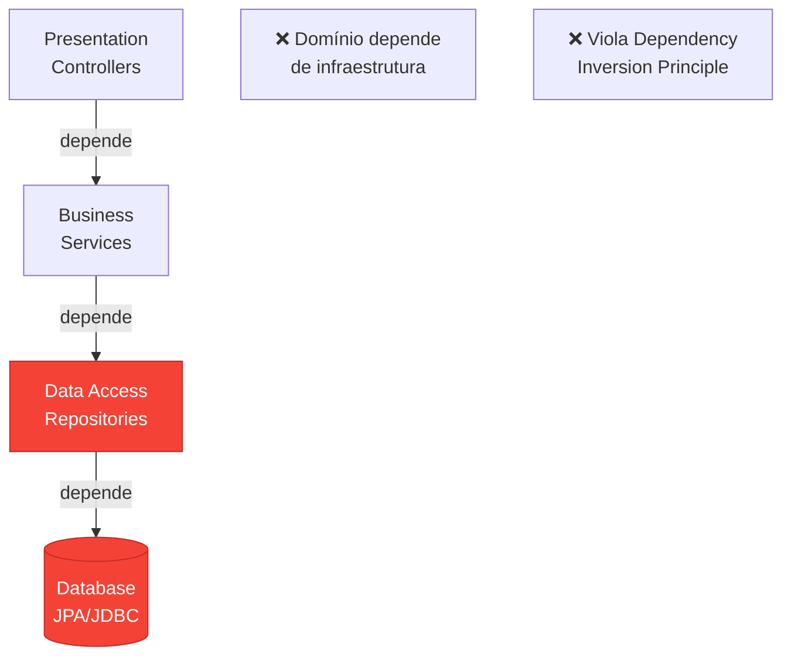
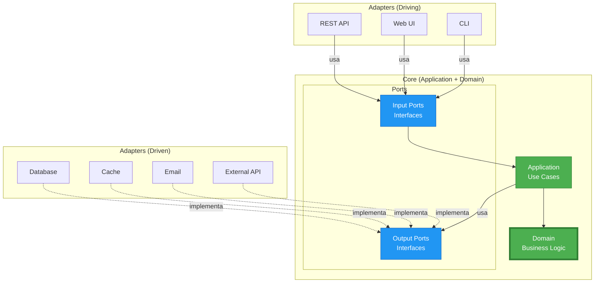
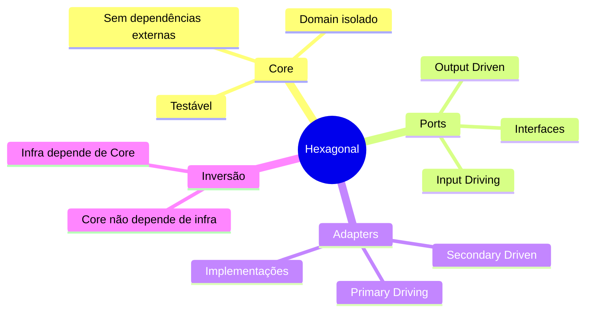
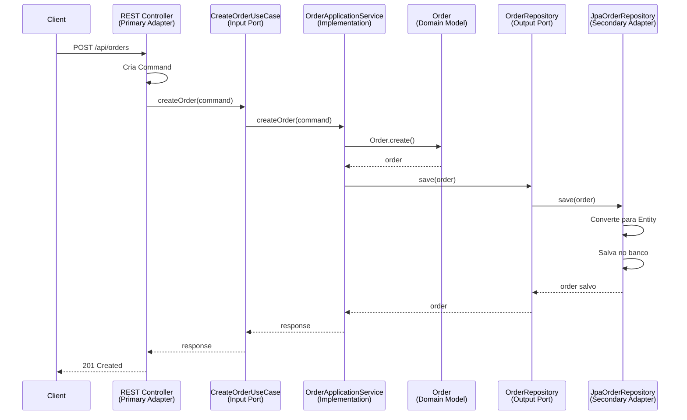
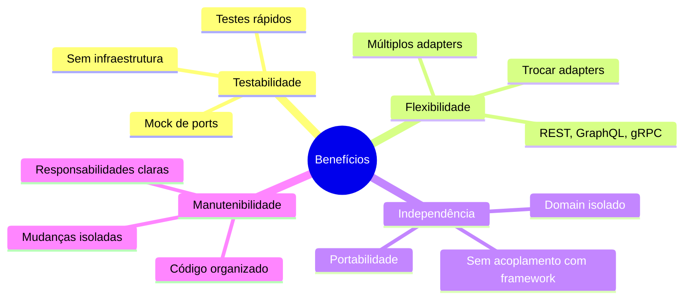
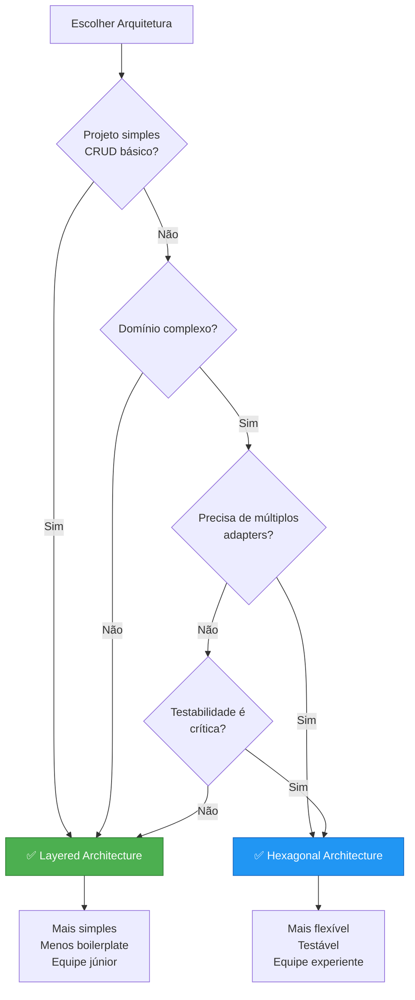

# Slide 17: Arquitetura em Camadas

**Horário:** 14:30 - 15:30

---

## 🏛️ Arquitetura Tradicional em 3 Camadas



---

## 📦 Estrutura de Pacotes (Layered)

```
src/main/java/com/example/
├── presentation/          # Camada de apresentação
│   ├── controller/
│   │   ├── OrderController.java
│   │   └── ProductController.java
│   └── dto/
│       ├── OrderDTO.java
│       └── ProductDTO.java
│
├── business/              # Camada de negócio
│   ├── service/
│   │   ├── OrderService.java
│   │   └── ProductService.java
│   └── validator/
│       └── OrderValidator.java
│
└── data/                  # Camada de dados
    ├── repository/
    │   ├── OrderRepository.java
    │   └── ProductRepository.java
    └── entity/
        ├── OrderEntity.java
        └── ProductEntity.java
```

---

## ✅ Vantagens



---

## ❌ Problemas



---

## 🔄 Fluxo de Dependências

### ❌ Problema: Dependências apontam para baixo



---

## 🏗️ Arquitetura Hexagonal (Ports & Adapters)



---

## 🎯 Conceitos da Arquitetura Hexagonal



---

## 📦 Estrutura de Pacotes (Hexagonal)

```
src/main/java/com/example/
├── domain/                         # 🟢 Core - Domain
│   ├── model/
│   │   ├── Order.java              # Entity
│   │   ├── Money.java              # Value Object
│   │   └── OrderStatus.java        # Enum
│   ├── service/
│   │   └── OrderPricingService.java  # Domain Service
│   └── exception/
│       └── OrderException.java
│
├── application/                    # 🟢 Core - Application
│   ├── port/
│   │   ├── in/                     # Input Ports (Driving)
│   │   │   ├── CreateOrderUseCase.java
│   │   │   └── FindOrderUseCase.java
│   │   └── out/                    # Output Ports (Driven)
│   │       ├── OrderRepository.java
│   │       ├── PaymentGateway.java
│   │       └── EmailService.java
│   └── service/
│       └── OrderApplicationService.java
│
└── infrastructure/                 # 🔵 Adapters
    ├── adapter/
    │   ├── in/                     # Primary Adapters (Driving)
    │   │   ├── rest/
    │   │   │   └── OrderController.java
    │   │   └── cli/
    │   │       └── OrderCLI.java
    │   └── out/                    # Secondary Adapters (Driven)
    │       ├── persistence/
    │       │   └── JpaOrderRepository.java
    │       ├── payment/
    │       │   └── StripePaymentGateway.java
    │       └── email/
    │           └── SmtpEmailService.java
    └── config/
        └── BeanConfiguration.java
```

---

## 🔌 Ports (Interfaces)

### Input Port (Driving)

```java
// application/port/in/CreateOrderUseCase.java
package com.example.application.port.in;

public interface CreateOrderUseCase {
    OrderResponse createOrder(CreateOrderCommand command);
}

// Command (DTO de entrada)
public record CreateOrderCommand(
    Long customerId,
    List<OrderItemRequest> items,
    Address shippingAddress
) {}
```

### Output Port (Driven)

```java
// application/port/out/OrderRepository.java
package com.example.application.port.out;

public interface OrderRepository {
    Order save(Order order);
    Optional<Order> findById(Long id);
    List<Order> findByCustomer(Long customerId);
}

// application/port/out/PaymentGateway.java
public interface PaymentGateway {
    PaymentResult processPayment(Order order, PaymentDetails details);
}
```

---

## 🔧 Adapters (Implementações)

### Primary Adapter (REST)

```java
// infrastructure/adapter/in/rest/OrderController.java
package com.example.infrastructure.adapter.in.rest;

@RestController
@RequestMapping("/api/orders")
@RequiredArgsConstructor
public class OrderController {
    
    private final CreateOrderUseCase createOrderUseCase;
    private final FindOrderUseCase findOrderUseCase;
    
    @PostMapping
    public ResponseEntity<OrderResponse> createOrder(
            @RequestBody CreateOrderRequest request) {
        
        CreateOrderCommand command = new CreateOrderCommand(
            request.customerId(),
            request.items(),
            request.shippingAddress()
        );
        
        OrderResponse response = createOrderUseCase.createOrder(command);
        return ResponseEntity.status(HttpStatus.CREATED).body(response);
    }
    
    @GetMapping("/{id}")
    public ResponseEntity<OrderResponse> getOrder(@PathVariable Long id) {
        return findOrderUseCase.findById(id)
            .map(ResponseEntity::ok)
            .orElse(ResponseEntity.notFound().build());
    }
}
```

### Secondary Adapter (Database)

```java
// infrastructure/adapter/out/persistence/JpaOrderRepository.java
package com.example.infrastructure.adapter.out.persistence;

@Repository
@RequiredArgsConstructor
public class JpaOrderRepositoryAdapter implements OrderRepository {
    
    private final SpringDataOrderRepository springDataRepo;
    private final OrderMapper mapper;
    
    @Override
    public Order save(Order order) {
        OrderEntity entity = mapper.toEntity(order);
        OrderEntity saved = springDataRepo.save(entity);
        return mapper.toDomain(saved);
    }
    
    @Override
    public Optional<Order> findById(Long id) {
        return springDataRepo.findById(id)
            .map(mapper::toDomain);
    }
}

// Spring Data JPA interface (interno ao adapter)
interface SpringDataOrderRepository extends JpaRepository<OrderEntity, Long> {}
```

---

## 🔄 Fluxo Completo



---

## 📊 Comparação: Layered vs Hexagonal

| Aspecto | Layered | Hexagonal |
|---------|---------|-----------|
| Dependências | Top → Bottom | Outside → Inside |
| Domínio | Acoplado com infra | Isolado |
| Testabilidade | Difícil (precisa DB) | Fácil (mocks) |
| Flexibilidade | Baixa | Alta |
| Complexidade | Baixa | Média |
| Manutenção | Difícil (código espalhado) | Fácil (isolado) |
| Framework | Acoplado | Desacoplado |

---

## 🎯 Benefícios da Hexagonal



---

## 💡 Quando Usar Cada Uma?



---

## 💡 Dica do Instrutor

```
⚠️ Layered Architecture:
✅ Use quando:
- Projeto simples (CRUD)
- Equipe iniciante
- Prazo curto
- Domínio trivial

❌ Evite quando:
- Domínio complexo
- Precisa de múltiplos front-ends/APIs
- Testabilidade é crucial
- Longo prazo

⚠️ Hexagonal Architecture:
✅ Use quando:
- Domínio rico e complexo
- Múltiplos adapters (REST, gRPC, CLI)
- Testabilidade importante
- Independência de framework
- Projeto de longo prazo

❌ Over-engineering para:
- CRUD simples
- Protótipos
- Projetos pequenos

🎯 Dica: Comece simples, evolua para hexagonal quando necessário!
```
