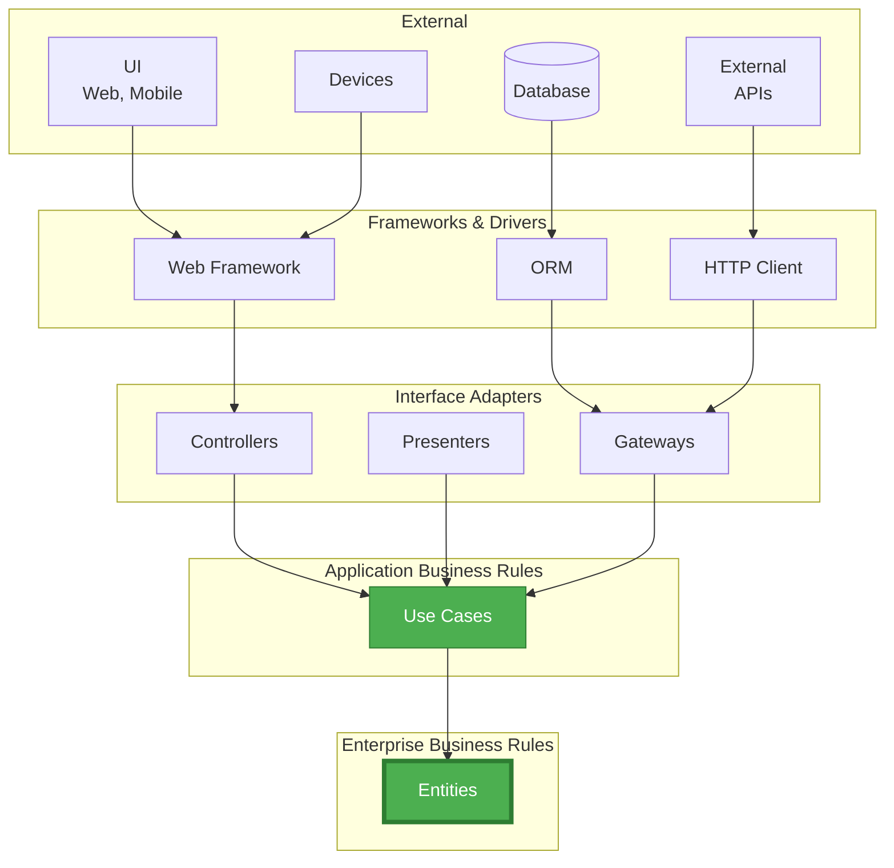
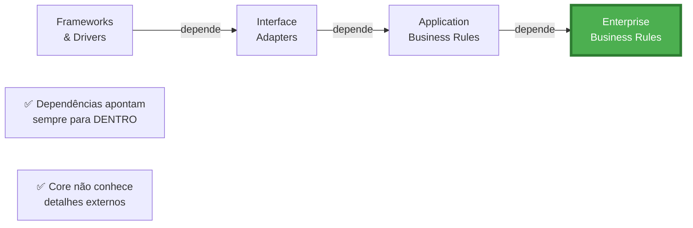
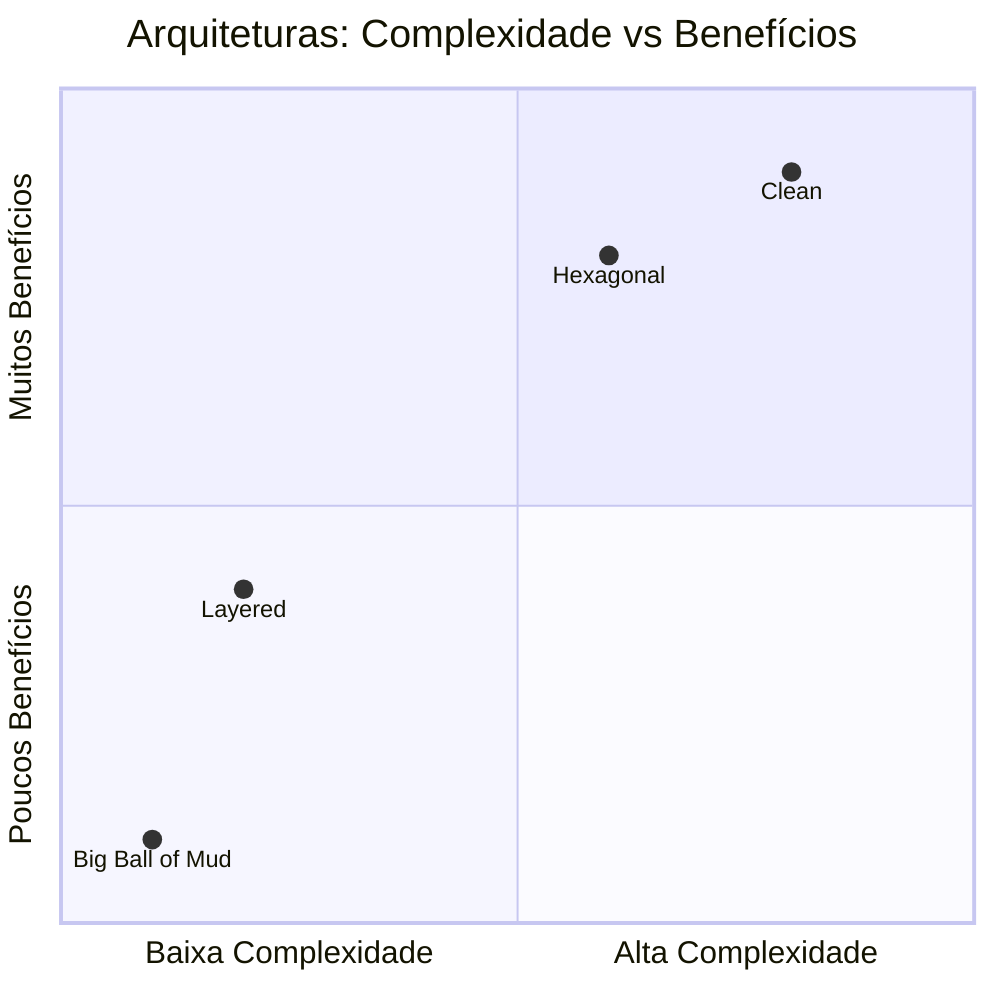
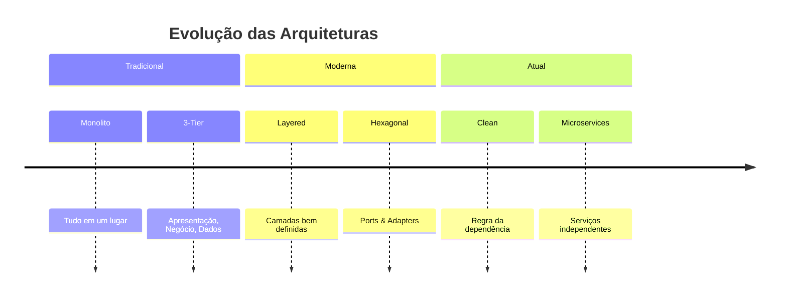
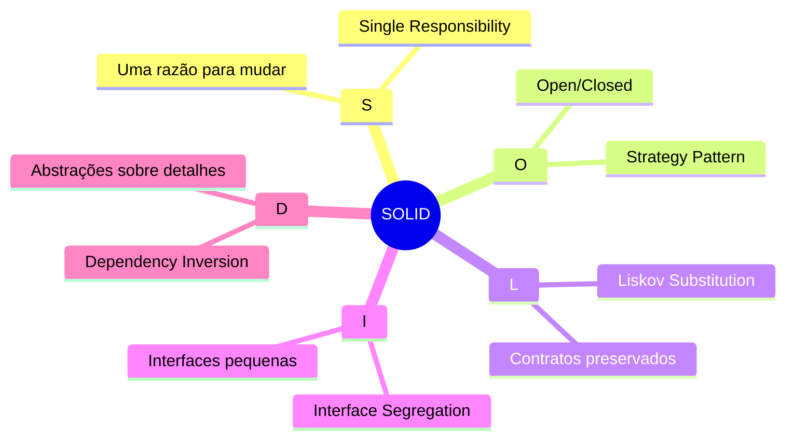
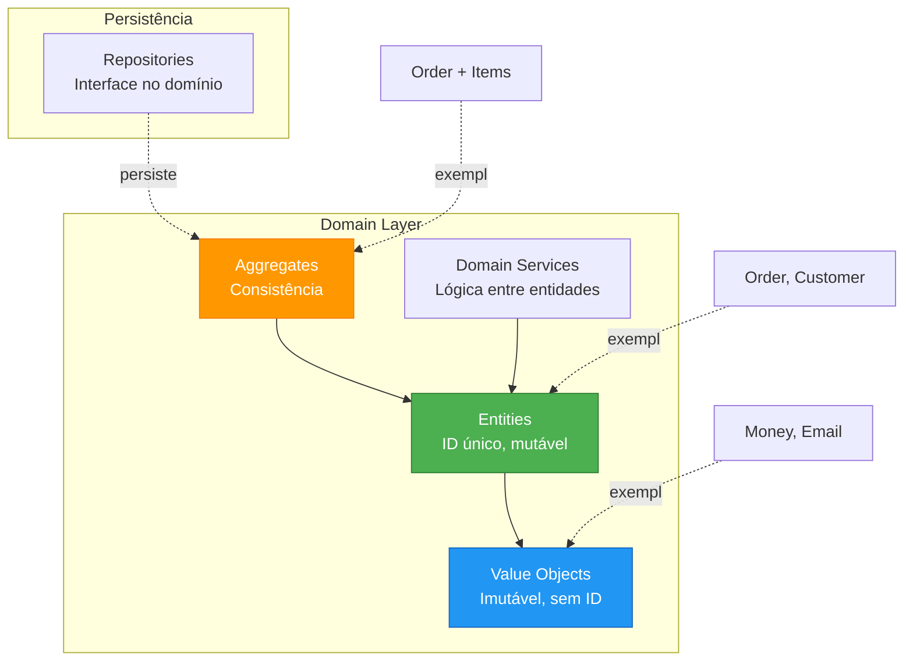
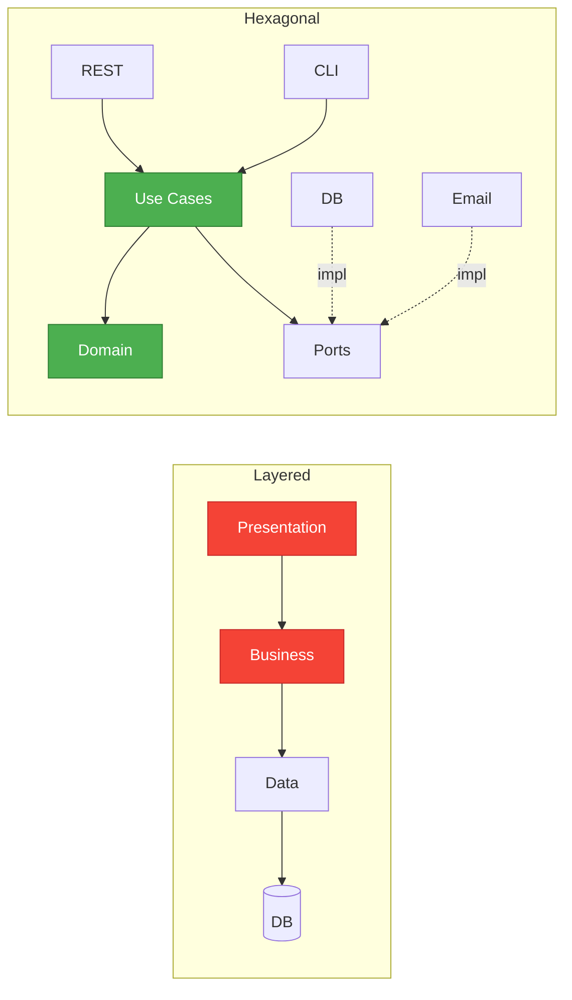
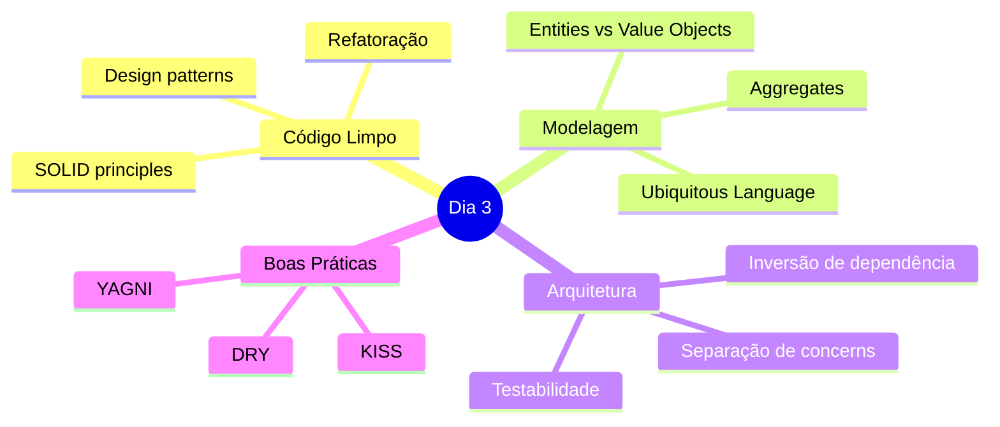
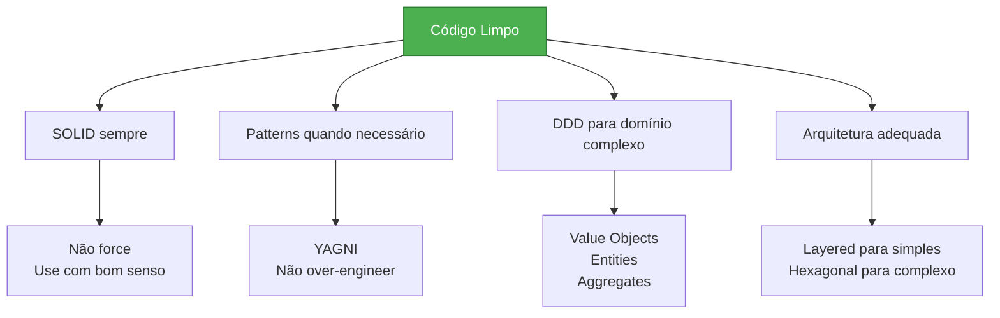
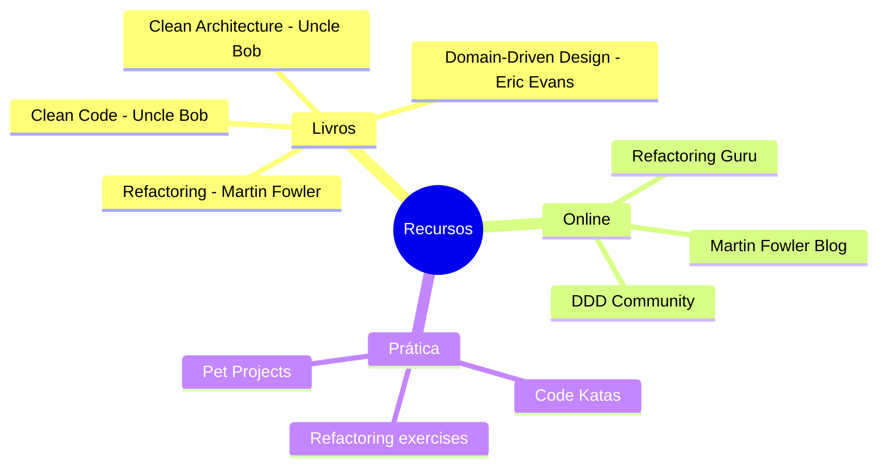

# Slide 18: Clean Architecture e Recap

---

## 🎯 Clean Architecture (Uncle Bob)



---

## 🎯 Regra da Dependência



**Regra de Ouro:** 
> **Código nas camadas internas não deve conhecer nada das camadas externas**

---

## 📊 Comparação de Arquiteturas



---

## 🏗️ Evolução Arquitetural



---

## 📚 Recap do Dia 3

### 🎯 SOLID Principles



---

### 🎨 Design Patterns

```mermaid
graph LR
    subgraph "Comportamental"
        ST[Strategy<br/>Múltiplas estratégias]
    end
    
    subgraph "Criacional"
        F[Factory<br/>Criação centralizada]
        B[Builder<br/>Objetos complexos]
        S[Singleton<br/>Instância única]
    end
    
    ST -->|OCP| USE1[Desconto<br/>Pagamento]
    F -->|SRP| USE2[Notificação<br/>Payment]
    B -->|Legibilidade| USE3[User<br/>Order]
    S -->|Spring| USE4[@Component<br/>@Service]
    
    style ST fill:#9C27B0,stroke:#7B1FA2,color:#fff
    style F fill:#4CAF50,stroke:#2E7D32,color:#fff
    style B fill:#4CAF50,stroke:#2E7D32,color:#fff
    style S fill:#4CAF50,stroke:#2E7D32,color:#fff
```

---

### 📐 DDD Building Blocks



---

### 🏛️ Arquiteturas



---

## 🎯 Principais Aprendizados



---

## 📊 Antes e Depois

### ❌ Código sem princípios

```java
@Service
public class OrderService {
    public void processOrder(Order order) {
        // Validação
        // Cálculo de desconto (if/else gigante)
        // Salva no MySQL diretamente
        // Envia email
        // Envia SMS
        // Atualiza cache
        // Gera PDF
        // Difícil testar
        // Impossível reutilizar
        // Acoplamento alto
    }
}
```

### ✅ Código com princípios

```java
@Service
@RequiredArgsConstructor
public class OrderApplicationService {  // SRP
    private final OrderValidator validator;  // SRP
    private final DiscountStrategy discountStrategy;  // OCP, Strategy
    private final OrderRepository repository;  // DIP, Repository
    private final NotificationFactory notificationFactory;  // Factory
    
    @Transactional
    public OrderResponse processOrder(CreateOrderCommand command) {
        // Cada responsabilidade isolada
        // Fácil testar
        // Fácil reutilizar
        // Baixo acoplamento
    }
}
```

---

## 🎯 Regras de Ouro



---

## 🔍 Sinais de Código Ruim vs Bom

| Aspecto | ❌ Código Ruim | ✅ Código Bom |
|---------|---------------|--------------|
| Classes | >500 linhas | <200 linhas |
| Métodos | >50 linhas | <20 linhas |
| Parâmetros | >5 parâmetros | <4 parâmetros |
| Dependências | >10 dependências | <5 dependências |
| Testes | Difícil testar | Fácil testar |
| Nomes | Genéricos (Manager, Util) | Específicos |
| Acoplamento | Alto (new, static) | Baixo (DI) |
| Duplicação | Código repetido | DRY |

---

## 📚 Recursos para Continuar



---

## 🎯 Próximos Passos

1. **Refatorar código existente**
   - Identificar violações de SOLID
   - Aplicar patterns onde faz sentido
   - Melhorar testabilidade

2. **Estudar mais patterns**
   - Adapter, Decorator, Observer
   - Template Method, Command
   - Proxy, Facade

3. **Aprofundar em DDD**
   - Bounded Contexts
   - Context Mapping
   - Event Storming

4. **Praticar arquitetura**
   - Implementar Hexagonal
   - Comparar com Layered
   - Avaliar trade-offs

---

## 💡 Mensagem Final

```
⚠️ Lembre-se:

✅ SOLID são princípios, não leis
✅ Patterns são ferramentas, não objetivos
✅ Simplicidade > Complexidade
✅ Código que funciona > Código perfeito
✅ Melhoria contínua > Perfeição

🎯 Regra de Ouro:
"Make it work, make it right, make it fast"
- Kent Beck

Primeiro faça funcionar
Depois faça certo (refatore)
Por último otimize (se necessário)
```

---

## 🙏 Obrigado!

**Dúvidas?**

📧 Email: [seu-email]  
💼 LinkedIn: [seu-linkedin]  
🐙 GitHub: [seu-github]

---

## 📝 Feedback

```
Por favor, responda:

1. O que você mais gostou no dia de hoje?
2. O que poderia melhorar?
3. Qual tópico você gostaria de aprofundar mais?
4. Como você pretende aplicar o aprendizado?

Obrigado pela participação! 🎉
```
