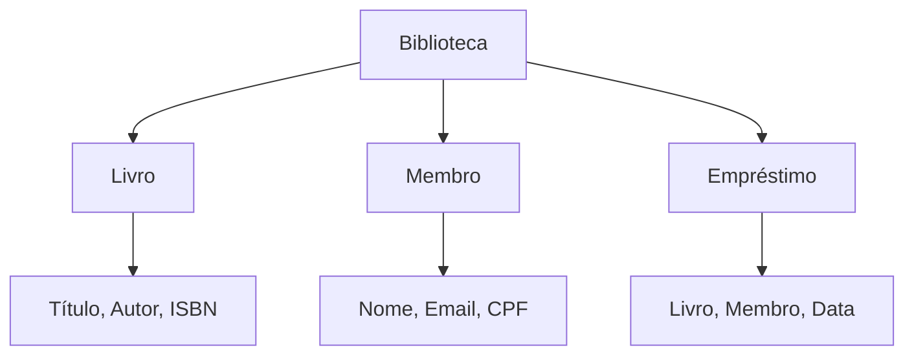
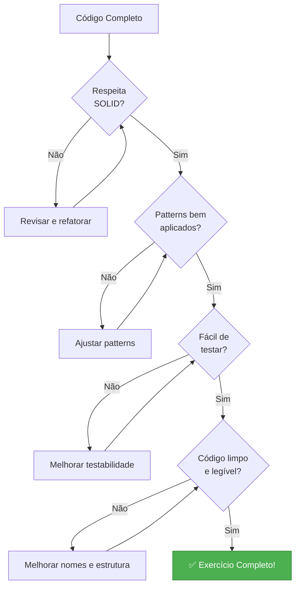

# Slide 19: Exercícios Práticos

**Horário:** 15:45 - 16:45

---

## 🎯 Exercício 1: Refatoração SOLID (30min)

### Código Problemático

```java
@Service
public class OrderProcessingService {
    
    public void processOrder(Long orderId) {
        // 1. Buscar pedido do banco
        Connection conn = DriverManager.getConnection("jdbc:mysql://...");
        PreparedStatement stmt = conn.prepareStatement("SELECT * FROM orders WHERE id = ?");
        stmt.setLong(1, orderId);
        ResultSet rs = stmt.executeQuery();
        
        Order order = new Order();
        if (rs.next()) {
            order.setId(rs.getLong("id"));
            order.setTotal(rs.getBigDecimal("total"));
            order.setStatus(rs.getString("status"));
        }
        
        // 2. Validar pedido
        if (order.getTotal() == null || order.getTotal().compareTo(BigDecimal.ZERO) <= 0) {
            throw new IllegalStateException("Invalid order total");
        }
        
        // 3. Calcular desconto
        BigDecimal discount = BigDecimal.ZERO;
        if (order.getCustomerType().equals("VIP")) {
            discount = order.getTotal().multiply(BigDecimal.valueOf(0.20));
        } else if (order.getCustomerType().equals("REGULAR")) {
            discount = order.getTotal().multiply(BigDecimal.valueOf(0.10));
        } else if (order.getCustomerType().equals("PREMIUM")) {
            discount = order.getTotal().multiply(BigDecimal.valueOf(0.30));
        }
        order.setTotal(order.getTotal().subtract(discount));
        
        // 4. Processar pagamento
        if (order.getPaymentMethod().equals("CREDIT_CARD")) {
            // processar cartão
        } else if (order.getPaymentMethod().equals("PIX")) {
            // processar PIX
        }
        
        // 5. Atualizar estoque
        stmt = conn.prepareStatement("UPDATE products SET stock = stock - ? WHERE id = ?");
        // ...
        
        // 6. Enviar email
        MimeMessage message = new MimeMessage();
        message.setSubject("Order Confirmation");
        Transport.send(message);
        
        // 7. Enviar SMS
        HttpClient client = HttpClient.newHttpClient();
        // enviar SMS...
        
        // 8. Log
        System.out.println("Order processed: " + orderId);
    }
}
```

---

## 🎯 Sua Tarefa

Refatore o código aplicando:

### 1️⃣ **SRP** - Single Responsibility Principle
```
Identifique as responsabilidades:
□ Acesso ao banco de dados
□ Validação
□ Cálculo de desconto
□ Processamento de pagamento
□ Atualização de estoque
□ Envio de email
□ Envio de SMS
□ Logging

Crie classes separadas para cada uma!
```

### 2️⃣ **OCP** - Open/Closed Principle
```
Use Strategy Pattern para:
□ Estratégias de desconto (VIP, REGULAR, PREMIUM)
□ Métodos de pagamento (CREDIT_CARD, PIX, BOLETO)

Deve ser fácil adicionar novos tipos sem modificar código existente!
```

### 3️⃣ **DIP** - Dependency Inversion Principle
```
□ Crie interfaces para dependências
□ Use injeção de dependência
□ Não use 'new' para dependências
□ Não use métodos estáticos de infraestrutura
```

---

## ✅ Solução Esperada

```mermaid
graph TD
    subgraph "Refatorado"
        OS[OrderService<br/>Orquestra]
        OV[OrderValidator<br/>Valida]
        DS[DiscountStrategy<br/>Interface]
        VIP[VipDiscount]
        REG[RegularDiscount]
        PS[PaymentStrategy<br/>Interface]
        CC[CreditCardPayment]
        PIX[PixPayment]
        OR[OrderRepository<br/>Interface]
        ES[EmailService]
        SMS[SmsService]
        
        OS --> OV
        OS --> DS
        OS --> PS
        OS --> OR
        OS --> ES
        OS --> SMS
        
        DS <|.. VIP
        DS <|.. REG
        PS <|.. CC
        PS <|.. PIX
    end
    
    style OS fill:#4CAF50,stroke:#2E7D32,color:#fff
    style DS fill:#2196F3,stroke:#1565C0,color:#fff
    style PS fill:#2196F3,stroke:#1565C0,color:#fff
```

---

## 🎯 Exercício 2: Design Patterns (20min)

### Cenário: Sistema de Notificações

Implemente um sistema que:

1. **Factory Pattern** para criar notificações
   - EmailNotification
   - SmsNotification
   - PushNotification
   - WhatsAppNotification

2. **Strategy Pattern** para escolher canal
   - Urgência Alta → SMS + Push
   - Urgência Média → Email + Push
   - Urgência Baixa → Email

3. **Builder Pattern** para criar Notification
   - Título
   - Mensagem
   - Destinatário
   - Urgência
   - Data de envio

---

## 📝 Template da Solução

```java
// 1. Interface base
public interface Notification {
    void send();
    NotificationType getType();
}

// 2. Enum
public enum NotificationType {
    EMAIL, SMS, PUSH, WHATSAPP
}

// 3. Builder
public class NotificationMessage {
    private String title;
    private String body;
    private String recipient;
    private Urgency urgency;
    
    // Implemente o Builder Pattern aqui
}

// 4. Factory
@Component
public class NotificationFactory {
    public Notification create(NotificationType type) {
        // Implemente aqui
    }
}

// 5. Strategy
public interface NotificationStrategy {
    void notify(NotificationMessage message);
}

@Component
public class UrgentNotificationStrategy implements NotificationStrategy {
    // Implemente: SMS + Push
}
```

---

## 🎯 Exercício 3: DDD Modeling (20min)

### Cenário: Sistema de Biblioteca

Modele o domínio de uma biblioteca:



---

## 📝 Sua Tarefa

### 1️⃣ Identifique Entities vs Value Objects

```
Entities (tem ID, mutável):
□ ?
□ ?
□ ?

Value Objects (sem ID, imutável):
□ ?
□ ?
□ ?
```

### 2️⃣ Defina o Aggregate

```
Aggregate Root: ?

Entidades internas: ?

Regras de negócio:
□ Livro só pode ser emprestado se disponível
□ Membro pode ter no máximo 3 livros emprestados
□ Empréstimo tem prazo de 14 dias
□ Multa por atraso: R$ 2,00/dia
```

### 3️⃣ Crie Repository Interface

```java
public interface LoanRepository {
    // Quais métodos são necessários?
    // Use linguagem de domínio!
}
```

---

## ✅ Solução Esperada

```java
// Entity
@Entity
public class Loan {  // Aggregate Root
    @Id private Long id;
    @ManyToOne private Book book;
    @ManyToOne private Member member;
    private LocalDate loanDate;
    private LocalDate dueDate;
    private LocalDate returnDate;
    private LoanStatus status;
    
    public void returnBook() {
        // Lógica de negócio
    }
    
    public Money calculateFine() {
        // Lógica de negócio
    }
}

// Value Object
public record ISBN(String value) {
    public ISBN {
        if (!value.matches("\\d{3}-\\d{10}")) {
            throw new IllegalArgumentException("Invalid ISBN");
        }
    }
}

// Repository
public interface LoanRepository {
    Loan save(Loan loan);
    List<Loan> findActiveLoans();
    List<Loan> findOverdueLoans();
    List<Loan> findByMember(Member member);
}
```

---

## 🏆 Checklist de Qualidade

### Após completar os exercícios, verifique:



---

## ✅ Critérios de Avaliação

| Critério | Pontos | Checklist |
|----------|--------|-----------|
| **SOLID** | 30 | □ SRP aplicado<br/>□ OCP aplicado<br/>□ DIP aplicado |
| **Patterns** | 30 | □ Strategy correto<br/>□ Factory correto<br/>□ Builder correto |
| **DDD** | 20 | □ Entities vs VOs<br/>□ Aggregate bem definido<br/>□ Repository adequado |
| **Código** | 20 | □ Limpo e legível<br/>□ Nomes descritivos<br/>□ Sem duplicação |

**Total:** 100 pontos

---

## 🎯 Dicas

```
✅ FAÇA:
- Comece simples, refatore depois
- Teste seu código
- Use nomes descritivos
- Pense na manutenibilidade

❌ EVITE:
- Over-engineering
- Patterns desnecessários
- Código complexo demais
- Premature optimization

💡 Lembre-se:
- "Make it work, make it right, make it fast"
- Refatoração é iterativa
- Código limpo é mais importante que código perfeito
```

---

## 🏁 Entrega

1. **Commits organizados**
   ```bash
   git commit -m "refactor: apply SRP to OrderService"
   git commit -m "feat: add Strategy pattern for discounts"
   git commit -m "feat: implement DDD model for Library"
   ```

2. **Testes unitários**
   ```java
   @Test
   void shouldCalculateVipDiscount() {
       // Teste para cada classe isoladamente
   }
   ```

3. **README.md** explicando:
   - Princípios aplicados
   - Patterns utilizados
   - Decisões de design
   - Como executar

---

## 💡 Dica do Instrutor

```
⏰ Gestão de tempo:
- 10min: Exercício 1 (Refatoração SOLID)
- 10min: Exercício 2 (Design Patterns)
- 10min: Exercício 3 (DDD Modeling)

🎯 Priorize:
1. Fazer funcionar
2. Aplicar princípios básicos
3. Refinar se houver tempo

❓ Dúvidas?
- Levante a mão
- Pergunte no chat
- Trabalhe em pares se necessário
```
