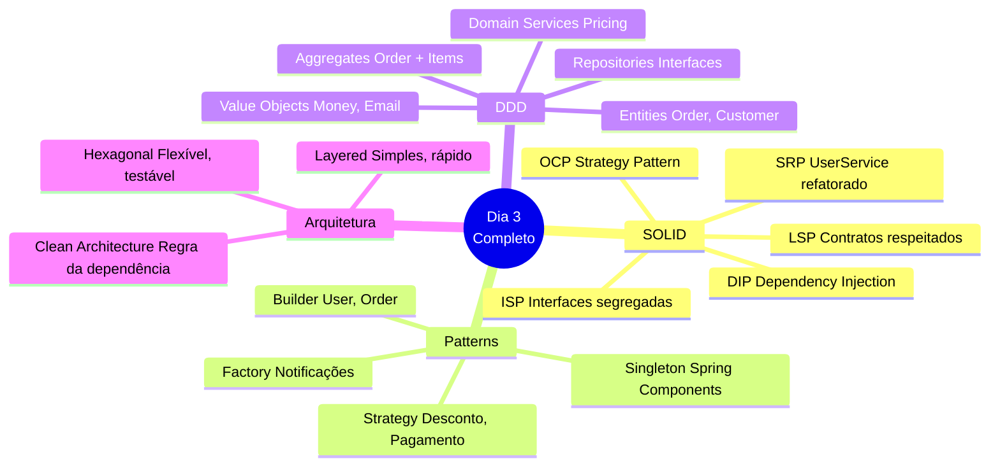
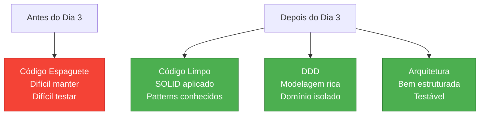
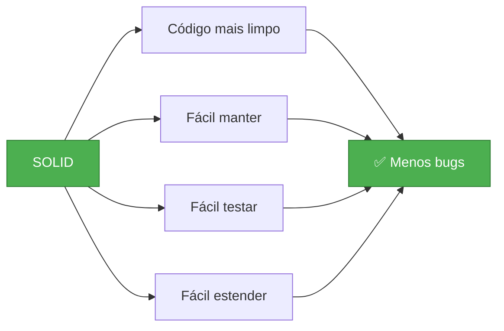
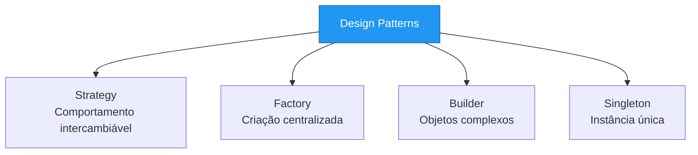
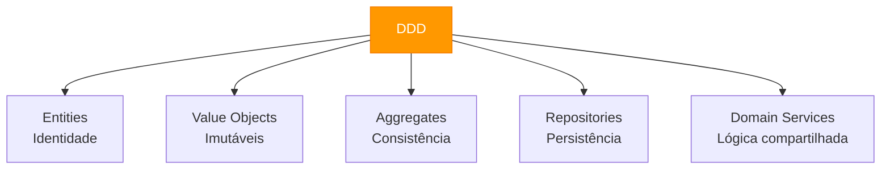
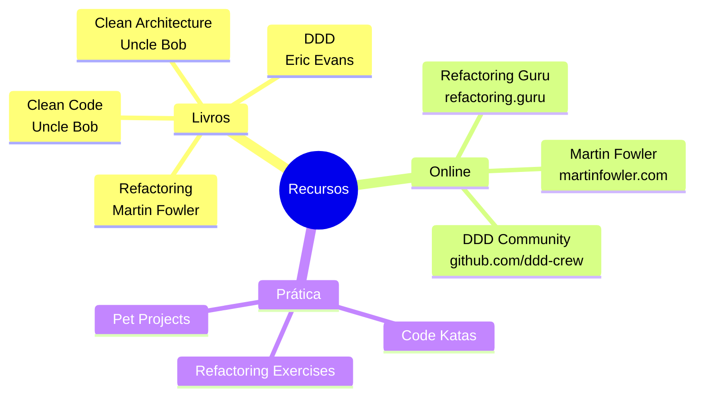
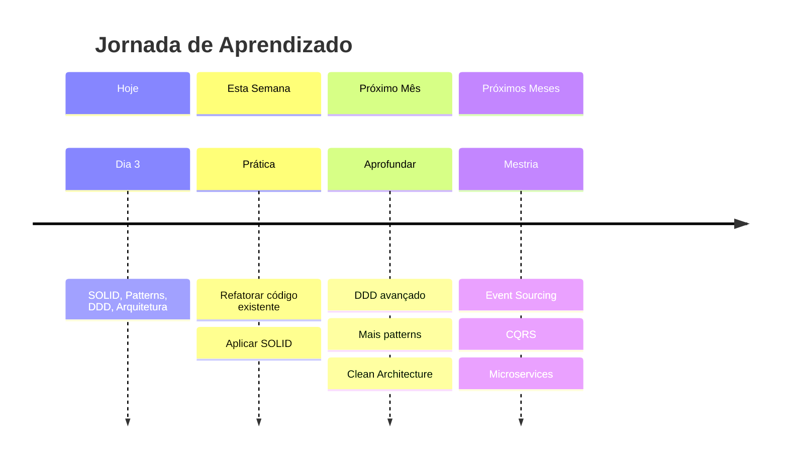
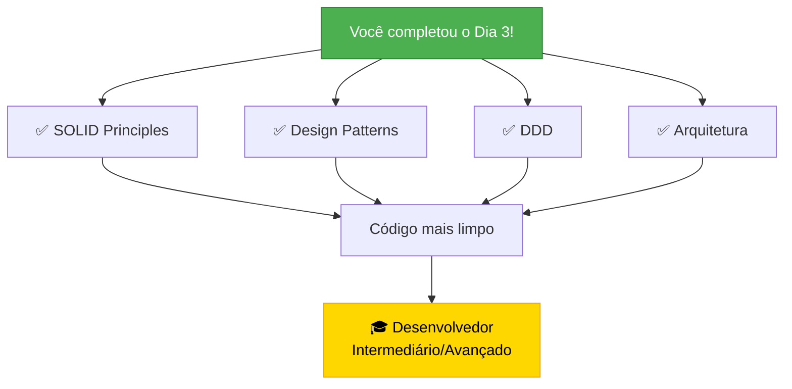

# Slide 20: Review e Q&A

**Horário:** 16:45 - 17:00

---

## 📊 Review do Dia 3



---

## 🎯 Principais Conquistas



---

## 📈 Evolução do Código

### Antes (Problema)
```java
// ❌ Tudo misturado
@Service
public class OrderService {
    public void process(Order order) {
        // 500 linhas de código
        // Tudo em um método
        // Impossível testar
        // Impossível reutilizar
        // Impossível manter
    }
}
```

### Depois (Solução)
```java
// ✅ Responsabilidades separadas
@Service
@RequiredArgsConstructor
public class OrderApplicationService {
    private final OrderValidator validator;        // SRP
    private final DiscountStrategy discountStrategy; // OCP, Strategy
    private final OrderRepository repository;       // DIP, Repository
    private final OrderPricingService pricingService; // Domain Service
    
    @Transactional
    public OrderResponse process(CreateOrderCommand cmd) {
        // Código limpo, testável, reutilizável
    }
}
```

---

## 🎓 O que Aprendemos

### SOLID Principles ✅



### Design Patterns ✅



### DDD ✅



---

## 🔑 Key Takeaways

```
1️⃣ SOLID não é opcional
   → Aplicar sempre que possível
   → Código mais sustentável

2️⃣ Patterns são ferramentas
   → Usar quando necessário
   → Não forçar (YAGNI)

3️⃣ DDD para domínio rico
   → Entities vs Value Objects
   → Aggregates para consistência
   → Ubiquitous Language

4️⃣ Arquitetura adequada
   → Layered para simples
   → Hexagonal para complexo
   → Clean Architecture como ideal

5️⃣ Testabilidade é crucial
   → DIP facilita testes
   → Mocks de interfaces
   → Testes rápidos
```

---

## 📚 Materiais de Referência



---

## 🏠 Tarefa de Casa

### 1️⃣ Refatoração Prática

```
□ Pegue a API de Tasks/Blog dos dias anteriores
□ Identifique violações de SOLID
□ Refatore aplicando os princípios
□ Adicione testes unitários
□ Compare antes/depois
```

### 2️⃣ Estudo Adicional

```
□ Ler sobre Adapter Pattern
□ Estudar Observer Pattern
□ Pesquisar Bounded Contexts (DDD)
□ Entender Event Sourcing
□ Ver vídeos sobre Clean Architecture
```

### 3️⃣ Preparação Dia 4

```
□ Revisar conceitos de Ports & Adapters
□ Ler sobre Clean Architecture
□ Entender Use Cases
□ Ver exemplos de projetos Hexagonais
```

---

## ❓ Q&A - Perguntas Frequentes

### 1. Quando aplicar SOLID?
```
✅ Sempre que possível
⚠️ Com bom senso
❌ Não force se adiciona complexidade desnecessária
```

### 2. Todos os patterns são necessários?
```
❌ Não! Use apenas quando resolver um problema real
✅ YAGNI: You Aren't Gonna Need It
```

### 3. DDD é para todo projeto?
```
✅ Domínio complexo → Sim
❌ CRUD simples → Não necessário
⚠️ Avalie complexidade do domínio
```

### 4. Layered ou Hexagonal?
```
Layered:
  ✅ Projeto simples
  ✅ Equipe júnior
  ✅ Prazo curto

Hexagonal:
  ✅ Domínio complexo
  ✅ Múltiplos adapters
  ✅ Testabilidade crucial
```

---

## 🎯 Próximos Passos



---

## 📊 Auto-Avaliação

### Antes do Dia 3

| Tópico | Nível (1-5) |
|--------|-------------|
| SOLID | ⭐ |
| Design Patterns | ⭐ |
| DDD | ⭐ |
| Arquitetura | ⭐⭐ |

### Depois do Dia 3 (esperado)

| Tópico | Nível (1-5) |
|--------|-------------|
| SOLID | ⭐⭐⭐⭐ |
| Design Patterns | ⭐⭐⭐⭐ |
| DDD | ⭐⭐⭐ |
| Arquitetura | ⭐⭐⭐⭐ |

**Avalie seu progresso!** 📈

---

## 💬 Feedback

```
Por favor, compartilhe:

1️⃣ O que você mais gostou?
   □ SOLID principles
   □ Design Patterns
   □ DDD
   □ Arquitetura
   □ Exercícios práticos

2️⃣ O que poderia melhorar?
   □ Mais tempo em ...
   □ Menos tempo em ...
   □ Mais exemplos de ...

3️⃣ Você se sente preparado para aplicar?
   □ Sim, totalmente
   □ Sim, com alguma prática
   □ Preciso revisar alguns tópicos

4️⃣ Qual tópico você gostaria de aprofundar?
   _________________________________
```

---

## 🎉 Parabéns!



---

## 🌟 Citação Inspiradora

> **"Any fool can write code that a computer can understand. Good programmers write code that humans can understand."**
> 
> *— Martin Fowler*

> **"Make it work, make it right, make it fast."**
> 
> *— Kent Beck*

> **"Simplicity is the ultimate sophistication."**
> 
> *— Leonardo da Vinci*

---

## 📞 Contato

```
📧 Email: [seu-email@example.com]
💼 LinkedIn: [linkedin.com/in/seu-perfil]
🐙 GitHub: [github.com/seu-usuario]
📚 Blog: [seu-blog.com]

Conecte-se comigo!
Compartilhe seus projetos!
Continue aprendendo!
```

---

## 🙏 Obrigado!

```
Até o próximo dia de treinamento!

Dia 4: Testes, Segurança e Performance
- Testes unitários e integração
- Spring Security
- Otimização de performance
- Monitoramento

Nos vemos lá! 👋
```

---

## 📝 Última Palavra

```
⚠️ Lembre-se sempre:

1. Código limpo > Código complexo
2. Simplicidade > Over-engineering
3. Testes > Sem testes
4. Refatoração contínua > Código perfeito
5. Aprendizado contínuo > Saber tudo

🎯 Continue praticando!
🎯 Continue aprendendo!
🎯 Continue evoluindo!

Bons códigos! 💻✨
```
