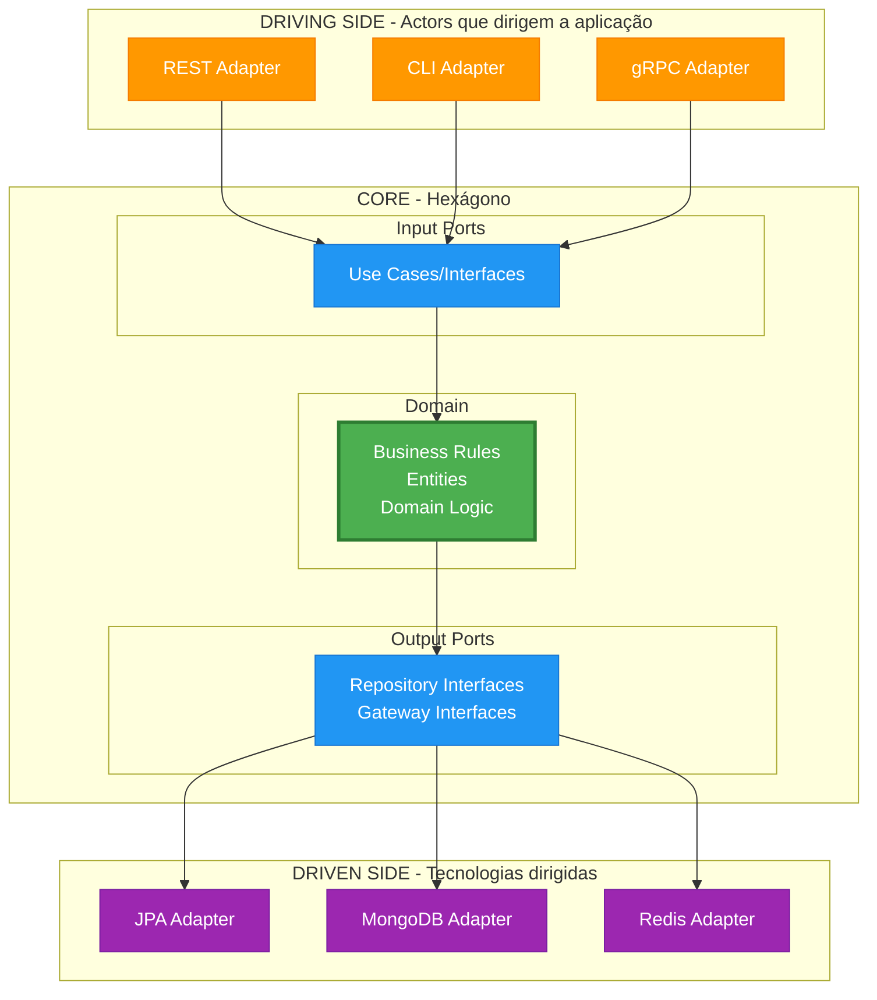
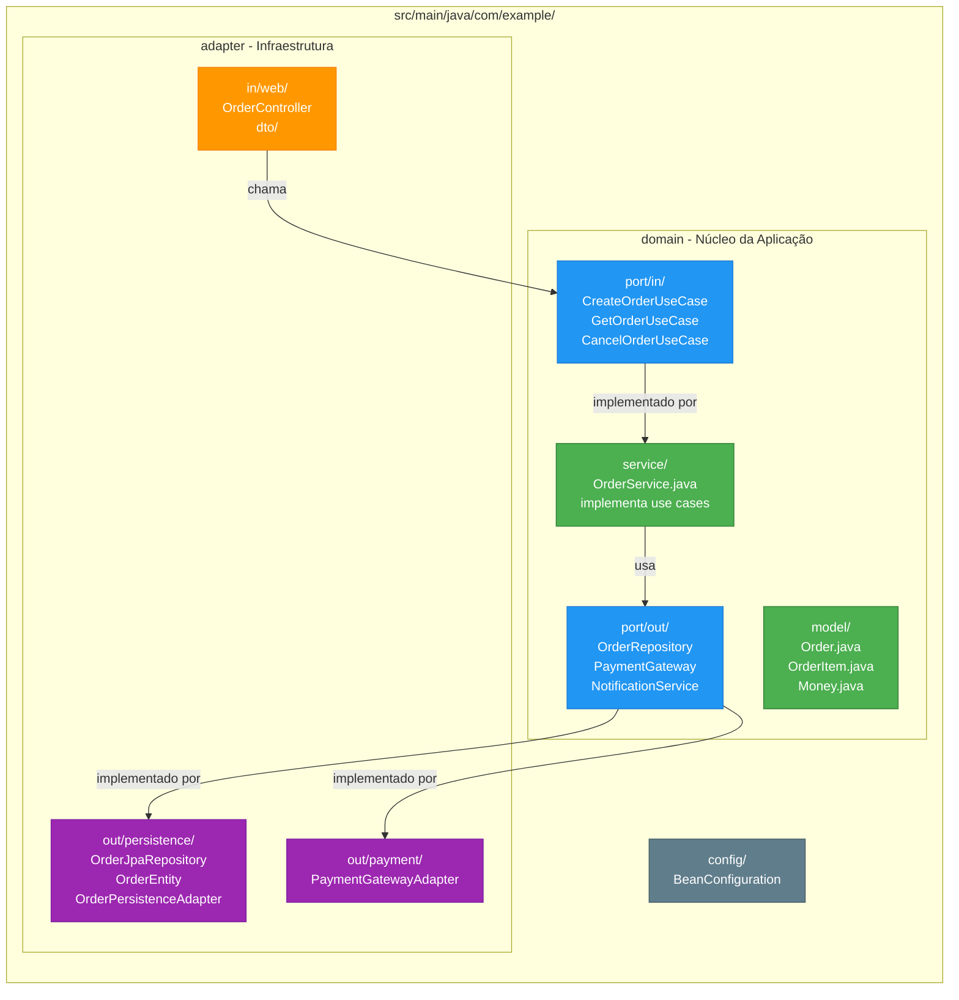
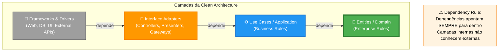
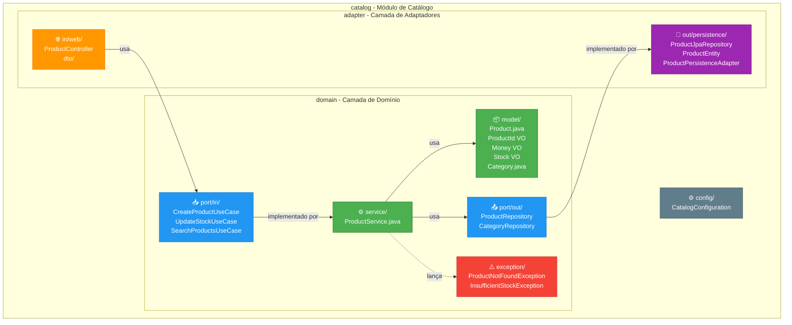

# Dia 4 - Arquitetura Hexagonal, Clean Architecture e Transações Distribuídas

**Duração**: 6 horas  
**Objetivo**: Implementar aplicações seguindo Arquitetura Hexagonal e Clean Architecture, e compreender transações distribuídas com SAGA

## 📋 Conteúdo Programático

### Manhã (3 horas)

#### 1. Transações ACID (30min)

**Conceitos Fundamentais**
- **A**tomicity - Tudo ou nada
- **C**onsistency - Dados sempre válidos
- **I**solation - Transações não interferem entre si
- **D**urability - Dados persistidos nunca são perdidos

**Implementação em Spring**
```java
@Service
public class TransferService {
    
    @Transactional  // Garante ACID
    public void transfer(Long fromId, Long toId, BigDecimal amount) {
        Account from = accountRepository.findById(fromId).orElseThrow();
        Account to = accountRepository.findById(toId).orElseThrow();
        
        from.withdraw(amount);
        to.deposit(amount);
        
        accountRepository.save(from);
        accountRepository.save(to);
        // Se qualquer operação falhar, TUDO é revertido
    }
}
```

**Trade-offs do ACID**
- ✅ Consistência forte
- ✅ Fácil de programar
- ❌ Baixa escalabilidade
- ❌ Não funciona em sistemas distribuídos

#### 2. Arquitetura Hexagonal (Ports & Adapters) (1.5h)

**Conceitos Fundamentais**



**Organização de Pacotes**



**Exemplo Prático**:
```java
// DOMAIN - Input Port (Use Case)
package domain.port.in;

public interface CreateOrderUseCase {
    OrderId createOrder(CreateOrderCommand command);
}

// DOMAIN - Output Port
package domain.port.out;

public interface OrderRepository {
    void save(Order order);
    Optional<Order> findById(OrderId id);
}

// DOMAIN - Service (implementa use case)
package domain.service;

@Service
@Transactional
public class OrderService implements CreateOrderUseCase {
    
    private final OrderRepository orderRepository;
    private final PaymentGateway paymentGateway;
    
    @Override
    public OrderId createOrder(CreateOrderCommand command) {
        // Lógica de domínio aqui
        Order order = Order.create(command);
        paymentGateway.authorize(order.getTotal());
        orderRepository.save(order);
        return order.getId();
    }
}

// ADAPTER IN - REST Controller
package adapter.in.web;

@RestController
@RequestMapping("/api/orders")
public class OrderController {
    
    private final CreateOrderUseCase createOrderUseCase;
    
    @PostMapping
    public ResponseEntity<OrderResponse> create(@RequestBody CreateOrderRequest request) {
        var command = new CreateOrderCommand(request);
        OrderId orderId = createOrderUseCase.createOrder(command);
        return ResponseEntity.ok(new OrderResponse(orderId));
    }
}

// ADAPTER OUT - Persistence
package adapter.out.persistence;

@Component
public class OrderPersistenceAdapter implements OrderRepository {
    
    private final OrderJpaRepository jpaRepository;
    private final OrderMapper mapper;
    
    @Override
    public void save(Order order) {
        OrderEntity entity = mapper.toEntity(order);
        jpaRepository.save(entity);
    }
}
```

#### 2. Clean Architecture (1.5h)

**Camadas e Dependências**



**Principais diferenças com arquitetura tradicional**:
- Domínio não conhece infraestrutura
- Use Cases explícitos
- Testabilidade independente
- Inversão de dependências radical

### Tarde (3 horas)

#### 3. Padrão SAGA - Transações Distribuídas (1.5h)

**O Problema**
```
ACID tradicional não funciona em microservices!
Cada serviço tem seu próprio banco de dados.
```

**A Solução: SAGA Pattern**
- Sequência de transações locais
- Cada transação tem uma compensação
- Consistência eventual ao invés de imediata

**Exemplo de Fluxo SAGA**
```java
// Order Service: Cria pedido
order = createOrder()  ✅

// Payment Service: Processa pagamento
payment = processPayment()  ✅

// Inventory Service: Reserva estoque
reservation = reserveStock()  ❌ FALHOU!

// COMPENSAÇÃO (ordem reversa):
refundPayment()  🔄
cancelOrder()    🔄
```

**Dois Tipos de SAGA**

##### SAGA Orquestrada (Orchestration)
- Coordenador central controla tudo
- Fácil de debugar
- Single point of failure
```java
@Service
public class OrderSagaOrchestrator {
    public void execute() {
        try {
            orderId = orderService.create();
            paymentId = paymentService.process();
            reservationId = inventoryService.reserve();
            shipmentId = shippingService.create();
        } catch (Exception e) {
            compensate();  // Desfaz tudo
        }
    }
}
```

##### SAGA Coreografada (Choreography)
- Sem coordenador central
- Serviços reagem a eventos
- Alta escalabilidade
```java
// Order Service publica evento
eventPublisher.publish(new OrderCreatedEvent());

// Payment Service escuta e reage
@EventListener
public void onOrderCreated(OrderCreatedEvent e) {
    processPayment();
    eventPublisher.publish(new PaymentProcessedEvent());
}

// Inventory Service escuta e reage
@EventListener
public void onPaymentProcessed(PaymentProcessedEvent e) {
    reserveStock();
}
```

**Orquestração vs Coreografia**

| Aspecto | Orquestração | Coreografia |
|---------|--------------|-------------|
| Coordenação | Centralizada | Distribuída |
| Complexidade | Menor | Maior |
| Debugging | Fácil | Difícil |
| Escalabilidade | Limitada | Alta |
| Acoplamento | Alto | Baixo |
| Resiliência | Single point of failure | Sem ponto único |

**Quando usar cada um?**
- **Orquestração**: Times iniciantes, fluxos complexos, debugging crítico
- **Coreografia**: Times experientes, alta escalabilidade, baixo acoplamento
- **Híbrido**: Orquestração para operações críticas + Coreografia para o resto

#### 4. Implementação Prática (1.5h)

**Projeto: E-commerce Modular**

Vamos criar um módulo de **Catálogo de Produtos** com Arquitetura Hexagonal:

**Features**:
- Criar produto
- Buscar produtos
- Atualizar estoque
- Categorizar produtos

**Estrutura**:



## 💻 Exercícios Práticos

### Exercício 1: Converter aplicação existente (2h)

Pegue a API de Tasks dos dias anteriores e converta para Arquitetura Hexagonal:

**Passo 1**: Definir o domínio
```java
// domain/model/Task.java
public class Task {
    private final TaskId id;
    private String title;
    private String description;
    private TaskStatus status;
    
    // Comportamentos ricos
    public void complete() {
        if (status == TaskStatus.COMPLETED) {
            throw new TaskAlreadyCompletedException();
        }
        this.status = TaskStatus.COMPLETED;
    }
}

// domain/model/TaskId.java (Value Object)
public record TaskId(Long value) {
    public TaskId {
        if (value == null || value <= 0) {
            throw new IllegalArgumentException("Invalid task ID");
        }
    }
}
```

**Passo 2**: Definir Use Cases (Input Ports)
```java
// domain/port/in/CreateTaskUseCase.java
public interface CreateTaskUseCase {
    TaskId create(CreateTaskCommand command);
}

// domain/port/in/CreateTaskCommand.java
public record CreateTaskCommand(
    String title,
    String description,
    Priority priority
) {}
```

**Passo 3**: Definir Output Ports
```java
// domain/port/out/TaskRepository.java
public interface TaskRepository {
    void save(Task task);
    Optional<Task> findById(TaskId id);
    List<Task> findAll();
}
```

**Passo 4**: Implementar Service
```java
// domain/service/TaskService.java
@Service
public class TaskService implements CreateTaskUseCase, CompleteTaskUseCase {
    
    private final TaskRepository taskRepository;
    
    @Override
    public TaskId create(CreateTaskCommand command) {
        Task task = Task.create(command.title(), command.description(), command.priority());
        taskRepository.save(task);
        return task.getId();
    }
}
```

**Passo 5**: Implementar Adapters
```java
// adapter/in/web/TaskController.java
@RestController
public class TaskController {
    private final CreateTaskUseCase createTaskUseCase;
    // ...
}

// adapter/out/persistence/TaskPersistenceAdapter.java
@Component
public class TaskPersistenceAdapter implements TaskRepository {
    private final TaskJpaRepository jpaRepository;
    // ...
}
```

### Exercício 2: Novo módulo com Clean Architecture (1.5h)

Crie um módulo de **Autenticação** seguindo Clean Architecture:

**Requisitos**:
- Registrar usuário
- Fazer login
- Validar token
- Atualizar perfil

**Use Cases**:
- RegisterUserUseCase
- LoginUseCase
- ValidateTokenUseCase
- UpdateProfileUseCase

**Output Ports**:
- UserRepository
- PasswordEncoder
- TokenGenerator

## 📚 Material de Estudo

### Leitura Obrigatória
- [Hexagonal Architecture](https://alistair.cockburn.us/hexagonal-architecture/)
- [Clean Architecture by Uncle Bob](https://blog.cleancoder.com/uncle-bob/2012/08/13/the-clean-architecture.html)
- [Get Your Hands Dirty on Clean Architecture](https://www.baeldung.com/spring-boot-clean-architecture)

### Leitura Complementar
- [Implementing DDD](https://www.amazon.com/Implementing-Domain-Driven-Design-Vaughn-Vernon/dp/0321834577)
- [Hexagonal Architecture with Spring Boot](https://medium.com/@TKonuklar/hexagonal-architecture-with-spring-boot)

### Exemplos de Código
- [Spring Boot Hexagonal Example](https://github.com/thombergs/buckpal)
- [Clean Architecture Example](https://github.com/mattia-battiston/clean-architecture-example)

## 🎯 Objetivos de Aprendizagem

Ao final deste dia, você deve ser capaz de:

- ✅ Explicar os conceitos de ACID e suas limitações
- ✅ Entender por que ACID tradicional não funciona em microservices
- ✅ Implementar o Padrão SAGA (Orquestração e Coreografia)
- ✅ Decidir entre Orquestração e Coreografia
- ✅ Explicar os conceitos de Ports & Adapters
- ✅ Organizar código seguindo Arquitetura Hexagonal
- ✅ Distinguir Input Ports de Output Ports
- ✅ Implementar Use Cases explícitos
- ✅ Manter domínio independente de framework
- ✅ Testar lógica de negócio isoladamente

## 🏠 Tarefa de Casa

1. **Implementar SAGA Orquestrada**:
   - Criar um sistema de e-commerce com Order, Payment, Inventory
   - Implementar compensação em caso de falha
   - Adicionar logs detalhados para rastreamento

2. **Converter para SAGA Coreografada**:
   - Refatorar o sistema anterior para usar eventos
   - Implementar idempotência nos handlers
   - Usar Kafka ou RabbitMQ para eventos

3. **Estudar**:
   - Event Sourcing pattern
   - CQRS pattern
   - Distributed tracing (Jaeger, Zipkin)

4. **Preparação para Dia 5**:
   - Revisar REST best practices
   - Estudar OpenAPI/Swagger specification
   - Entender OAuth2 e JWT

## 📝 Notas do Instrutor

```
Pontos de atenção:
- Começar com ACID para contextualizar o problema
- Enfatizar que ACID não funciona em distribuído
- Mostrar SAGA como solução natural
- Demonstrar Orquestração primeiro (mais fácil)
- Depois mostrar Coreografia (mais escalável)
- Enfatizar separação entre domínio e infraestrutura
- Mostrar como testar domínio sem Spring
- Explicar naming conventions (UseCase, Port, Adapter)
- Demonstrar facilidade de trocar adapters
- Discutir trade-offs (complexidade vs benefícios)
- Mostrar quando é OVERKILL usar essas arquiteturas
- Ressaltar importância de idempotência em SAGA
- Demonstrar correlation IDs para rastreamento
```

## 🔗 Links Úteis

### ACID e Transações
- [ACID Properties](https://en.wikipedia.org/wiki/ACID)
- [Spring Transaction Management](https://docs.spring.io/spring-framework/reference/data-access/transaction.html)
- [PostgreSQL ACID Compliance](https://www.postgresql.org/docs/current/tutorial-transactions.html)

### SAGA Pattern
- [Pattern: Saga](https://microservices.io/patterns/data/saga.html) - Chris Richardson
- [Saga Pattern Implementation](https://docs.microsoft.com/azure/architecture/reference-architectures/saga/saga)
- [Microservices Patterns Book](https://www.manning.com/books/microservices-patterns) - Chris Richardson

### Arquitetura Hexagonal
- [Hexagonal Architecture](https://alistair.cockburn.us/hexagonal-architecture/)
- [Clean Architecture by Uncle Bob](https://blog.cleancoder.com/uncle-bob/2012/08/13/the-clean-architecture.html)
- [Get Your Hands Dirty on Clean Architecture](https://www.baeldung.com/spring-boot-clean-architecture)
- [Hexagonal Architecture with Spring Boot](https://medium.com/@TKonuklar/hexagonal-architecture-with-spring-boot)

### Ferramentas
- [Camunda](https://camunda.com/) - Workflow orchestration
- [Temporal](https://temporal.io/) - Durable execution
- [Apache Kafka](https://kafka.apache.org/) - Event streaming
- [Spring Cloud Stream](https://spring.io/projects/spring-cloud-stream) - Event-driven microservices

### Exemplos de Código
- [Spring Boot Hexagonal Example](https://github.com/thombergs/buckpal)
- [Clean Architecture Example](https://github.com/mattia-battiston/clean-architecture-example)
- [Saga Pattern Examples](https://github.com/eventuate-tram/eventuate-tram-sagas-examples-customers-and-orders)
