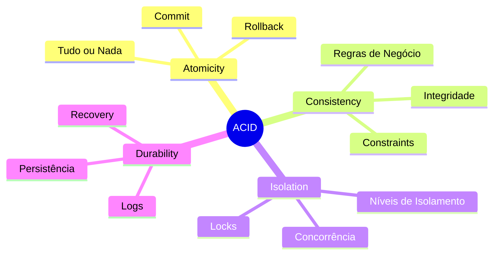
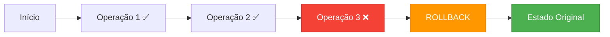
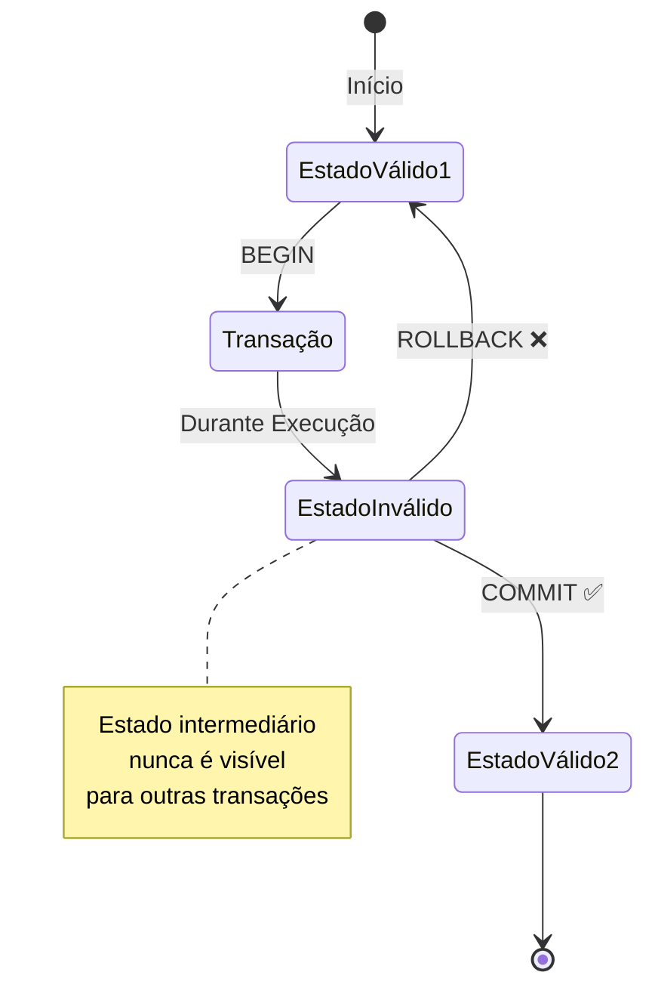
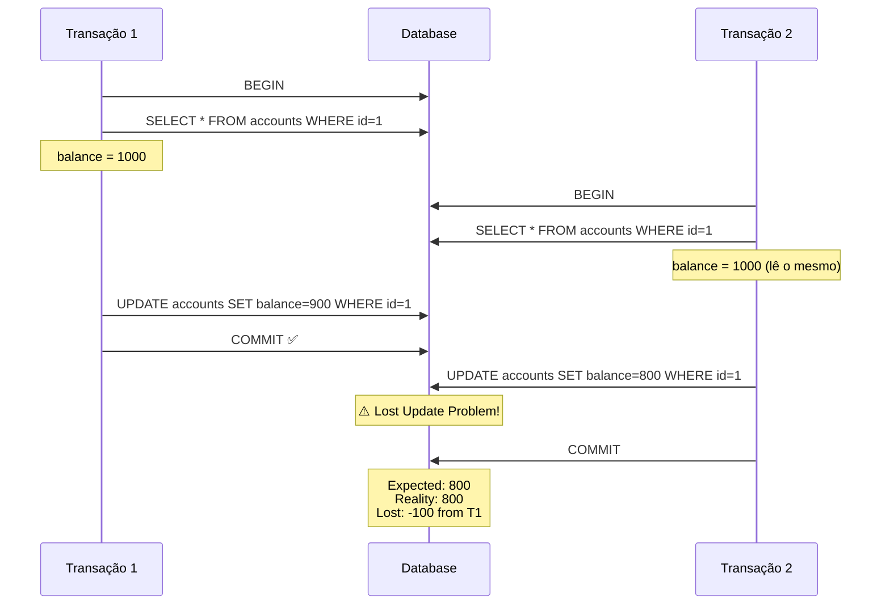
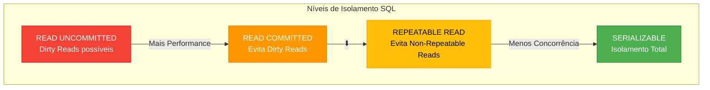
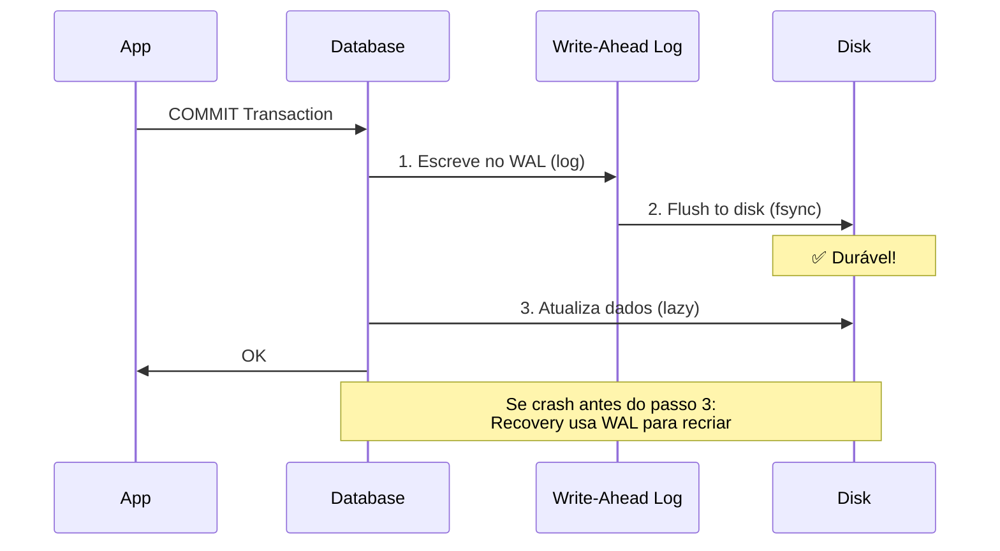
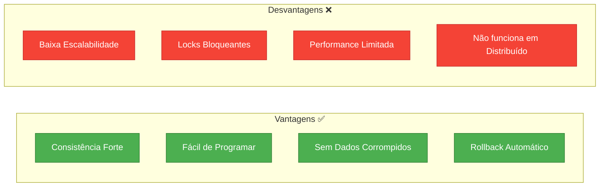
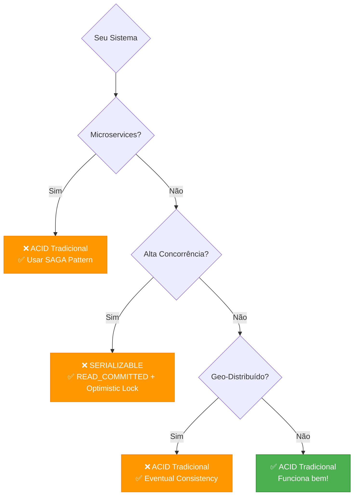
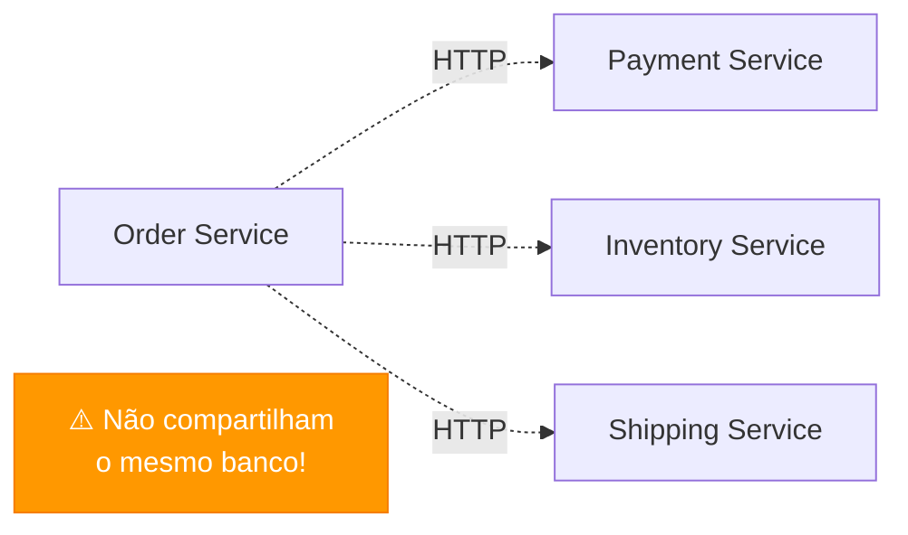

# Slide 1: Transações ACID

---

## 🎯 O que são Transações ACID?

**ACID** é um acrônimo que define as propriedades fundamentais de transações em bancos de dados relacionais:



---

## ⚛️ Atomicity (Atomicidade)

> **"Tudo ou Nada"** - Uma transação é indivisível



### Exemplo em Java/Spring

```java
@Service
@RequiredArgsConstructor
public class TransferService {
    
    private final AccountRepository accountRepository;
    
    @Transactional  // ✅ Garante atomicidade
    public void transfer(Long fromId, Long toId, BigDecimal amount) {
        Account from = accountRepository.findById(fromId)
            .orElseThrow(() -> new AccountNotFoundException(fromId));
        Account to = accountRepository.findById(toId)
            .orElseThrow(() -> new AccountNotFoundException(toId));
        
        // Se qualquer operação falhar, TUDO é revertido
        from.withdraw(amount);  // Operação 1
        to.deposit(amount);     // Operação 2
        
        accountRepository.save(from);  // Operação 3
        accountRepository.save(to);    // Operação 4
        
        // Se chegar aqui sem exceção: COMMIT
    }
}
```

**Sem @Transactional**: Se `to.deposit()` falhar, `from.withdraw()` já foi executado! 💥

---

## 🔄 Consistency (Consistência)

> **Dados sempre válidos** - Transação move o banco de um estado válido para outro estado válido



### Exemplo: Regras de Negócio

```java
@Entity
public class Account {
    
    @Id
    private Long id;
    
    @Column(nullable = false)
    private BigDecimal balance;
    
    @Version  // Controle de concorrência otimista
    private Long version;
    
    public void withdraw(BigDecimal amount) {
        // ✅ CONSISTENCY: Validação antes de modificar
        if (amount.compareTo(BigDecimal.ZERO) <= 0) {
            throw new IllegalArgumentException("Amount must be positive");
        }
        
        if (balance.compareTo(amount) < 0) {
            throw new InsufficientBalanceException();
        }
        
        this.balance = balance.subtract(amount);
        // Estado permanece CONSISTENTE
    }
    
    public void deposit(BigDecimal amount) {
        if (amount.compareTo(BigDecimal.ZERO) <= 0) {
            throw new IllegalArgumentException("Amount must be positive");
        }
        this.balance = balance.add(amount);
    }
}
```

### Constraints no Banco de Dados

```sql
-- Garantias de consistência a nível de banco
CREATE TABLE accounts (
    id BIGINT PRIMARY KEY,
    balance DECIMAL(19,2) NOT NULL CHECK (balance >= 0),  -- ✅ Nunca negativo
    version BIGINT NOT NULL DEFAULT 0
);

-- Trigger para auditoria (mantém log consistente)
CREATE TRIGGER account_audit_trigger
AFTER UPDATE ON accounts
FOR EACH ROW
INSERT INTO account_audit (account_id, old_balance, new_balance, changed_at)
VALUES (NEW.id, OLD.balance, NEW.balance, NOW());
```

---

## 🔒 Isolation (Isolamento)

> **Transações concorrentes não interferem entre si**



### Níveis de Isolamento



### Configuração no Spring

```java
@Service
@RequiredArgsConstructor
public class BankService {
    
    private final AccountRepository accountRepository;
    
    // Isolamento padrão do banco (geralmente READ_COMMITTED)
    @Transactional
    public void defaultIsolation() {
        // ...
    }
    
    // Serializable: Máximo isolamento, mínima concorrência
    @Transactional(isolation = Isolation.SERIALIZABLE)
    public void criticalOperation() {
        // Usado para operações críticas que não podem ter race conditions
        // Ex: reserva de assentos, leilões, etc.
    }
    
    // Read Committed: Bom equilíbrio
    @Transactional(isolation = Isolation.READ_COMMITTED)
    public void standardOperation() {
        // Evita dirty reads
        // Permite non-repeatable reads (aceitável na maioria dos casos)
    }
}
```

### Problemas de Concorrência

```java
// ❌ Lost Update Problem
@Transactional
public void transferWrong(Long accountId, BigDecimal amount) {
    Account account = accountRepository.findById(accountId).orElseThrow();
    account.setBalance(account.getBalance().subtract(amount));
    // Outra transação pode modificar entre o findById e o save!
    accountRepository.save(account);
}

// ✅ Solução: Optimistic Locking com @Version
@Entity
public class Account {
    @Version
    private Long version;  // JPA incrementa automaticamente
}

// ✅ Solução: Pessimistic Locking
@Transactional
public void transferCorrect(Long accountId, BigDecimal amount) {
    Account account = accountRepository.findByIdWithLock(accountId);
    account.setBalance(account.getBalance().subtract(amount));
    accountRepository.save(account);
}

// Repository
@Query("SELECT a FROM Account a WHERE a.id = :id")
@Lock(LockModeType.PESSIMISTIC_WRITE)  // Trava o registro
Optional<Account> findByIdWithLock(@Param("id") Long id);
```

---

## 💾 Durability (Durabilidade)

> **Dados persistidos NUNCA são perdidos** - Mesmo com crash do sistema



### Garantias de Durabilidade

```java
@Configuration
public class DatabaseConfiguration {
    
    @Bean
    public DataSource dataSource() {
        HikariConfig config = new HikariConfig();
        config.setJdbcUrl("jdbc:postgresql://localhost:5432/mydb");
        
        // ✅ Configurações para durabilidade
        config.addDataSourceProperty("synchronous_commit", "on");
        config.addDataSourceProperty("fsync", "on");
        config.addDataSourceProperty("full_page_writes", "on");
        
        return new HikariDataSource(config);
    }
}
```

### Write-Ahead Logging (WAL)

```sql
-- PostgreSQL - Ver logs de transações
SELECT * FROM pg_stat_wal;

-- Configurações de durabilidade
ALTER SYSTEM SET synchronous_commit = 'on';  -- ✅ Máxima durabilidade
ALTER SYSTEM SET wal_level = 'replica';      -- Permite replicação

-- Trade-off: Performance vs Durabilidade
-- synchronous_commit = 'off'  -- ⚠️ Mais rápido, mas pode perder últimos commits
-- synchronous_commit = 'on'   -- ✅ Garante durabilidade
```

---

## 📊 ACID em Ação: Exemplo Completo

```java
@Service
@RequiredArgsConstructor
@Slf4j
public class OrderService {
    
    private final OrderRepository orderRepository;
    private final ProductRepository productRepository;
    private final PaymentService paymentService;
    
    @Transactional(
        isolation = Isolation.READ_COMMITTED,  // I - Isolation
        propagation = Propagation.REQUIRED,
        rollbackFor = Exception.class,
        timeout = 30
    )
    public OrderId createOrder(CreateOrderCommand cmd) {
        
        // A - Atomicity: Todas essas operações ou nenhuma
        try {
            // 1. Validar estoque
            Product product = productRepository.findById(cmd.productId())
                .orElseThrow(() -> new ProductNotFoundException());
            
            // C - Consistency: Regras de negócio
            if (product.getStock() < cmd.quantity()) {
                throw new InsufficientStockException();
            }
            
            // 2. Criar pedido
            Order order = Order.create(cmd);
            orderRepository.save(order);
            
            // 3. Atualizar estoque
            product.decreaseStock(cmd.quantity());
            productRepository.save(product);
            
            // 4. Processar pagamento
            paymentService.process(order.getTotal());
            
            // D - Durability: Após COMMIT, dados estão salvos
            log.info("Order {} created successfully", order.getId());
            return order.getId();
            
        } catch (Exception e) {
            // A - Atomicity: Rollback automático
            log.error("Failed to create order", e);
            throw e;  // @Transactional faz rollback
        }
    }
}
```

---

## ⚖️ Trade-offs do ACID



### Quando NÃO usar ACID tradicional?



---

## 🎯 Principais Conclusões

| Propriedade | O que Garante | Como o Spring Ajuda |
|-------------|---------------|---------------------|
| **Atomicity** | Tudo ou nada | `@Transactional` faz rollback automático |
| **Consistency** | Dados válidos | Bean Validation + Domain Logic |
| **Isolation** | Sem interferência | `isolation` parameter + `@Version` |
| **Durability** | Dados persistidos | Connection pool + WAL do banco |

### Best Practices

```java
// ✅ DO: Transações curtas
@Transactional
public void quickOperation() {
    // operação rápida
}

// ❌ DON'T: Transações longas
@Transactional
public void longOperation() {
    // loop que processa 10.000 registros
    // operações de I/O
    // chamadas HTTP
}

// ✅ DO: Rollback em checked exceptions
@Transactional(rollbackFor = Exception.class)
public void safeOperation() throws Exception {
    // ...
}

// ✅ DO: Readonly para queries
@Transactional(readOnly = true)
public List<Order> findAll() {
    return orderRepository.findAll();
}

// ✅ DO: Timeout para evitar locks eternos
@Transactional(timeout = 5)
public void timedOperation() {
    // max 5 segundos
}
```

---

## 🔗 Próximo: Padrão SAGA

**Pergunta**: E quando temos múltiplos microservices?



**Resposta**: ACID tradicional não funciona em sistemas distribuídos!  
**Solução**: Padrão SAGA (próximo slide)
