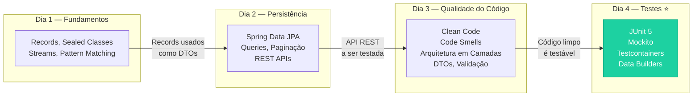
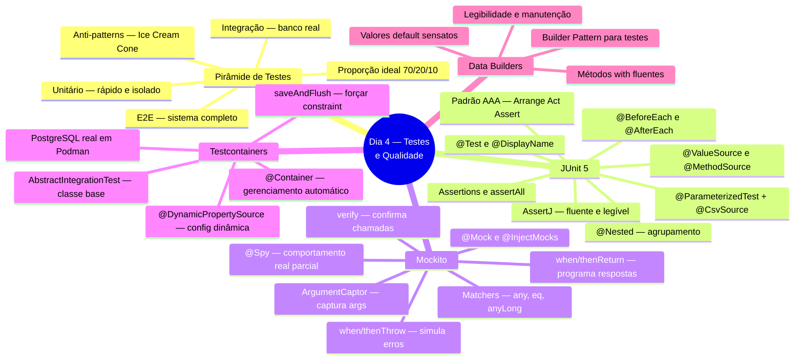
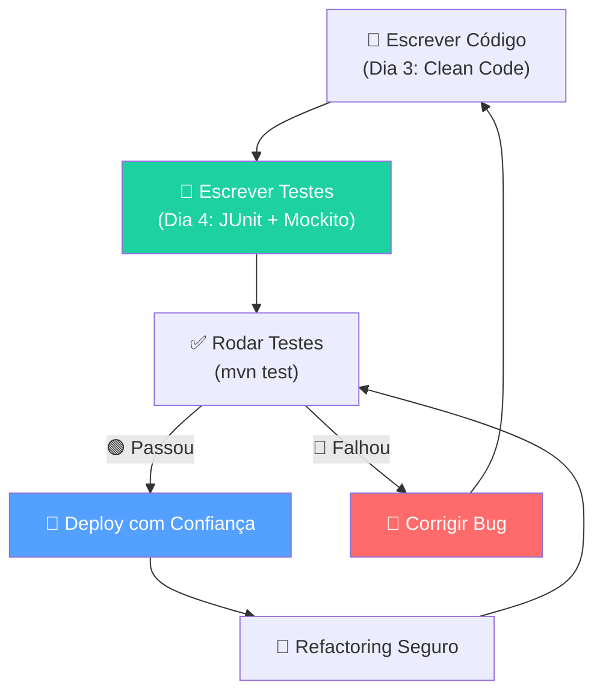
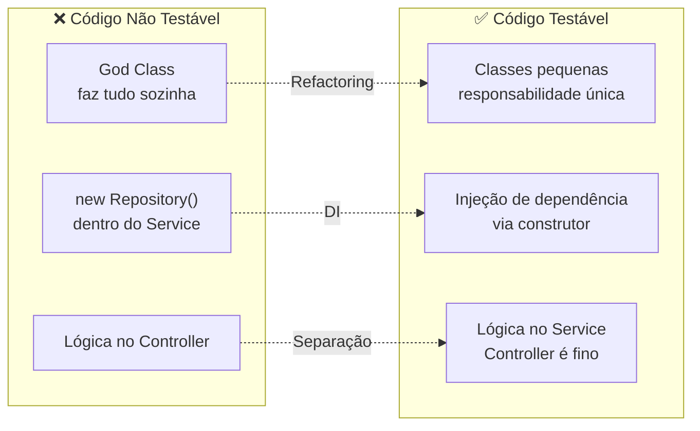
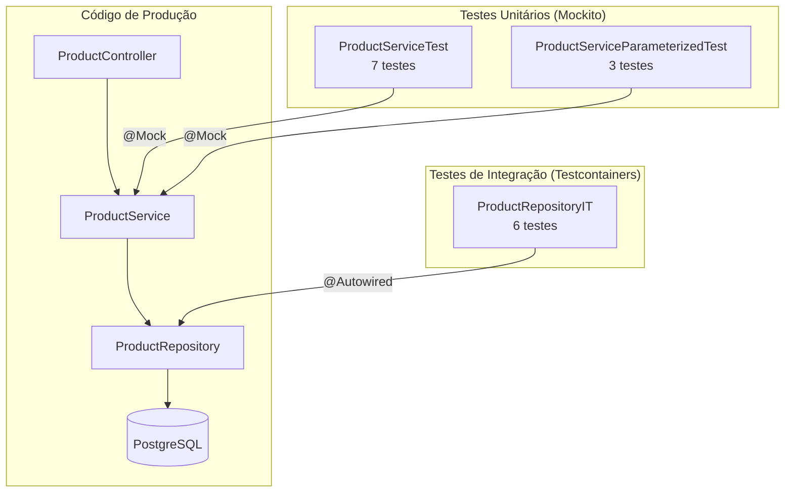
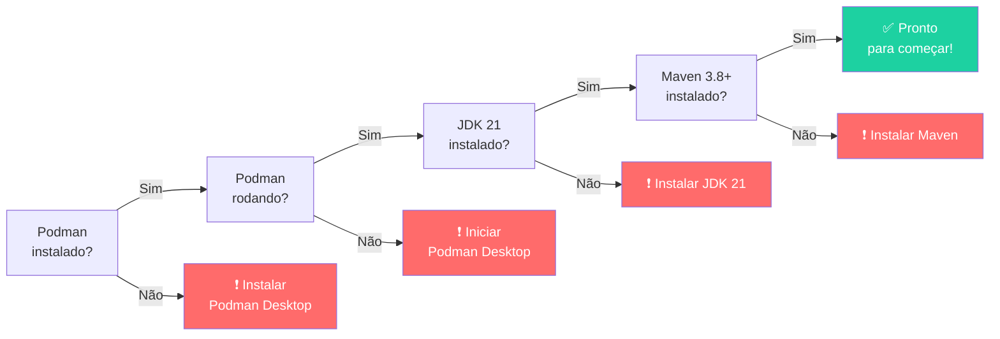

# Slide 1: Abertura e Recap do Dia 3

**Horário:** 09:00 - 09:15

---

## 📝 Recapitulando o Dia 3

No Dia 3 aprendemos a transformar **"código que funciona"** em **"código profissional"**:

- ✓ **Clean Code** — Nomenclatura significativa, métodos pequenos e coesos, DRY
- ✓ **Code Smells** — God Class, Long Method, Feature Envy, Primitive Obsession
- ✓ **Arquitetura em Camadas** — Controller → Service → Repository, cada um com sua responsabilidade
- ✓ **DTOs** — Records como Request/Response, mapeamento Entity ↔ DTO
- ✓ **Arquitetura Hexagonal** — Ports & Adapters, domain/, adapter/in/web/, adapter/out/persistence/
- ✓ **Tratamento de Erros** — @ControllerAdvice, Problem Details (RFC 7807), Custom Exceptions
- ✓ **Validação** — Bean Validation (@Valid), Custom Validators (@ValidCpf)
- ✓ **Refactoring** — Extract Method, Rename, Extract Class, Replace Conditional

> **Hoje vamos aprender a garantir que tudo isso funciona — e continua funcionando!**

---

## 🔗 Conexão entre os Dias — A Jornada do Desenvolvedor



### Por que testes são o próximo passo natural?

| O que fizemos nos dias anteriores | O que testes garantem |
|-----------------------------------|----------------------|
| Criamos **Records** e **DTOs** | Testes verificam que o mapeamento está correto |
| Escrevemos **regras de negócio** no Service | Testes unitários validam cada regra isoladamente |
| Configuramos **JPA + PostgreSQL** | Testes de integração garantem que queries funcionam no banco real |
| Adicionamos **validação** (@Valid, @ValidCpf) | Testes parametrizados cobrem múltiplos cenários |
| Implementamos **Error Handling** | Testes verificam que exceções corretas são lançadas |

---

## 🧭 Mapa Mental do Dia 4



---

## 🎯 Objetivos de Aprendizagem

Ao final deste dia, o aluno será capaz de:

1. **Explicar** a Pirâmide de Testes e decidir **onde** investir esforço
2. **Escrever** testes unitários com JUnit 5 seguindo o padrão AAA
3. **Parametrizar** testes com `@ParameterizedTest` + `@CsvSource`
4. **Isolar** dependências com `@Mock` e `@InjectMocks` (Mockito)
5. **Capturar** argumentos com `ArgumentCaptor` e verificar com `verify`
6. **Configurar** Testcontainers com PostgreSQL real para testes de integração
7. **Criar** Data Builders fluentes para massa de dados legível
8. **Atingir** cobertura >80% na camada Service

---

## 📊 Fluxo do Dia — Agenda Visual

```mermaid
gantt
    title Agenda do Dia 4
    dateFormat HH:mm
    axisFormat %H:%M

    section Manhã
    Recap + Abertura             :a1, 09:00, 15min
    Pirâmide de Testes           :a2, 09:15, 30min
    JUnit 5 — Anatomia (AAA)    :a3, 09:45, 30min
    JUnit 5 — Parametrizado     :a4, 10:15, 30min
    Coffee Break ☕              :a5, 10:45, 15min
    Mockito — Mock/InjectMocks  :a6, 11:00, 30min
    Mockito — Captor/Verify/Spy :a7, 11:30, 30min

    section Almoço
    Almoço 🍽️                   :a8, 12:00, 60min

    section Tarde
    Testcontainers              :a9, 13:00, 20min
    Data Builders               :a10, 13:20, 20min
    Walkthrough testing-demo    :a11, 13:40, 30min
    Exercício TODOs 1-7         :a12, 14:10, 140min
    Review e Q&A                :a13, 16:30, 30min
```



---

## 🔄 O Ciclo do Software Confiável



> **Sem testes**: qualquer mudança é arriscada — "funciona, não mexe!".  
> **Com testes**: refactoring e novas features se tornam seguros — "mudou? roda os testes!".

---

## 🧠 O que é "Código Testável"?

O código limpo que escrevemos no Dia 3 tem uma consequência importante: **é testável**.



### Princípios que tornam o código testável

| Princípio do Dia 3 | Benefício para Testes (Dia 4) |
|---------------------|-------------------------------|
| **Responsabilidade Única** | Cada classe é testada isoladamente |
| **Injeção de Dependência** | Permite substituir por mocks |
| **Métodos pequenos** | Fácil de cobrir todos os caminhos |
| **Separação em camadas** | Teste unitário no Service, integração no Repository |
| **DTOs (Records)** | Dados imutáveis, fácil de comparar em asserts |

---

## 📦 Projetos do Dia

### 1️⃣ `04-testing-demo` — Projeto completo (referência)

API de Catálogo de Produtos com **todos os testes implementados**.



### 2️⃣ `04-employee-api-tests` — Exercício (7 TODOs)

API de Gestão de Funcionários — **você vai adicionar os testes!**

---

## 📚 Referências Bibliográficas

| Livro/Recurso | Autor | Relevância |
|---------------|-------|------------|
| **Growing Object-Oriented Software, Guided by Tests** | Steve Freeman, Nat Pryce | Filosofia TDD e builders |
| **Effective Unit Testing** | Lasse Koskela | Padrões de teste, legibilidade |
| **Working Effectively with Legacy Code** | Michael Feathers | Testabilidade de código existente |
| **Clean Code** (Cap. 9 — Unit Tests) | Robert C. Martin | Regras de testes limpos |
| **JUnit 5 User Guide** | JUnit Team | Referência oficial |
| **Mockito Documentation** | Mockito Team | Mocks, spies, captors |
| **Testcontainers Docs** | Testcontainers Team | Configuração e boas práticas |

---

## 🔧 Pré-requisitos do Dia

> **IMPORTANTE**: Podman Desktop precisa estar rodando para os testes de integração com Testcontainers!

```bash
# Verificar Podman
podman --version
podman run docker.io/library/hello-world

# Verificar Java
java --version

# Verificar Maven
mvn --version
```

### Checklist de verificação


