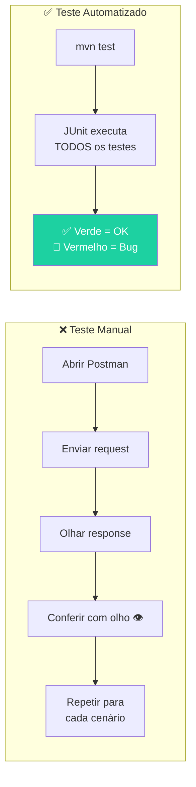
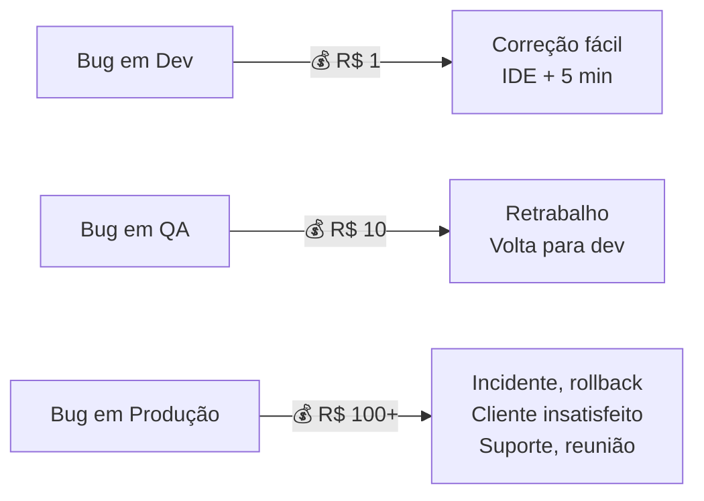
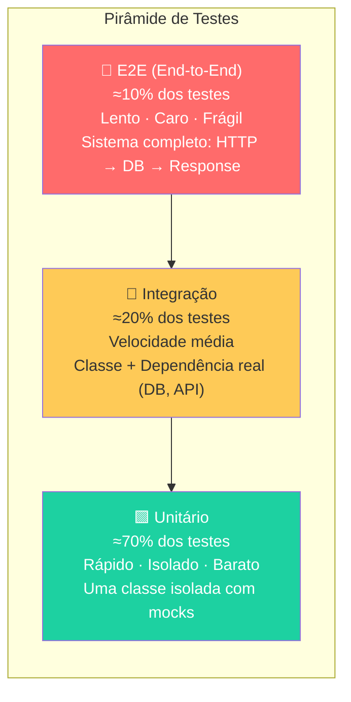
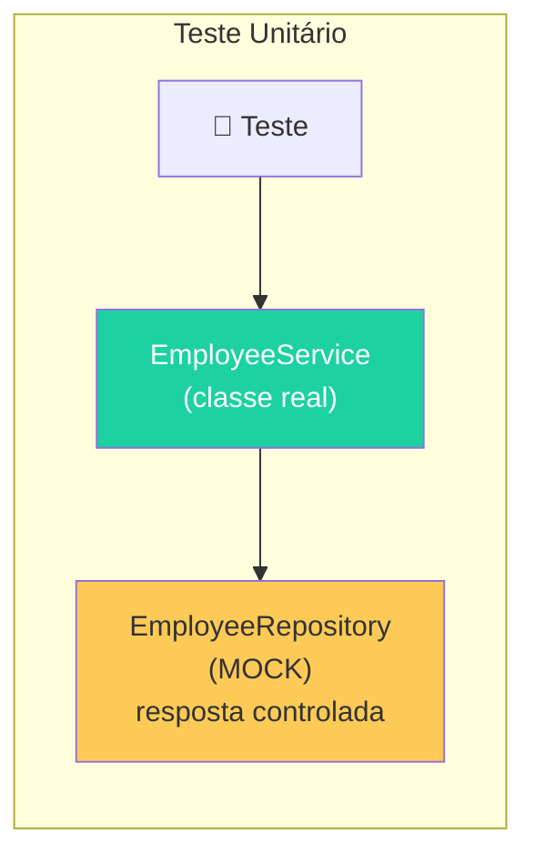
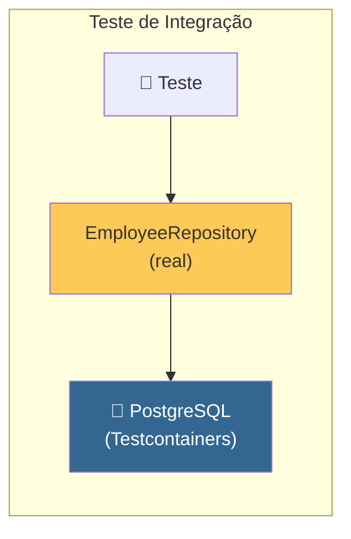
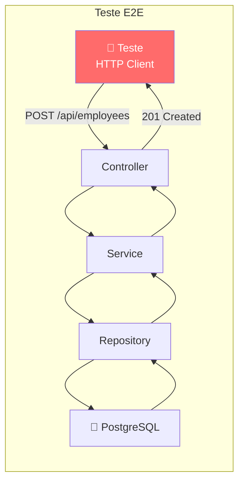
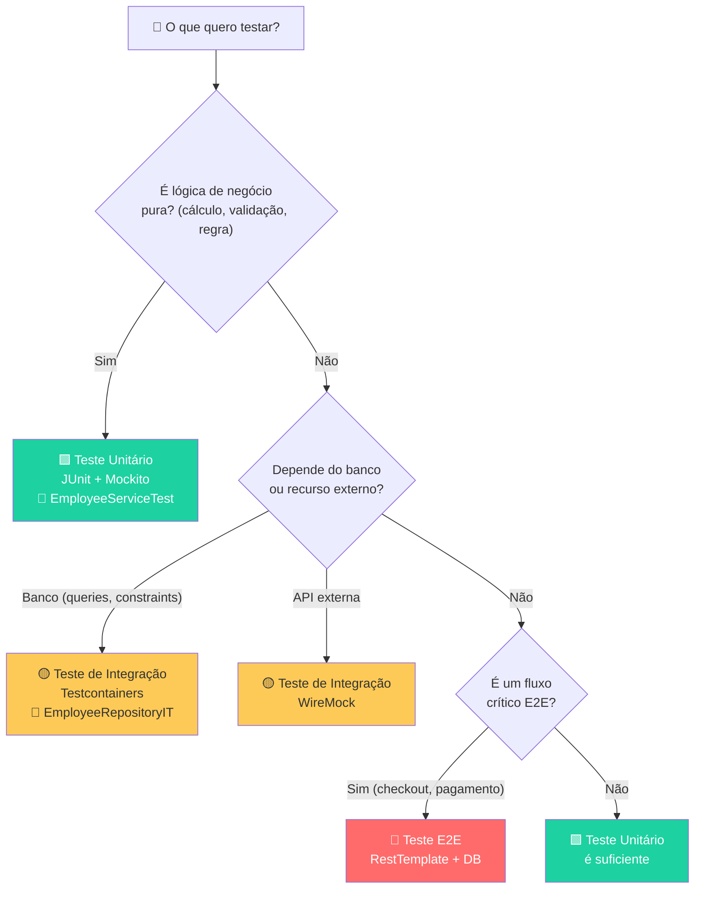
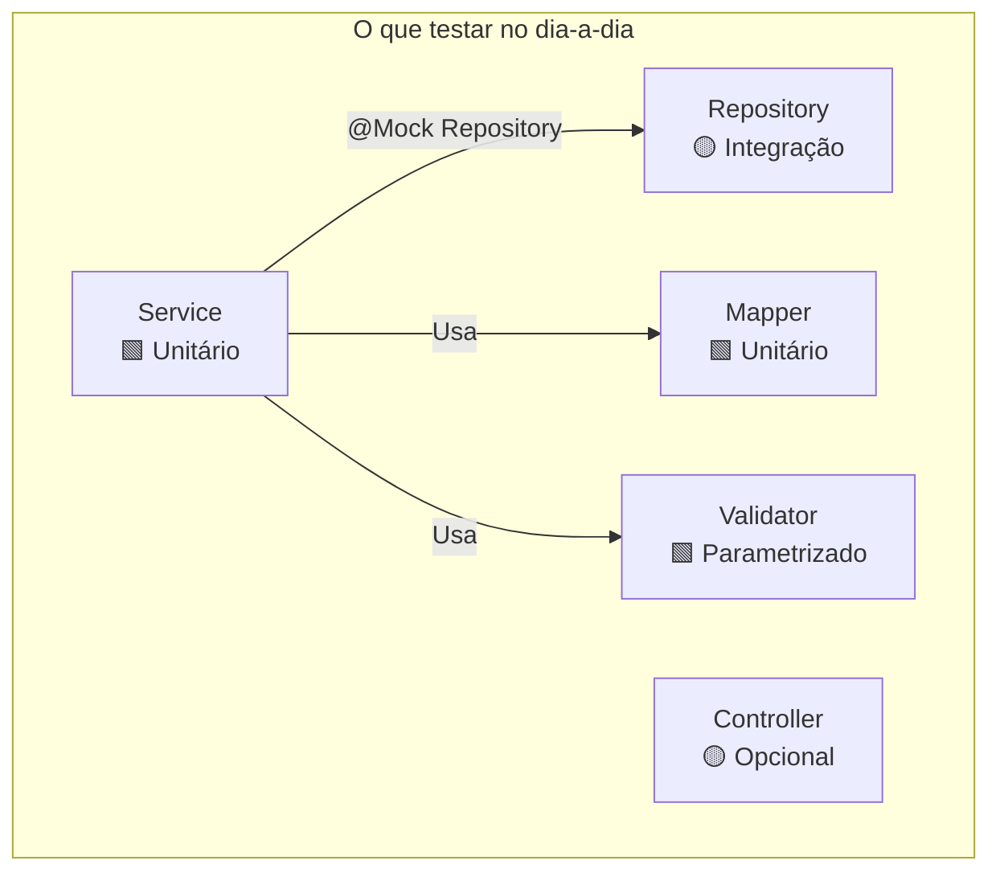
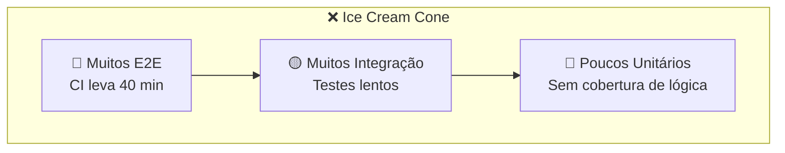
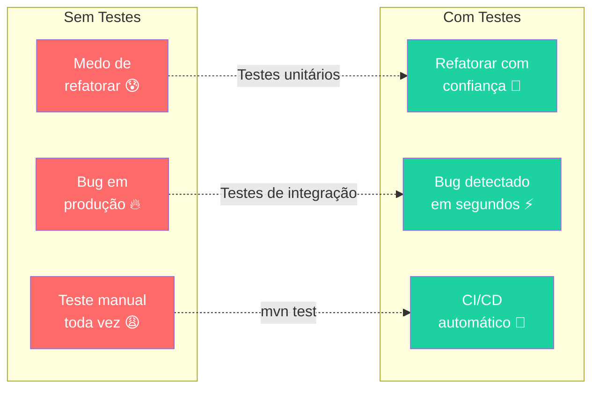

# Slide 2: Pirâmide de Testes

**Horário:** 09:15 - 09:45

---

## Por que Testar?

> **"Código sem testes é código legado."** — Michael Feathers, *Working Effectively with Legacy Code*

### O que é um teste automatizado?

Um teste automatizado é um **programa que verifica outro programa**. Em vez de abrir o Postman, clicar, olhar o resultado e conferir manualmente — o teste faz tudo isso sozinho, em milissegundos.



### O Custo de Não Testar



| Quando encontra o bug | Custo relativo | Impacto | Exemplo |
|------------------------|----------------|---------|---------|
| Durante o desenvolvimento | 1x | Nenhum | Teste unitário pega NPE |
| Em testes/QA | 10x | Retrabalho, atraso | Teste manual descobre campo errado |
| Em produção | 100x+ | Incidente, perda de receita | Cliente recebe cálculo errado |

> **Testes automatizados** detectam bugs no momento mais barato: **durante o desenvolvimento**.

---

## A Pirâmide de Testes

A Pirâmide de Testes (Martin Fowler / Mike Cohn) define **onde investir esforço** para maximizar confiança com menor custo.



### Detalhamento de Cada Camada

| Camada | O que testa | Velocidade | Custo de manutenção | Proporção | Ferramentas |
|--------|-------------|------------|---------------------|-----------|-------------|
| **Unitário** | Uma classe isolada (Service, Mapper, Validator) | ⚡ Milissegundos | 💚 Baixo | ~70% | JUnit 5 + Mockito |
| **Integração** | Classe + dependência real (Service + DB, API) | 🕐 Segundos | 🟡 Médio | ~20% | Testcontainers + Spring Boot Test |
| **E2E** | Sistema completo (HTTP → Service → DB → Response) | 🐌 Minutos | 🔴 Alto | ~10% | RestAssured, Selenium, Cypress |

---

## O que Cada Camada Garante

### 🟩 Testes Unitários (Base da Pirâmide)

Testam a **lógica de negócio** isoladamente — sem banco, sem rede, sem filesystem.



```java
// Testa a LÓGICA de negócio isoladamente
@Test
void shouldRejectSalaryBelowMinimum() {
    var request = new EmployeeRequest("João", "joao@email.com",
            new BigDecimal("1000.00"), "529.982.247-25", 1L);

    assertThrows(InvalidSalaryException.class,
            () -> employeeService.create(request));
}
```

- ✅ Roda em **milissegundos** (sem banco, sem rede)
- ✅ Isola a classe testada com **mocks**
- ✅ Feedback **imediato** no IDE
- ✅ Não precisa de Podman, servidor, ou infraestrutura

### 🔶 Testes de Integração (Meio da Pirâmide)

Testam a **interação entre componentes** — classe + banco real, classe + API real.



```java
// Testa a PERSISTÊNCIA com banco real
@Test
void shouldSaveAndFindEmployeeInDatabase() {
    var employee = new Employee();
    employee.setName("João");
    employee.setEmail("joao@email.com");

    Employee saved = repository.save(employee);
    Optional<Employee> found = repository.findById(saved.getId());

    assertThat(found).isPresent();
    assertThat(found.get().getName()).isEqualTo("João");
}
```

- ✅ Verifica **queries JPQL**, constraints, migrations
- ✅ Usa banco **real** (PostgreSQL via Testcontainers)
- ⚠️ Mais lento que unitário (2-5 segundos)
- ⚠️ Requer Podman rodando

### 🔴 Testes E2E (Topo da Pirâmide)

Testam o **fluxo completo** — da request HTTP até a response.



```java
// Testa o FLUXO COMPLETO: HTTP → Service → DB → Response
@Test
void shouldCreateEmployeeViaApi() {
    var response = restTemplate.postForEntity("/api/employees", request, EmployeeResponse.class);

    assertThat(response.getStatusCode()).isEqualTo(HttpStatus.CREATED);
    assertThat(response.getBody().name()).isEqualTo("João");
}
```

- ✅ Garante que **tudo funciona junto** (rotas, serialização, validação, banco)
- ⚠️ Lento, frágil, caro de manter
- ⚠️ Reservar para **fluxos críticos** do negócio

---

## 📐 Onde Investir Esforço? — Árvore de Decisão



### Regras Práticas — Mapeamento Camada → Tipo de Teste

| Camada da Aplicação | Tipo de Teste | Justificativa |
|---------------------|---------------|---------------|
| **Service** | 🟩 Unitário (com Mockito) | Regras de negócio não precisam de banco |
| **Repository** | 🟡 Integração (Testcontainers) | Queries JPQL e constraints dependem do banco real |
| **Controller** | 🟡 Integração (`@WebMvcTest`) | Validação de rotas, serialização, `@Valid` |
| **Mapper** | 🟩 Unitário (sem mocks) | Transformação pura de dados, sem dependências |
| **Validator** | 🟩 Unitário ou Parametrizado | Lógica pura (CPF, email) |
| **Builder** | ❌ Não precisa de teste | É ferramenta de teste, não código de produção |



---

## ⚠️ Anti-Patterns de Teste — O que NÃO Fazer

### ❌ Ice Cream Cone (Pirâmide Invertida)

```
/________________\  E2E (muitos) — CARO! Lento! Frágil!
 \              /   Integração (muitos) — LENTO!
  \            /    Unitário (poucos) — ⚠️ Base fraca
   \__________/     → Feedback lento, suíte frágil, CI lento
```



**Consequência**: CI leva 40+ minutos, testes quebram com frequência, feedback lento.

### ❌ Hourglass (Ampulheta)

```
/______\    E2E (muitos)
 |    |     Integração (poucos) — GAP! Peças não se encaixam
/______\    Unitário (muitos)
→ Peças isoladas OK, mas não verificamos se se encaixam
```

**Consequência**: Unitários passam, E2E passa, mas queries erradas no banco não são detectadas.

### ✅ Pirâmide Correta

```
    /\        E2E (poucos) — fluxos críticos
   /  \       Integração (alguns) — banco + queries
  /    \      Unitário (muitos) — lógica de negócio
 /______\     → Feedback rápido + confiança alta
```

---

## 📊 Comparação Visual das Abordagens



---

## 🧠 Conceitos-Chave para Levar

| Conceito | Definição |
|----------|-----------|
| **Teste Unitário** | Testa uma única classe isolada, substituindo dependências por mocks |
| **Teste de Integração** | Testa a interação entre componentes com dependências reais (banco, API) |
| **Teste E2E** | Testa o sistema completo de ponta a ponta (request → response) |
| **Pirâmide de Testes** | Modelo que sugere proporção 70% unitário, 20% integração, 10% E2E |
| **Mock** | Objeto falso que simula o comportamento de uma dependência |
| **Isolamento** | Cada teste roda independente dos outros — sem estado compartilhado |
| **Feedback rápido** | Testes unitários rodam em milissegundos — resultado imediato |

---

## 💡 Dica do Instrutor

> Comece **sempre** pelos testes unitários do Service. Se a lógica de negócio está coberta, você já tem 70% de confiança. Adicione testes de integração apenas para o que **requer o banco real** (queries, constraints, transactions).

> **Pergunta para a turma**: "Se vocês tivessem que escolher entre 100 testes E2E lentos ou 100 testes unitários rápidos, qual escolheriam? Por quê?"
