# Slide 2: Padrão SAGA

---

## 🎯 O que é o Padrão SAGA?

> **SAGA** é um padrão para gerenciar **transações distribuídas** através de uma sequência de transações locais.

```mermaid
graph LR
    A[Transação Local 1] --> B[Transação Local 2]
    B --> C[Transação Local 3]
    C --> D[Transação Local N]
    
    D -.->|Falha| E[Compensação N]
    E -.-> F[Compensação N-1]
    F -.-> G[Compensação N-2]
    
    style A fill:#4CAF50,stroke:#2E7D32,color:#fff
    style B fill:#4CAF50,stroke:#2E7D32,color:#fff
    style C fill:#4CAF50,stroke:#2E7D32,color:#fff
    style D fill:#f44336,stroke:#c62828,color:#fff
    style E fill:#ff9800,stroke:#f57c00,color:#fff
    style F fill:#ff9800,stroke:#f57c00,color:#fff
    style G fill:#ff9800,stroke:#f57c00,color:#fff
```



### Por que precisamos de SAGA?


---

## 🔄 Funcionamento do SAGA

### Cenário: Criar Pedido

```mermaid
sequenceDiagram
    participant Client
    participant Order as Order Service
    participant Payment as Payment Service
    participant Inventory as Inventory Service
    participant Shipping as Shipping Service
    
    Client->>Order: POST /orders
    Note over Order: Transação Local 1
    Order->>Order: Criar pedido (PENDING)
    Order->>Order: Salvar no BD
    
    Order->>Payment: Processar pagamento
    Note over Payment: Transação Local 2
    Payment->>Payment: Reservar valor
    Payment->>Payment: Salvar no BD
    Payment-->>Order: OK
    
    Order->>Inventory: Reservar estoque
    Note over Inventory: Transação Local 3
    Inventory->>Inventory: Decrementar estoque
    Inventory->>Inventory: Salvar no BD
    Inventory-->>Order: OK
    
    Order->>Shipping: Criar envio
    Note over Shipping: Transação Local 4
    Shipping->>Shipping: Agendar envio
    Shipping-->>Order: OK
    
    Order->>Order: Atualizar status (CONFIRMED)
    Order-->>Client: 201 Created
```



### Cenário: Falha no Meio do Processo

```mermaid
sequenceDiagram
    participant Order as Order Service
    participant Payment as Payment Service
    participant Inventory as Inventory Service
    participant Shipping as Shipping Service
    
    Order->>Order: ✅ Criar pedido
    Order->>Payment: Processar pagamento
    Payment->>Payment: ✅ Pagamento OK
    Payment-->>Order: OK
    
    Order->>Inventory: Reservar estoque
    Inventory->>Inventory: ❌ Estoque insuficiente!
    Inventory-->>Order: ERROR
    
    Note over Order: SAGA deve compensar!
    
    Order->>Payment: COMPENSAÇÃO: Estornar pagamento
    Payment->>Payment: ✅ Estorno realizado
    Payment-->>Order: OK
    
    Order->>Order: ✅ Cancelar pedido
    Order-->>Order: Status: CANCELLED
    
    Note over Order,Shipping: Tudo foi desfeito!<br/>Consistência eventual mantida
```



---

## 📋 Componentes de uma SAGA

### 1. Transações Locais

Cada serviço executa sua própria transação ACID:

```java
// Order Service - Transação Local 1
@Service
@RequiredArgsConstructor
public class OrderService {
    
    private final OrderRepository orderRepository;
    
    @Transactional  // ACID local ao Order Service
    public OrderId createOrder(CreateOrderCommand cmd) {
        Order order = Order.create(cmd);
        order.setStatus(OrderStatus.PENDING);
        orderRepository.save(order);
        return order.getId();
    }
}

// Payment Service - Transação Local 2
@Service
@RequiredArgsConstructor
public class PaymentService {
    
    private final PaymentRepository paymentRepository;
    
    @Transactional  // ACID local ao Payment Service
    public PaymentId reservePayment(ReservePaymentCommand cmd) {
        Payment payment = Payment.create(cmd);
        payment.setStatus(PaymentStatus.RESERVED);
        paymentRepository.save(payment);
        return payment.getId();
    }
}
```

### 2. Transações Compensatórias

Cada transação local tem uma **compensação** para desfazê-la:

```java
// Transação Normal
public void reservePayment(OrderId orderId, BigDecimal amount) {
    Payment payment = Payment.reserve(orderId, amount);
    paymentRepository.save(payment);
}

// Transação Compensatória
public void cancelPayment(OrderId orderId) {
    Payment payment = paymentRepository.findByOrderId(orderId)
        .orElseThrow();
    payment.cancel();  // Libera o valor reservado
    paymentRepository.save(payment);
}
```

```java
// Inventory Service
public void reserveStock(ProductId productId, int quantity) {
    Product product = productRepository.findById(productId).orElseThrow();
    product.decreaseStock(quantity);  // Transação normal
    productRepository.save(product);
}

public void releaseStock(ProductId productId, int quantity) {
    Product product = productRepository.findById(productId).orElseThrow();
    product.increaseStock(quantity);  // Compensação
    productRepository.save(product);
}
```

---

## 🏗️ Tipos de SAGA

```mermaid
graph TB
    A[Padrão SAGA] --> B[Orquestração]
    A --> C[Coreografia]
    
    B --> D[Coordenador Central]
    B --> E[Controle Centralizado]
    
    C --> F[Eventos Distribuídos]
    C --> G[Sem Coordenador]
    
    style B fill:#2196F3,stroke:#1976D2,color:#fff
    style C fill:#FF9800,stroke:#F57C00,color:#fff
```



### Veremos em detalhes nos próximos slides!

---

## 🎯 SAGA Orquestrada (Orchestration)

> **Coordenador central** controla toda a saga

```mermaid
sequenceDiagram
    participant Orchestrator
    participant Order
    participant Payment
    participant Inventory
    participant Shipping
    
    Note over Orchestrator: Orchestrator coordena TUDO
    
    Orchestrator->>Order: 1. Criar pedido
    Order-->>Orchestrator: OK
    
    Orchestrator->>Payment: 2. Processar pagamento
    Payment-->>Orchestrator: OK
    
    Orchestrator->>Inventory: 3. Reservar estoque
    Inventory-->>Orchestrator: ERRO!
    
    Note over Orchestrator: Orchestrator inicia compensação
    
    Orchestrator->>Payment: Compensar: Estornar
    Payment-->>Orchestrator: OK
    
    Orchestrator->>Order: Compensar: Cancelar
    Order-->>Orchestrator: OK
```



### Implementação com Orchestrator

```java
@Service
@RequiredArgsConstructor
@Slf4j
public class OrderSagaOrchestrator {
    
    private final OrderService orderService;
    private final PaymentService paymentService;
    private final InventoryService inventoryService;
    private final ShippingService shippingService;
    
    public OrderResult executeOrderSaga(CreateOrderCommand cmd) {
        
        OrderId orderId = null;
        PaymentId paymentId = null;
        ReservationId reservationId = null;
        
        try {
            // Passo 1: Criar pedido
            log.info("Step 1: Creating order");
            orderId = orderService.createOrder(cmd);
            
            // Passo 2: Processar pagamento
            log.info("Step 2: Processing payment for order {}", orderId);
            paymentId = paymentService.reservePayment(
                new ReservePaymentCommand(orderId, cmd.amount())
            );
            
            // Passo 3: Reservar estoque
            log.info("Step 3: Reserving inventory for order {}", orderId);
            reservationId = inventoryService.reserveStock(
                new ReserveStockCommand(orderId, cmd.items())
            );
            
            // Passo 4: Criar envio
            log.info("Step 4: Creating shipment for order {}", orderId);
            ShipmentId shipmentId = shippingService.createShipment(
                new CreateShipmentCommand(orderId, cmd.address())
            );
            
            // Sucesso! Confirmar pedido
            orderService.confirmOrder(orderId);
            log.info("SAGA completed successfully for order {}", orderId);
            
            return OrderResult.success(orderId);
            
        } catch (Exception e) {
            log.error("SAGA failed for order {}, starting compensation", orderId, e);
            
            // COMPENSAÇÃO em ordem reversa
            compensate(orderId, paymentId, reservationId);
            
            return OrderResult.failure(e.getMessage());
        }
    }
    
    private void compensate(OrderId orderId, PaymentId paymentId, ReservationId reservationId) {
        // Compensar na ordem reversa
        
        if (reservationId != null) {
            try {
                log.info("Compensating: Releasing inventory reservation {}", reservationId);
                inventoryService.releaseStock(reservationId);
            } catch (Exception e) {
                log.error("Failed to compensate inventory", e);
                // Pode precisar de retry ou alertas
            }
        }
        
        if (paymentId != null) {
            try {
                log.info("Compensating: Refunding payment {}", paymentId);
                paymentService.refundPayment(paymentId);
            } catch (Exception e) {
                log.error("Failed to compensate payment", e);
            }
        }
        
        if (orderId != null) {
            try {
                log.info("Compensating: Cancelling order {}", orderId);
                orderService.cancelOrder(orderId);
            } catch (Exception e) {
                log.error("Failed to compensate order", e);
            }
        }
    }
}
```

### Vantagens da Orquestração

```mermaid
graph LR
    A[✅ Fácil de entender] --> E[Coordenador<br/>Central]
    B[✅ Fácil de debugar] --> E
    C[✅ Controle centralizado] --> E
    D[✅ Mais simples para começar] --> E
    
    style E fill:#2196F3,stroke:#1976D2,color:#fff
```



### Desvantagens da Orquestração

```mermaid
graph LR
    A[❌ Single Point of Failure] --> E[Coordenador<br/>Central]
    B[❌ Acoplamento alto] --> E
    C[❌ Escalabilidade limitada] --> E
    D[❌ Gargalo de performance] --> E
    
    style E fill:#f44336,stroke:#c62828,color:#fff
```



---

## 🎭 SAGA Coreografada (Choreography)

> **Sem coordenador** - Serviços reagem a eventos


### Implementação com Eventos

```java
// Order Service - Publica evento
@Service
@RequiredArgsConstructor
public class OrderService {
    
    private final OrderRepository orderRepository;
    private final EventPublisher eventPublisher;
    
    @Transactional
    public OrderId createOrder(CreateOrderCommand cmd) {
        Order order = Order.create(cmd);
        order.setStatus(OrderStatus.PENDING);
        orderRepository.save(order);
        
        // Publica evento para outros serviços
        eventPublisher.publish(new OrderCreatedEvent(
            order.getId(),
            order.getCustomerId(),
            order.getTotal()
        ));
        
        return order.getId();
    }
}

// Payment Service - Escuta evento e publica próximo
@Service
@RequiredArgsConstructor
public class PaymentEventHandler {
    
    private final PaymentService paymentService;
    private final EventPublisher eventPublisher;
    
    @EventListener
    @Transactional
    public void handleOrderCreated(OrderCreatedEvent event) {
        try {
            // Processa pagamento
            PaymentId paymentId = paymentService.reservePayment(
                new ReservePaymentCommand(event.orderId(), event.amount())
            );
            
            // Publica sucesso
            eventPublisher.publish(new PaymentProcessedEvent(
                event.orderId(),
                paymentId
            ));
            
        } catch (PaymentFailedException e) {
            // Publica falha - inicia compensação
            eventPublisher.publish(new PaymentFailedEvent(
                event.orderId(),
                e.getMessage()
            ));
        }
    }
    
    // Handler de compensação
    @EventListener
    @Transactional
    public void handleInventoryFailed(InventoryFailedEvent event) {
        // Compensa o pagamento
        paymentService.refundPayment(event.orderId());
        
        eventPublisher.publish(new PaymentRefundedEvent(event.orderId()));
    }
}

// Inventory Service - Escuta e reage
@Service
@RequiredArgsConstructor
public class InventoryEventHandler {
    
    private final InventoryService inventoryService;
    private final EventPublisher eventPublisher;
    
    @EventListener
    @Transactional
    public void handlePaymentProcessed(PaymentProcessedEvent event) {
        try {
            // Reserva estoque
            inventoryService.reserveStock(event.orderId());
            
            eventPublisher.publish(new StockReservedEvent(event.orderId()));
            
        } catch (InsufficientStockException e) {
            // Publica falha - outros serviços vão compensar
            eventPublisher.publish(new InventoryFailedEvent(
                event.orderId(),
                e.getMessage()
            ));
        }
    }
}
```

### Vantagens da Coreografia

```mermaid
graph LR
    A[✅ Sem single point of failure] --> E[Event-Driven<br/>Architecture]
    B[✅ Desacoplamento] --> E
    C[✅ Escalabilidade alta] --> E
    D[✅ Serviços independentes] --> E
    
    style E fill:#4CAF50,stroke:#2E7D32,color:#fff
```



### Desvantagens da Coreografia

```mermaid
graph LR
    A[❌ Difícil de debugar] --> E[Event-Driven<br/>Architecture]
    B[❌ Complexidade distribuída] --> E
    C[❌ Difícil rastrear fluxo] --> E
    D[❌ Eventual consistency] --> E
    
    style E fill:#ff9800,stroke:#f57c00,color:#fff
```



---

## 📊 Comparação: Orquestração vs Coreografia

| Aspecto | Orquestração | Coreografia |
|---------|--------------|-------------|
| **Coordenação** | Centralizada (Orchestrator) | Distribuída (Eventos) |
| **Complexidade** | Menor (lógica em um lugar) | Maior (lógica espalhada) |
| **Acoplamento** | Alto (todos chamam orchestrator) | Baixo (apenas eventos) |
| **Debugabilidade** | Fácil (logs centralizados) | Difícil (rastreamento distribuído) |
| **Escalabilidade** | Limitada (orchestrator é gargalo) | Alta (sem ponto único) |
| **Resiliência** | Single point of failure | Sem single point |
| **Manutenibilidade** | Fácil adicionar steps | Difícil entender fluxo completo |


---

## ⚠️ Desafios do Padrão SAGA

### 1. Idempotência

```java
// ❌ Problema: Processar o mesmo evento duas vezes
@EventListener
public void handlePaymentProcessed(PaymentProcessedEvent event) {
    paymentService.processPayment(event.orderId());  // Pode ser chamado 2x!
}

// ✅ Solução: Idempotência com tabela de eventos processados
@EventListener
@Transactional
public void handlePaymentProcessed(PaymentProcessedEvent event) {
    // Verifica se já processou
    if (processedEvents.exists(event.eventId())) {
        log.warn("Event {} already processed, skipping", event.eventId());
        return;
    }
    
    // Processa
    paymentService.processPayment(event.orderId());
    
    // Marca como processado
    processedEvents.save(new ProcessedEvent(event.eventId()));
}
```

### 2. Ordem de Eventos

```java
// ⚠️ Eventos podem chegar fora de ordem!
// Event 1: OrderCreated
// Event 2: OrderCancelled
// Pode chegar: Event 2 antes de Event 1!

// ✅ Solução: Versionamento e verificação de estado
@EventListener
public void handleOrderCancelled(OrderCancelledEvent event) {
    Order order = orderRepository.findById(event.orderId())
        .orElse(null);
    
    if (order == null) {
        // Ordem ainda não foi criada, guardar evento para replay
        pendingEvents.save(event);
        return;
    }
    
    if (order.getVersion() < event.version()) {
        // Evento mais recente, processar
        order.cancel();
    } else {
        // Evento antigo, ignorar
        log.warn("Received old event, ignoring");
    }
}
```

### 3. Falhas Parciais

```java
// ⚠️ E se a compensação falhar?
public void compensate() {
    try {
        inventoryService.releaseStock();  // OK
    } catch (Exception e) {
        log.error("Failed to release stock", e);
    }
    
    try {
        paymentService.refund();  // FALHA!
    } catch (Exception e) {
        // 💥 Agora temos inconsistência!
        // Estoque foi liberado, mas pagamento não foi estornado
        log.error("Failed to refund payment", e);
        // Precisamos de retry, dead letter queue, alertas manuais...
    }
}

// ✅ Solução: Retry + Dead Letter Queue + Alertas
@Retryable(maxAttempts = 3, backoff = @Backoff(delay = 1000))
public void refundWithRetry(PaymentId paymentId) {
    paymentService.refund(paymentId);
}

@Recover
public void handleRefundFailure(Exception e, PaymentId paymentId) {
    // Após 3 tentativas, manda para DLQ
    deadLetterQueue.send(new RefundFailedMessage(paymentId));
    
    // Alerta para time de operações
    alertService.sendAlert("CRITICAL: Payment refund failed for " + paymentId);
}
```

---

## 🛠️ Ferramentas para SAGA

### Spring Boot + Events

```java
@Configuration
public class EventConfiguration {
    
    @Bean
    public ApplicationEventPublisher eventPublisher(ApplicationContext context) {
        return context;
    }
}

// Publicar eventos
@Service
@RequiredArgsConstructor
public class OrderService {
    
    private final ApplicationEventPublisher eventPublisher;
    
    public void createOrder(CreateOrderCommand cmd) {
        Order order = Order.create(cmd);
        orderRepository.save(order);
        
        // Publica evento síncrono dentro do mesmo processo
        eventPublisher.publishEvent(new OrderCreatedEvent(order.getId()));
    }
}
```

### Apache Kafka para Eventos Distribuídos

```java
@Configuration
public class KafkaProducerConfig {
    
    @Bean
    public ProducerFactory<String, OrderCreatedEvent> producerFactory() {
        return new DefaultKafkaProducerFactory<>(producerConfigs());
    }
    
    @Bean
    public KafkaTemplate<String, OrderCreatedEvent> kafkaTemplate() {
        return new KafkaTemplate<>(producerFactory());
    }
}

@Service
@RequiredArgsConstructor
public class OrderService {
    
    private final KafkaTemplate<String, OrderCreatedEvent> kafkaTemplate;
    
    @Transactional
    public void createOrder(CreateOrderCommand cmd) {
        Order order = Order.create(cmd);
        orderRepository.save(order);
        
        // Publica evento assíncrono via Kafka
        kafkaTemplate.send("order-events", new OrderCreatedEvent(order.getId()));
    }
}

// Consumidor
@Service
@Slf4j
public class PaymentEventListener {
    
    @KafkaListener(topics = "order-events", groupId = "payment-service")
    public void handleOrderCreated(OrderCreatedEvent event) {
        log.info("Received order created event: {}", event);
        // Processar pagamento
    }
}
```

### Frameworks SAGA

- **Axon Framework**: https://axoniq.io/
- **Eventuate Tram Saga**: https://eventuate.io/
- **Camunda**: https://camunda.com/ (Workflow orchestration)
- **Netflix Conductor**: https://conductor.netflix.com/

---

## 🎯 Quando usar SAGA?


### Use SAGA quando:
- ✅ Você tem múltiplos microservices
- ✅ Precisa manter consistência entre serviços
- ✅ Não pode usar transações distribuídas (2PC)
- ✅ Pode aceitar consistência eventual

### NÃO use SAGA quando:
- ❌ Monolito com único banco de dados
- ❌ Operações simples e independentes
- ❌ Time não está preparado para lidar com eventual consistency
- ❌ Requisitos de consistência forte (ACID obrigatório)

---

## 📚 Referências

- [Pattern: Saga](https://microservices.io/patterns/data/saga.html) - Chris Richardson
- [Saga Pattern Implementation](https://docs.microsoft.com/azure/architecture/reference-architectures/saga/saga)
- [Microservices Patterns Book](https://www.manning.com/books/microservices-patterns) - Chris Richardson
