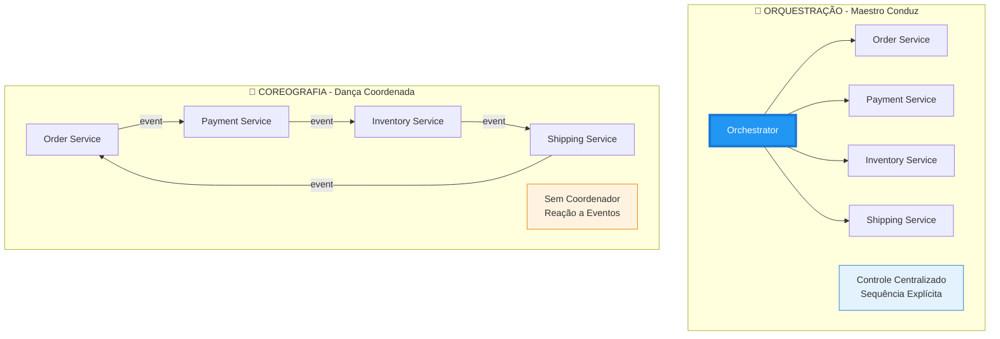
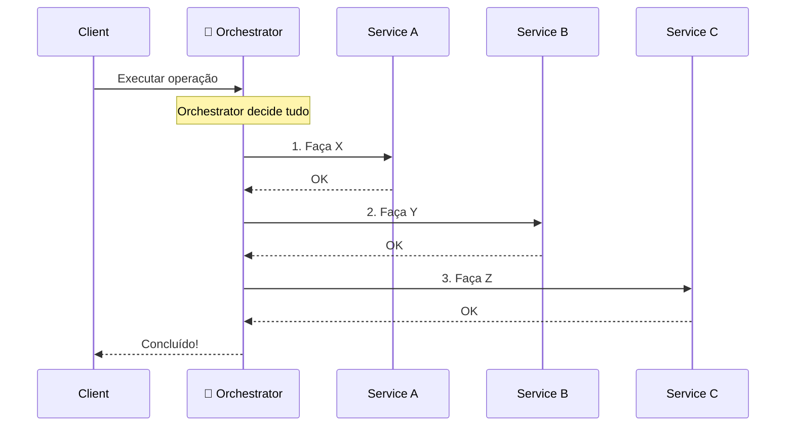
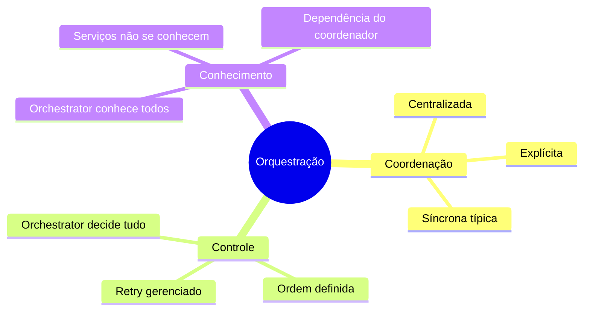
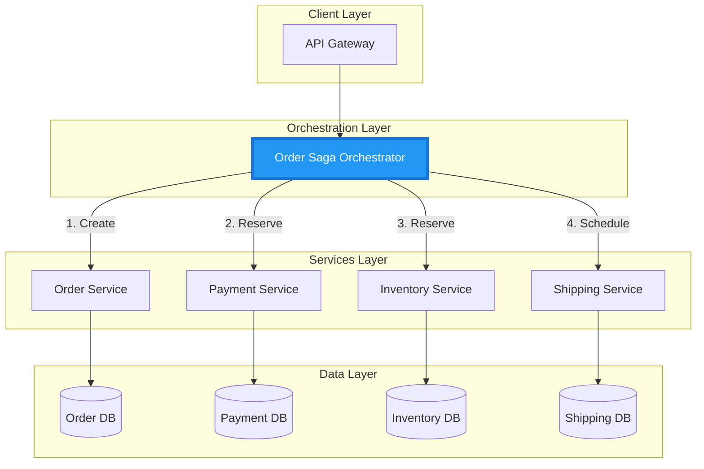
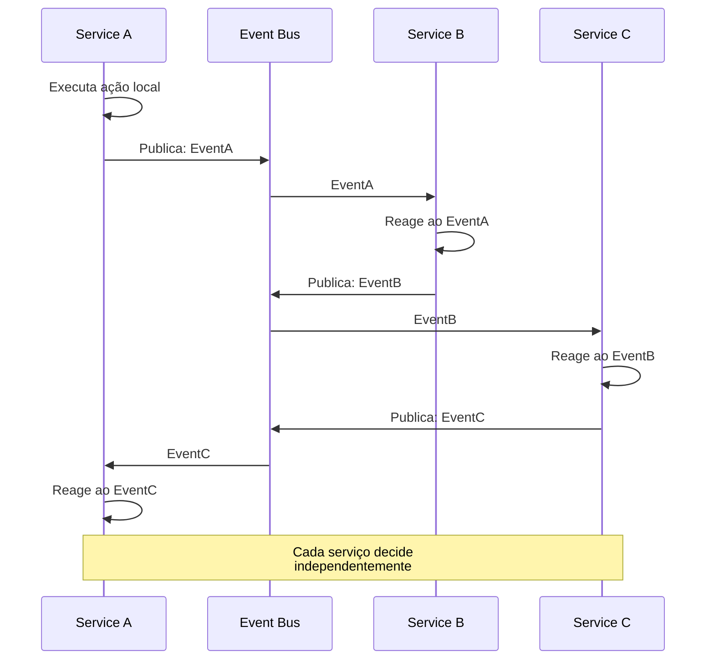
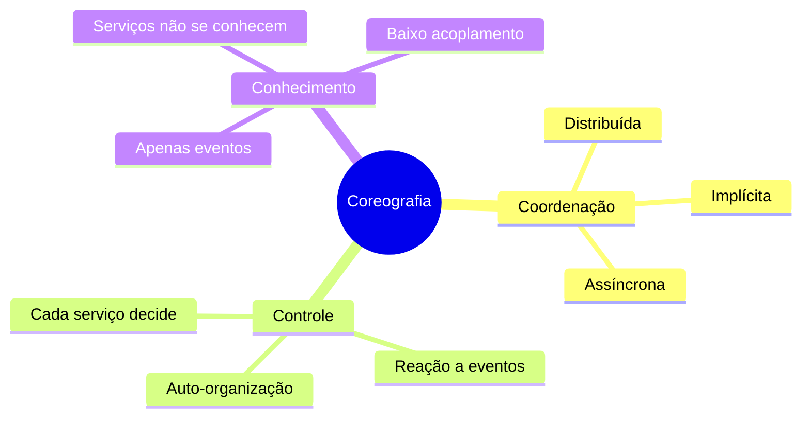
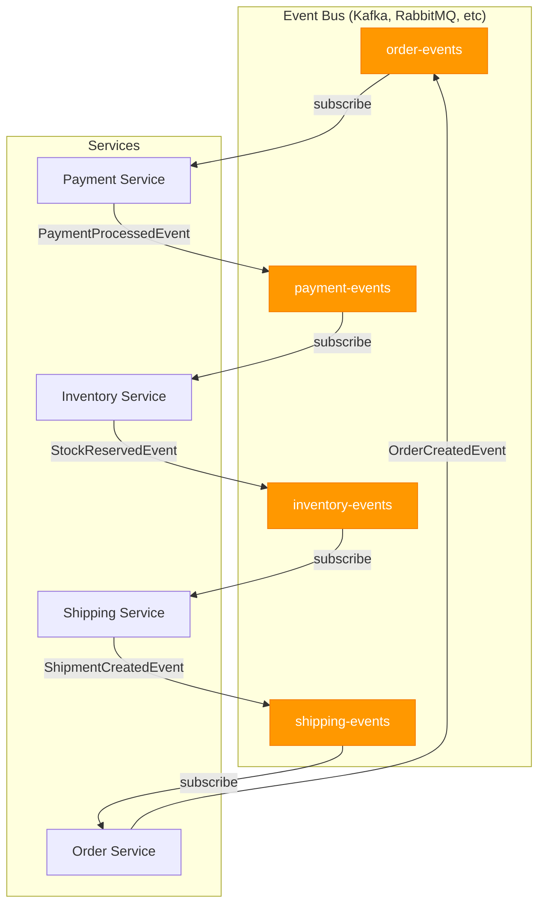
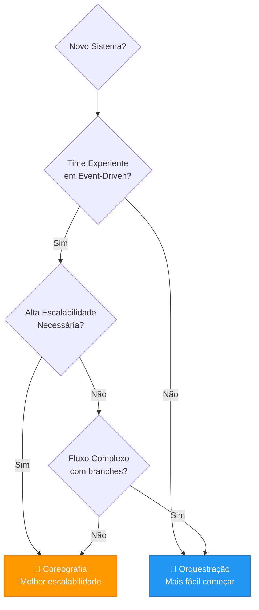
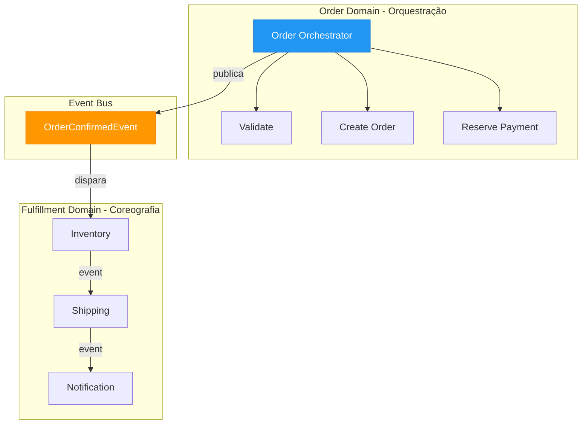
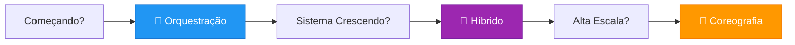

# Slide 3: Orquestração vs Coreografia

---

## 🎭 Orquestração vs Coreografia: Comparação Detalhada



---

## 🎻 ORQUESTRAÇÃO (Orchestration)

### Conceito

> **Um coordenador central (Orchestrator)** que **comanda** todos os serviços participantes



### Características



---

## 🏗️ Arquitetura Orquestrada



---

## 💻 Implementação: Orquestração

### Orchestrator Básico

```java
@Service
@RequiredArgsConstructor
@Slf4j
public class OrderSagaOrchestrator {
    
    private final OrderService orderService;
    private final PaymentService paymentService;
    private final InventoryService inventoryService;
    private final ShippingService shippingService;
    private final SagaStateRepository sagaStateRepository;
    
    /**
     * Executa a SAGA de criação de pedido
     * Orchestrator controla toda a sequência
     */
    public OrderResult executeOrderCreationSaga(CreateOrderCommand cmd) {
        
        // Cria estado da SAGA para rastreabilidade
        SagaState saga = SagaState.start("ORDER_CREATION", cmd);
        sagaStateRepository.save(saga);
        
        try {
            // ===== STEP 1: Create Order =====
            log.info("[SAGA-{}] Step 1/4: Creating order", saga.getId());
            saga.startStep("CREATE_ORDER");
            
            OrderId orderId = orderService.createOrder(cmd);
            saga.completeStep("CREATE_ORDER", orderId);
            
            // ===== STEP 2: Process Payment =====
            log.info("[SAGA-{}] Step 2/4: Processing payment", saga.getId());
            saga.startStep("PROCESS_PAYMENT");
            
            PaymentId paymentId = paymentService.processPayment(
                ProcessPaymentCommand.builder()
                    .orderId(orderId)
                    .amount(cmd.totalAmount())
                    .customerId(cmd.customerId())
                    .build()
            );
            saga.completeStep("PROCESS_PAYMENT", paymentId);
            
            // ===== STEP 3: Reserve Inventory =====
            log.info("[SAGA-{}] Step 3/4: Reserving inventory", saga.getId());
            saga.startStep("RESERVE_INVENTORY");
            
            ReservationId reservationId = inventoryService.reserveItems(
                ReserveItemsCommand.builder()
                    .orderId(orderId)
                    .items(cmd.items())
                    .build()
            );
            saga.completeStep("RESERVE_INVENTORY", reservationId);
            
            // ===== STEP 4: Create Shipment =====
            log.info("[SAGA-{}] Step 4/4: Creating shipment", saga.getId());
            saga.startStep("CREATE_SHIPMENT");
            
            ShipmentId shipmentId = shippingService.createShipment(
                CreateShipmentCommand.builder()
                    .orderId(orderId)
                    .address(cmd.shippingAddress())
                    .items(cmd.items())
                    .build()
            );
            saga.completeStep("CREATE_SHIPMENT", shipmentId);
            
            // ===== SUCCESS: Confirm Order =====
            orderService.confirmOrder(orderId);
            saga.markCompleted();
            sagaStateRepository.save(saga);
            
            log.info("[SAGA-{}] ✅ Completed successfully", saga.getId());
            return OrderResult.success(orderId);
            
        } catch (Exception e) {
            log.error("[SAGA-{}] ❌ Failed at step: {}", saga.getId(), saga.getCurrentStep(), e);
            
            // Inicia compensação
            compensate(saga);
            
            saga.markFailed(e.getMessage());
            sagaStateRepository.save(saga);
            
            return OrderResult.failure(e.getMessage());
        }
    }
    
    /**
     * Executa compensação em ordem reversa
     */
    private void compensate(SagaState saga) {
        log.warn("[SAGA-{}] 🔄 Starting compensation", saga.getId());
        
        List<String> completedSteps = saga.getCompletedSteps();
        
        // Compensa na ordem REVERSA
        for (int i = completedSteps.size() - 1; i >= 0; i--) {
            String step = completedSteps.get(i);
            
            try {
                switch (step) {
                    case "CREATE_SHIPMENT" -> {
                        log.info("[SAGA-{}] Compensating: Cancelling shipment", saga.getId());
                        ShipmentId shipmentId = saga.getStepResult(step);
                        shippingService.cancelShipment(shipmentId);
                    }
                    case "RESERVE_INVENTORY" -> {
                        log.info("[SAGA-{}] Compensating: Releasing inventory", saga.getId());
                        ReservationId reservationId = saga.getStepResult(step);
                        inventoryService.releaseReservation(reservationId);
                    }
                    case "PROCESS_PAYMENT" -> {
                        log.info("[SAGA-{}] Compensating: Refunding payment", saga.getId());
                        PaymentId paymentId = saga.getStepResult(step);
                        paymentService.refundPayment(paymentId);
                    }
                    case "CREATE_ORDER" -> {
                        log.info("[SAGA-{}] Compensating: Cancelling order", saga.getId());
                        OrderId orderId = saga.getStepResult(step);
                        orderService.cancelOrder(orderId);
                    }
                }
                
                saga.compensateStep(step);
                
            } catch (Exception e) {
                log.error("[SAGA-{}] ⚠️ Failed to compensate step: {}", saga.getId(), step, e);
                // Registra falha mas continua compensando outros steps
                saga.recordCompensationFailure(step, e.getMessage());
            }
        }
        
        log.warn("[SAGA-{}] 🔄 Compensation completed", saga.getId());
    }
}
```

### Modelo de Estado da SAGA

```java
@Entity
@Table(name = "saga_state")
@Data
@NoArgsConstructor
public class SagaState {
    
    @Id
    @GeneratedValue(strategy = GenerationType.UUID)
    private UUID id;
    
    private String sagaType;  // Ex: "ORDER_CREATION"
    
    @Enumerated(EnumType.STRING)
    private SagaStatus status;  // RUNNING, COMPLETED, FAILED, COMPENSATING, COMPENSATED
    
    private String currentStep;
    
    @Convert(converter = JsonConverter.class)
    private List<SagaStepExecution> steps = new ArrayList<>();
    
    private LocalDateTime startedAt;
    private LocalDateTime completedAt;
    private String failureReason;
    
    public static SagaState start(String sagaType, Object command) {
        SagaState saga = new SagaState();
        saga.sagaType = sagaType;
        saga.status = SagaStatus.RUNNING;
        saga.startedAt = LocalDateTime.now();
        return saga;
    }
    
    public void startStep(String stepName) {
        this.currentStep = stepName;
        this.steps.add(SagaStepExecution.started(stepName));
    }
    
    public void completeStep(String stepName, Object result) {
        this.steps.stream()
            .filter(s -> s.getName().equals(stepName))
            .findFirst()
            .ifPresent(s -> s.complete(result));
    }
    
    public void markCompleted() {
        this.status = SagaStatus.COMPLETED;
        this.completedAt = LocalDateTime.now();
    }
    
    public void markFailed(String reason) {
        this.status = SagaStatus.FAILED;
        this.failureReason = reason;
        this.completedAt = LocalDateTime.now();
    }
    
    public List<String> getCompletedSteps() {
        return steps.stream()
            .filter(s -> s.getStatus() == StepStatus.COMPLETED)
            .map(SagaStepExecution::getName)
            .toList();
    }
    
    public <T> T getStepResult(String stepName) {
        return (T) steps.stream()
            .filter(s -> s.getName().equals(stepName))
            .findFirst()
            .map(SagaStepExecution::getResult)
            .orElse(null);
    }
}

@Data
@AllArgsConstructor
@NoArgsConstructor
class SagaStepExecution {
    private String name;
    private StepStatus status;
    private Object result;
    private LocalDateTime startedAt;
    private LocalDateTime completedAt;
    private String failureReason;
    
    public static SagaStepExecution started(String name) {
        return new SagaStepExecution(
            name,
            StepStatus.RUNNING,
            null,
            LocalDateTime.now(),
            null,
            null
        );
    }
    
    public void complete(Object result) {
        this.status = StepStatus.COMPLETED;
        this.result = result;
        this.completedAt = LocalDateTime.now();
    }
}

enum SagaStatus {
    RUNNING, COMPLETED, FAILED, COMPENSATING, COMPENSATED
}

enum StepStatus {
    RUNNING, COMPLETED, FAILED, COMPENSATED
}
```

---

## 💃 COREOGRAFIA (Choreography)

### Conceito

> **Sem coordenador central** - Cada serviço sabe o que fazer quando recebe um evento



### Características



---

## 🏗️ Arquitetura Coreografada



---

## 💻 Implementação: Coreografia

### Eventos de Domínio

```java
// Event base
public interface DomainEvent {
    UUID eventId();
    UUID correlationId();  // Para rastrear toda a saga
    LocalDateTime occurredAt();
    int version();
}

// Eventos de Order
@Data
@AllArgsConstructor
public class OrderCreatedEvent implements DomainEvent {
    private UUID eventId;
    private UUID correlationId;
    private LocalDateTime occurredAt;
    private int version;
    
    // Domain data
    private OrderId orderId;
    private CustomerId customerId;
    private List<OrderItem> items;
    private Money totalAmount;
    private Address shippingAddress;
}

@Data
@AllArgsConstructor
public class OrderConfirmedEvent implements DomainEvent {
    private UUID eventId;
    private UUID correlationId;
    private LocalDateTime occurredAt;
    private int version;
    
    private OrderId orderId;
}

@Data
@AllArgsConstructor
public class OrderCancelledEvent implements DomainEvent {
    private UUID eventId;
    private UUID correlationId;
    private LocalDateTime occurredAt;
    private int version;
    
    private OrderId orderId;
    private String reason;
}

// Eventos de Payment
@Data
@AllArgsConstructor
public class PaymentProcessedEvent implements DomainEvent {
    private UUID eventId;
    private UUID correlationId;
    private LocalDateTime occurredAt;
    private int version;
    
    private OrderId orderId;
    private PaymentId paymentId;
    private Money amount;
}

@Data
@AllArgsConstructor
public class PaymentFailedEvent implements DomainEvent {
    private UUID eventId;
    private UUID correlationId;
    private LocalDateTime occurredAt;
    private int version;
    
    private OrderId orderId;
    private String reason;
}

// Eventos de Inventory
@Data
@AllArgsConstructor
public class StockReservedEvent implements DomainEvent {
    private UUID eventId;
    private UUID correlationId;
    private LocalDateTime occurredAt;
    private int version;
    
    private OrderId orderId;
    private ReservationId reservationId;
}

@Data
@AllArgsConstructor
public class StockReservationFailedEvent implements DomainEvent {
    private UUID eventId;
    private UUID correlationId;
    private LocalDateTime occurredAt;
    private int version;
    
    private OrderId orderId;
    private String reason;
}
```

### Order Service - Publica e Escuta

```java
@Service
@RequiredArgsConstructor
@Slf4j
public class OrderService {
    
    private final OrderRepository orderRepository;
    private final EventPublisher eventPublisher;
    
    /**
     * Cria pedido e publica evento
     */
    @Transactional
    public OrderId createOrder(CreateOrderCommand cmd) {
        UUID correlationId = UUID.randomUUID();  // ID para rastrear toda a saga
        
        log.info("[CORRELATION-{}] Creating order", correlationId);
        
        Order order = Order.create(cmd);
        order.setStatus(OrderStatus.PENDING_PAYMENT);
        orderRepository.save(order);
        
        // Publica evento - Payment Service vai reagir
        eventPublisher.publish(OrderCreatedEvent.builder()
            .eventId(UUID.randomUUID())
            .correlationId(correlationId)
            .occurredAt(LocalDateTime.now())
            .version(1)
            .orderId(order.getId())
            .customerId(cmd.customerId())
            .items(cmd.items())
            .totalAmount(cmd.totalAmount())
            .shippingAddress(cmd.shippingAddress())
            .build()
        );
        
        return order.getId();
    }
    
    /**
     * Escuta evento de shipment criado - última etapa
     */
    @EventListener
    @Transactional
    public void handleShipmentCreated(ShipmentCreatedEvent event) {
        log.info("[CORRELATION-{}] Shipment created, confirming order {}", 
            event.correlationId(), event.orderId());
        
        Order order = orderRepository.findById(event.orderId())
            .orElseThrow(() -> new OrderNotFoundException(event.orderId()));
        
        order.confirm();
        orderRepository.save(order);
        
        // Publica evento final
        eventPublisher.publish(OrderConfirmedEvent.builder()
            .eventId(UUID.randomUUID())
            .correlationId(event.correlationId())
            .occurredAt(LocalDateTime.now())
            .version(event.version() + 1)
            .orderId(order.getId())
            .build()
        );
        
        log.info("[CORRELATION-{}] ✅ Order {} confirmed", event.correlationId(), order.getId());
    }
    
    /**
     * Escuta falhas para compensar
     */
    @EventListener
    @Transactional
    public void handlePaymentFailed(PaymentFailedEvent event) {
        log.warn("[CORRELATION-{}] Payment failed, cancelling order {}", 
            event.correlationId(), event.orderId());
        
        Order order = orderRepository.findById(event.orderId())
            .orElseThrow();
        
        order.cancel(event.reason());
        orderRepository.save(order);
        
        eventPublisher.publish(OrderCancelledEvent.builder()
            .eventId(UUID.randomUUID())
            .correlationId(event.correlationId())
            .occurredAt(LocalDateTime.now())
            .version(event.version() + 1)
            .orderId(order.getId())
            .reason(event.reason())
            .build()
        );
    }
    
    @EventListener
    @Transactional
    public void handleStockReservationFailed(StockReservationFailedEvent event) {
        log.warn("[CORRELATION-{}] Stock reservation failed, cancelling order {}", 
            event.correlationId(), event.orderId());
        
        Order order = orderRepository.findById(event.orderId())
            .orElseThrow();
        
        order.cancel(event.reason());
        orderRepository.save(order);
        
        // Publica para Payment compensar
        eventPublisher.publish(OrderCancelledEvent.builder()
            .eventId(UUID.randomUUID())
            .correlationId(event.correlationId())
            .occurredAt(LocalDateTime.now())
            .version(event.version() + 1)
            .orderId(order.getId())
            .reason(event.reason())
            .build()
        );
    }
}
```

### Payment Service - Reage a Eventos

```java
@Service
@RequiredArgsConstructor
@Slf4j
public class PaymentEventHandler {
    
    private final PaymentService paymentService;
    private final EventPublisher eventPublisher;
    private final ProcessedEventRepository processedEventRepository;
    
    /**
     * Reage ao OrderCreatedEvent
     */
    @EventListener
    @Transactional
    public void handleOrderCreated(OrderCreatedEvent event) {
        
        // Idempotência: verificar se já processou
        if (processedEventRepository.exists(event.eventId())) {
            log.warn("[CORRELATION-{}] Event {} already processed, skipping", 
                event.correlationId(), event.eventId());
            return;
        }
        
        log.info("[CORRELATION-{}] Processing payment for order {}", 
            event.correlationId(), event.orderId());
        
        try {
            // Processa pagamento
            PaymentId paymentId = paymentService.processPayment(
                ProcessPaymentCommand.builder()
                    .orderId(event.orderId())
                    .customerId(event.customerId())
                    .amount(event.totalAmount())
                    .build()
            );
            
            // Marca evento como processado
            processedEventRepository.save(new ProcessedEvent(event.eventId()));
            
            // Publica sucesso - Inventory Service vai reagir
            eventPublisher.publish(PaymentProcessedEvent.builder()
                .eventId(UUID.randomUUID())
                .correlationId(event.correlationId())
                .occurredAt(LocalDateTime.now())
                .version(event.version() + 1)
                .orderId(event.orderId())
                .paymentId(paymentId)
                .amount(event.totalAmount())
                .build()
            );
            
            log.info("[CORRELATION-{}] ✅ Payment processed: {}", 
                event.correlationId(), paymentId);
            
        } catch (InsufficientFundsException e) {
            log.error("[CORRELATION-{}] ❌ Payment failed for order {}", 
                event.correlationId(), event.orderId(), e);
            
            // Marca como processado (não reprocessar)
            processedEventRepository.save(new ProcessedEvent(event.eventId()));
            
            // Publica falha - Order Service vai compensar
            eventPublisher.publish(PaymentFailedEvent.builder()
                .eventId(UUID.randomUUID())
                .correlationId(event.correlationId())
                .occurredAt(LocalDateTime.now())
                .version(event.version() + 1)
                .orderId(event.orderId())
                .reason(e.getMessage())
                .build()
            );
        }
    }
    
    /**
     * Compensação: Escuta OrderCancelledEvent
     */
    @EventListener
    @Transactional
    public void handleOrderCancelled(OrderCancelledEvent event) {
        
        if (processedEventRepository.exists(event.eventId())) {
            return;
        }
        
        log.info("[CORRELATION-{}] 🔄 Compensating: Refunding payment for order {}", 
            event.correlationId(), event.orderId());
        
        try {
            paymentService.refundByOrderId(event.orderId());
            processedEventRepository.save(new ProcessedEvent(event.eventId()));
            
            log.info("[CORRELATION-{}] ✅ Payment refunded for order {}", 
                event.correlationId(), event.orderId());
            
        } catch (Exception e) {
            log.error("[CORRELATION-{}] ⚠️ Failed to refund payment for order {}", 
                event.correlationId(), event.orderId(), e);
            // Pode enviar para DLQ ou sistema de alertas
        }
    }
}
```

### Inventory Service - Reage a Eventos

```java
@Service
@RequiredArgsConstructor
@Slf4j
public class InventoryEventHandler {
    
    private final InventoryService inventoryService;
    private final EventPublisher eventPublisher;
    private final ProcessedEventRepository processedEventRepository;
    
    /**
     * Reage ao PaymentProcessedEvent
     */
    @EventListener
    @Transactional
    public void handlePaymentProcessed(PaymentProcessedEvent event) {
        
        if (processedEventRepository.exists(event.eventId())) {
            return;
        }
        
        log.info("[CORRELATION-{}] Reserving stock for order {}", 
            event.correlationId(), event.orderId());
        
        try {
            ReservationId reservationId = inventoryService.reserveForOrder(event.orderId());
            
            processedEventRepository.save(new ProcessedEvent(event.eventId()));
            
            // Publica sucesso - Shipping Service vai reagir
            eventPublisher.publish(StockReservedEvent.builder()
                .eventId(UUID.randomUUID())
                .correlationId(event.correlationId())
                .occurredAt(LocalDateTime.now())
                .version(event.version() + 1)
                .orderId(event.orderId())
                .reservationId(reservationId)
                .build()
            );
            
            log.info("[CORRELATION-{}] ✅ Stock reserved: {}", 
                event.correlationId(), reservationId);
            
        } catch (InsufficientStockException e) {
            log.error("[CORRELATION-{}] ❌ Stock reservation failed for order {}", 
                event.correlationId(), event.orderId(), e);
            
            processedEventRepository.save(new ProcessedEvent(event.eventId()));
            
            // Publica falha - Payment e Order vão compensar
            eventPublisher.publish(StockReservationFailedEvent.builder()
                .eventId(UUID.randomUUID())
                .correlationId(event.correlationId())
                .occurredAt(LocalDateTime.now())
                .version(event.version() + 1)
                .orderId(event.orderId())
                .reason(e.getMessage())
                .build()
            );
        }
    }
    
    /**
     * Compensação: Escuta OrderCancelledEvent
     */
    @EventListener
    @Transactional
    public void handleOrderCancelled(OrderCancelledEvent event) {
        
        if (processedEventRepository.exists(event.eventId())) {
            return;
        }
        
        log.info("[CORRELATION-{}] 🔄 Compensating: Releasing stock for order {}", 
            event.correlationId(), event.orderId());
        
        try {
            inventoryService.releaseForOrder(event.orderId());
            processedEventRepository.save(new ProcessedEvent(event.eventId()));
            
            log.info("[CORRELATION-{}] ✅ Stock released for order {}", 
                event.correlationId(), event.orderId());
            
        } catch (Exception e) {
            log.error("[CORRELATION-{}] ⚠️ Failed to release stock for order {}", 
                event.correlationId(), event.orderId(), e);
        }
    }
}
```

---

## 📊 Comparação Lado a Lado

| Aspecto | 🎻 Orquestração | 💃 Coreografia |
|---------|----------------|----------------|
| **Coordenação** | Centralizada (Orchestrator) | Distribuída (Eventos) |
| **Conhecimento** | Orchestrator conhece todos os serviços | Serviços só conhecem eventos |
| **Acoplamento** | Alto (serviços dependem do orchestrator) | Baixo (serviços independentes) |
| **Complexidade** | Menor (lógica centralizada) | Maior (lógica distribuída) |
| **Debugging** | ✅ Fácil (logs centralizados) | ❌ Difícil (rastreamento distribuído) |
| **Manutenção** | ✅ Fácil adicionar steps | ⚠️ Difícil entender fluxo completo |
| **Escalabilidade** | ⚠️ Limitada (orchestrator é gargalo) | ✅ Alta (sem gargalo central) |
| **Resiliência** | ❌ Single point of failure | ✅ Sem ponto único de falha |
| **Transparência** | ✅ Fluxo explícito no código | ❌ Fluxo implícito em eventos |
| **Timeout** | ✅ Fácil implementar | ⚠️ Complexo (requer tracking) |
| **Compensação** | ✅ Controlada centralmente | ⚠️ Distribuída (mais complexa) |
| **Performance** | ⚠️ Mais lenta (sync típico) | ✅ Mais rápida (async) |

---

## 🎯 Quando usar cada padrão?



### Use ORQUESTRAÇÃO quando:

✅ **Time iniciante** em arquitetura de microservices  
✅ **Fluxos complexos** com muitas condicionais e branches  
✅ **Debugging é crítico** (ex: sistemas financeiros)  
✅ **Controle centralizado** é desejável  
✅ **Timeouts precisos** são necessários  
✅ **Auditoria detalhada** step-by-step é requisito

### Use COREOGRAFIA quando:

✅ **Time experiente** em event-driven architecture  
✅ **Alta escalabilidade** é prioridade  
✅ **Baixo acoplamento** é essencial  
✅ **Serviços independentes** devem evoluir separadamente  
✅ **Event sourcing** já é usado  
✅ **Resiliência** é mais importante que debugging fácil

---

## 🔀 Padrão Híbrido

> **Melhor dos dois mundos**: Combine orquestração e coreografia



### Exemplo Híbrido

```java
@Service
@RequiredArgsConstructor
public class HybridOrderSaga {
    
    private final OrderService orderService;
    private final PaymentService paymentService;
    private final EventPublisher eventPublisher;
    
    /**
     * Orquestração para operações críticas do Order
     */
    @Transactional
    public OrderId executeOrderCreation(CreateOrderCommand cmd) {
        
        // ORQUESTRAÇÃO: Controle rígido sobre order e payment
        OrderId orderId = orderService.createOrder(cmd);
        PaymentId paymentId = paymentService.processPayment(orderId, cmd.amount());
        
        orderService.markAsPaid(orderId, paymentId);
        
        // COREOGRAFIA: Deixa fulfillment reagir a evento
        eventPublisher.publish(new OrderConfirmedEvent(
            orderId, cmd.items(), cmd.address()
        ));
        
        return orderId;
    }
}

// Inventory, Shipping, Notification reagem ao evento independentemente
@Service
class InventoryService {
    @EventListener
    void onOrderConfirmed(OrderConfirmedEvent e) { /* ... */ }
}

@Service
class ShippingService {
    @EventListener
    void onStockReserved(StockReservedEvent e) { /* ... */ }
}
```

**Vantagens**:
- ✅ Controle onde é crítico (order + payment)
- ✅ Flexibilidade onde é possível (fulfillment)
- ✅ Equilíbrio entre complexidade e escalabilidade

---

## 🛠️ Ferramentas e Tecnologias

### Para Orquestração

| Ferramenta | Descrição | Caso de Uso |
|-----------|-----------|-------------|
| **Camunda** | Workflow/BPM engine | Fluxos complexos com UI visual |
| **Netflix Conductor** | Workflow orchestration | Alta escala, microservices |
| **Temporal** | Durable execution | Workflows de longa duração |
| **Spring State Machine** | State machine framework | Máquinas de estado |
| **Código manual** | Orchestrator service | Fluxos simples |

### Para Coreografia

| Ferramenta | Descrição | Caso de Uso |
|-----------|-----------|-------------|
| **Apache Kafka** | Event streaming platform | High throughput, event sourcing |
| **RabbitMQ** | Message broker | Routing complexo, garantias |
| **AWS SNS/SQS** | Cloud messaging | Serverless, AWS ecosystem |
| **Google Pub/Sub** | Cloud messaging | GCP ecosystem |
| **Azure Service Bus** | Cloud messaging | Azure ecosystem |
| **Spring Cloud Stream** | Framework abstraction | Múltiplos brokers |

---

## 📚 Resumo e Recomendações



### Recomendação Geral

1. **Comece com Orquestração**: Mais fácil de entender e implementar
2. **Evolua para Híbrido**: Conforme o sistema cresce
3. **Considere Coreografia**: Quando escalabilidade é crítica

### Best Practices

✅ **Sempre** implemente idempotência  
✅ **Sempre** use correlation IDs para rastreamento  
✅ **Sempre** tenha retry com exponential backoff  
✅ **Sempre** monitore e alerte sobre compensações  
✅ **Sempre** teste cenários de falha  
✅ **Sempre** documente o fluxo da SAGA

---

## 🔗 Próximos Passos

- Implementar exemplo prático com Spring Boot
- Integrar com Kafka para eventos
- Adicionar monitoramento e observabilidade
- Implementar distributed tracing
- Testar cenários de falha e compensação
