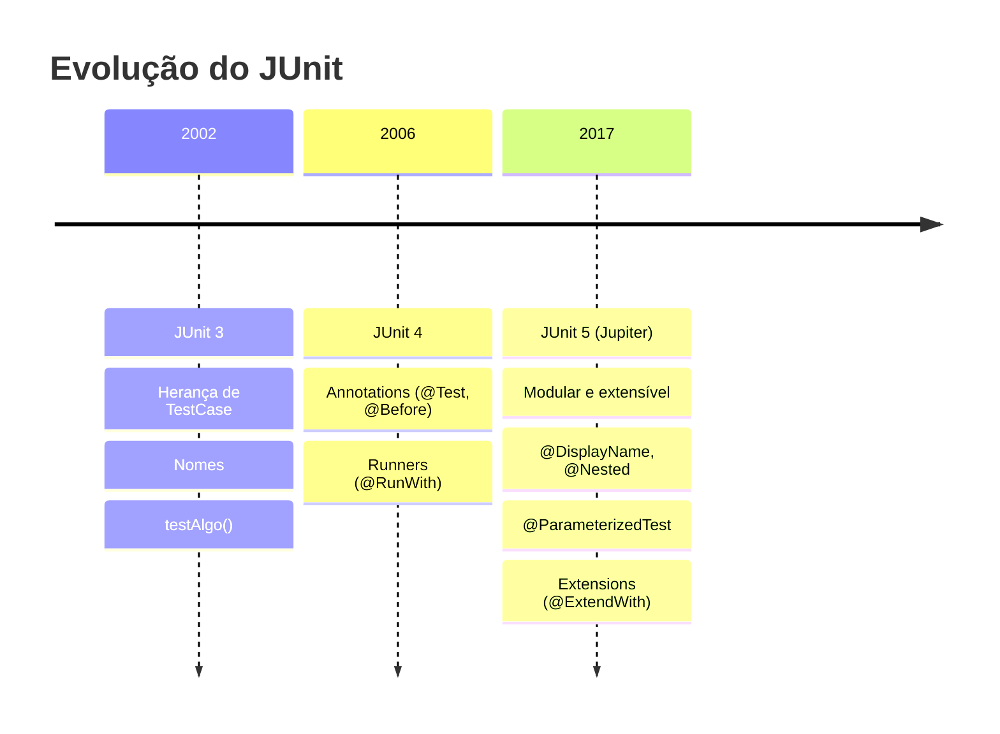
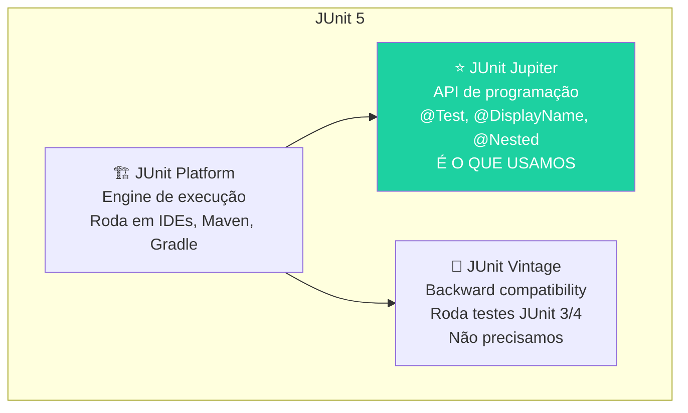
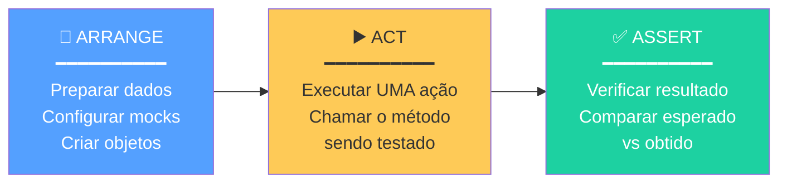
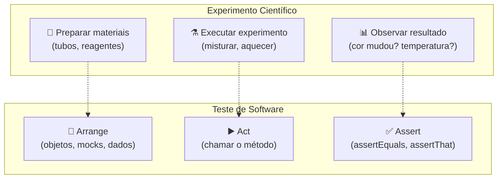
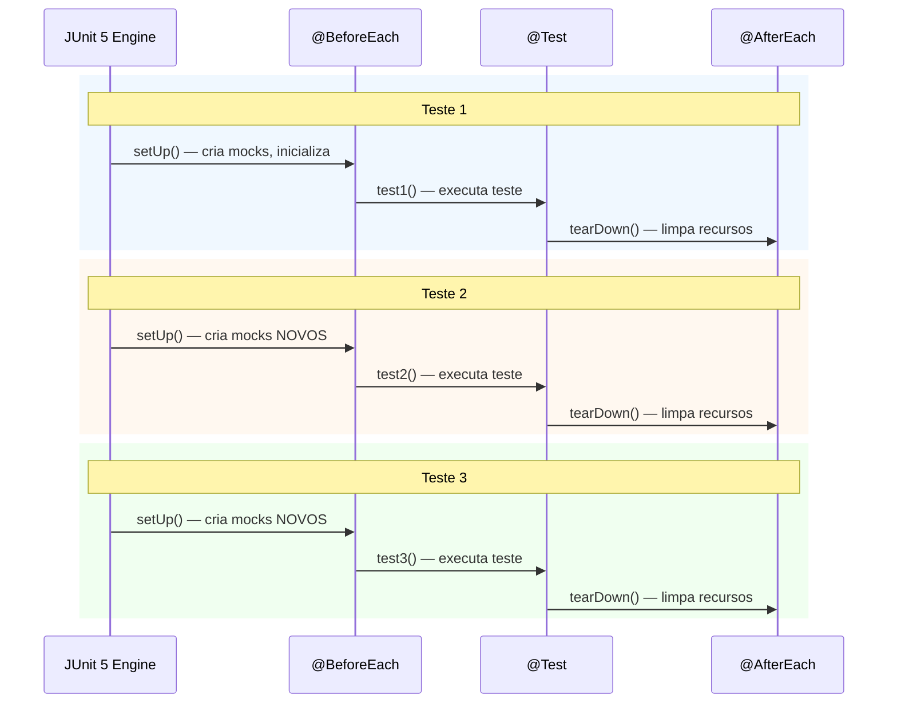
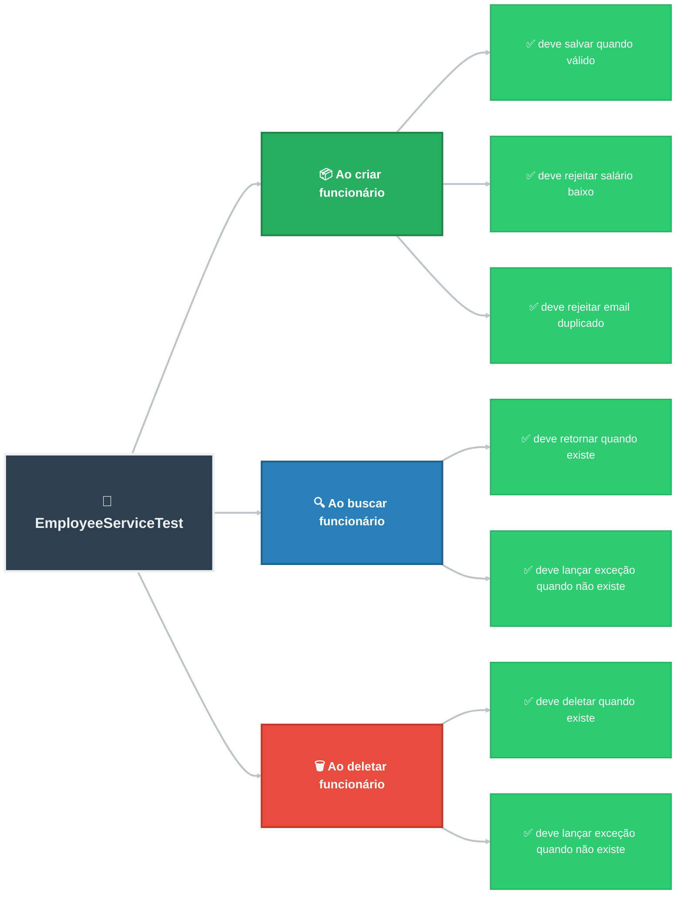
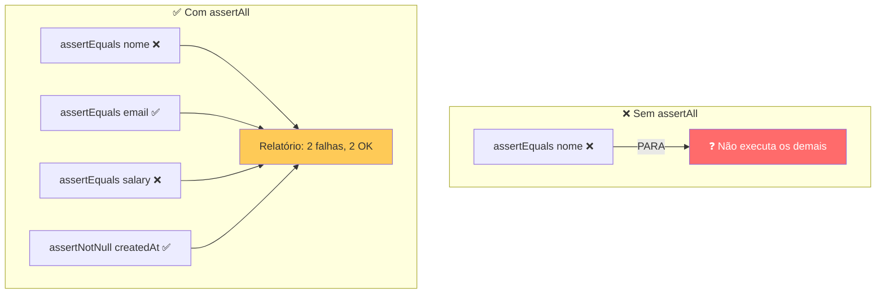
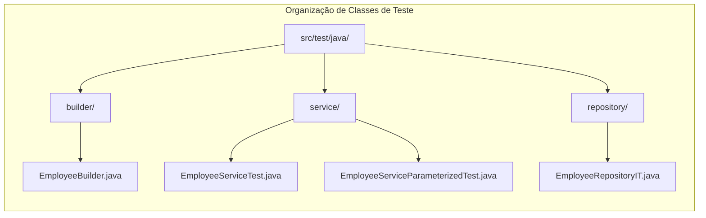
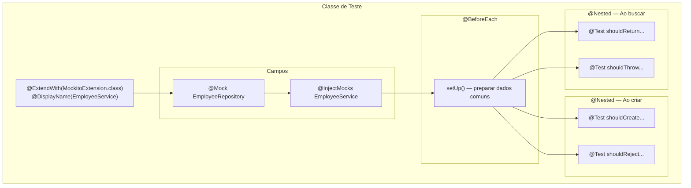

# Slide 3: JUnit 5 — Anatomia de um Teste

**Horário:** 09:45 - 10:15

---

## JUnit 5 — A Plataforma de Testes do Java Moderno

### Evolução do JUnit



### Arquitetura do JUnit 5

JUnit 5 não é um JAR monolítico — é composto por **3 módulos**:



| Módulo | Função | Quando usar |
|--------|--------|-------------|
| **Platform** | Engine de execução (IDE, Maven, Gradle) | Sempre (está por trás) |
| **Jupiter** | API de programação (annotations, assertions) | **Sempre — é o que escrevemos** |
| **Vintage** | Compatibilidade com JUnit 3/4 | Apenas em projetos legados |

> No Spring Boot, basta ter `spring-boot-starter-test` — já inclui JUnit 5 (Jupiter), Mockito e AssertJ. Não precisa adicionar mais nada.

---

## O Padrão AAA — Arrange, Act, Assert

Todo teste bem escrito segue **3 etapas claras e separadas**:



### Exemplo Detalhado

```java
@Test
@DisplayName("Deve calcular desconto de 10% para pedidos acima de R$ 100")
void shouldCalculateDiscountForLargeOrders() {
    // ═══════════════════════════════════════════
    // ✅ ARRANGE — Preparar os dados e o cenário
    // ═══════════════════════════════════════════
    var order = new Order(new BigDecimal("200.00"));
    var calculator = new DiscountCalculator();

    // ═══════════════════════════════════════════
    // ✅ ACT — Executar a ação sendo testada
    // ═══════════════════════════════════════════
    BigDecimal discount = calculator.calculate(order);

    // ═══════════════════════════════════════════
    // ✅ ASSERT — Verificar se o resultado é o esperado
    // ═══════════════════════════════════════════
    assertEquals(new BigDecimal("20.00"), discount);
}
```

### Regras de Ouro do AAA

| Etapa | ✅ O que FAZER | ❌ O que NÃO fazer |
|-------|---------------|-------------------|
| **Arrange** | Criar objetos, configurar mocks, preparar dados | Lógica complexa, loops, condicionais |
| **Act** | **UMA** chamada ao método testado | Múltiplas ações (cada teste testa UMA coisa) |
| **Assert** | Verificar resultado esperado (1-5 asserts) | Mais de 5 asserts (sinal de teste fazendo demais) |

### Analogia: AAA é como um experimento científico



---

## Anotações Essenciais do JUnit 5

### @Test e @DisplayName

```java
@Test   // Marca o método como um teste
@DisplayName("Deve criar funcionário com sucesso quando dados são válidos")
void shouldCreateEmployeeSuccessfully() {
    // teste aqui
}
```

> **@DisplayName** gera relatórios legíveis para humanos.
> - Sem ele: `shouldCreateEmployeeSuccessfully`
> - Com ele: `"Deve criar funcionário com sucesso quando dados são válidos"`
> 
> **Dica**: escreva o @DisplayName **em português** para o relatório ficar legível para o time. O nome do método pode ser em inglês (padrão do mercado).

### @BeforeEach e @AfterEach — Lifecycle do Teste

```java
class EmployeeServiceTest {

    private EmployeeService service;
    private EmployeeRepository repository;

    @BeforeEach
    void setUp() {
        // ✅ Executado ANTES de cada @Test
        // Usado para: criar mocks, inicializar objetos, limpar estado
        repository = mock(EmployeeRepository.class);
        service = new EmployeeService(repository);
    }

    @AfterEach
    void tearDown() {
        // ✅ Executado DEPOIS de cada @Test (cleanup)
        // Usado para: fechar conexões, limpar arquivos temporários
    }

    @Test
    void test1() { /* repository está limpo — mock novo */ }

    @Test
    void test2() { /* repository está limpo — novo mock */ }
}
```

### Ciclo de Vida Visual



> **Importante**: cada teste recebe um **setup novo**. Testes são **isolados** — um não afeta o outro.

### Lifecycles Completos

| Anotação | Quando executa | Quantas vezes | Uso típico |
|----------|---------------|---------------|------------|
| `@BeforeAll` | Antes de **todos** os testes (static) | 1x por classe | Subir container Podman |
| `@BeforeEach` | Antes de **cada** teste | N vezes | Criar mocks, preparar dados |
| `@Test` | O teste em si | 1x cada | O que estamos testando |
| `@AfterEach` | Depois de **cada** teste | N vezes | Limpar estado |
| `@AfterAll` | Depois de **todos** os testes (static) | 1x por classe | Parar container Podman |

---

## @Nested — Agrupando Testes por Funcionalidade

`@Nested` permite organizar testes em **classes internas**, criando uma hierarquia legível.

```java
@DisplayName("EmployeeService")
class EmployeeServiceTest {

    @Nested
    @DisplayName("Ao criar funcionário")
    class CreateEmployee {

        @Test
        @DisplayName("deve salvar quando dados são válidos")
        void shouldSaveWhenDataIsValid() { /* ... */ }

        @Test
        @DisplayName("deve rejeitar quando salário é menor que mínimo")
        void shouldRejectWhenSalaryIsBelowMinimum() { /* ... */ }

        @Test
        @DisplayName("deve rejeitar quando email já existe")
        void shouldRejectWhenEmailAlreadyExists() { /* ... */ }
    }

    @Nested
    @DisplayName("Ao buscar funcionário")
    class FindEmployee {

        @Test
        @DisplayName("deve retornar funcionário quando ID existe")
        void shouldReturnWhenIdExists() { /* ... */ }

        @Test
        @DisplayName("deve lançar exceção quando ID não existe")
        void shouldThrowWhenIdDoesNotExist() { /* ... */ }
    }

    @Nested
    @DisplayName("Ao deletar funcionário")
    class DeleteEmployee {

        @Test
        @DisplayName("deve deletar quando ID existe")
        void shouldDeleteWhenIdExists() { /* ... */ }

        @Test
        @DisplayName("deve lançar exceção quando ID não existe")
        void shouldThrowWhenIdNotFound() { /* ... */ }
    }
}
```

**Saída no IntelliJ / Terminal:**
```
✅ EmployeeService
   ✅ Ao criar funcionário
      ✅ deve salvar quando dados são válidos
      ✅ deve rejeitar quando salário é menor que mínimo
      ✅ deve rejeitar quando email já existe
   ✅ Ao buscar funcionário
      ✅ deve retornar funcionário quando ID existe
      ✅ deve lançar exceção quando ID não existe
   ✅ Ao deletar funcionário
      ✅ deve deletar quando ID existe
      ✅ deve lançar exceção quando ID não existe
```



---

## Assertions — Verificando Resultados

### JUnit 5 Nativo — Assertions Básicas

```java
// Igualdade
assertEquals("João", employee.getName());
assertEquals(new BigDecimal("3000.00"), employee.getSalary());

// Nulidade
assertNotNull(employee.getId());
assertNull(employee.getDeletedAt());

// Booleano
assertTrue(employee.isActive());
assertFalse(employee.isDeleted());

// Exceção — retorna a exceção para inspeção
var exception = assertThrows(EmployeeNotFoundException.class,
    () -> service.findById(999L));
assertEquals("Funcionário não encontrado com ID: 999", exception.getMessage());

// Mensagem customizada (útil quando falha)
assertEquals("João", employee.getName(),
    "Nome do funcionário deveria ser João");
```

### assertAll — Verifica TUDO de uma vez (não para no primeiro erro)

```java
// ❌ SEM assertAll — PARA no primeiro erro
assertEquals("João", response.name());          // se falhar, não chega aqui ↓
assertEquals("joao@email.com", response.email());
assertEquals(new BigDecimal("3000.00"), response.salary());

// ✅ COM assertAll — verifica TODOS e mostra TODOS os erros de uma vez
assertAll(
    () -> assertEquals("João", response.name()),
    () -> assertEquals("joao@email.com", response.email()),
    () -> assertEquals(new BigDecimal("3000.00"), response.salary()),
    () -> assertNotNull(response.createdAt())
);
```



### assertThrows — Testando Exceções

```java
@Test
@DisplayName("Deve lançar exceção quando salário é menor que o mínimo")
void shouldThrowWhenSalaryBelowMinimum() {
    var request = new EmployeeRequest("João", "joao@email.com",
            new BigDecimal("1000.00"), "529.982.247-25", 1L);

    // Captura a exceção E verifica a mensagem
    var exception = assertThrows(SalaryBelowMinimumException.class,
            () -> service.create(request));

    assertEquals("Salário não pode ser menor que R$ 1.412,00", exception.getMessage());
}
```

---

## 📋 Convenções de Nomenclatura

### Nomes de Métodos de Teste

| Padrão | Exemplo | Quando usar |
|--------|---------|-------------|
| `should...When...` | `shouldCreateEmployee_WhenDataIsValid` | Padrão mais comum |
| `should...` | `shouldRejectSalaryBelowMinimum` | Quando o "when" é óbvio |
| `given...When...Then...` | `givenValidData_WhenCreate_ThenReturnEmployee` | BDD style |

> **Escolha UM padrão** e mantenha consistência no projeto inteiro.

### Nomes de Classes de Teste

| Tipo de Teste | Padrão de Nome | Exemplo |
|---------------|----------------|---------|
| Unitário | `{Classe}Test` | `EmployeeServiceTest` |
| Integração | `{Classe}IT` | `EmployeeRepositoryIT` |
| Parametrizado | `{Classe}ParameterizedTest` | `CpfValidatorParameterizedTest` |



---

## 🧠 Resumo Visual — Anatomia de um Teste



---

## 💡 Dica do Instrutor

> Escreva o `@DisplayName` **em português** para o relatório ficar legível para o time. O nome do método pode ser em inglês (padrão do mercado), mas o display name é para **humanos lerem**.

```java
@Test
@DisplayName("Deve lançar exceção quando CPF é inválido")
void shouldThrowWhenCpfIsInvalid() { /* ... */ }
```

> **Demonstração sugerida**: escreva um teste simples ao vivo, mostrando as 3 etapas (AAA) claramente separadas. Rode no IntelliJ e mostre o output verde com @DisplayName.
