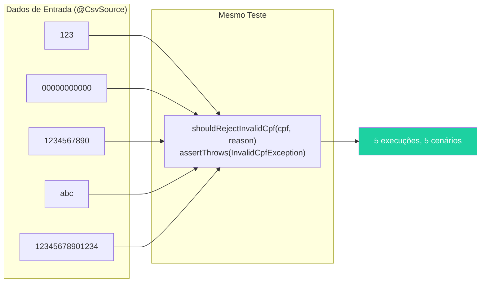
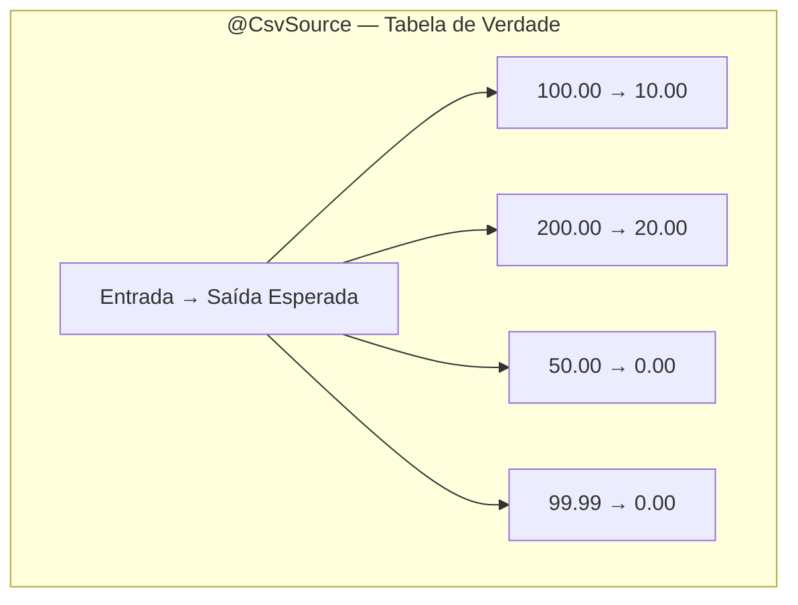
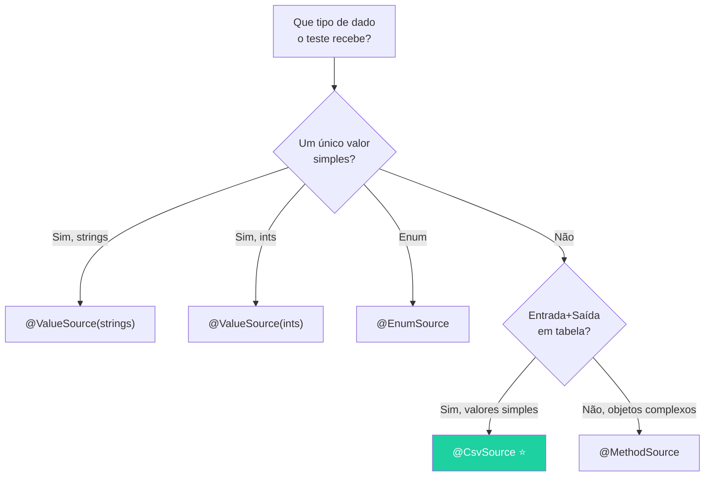
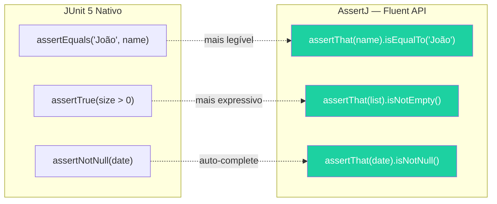
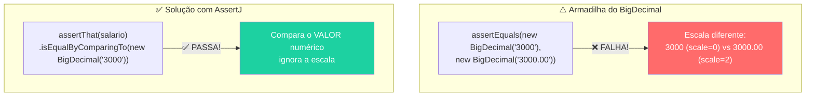
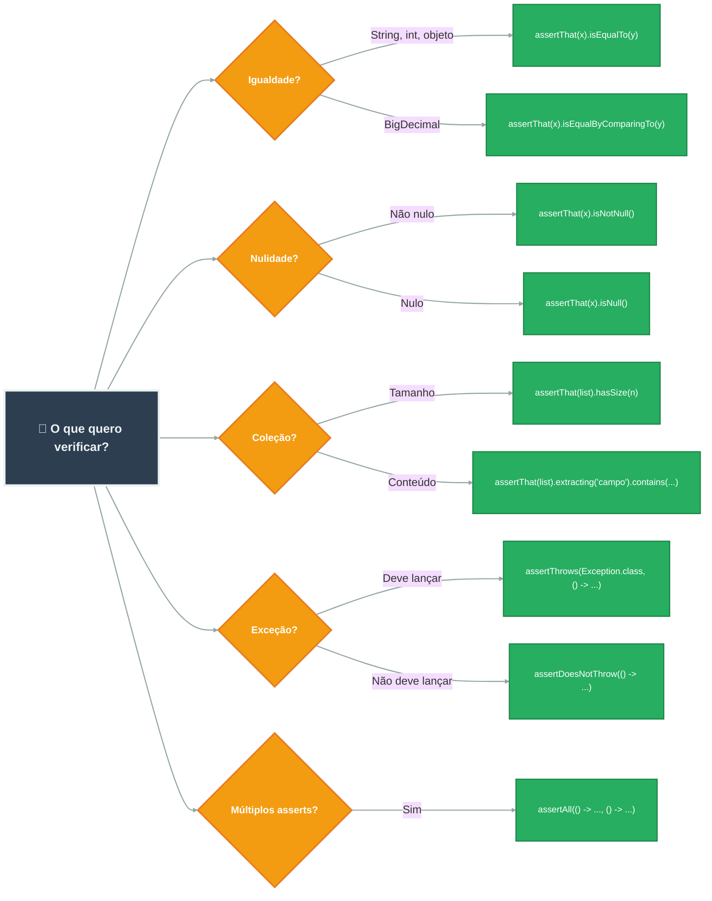

# Slide 4: JUnit 5 — @ParameterizedTest e Assertions Avançadas

**Horário:** 10:15 - 10:45

---

## @ParameterizedTest — Testando Múltiplos Cenários com Um Único Teste

### O Problema: Código Repetido

Quando precisamos testar múltiplos cenários com a mesma estrutura, acabamos com testes quase idênticos:

```java
// ❌ 4 testes quase idênticos — violação DRY!
@Test
void shouldRejectCpf123() {
    assertThrows(InvalidCpfException.class, () -> validator.validate("123"));
}

@Test
void shouldRejectCpfAllZeros() {
    assertThrows(InvalidCpfException.class, () -> validator.validate("00000000000"));
}

@Test
void shouldRejectCpfShort() {
    assertThrows(InvalidCpfException.class, () -> validator.validate("1234567890"));
}

@Test
void shouldRejectCpfLetters() {
    assertThrows(InvalidCpfException.class, () -> validator.validate("abc"));
}
```

**Problemas**: 4 testes com a mesma lógica; se o construtor mudar, precisa alterar todos.

### A Solução: @ParameterizedTest + @CsvSource

```java
// ✅ UM teste, MÚLTIPLOS cenários — DRY!
@ParameterizedTest
@CsvSource({
    "123,             CPF muito curto",
    "00000000000,     CPF com todos dígitos iguais",
    "1234567890,      CPF com 10 dígitos",
    "abc,             CPF com letras",
    "12345678901234,  CPF com mais de 11 dígitos"
})
@DisplayName("Deve rejeitar CPF inválido")
void shouldRejectInvalidCpf(String cpf, String reason) {
    assertThrows(InvalidCpfException.class,
            () -> validator.validate(cpf),
            "Deveria rejeitar: " + reason);
}
```



**Saída no IntelliJ:**
```
✅ Deve rejeitar CPF inválido
   ✅ [1] 123, CPF muito curto
   ✅ [2] 00000000000, CPF com todos dígitos iguais
   ✅ [3] 1234567890, CPF com 10 dígitos
   ✅ [4] abc, CPF com letras
   ✅ [5] 12345678901234, CPF com mais de 11 dígitos
```

---

## Fontes de Dados para @ParameterizedTest

### 1️⃣ @CsvSource — Tabela inline (mais usada)

Ideal para testes com **entrada e saída esperada** — como uma tabela de verdade.

```java
@ParameterizedTest
@CsvSource({
    "100.00, 10.00",    // 10% de desconto
    "200.00, 20.00",
    "50.00, 0.00",      // sem desconto abaixo de 100
    "99.99, 0.00"
})
@DisplayName("Deve calcular desconto corretamente")
void shouldCalculateDiscount(String orderValue, String expectedDiscount) {
    BigDecimal result = calculator.calculate(new BigDecimal(orderValue));
    assertEquals(new BigDecimal(expectedDiscount), result);
}
```



### 2️⃣ @ValueSource — Lista simples de valores

Ideal quando o teste recebe **um único parâmetro** e a asserção é a mesma.

```java
@ParameterizedTest
@ValueSource(strings = {"", " ", "  ", "\t", "\n"})
@DisplayName("Deve rejeitar nome em branco ou com espaços")
void shouldRejectBlankName(String name) {
    var request = new EmployeeRequest(name, "email@test.com",
            new BigDecimal("3000.00"), "529.982.247-25", 1L);

    assertThrows(ConstraintViolationException.class,
            () -> service.create(request));
}
```

### 3️⃣ @EnumSource — Todos os valores de um Enum

Testa automaticamente **todos** os valores do enum sem listar um por um.

```java
@ParameterizedTest
@EnumSource(OrderStatus.class)     // PENDING, PROCESSING, COMPLETED, CANCELLED
@DisplayName("Deve aceitar todos os status válidos")
void shouldAcceptAllOrderStatuses(OrderStatus status) {
    var order = new Order();
    order.setStatus(status);
    assertDoesNotThrow(() -> validator.validate(order));
}
```

### 4️⃣ @MethodSource — Dados complexos (objetos, múltiplos parâmetros)

Quando os dados são objetos complexos que não cabem em uma string CSV.

```java
@ParameterizedTest
@MethodSource("invalidEmployeeRequests")
@DisplayName("Deve rejeitar requests inválidos")
void shouldRejectInvalidRequests(EmployeeRequest request, String expectedError) {
    var exception = assertThrows(ValidationException.class,
            () -> service.create(request));
    assertThat(exception.getMessage()).contains(expectedError);
}

// Método estático que fornece os dados
static Stream<Arguments> invalidEmployeeRequests() {
    return Stream.of(
        Arguments.of(
            new EmployeeRequest("", "email@test.com", new BigDecimal("3000"), "529.982.247-25", 1L),
            "nome"
        ),
        Arguments.of(
            new EmployeeRequest("João", "invalido", new BigDecimal("3000"), "529.982.247-25", 1L),
            "email"
        ),
        Arguments.of(
            new EmployeeRequest("João", "email@test.com", new BigDecimal("-1"), "529.982.247-25", 1L),
            "salário"
        )
    );
}
```

### Comparação das Fontes — Quando Usar Cada Uma



| Fonte | Quando usar | Complexidade | Exemplo |
|-------|-------------|--------------|---------|
| `@CsvSource` | Valores simples em tabela (entrada/saída) | ⭐ Simples | CPFs inválidos, cálculos |
| `@ValueSource` | Lista de **um único tipo** | ⭐ Simples | Nomes em branco |
| `@EnumSource` | Todos os valores de um enum | ⭐ Simples | Status de pedido |
| `@MethodSource` | Objetos complexos, múltiplos parâmetros | ⭐⭐ Médio | DTOs inválidos |
| `@CsvFileSource` | Dados em arquivo CSV externo (muitos) | ⭐⭐ Médio | Massa de dados grande |

---

## AssertJ — Assertions Fluentes e Legíveis

### Por que AssertJ em vez de JUnit Assertions?



| JUnit 5 Nativo | AssertJ | Vantagem |
|----------------|---------|----------|
| `assertEquals("João", name)` | `assertThat(name).isEqualTo("João")` | Lê como frase: "asserte que nome é igual a João" |
| `assertTrue(employees.size() > 0)` | `assertThat(employees).isNotEmpty()` | Mais expressivo e semântico |
| `assertNotNull(createdAt)` | `assertThat(createdAt).isNotNull()` | IDE auto-complete mostra todos os métodos |

### Assertions com Coleções

```java
List<Employee> employees = service.findAll();

// Tamanho
assertThat(employees).hasSize(3);
assertThat(employees).isEmpty();
assertThat(employees).isNotEmpty();

// Conteúdo — extrair propriedades específicas
assertThat(employees)
    .extracting("name")
    .containsExactly("Ana", "Carlos", "João");   // ordem importa

assertThat(employees)
    .extracting("name")
    .containsExactlyInAnyOrder("João", "Ana", "Carlos");   // ordem não importa

// Filtrar e verificar
assertThat(employees)
    .filteredOn(e -> e.getSalary().compareTo(new BigDecimal("5000")) > 0)
    .hasSize(1)
    .extracting("name")
    .contains("Carlos");
```

### Assertions com Exceções

```java
// Verificar tipo, mensagem e campos
assertThatThrownBy(() -> service.findById(999L))
    .isInstanceOf(EmployeeNotFoundException.class)
    .hasMessage("Funcionário não encontrado com ID: 999")
    .hasFieldOrPropertyWithValue("id", 999L);

// Verificar que NÃO lança exceção
assertThatCode(() -> service.create(validRequest))
    .doesNotThrowAnyException();
```

### Assertions com Strings

```java
assertThat(response.getMessage())
    .startsWith("Funcionário")
    .contains("criado")
    .endsWith("sucesso")
    .doesNotContain("erro");
```

### Assertions com BigDecimal ⚠️

```java
// ⚠️ CUIDADO! assertEqual falha com BigDecimal de escalas diferentes
// new BigDecimal("3000") != new BigDecimal("3000.00") com assertEquals!

// ✅ AssertJ — comparação numérica (ignora escala)
assertThat(salary).isEqualByComparingTo(new BigDecimal("3000"));

// Comparações
assertThat(salary).isGreaterThan(BigDecimal.ZERO);
assertThat(salary).isGreaterThanOrEqualTo(new BigDecimal("1412.00"));
assertThat(salary).isBetween(
    new BigDecimal("1412.00"),
    new BigDecimal("50000.00")
);
```



---

## 🧠 Exercício Mental Rápido

Qual fonte de dados você usaria para cada cenário?

| Cenário | Resposta | Por quê |
|---------|----------|---------|
| Testar 5 CPFs inválidos | `@CsvSource` ou `@ValueSource` | Valores simples, mesmo assert |
| Testar cálculo de desconto com entrada/saída | `@CsvSource` | Tabela entrada → saída |
| Testar todos os tipos de pagamento (Enum) | `@EnumSource` | Cobertura automática do enum |
| Testar múltiplos DTOs inválidos | `@MethodSource` | Objetos complexos como parâmetro |
| Testar validação de email com 10 formatos | `@CsvSource` | Strings simples em tabela |

---

## 📊 Mapa de Decisão — Qual Assertion Usar?



---

## 💡 Dica do Instrutor

> Use `@ParameterizedTest` sempre que tiver **3+ cenários** com a **mesma estrutura** de teste. Se cada cenário precisa de um arrange/assert diferente, use `@Test` separado.

> **Demonstração sugerida**: Escreva primeiro 3 testes separados para CPF inválido, depois refatore para `@ParameterizedTest` ao vivo, mostrando a eliminação da repetição.
