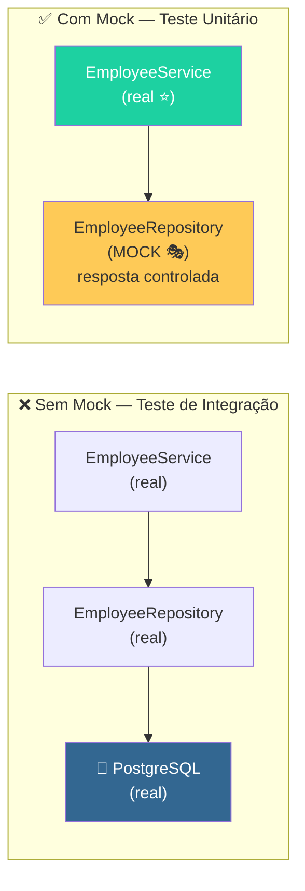
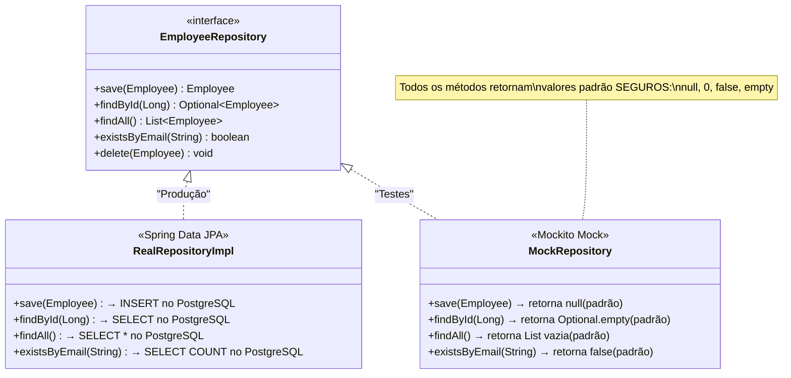
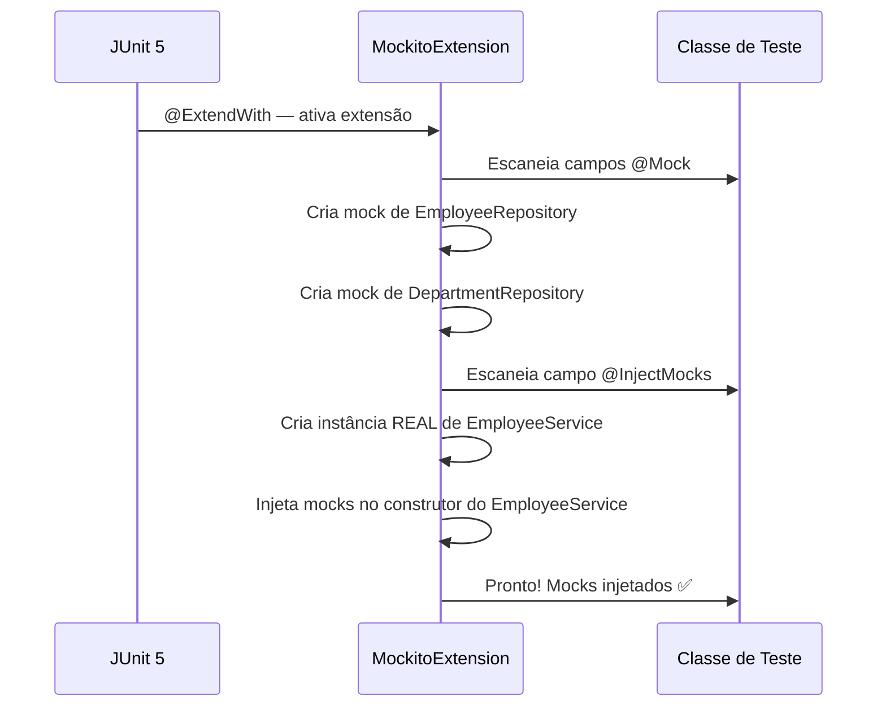
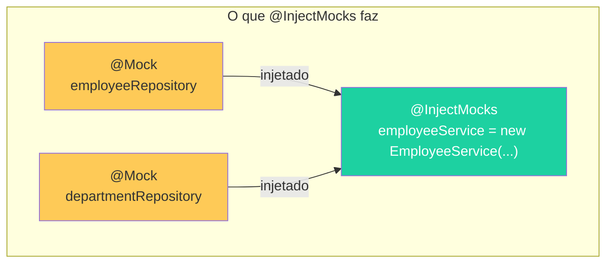
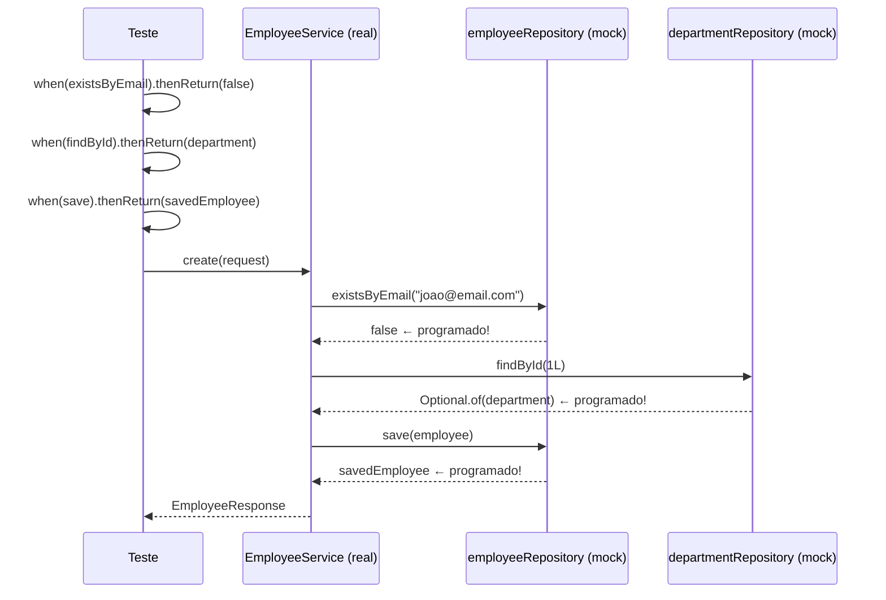
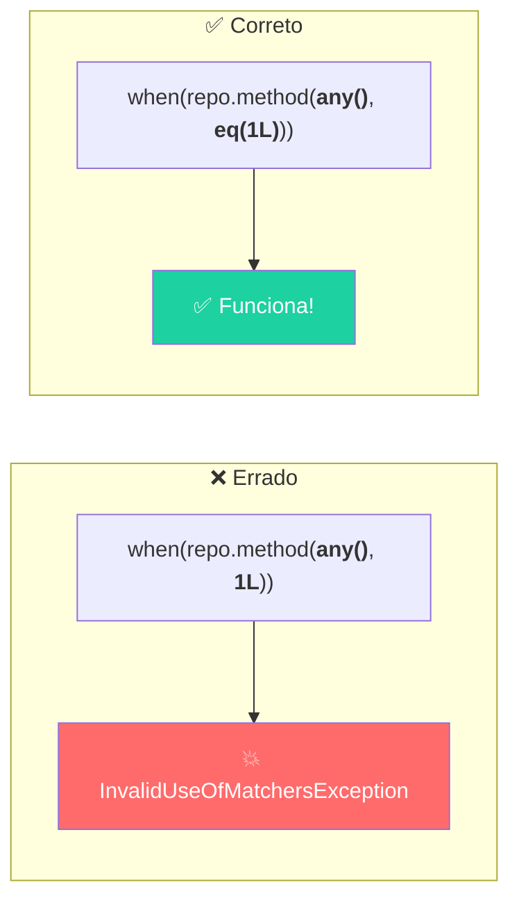
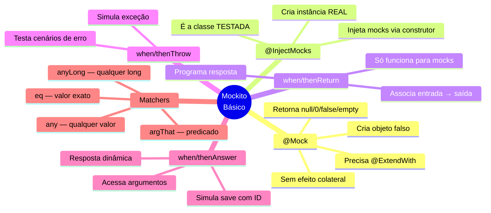

# Slide 5: Mockito — @Mock, @InjectMocks, when/thenReturn

**Horário:** 11:00 - 11:30

---

## Por que Mockito? — O Problema das Dependências

### O problema: "Teste unitário" com dependências reais

```java
// ❌ Teste "unitário" que depende do banco de dados
class EmployeeServiceTest {

    @Test
    void shouldCreateEmployee() {
        // 💥 Precisa de banco rodando, dados limpos, connection pool...
        var repository = new EmployeeRepository(dataSource);
        var service = new EmployeeService(repository);

        service.create(request); // 💥 Salva no banco de verdade! Lento!
    }
}
```

**Problemas deste approach:**
- 🐌 Lento (precisa do banco)
- 💥 Frágil (depende de dados existentes)
- 🔗 Acoplado (se o banco cai, o teste falha)
- 🧹 Hard to clean (dados sujos entre testes)

### A solução: substituir dependências por Mocks

```java
// ✅ Teste unitário ISOLADO — sem banco, sem rede, sem Docker
@ExtendWith(MockitoExtension.class)
class EmployeeServiceTest {

    @Mock
    private EmployeeRepository repository;  // 🎭 FALSO — simulação do banco

    @InjectMocks
    private EmployeeService service;  // ⭐ REAL — classe sendo testada

    @Test
    void shouldCreateEmployee() {
        when(repository.save(any())).thenReturn(savedEmployee);

        service.create(request); // ⚡ Rápido, isolado, controlado
    }
}
```



---

## O que é um Mock?

Um **mock** é um **objeto falso** que simula o comportamento de uma dependência real.



### Comportamento padrão do Mock

| Tipo de retorno | Valor padrão do Mock |
|-----------------|---------------------|
| `Object` | `null` |
| `int`, `long` | `0` |
| `boolean` | `false` |
| `Optional<T>` | `Optional.empty()` |
| `List<T>` | `[]` (lista vazia) |
| `void` | Nada (não faz nada) |

> O mock **não faz nada** a menos que você o **programe** com `when(...).thenReturn(...)`.

---

## Configuração do Mockito

### Forma 1: @ExtendWith — Recomendada ⭐

```java
@ExtendWith(MockitoExtension.class)  // ← Habilita Mockito nesta classe
class EmployeeServiceTest {

    @Mock
    private EmployeeRepository employeeRepository;    // mock da dependência 1

    @Mock
    private DepartmentRepository departmentRepository; // mock da dependência 2

    @InjectMocks
    private EmployeeService employeeService;  // classe real — recebe os mocks
}
```

### Forma 2: Manual — Para entender o que acontece por baixo

```java
class EmployeeServiceTest {

    private EmployeeRepository employeeRepository;
    private EmployeeService employeeService;

    @BeforeEach
    void setUp() {
        employeeRepository = mock(EmployeeRepository.class);       // cria mock manualmente
        employeeService = new EmployeeService(employeeRepository); // injeta manualmente
    }
}
```

> **@ExtendWith(MockitoExtension.class)** faz automaticamente o que a Forma 2 faz manualmente. Use sempre a Forma 1.

### Fluxo de criação dos Mocks



---

## @Mock — Criando Dependências Falsas

```java
@Mock
private EmployeeRepository employeeRepository;
```

O mock é uma **implementação vazia** da interface:
- ✅ Todos os métodos existem (mesma assinatura)
- ❌ Nenhum efeito colateral (não salva no banco, não envia email)
- 🎯 Você **programa** o comportamento com `when(...).thenReturn(...)`

---

## @InjectMocks — Injetando Mocks na Classe Real

```java
@InjectMocks
private EmployeeService employeeService;
```

O Mockito **cria uma instância REAL** de `EmployeeService` e injeta todos os `@Mock`:

```java
// Equivalente a fazer manualmente:
employeeService = new EmployeeService(
    employeeRepository,          // @Mock
    departmentRepository         // @Mock
);
```



> **@Mock** = cria o falso. **@InjectMocks** = injeta os falsos no objeto real.

---

## when(...).thenReturn(...) — Programando Respostas

### Cenário 1: Retornar um valor específico

```java
@Test
@DisplayName("Deve criar funcionário com sucesso")
void shouldCreateEmployeeSuccessfully() {
    // Arrange
    var request = new EmployeeRequest("João", "joao@email.com",
            new BigDecimal("3000.00"), "529.982.247-25", 1L);
    var department = new Department(1L, "Tecnologia");
    var savedEmployee = EmployeeBuilder.anEmployee().build();

    // ═══ Programar respostas dos mocks ═══
    when(employeeRepository.existsByEmail("joao@email.com")).thenReturn(false);
    when(departmentRepository.findById(1L)).thenReturn(Optional.of(department));
    when(employeeRepository.save(any(Employee.class))).thenReturn(savedEmployee);

    // Act
    var response = employeeService.create(request);

    // Assert
    assertThat(response.name()).isEqualTo("João");
}
```



### Cenário 2: Lançar uma exceção

```java
@Test
@DisplayName("Deve lançar exceção quando departamento não existe")
void shouldThrowWhenDepartmentNotFound() {
    var request = new EmployeeRequest("João", "joao@email.com",
            new BigDecimal("3000.00"), "529.982.247-25", 999L);

    // Mock retorna empty = departamento não existe
    when(departmentRepository.findById(999L)).thenReturn(Optional.empty());

    assertThrows(DepartmentNotFoundException.class,
            () -> employeeService.create(request));
}
```

### Cenário 3: Retornar o argumento recebido (thenAnswer)

```java
// Retorna o mesmo objeto que foi passado ao save()
// Útil para simular o comportamento de save() que retorna o entity salvo
when(employeeRepository.save(any(Employee.class)))
    .thenAnswer(invocation -> {
        Employee e = invocation.getArgument(0);
        e.setId(1L);  // simular geração de ID
        return e;
    });
```

---

## Matchers — Flexibilizando Argumentos

Matchers permitem definir **quais argumentos** devem acionar o mock.

```java
// Valor exato — só funciona para findById(1L)
when(repository.findById(1L)).thenReturn(Optional.of(employee));

// Qualquer valor long — funciona para findById(qualquer_numero)
when(repository.findById(anyLong())).thenReturn(Optional.of(employee));

// Qualquer objeto do tipo Employee
when(repository.save(any(Employee.class))).thenReturn(employee);

// Qualquer string
when(repository.existsByEmail(anyString())).thenReturn(false);

// String exata com eq() — necessário quando mistura com matchers
when(repository.findByEmail(eq("joao@email.com"))).thenReturn(Optional.of(employee));
```

### Tabela de Matchers Comuns

| Matcher | O que aceita | Exemplo |
|---------|-------------|---------|
| `any()` | Qualquer valor (incluindo null) | `any()` |
| `any(Class.class)` | Qualquer objeto do tipo | `any(Employee.class)` |
| `anyLong()` | Qualquer `long` | `anyLong()` |
| `anyString()` | Qualquer `String` (não null) | `anyString()` |
| `anyList()` | Qualquer `List` | `anyList()` |
| `eq(value)` | Valor exato (usar quando mistura matchers) | `eq(1L)` |
| `argThat(predicate)` | Argumento que satisfaz um predicado | `argThat(e -> e.getName().equals("João"))` |

### ⚠️ Regra Importante: Matchers são "tudo ou nada"

```java
// ❌ ERRO: mistura matcher (any) com valor literal (1L)
when(repo.method(any(), 1L)).thenReturn(result);

// ✅ CORRETO: matcher em TODOS os argumentos
when(repo.method(any(), eq(1L))).thenReturn(result);
```



---

## 📝 Exemplo Completo — Teste Unitário com Mockito

```java
@ExtendWith(MockitoExtension.class)
class EmployeeServiceTest {

    @Mock
    private EmployeeRepository employeeRepository;

    @Mock
    private DepartmentRepository departmentRepository;

    @InjectMocks
    private EmployeeService employeeService;

    @Test
    @DisplayName("Deve criar funcionário com sucesso quando dados são válidos")
    void shouldCreateEmployeeSuccessfully() {
        // ═══ ARRANGE ═══
        var department = new Department(1L, "Tecnologia");
        var request = new EmployeeRequest("João Silva", "joao@email.com",
                new BigDecimal("3000.00"), "529.982.247-25", 1L);
        var savedEmployee = EmployeeBuilder.anEmployee()
                .withName("João Silva")
                .withEmail("joao@email.com")
                .withDepartment(department)
                .build();

        when(employeeRepository.existsByEmail("joao@email.com")).thenReturn(false);
        when(departmentRepository.findById(1L)).thenReturn(Optional.of(department));
        when(employeeRepository.save(any(Employee.class))).thenReturn(savedEmployee);

        // ═══ ACT ═══
        EmployeeResponse response = employeeService.create(request);

        // ═══ ASSERT ═══
        assertAll(
            () -> assertThat(response.name()).isEqualTo("João Silva"),
            () -> assertThat(response.email()).isEqualTo("joao@email.com"),
            () -> assertThat(response.departmentName()).isEqualTo("Tecnologia")
        );
    }
}
```

---

## 🧠 Mapa Mental — Mockito Básico



---

## ⚠️ Erros Comuns dos Alunos

| Erro | Sintoma | Solução |
|------|---------|---------|
| Esquecer `@ExtendWith(MockitoExtension.class)` | `@Mock` não funciona, NPE | Adicionar na classe |
| Misturar matchers com valores | `InvalidUseOfMatchersException` | Usar `eq()` em todos |
| Programar mock que não é chamado | Teste passa por acaso | Verificar com `verify()` |
| Confundir `@Mock` com `@InjectMocks` | NPE ou mock no lugar errado | `@Mock` = dependência, `@InjectMocks` = testado |
| Não programar retorno do mock | Método retorna null, teste falha com NPE | Adicionar `when().thenReturn()` |

---

## 💡 Dica do Instrutor

> Mostre no IntelliJ: `@Mock` tem **underline** (warning) se não tiver `@ExtendWith(MockitoExtension.class)`. É o erro #1 dos alunos.

> **Demonstração sugerida**: 
> 1. Escreva um teste SEM `@ExtendWith` → mostra o NPE
> 2. Adicione `@ExtendWith` → funciona
> 3. Explique: "O Mockito precisa ser ativado — sem @ExtendWith, os @Mock são null"
