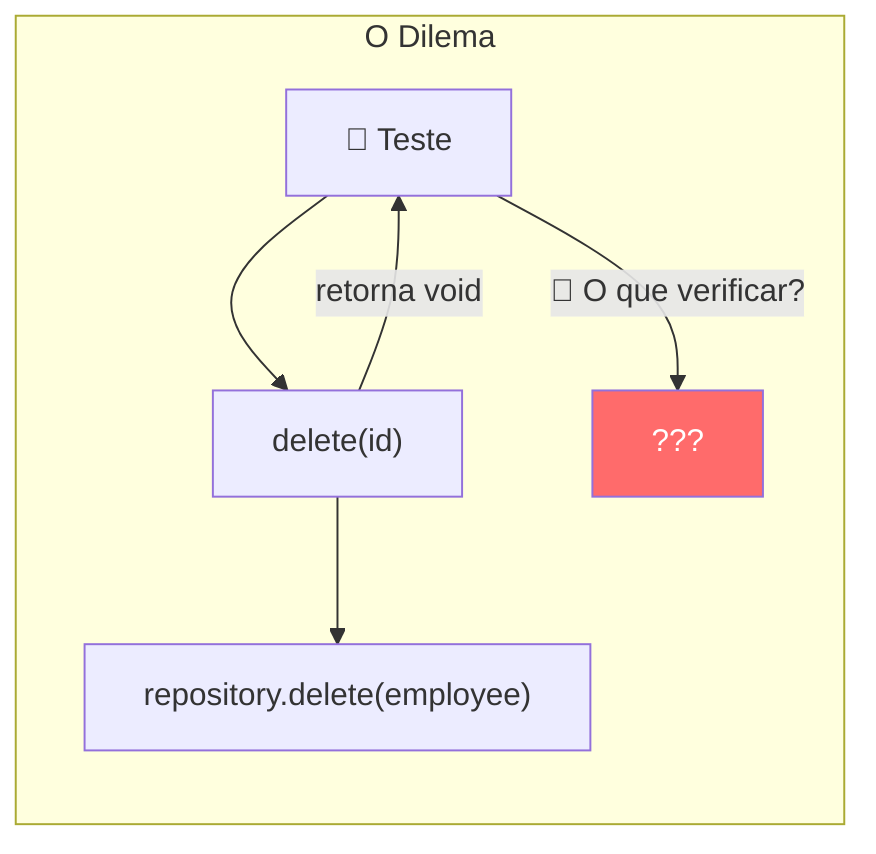
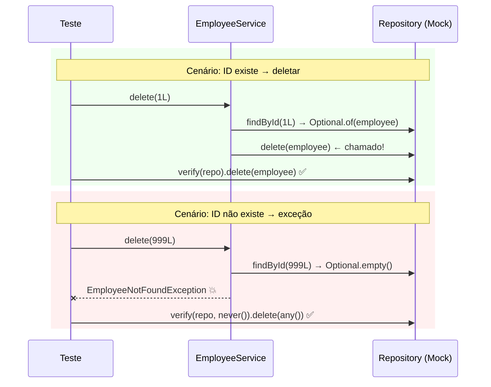
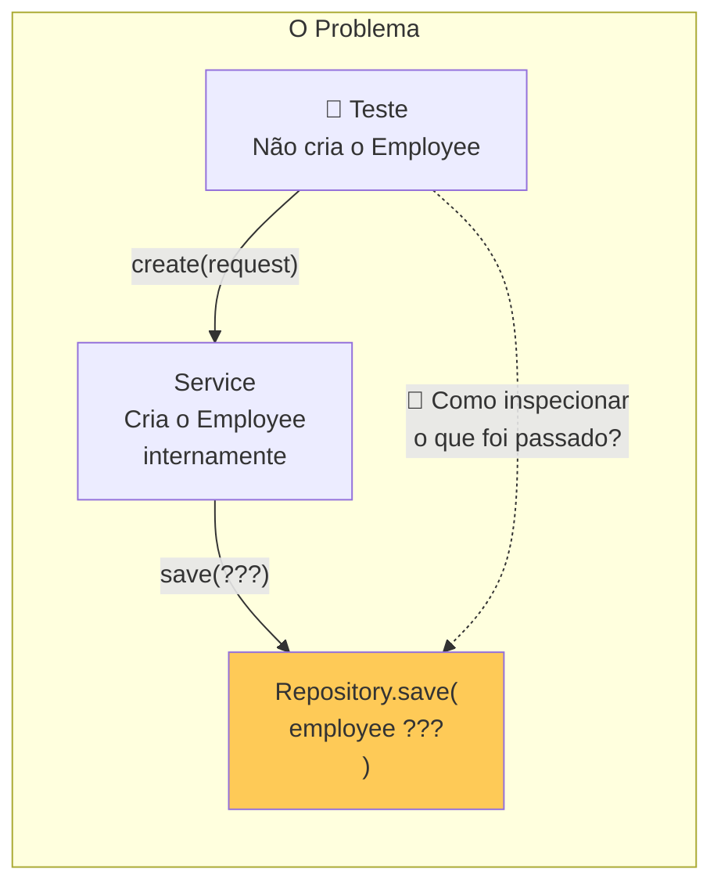
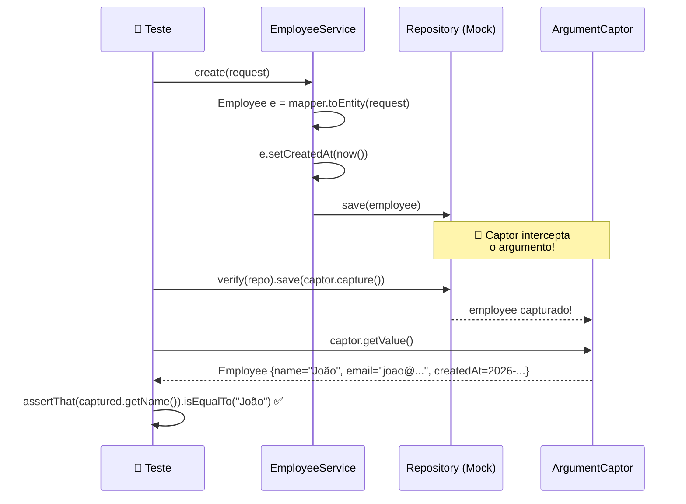
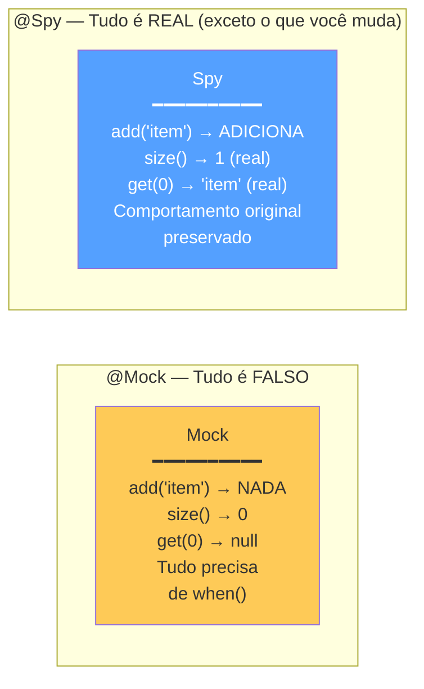
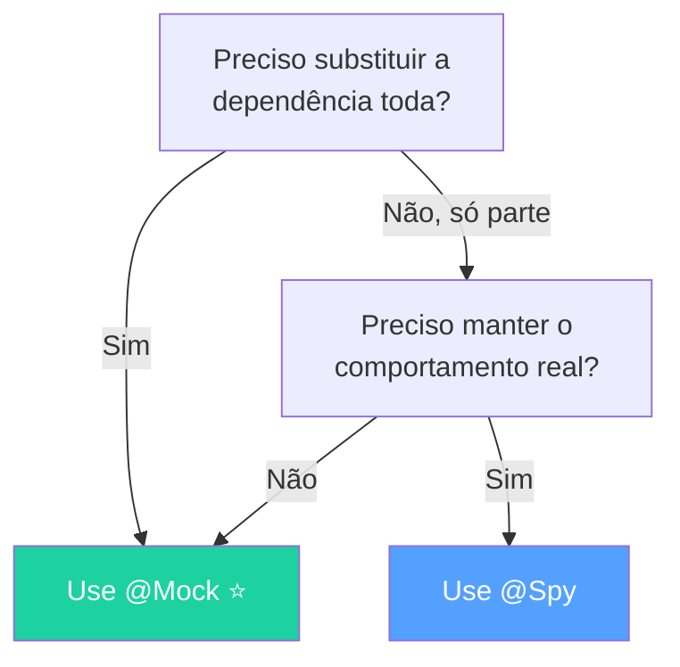
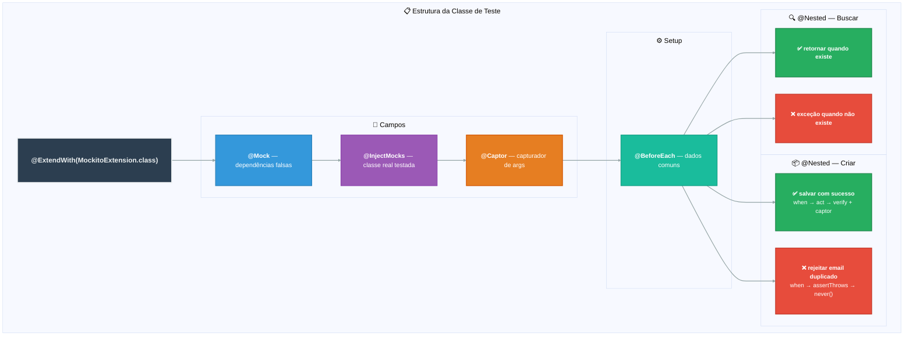
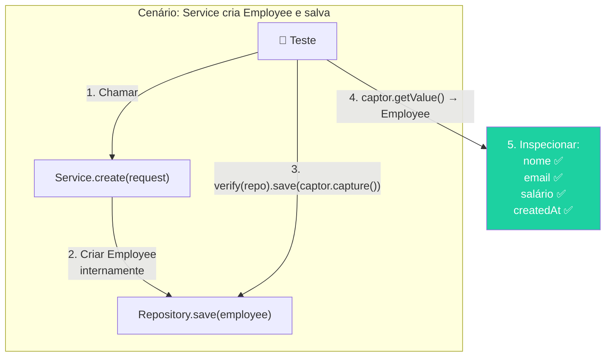

# Slide 6: Mockito — ArgumentCaptor, verify e @Spy

**Horário:** 11:30 - 12:00

---

## verify() — Confirmando que um Método foi Chamado

### O Problema: Métodos que retornam void

Às vezes o método testado **não retorna nada** — como verificar que funcionou?

```java
// O método delete() retorna void — não tem retorno para verificar!
public void delete(Long id) {
    Employee employee = repository.findById(id)
            .orElseThrow(() -> new EmployeeNotFoundException(id));
    repository.delete(employee);  // ← como saber se foi chamado?
}
```



### A Solução: verify()

`verify()` confirma que um método do mock **foi chamado** (ou **não foi chamado**).

```java
@Test
@DisplayName("Deve deletar funcionário quando ID existe")
void shouldDeleteEmployeeWhenExists() {
    // Arrange
    var employee = EmployeeBuilder.anEmployee().withId(1L).build();
    when(employeeRepository.findById(1L)).thenReturn(Optional.of(employee));

    // Act
    employeeService.delete(1L);

    // Assert — verificar que os métodos foram chamados
    verify(employeeRepository).findById(1L);        // ✅ foi chamado
    verify(employeeRepository).delete(employee);     // ✅ foi chamado
}

@Test
@DisplayName("Não deve chamar delete quando ID não existe")
void shouldNotDeleteWhenNotExists() {
    when(employeeRepository.findById(999L)).thenReturn(Optional.empty());

    assertThrows(EmployeeNotFoundException.class,
            () -> employeeService.delete(999L));

    // ✅ Verificar que delete NUNCA foi chamado (teste negativo)
    verify(employeeRepository, never()).delete(any());
}
```



### Modos de Verificação — Tabela Completa

```java
// 1️⃣ Foi chamado exatamente 1 vez (padrão)
verify(repository).save(any());

// 2️⃣ Foi chamado exatamente N vezes
verify(repository, times(2)).save(any());

// 3️⃣ Nunca foi chamado
verify(repository, never()).delete(any());

// 4️⃣ Foi chamado pelo menos 1 vez
verify(repository, atLeastOnce()).findById(anyLong());

// 5️⃣ Foi chamado no máximo N vezes
verify(repository, atMost(3)).findAll();

// 6️⃣ Nenhuma outra interação além das verificadas
verifyNoMoreInteractions(repository);
```

| Modo | Significado | Quando usar |
|------|-------------|-------------|
| `verify(mock)` | Chamado exatamente 1x | Padrão para maioria dos casos |
| `verify(mock, times(n))` | Chamado exatamente N vezes | Batch processing, loops |
| `verify(mock, never())` | NUNCA chamado | Cenários de erro — "não tentou salvar" |
| `verify(mock, atLeastOnce())` | Chamado 1 ou mais vezes | Quando só importa que foi chamado |
| `verify(mock, atMost(n))` | Chamado no máximo N vezes | Rate limiting, caching |
| `verifyNoMoreInteractions(mock)` | Sem interações extras | Quando quer garantir que só chamou o esperado |

---

## ArgumentCaptor — Capturando Argumentos Passados ao Mock

### O Problema: O que o Service passou ao Repository?

Quando o Service **cria um objeto internamente** e passa ao Repository, como verificar o que foi criado?

```java
public EmployeeResponse create(EmployeeRequest request) {
    // O Service CRIA o Employee internamente — o teste não tem acesso!
    Employee employee = EmployeeMapper.toEntity(request, department);
    employee.setCreatedAt(LocalDateTime.now());

    // E SALVA — como verificar o que foi passado aqui?  🤔
    Employee saved = repository.save(employee);

    return EmployeeMapper.toResponse(saved);
}
```



### A Solução: ArgumentCaptor

O `ArgumentCaptor` **intercepta** o argumento passado ao mock e permite inspecioná-lo.

```java
@Test
@DisplayName("Deve salvar funcionário com timestamps e departamento corretos")
void shouldSaveEmployeeWithCorrectData() {
    // Arrange
    var department = new Department(1L, "Tecnologia");
    var request = new EmployeeRequest("João Silva", "joao@email.com",
            new BigDecimal("3000.00"), "529.982.247-25", 1L);

    when(employeeRepository.existsByEmail(anyString())).thenReturn(false);
    when(departmentRepository.findById(1L)).thenReturn(Optional.of(department));
    when(employeeRepository.save(any())).thenAnswer(inv -> {
        Employee e = inv.getArgument(0);
        e.setId(1L);
        return e;
    });

    // Act
    employeeService.create(request);

    // Assert — CAPTURAR o que foi passado ao save()
    ArgumentCaptor<Employee> captor = ArgumentCaptor.forClass(Employee.class);
    verify(employeeRepository).save(captor.capture());  // ← captura!

    Employee captured = captor.getValue();  // ← inspeciona!
    assertAll(
        () -> assertThat(captured.getName()).isEqualTo("João Silva"),
        () -> assertThat(captured.getEmail()).isEqualTo("joao@email.com"),
        () -> assertThat(captured.getSalary()).isEqualByComparingTo(new BigDecimal("3000.00")),
        () -> assertThat(captured.getDepartment().getName()).isEqualTo("Tecnologia"),
        () -> assertThat(captured.getCreatedAt()).isNotNull()
    );
}
```

### Fluxo Visual do ArgumentCaptor



### ArgumentCaptor com @Captor (como campo da classe)

Em vez de criar o captor dentro do teste, declare como campo com `@Captor`:

```java
@ExtendWith(MockitoExtension.class)
class EmployeeServiceTest {

    @Mock
    private EmployeeRepository repository;

    @InjectMocks
    private EmployeeService service;

    @Captor   // ← declarar como campo — mais limpo
    private ArgumentCaptor<Employee> employeeCaptor;

    @Test
    void shouldCaptureEmployee() {
        // ... arrange e act ...

        verify(repository).save(employeeCaptor.capture());
        Employee captured = employeeCaptor.getValue();
        assertThat(captured.getName()).isEqualTo("João");
    }
}
```

| Approach | Código | Quando usar |
|----------|--------|-------------|
| Inline | `ArgumentCaptor.forClass(Employee.class)` | Usado em um único teste |
| `@Captor` | Campo da classe | Reutilizado em vários testes |

---

## @Spy — Observando o Comportamento Real

### @Mock vs @Spy — Diferença Fundamental



| Aspecto | `@Mock` | `@Spy` |
|---------|---------|--------|
| **Comportamento padrão** | Retorna null/0/false/vazio | Executa o método **real** |
| **Override** | `when().thenReturn()` | `doReturn().when()` |
| **Quando usar** | 95% dos casos | Quando quer manter lógica real |
| **Risco** | Nenhum (seguro, controlado) | Pode executar efeitos colaterais reais |

### Exemplo com @Spy

```java
// @Mock — TUDO é falso (não executa nada)
@Mock
private List<String> mockedList;

mockedList.add("item");         // ❌ NÃO adiciona nada
mockedList.size();              // retorna 0

// @Spy — comportamento REAL com possibilidade de interceptação
@Spy
private List<String> spiedList = new ArrayList<>();

spiedList.add("item");          // ✅ ADICIONA de verdade
spiedList.size();               // retorna 1 (real!)
```

### Quando usar @Spy?

```java
@Spy
private EmployeeService employeeService;

@Test
void shouldCallInternalMethod() {
    // ⚠️ Syntax diferente: doReturn().when() em vez de when().thenReturn()
    doReturn(true).when(employeeService).isEligibleForPromotion(any());

    // Métodos NÃO interceptados executam normalmente
    employeeService.processPromotion(employee); // ← executa lógica real
}
```

> **Regra de ouro**: Use `@Mock` em 95% dos casos. Use `@Spy` apenas quando precisa manter parte do comportamento real (ex: refatoração gradual de código legado, método template).



---

## 📋 Padrão Completo de um Teste Unitário

Combinando tudo que aprendemos em uma classe de teste organizada:

```java
@ExtendWith(MockitoExtension.class)
@DisplayName("EmployeeService")
class EmployeeServiceTest {

    // ═══ MOCKS ═══
    @Mock
    private EmployeeRepository employeeRepository;

    @Mock
    private DepartmentRepository departmentRepository;

    // ═══ CLASSE TESTADA ═══
    @InjectMocks
    private EmployeeService employeeService;

    // ═══ CAPTORS ═══
    @Captor
    private ArgumentCaptor<Employee> employeeCaptor;

    // ═══ DADOS COMUNS ═══
    private Department defaultDepartment;

    @BeforeEach
    void setUp() {
        defaultDepartment = new Department(1L, "Tecnologia");
    }

    // ═══ TESTES AGRUPADOS ═══
    @Nested
    @DisplayName("Ao criar funcionário")
    class CreateEmployee {

        @Test
        @DisplayName("deve salvar com sucesso quando dados são válidos")
        void shouldSaveSuccessfully() {
            // Arrange
            var request = new EmployeeRequest("João", "joao@email.com",
                    new BigDecimal("3000.00"), "529.982.247-25", 1L);

            when(employeeRepository.existsByEmail(anyString())).thenReturn(false);
            when(departmentRepository.findById(1L)).thenReturn(Optional.of(defaultDepartment));
            when(employeeRepository.save(any())).thenAnswer(inv -> inv.getArgument(0));

            // Act
            employeeService.create(request);

            // Assert — capturar e inspecionar
            verify(employeeRepository).save(employeeCaptor.capture());
            assertThat(employeeCaptor.getValue().getName()).isEqualTo("João");
        }

        @Test
        @DisplayName("deve rejeitar quando email já existe")
        void shouldRejectDuplicateEmail() {
            var request = new EmployeeRequest("João", "existente@email.com",
                    new BigDecimal("3000.00"), "529.982.247-25", 1L);

            when(employeeRepository.existsByEmail("existente@email.com")).thenReturn(true);

            assertThrows(DuplicateEmailException.class,
                    () -> employeeService.create(request));

            // ✅ Verificar que NÃO tentou salvar
            verify(employeeRepository, never()).save(any());
        }
    }
}
```



---

## 🧠 Quick Quiz — Mockito Avançado

| Pergunta | Resposta |
|----------|----------|
| Para que serve `verify()`? | Confirmar que um método do mock foi chamado |
| O que `verify(repo, never())` verifica? | Que o método **NUNCA** foi chamado |
| Para que serve `ArgumentCaptor`? | Capturar o argumento passado a um método mockado |
| Quando declarar `@Captor` como campo? | Quando reutilizar em vários testes da mesma classe |
| Diferença entre `@Mock` e `@Spy`? | Mock = tudo falso; Spy = comportamento real por padrão |
| Quando usar `@Spy`? | Quando precisa manter parte do comportamento real (raro, ~5% dos casos) |
| `doReturn().when()` vs `when().thenReturn()`? | Use `doReturn` com `@Spy` para evitar executar o método real |

---

## 🔗 Conexão verify + ArgumentCaptor — O Combo Poderoso



---

## 💡 Dica do Instrutor

> Demonstre ao vivo: escreva um teste que usa `verify(repo, never()).save(any())` para um cenário de erro. Isso mostra que, além de verificar que a exceção foi lançada, o Service **nem tentou** salvar no banco.

> **Analogia para @Spy**: "Imagine um @Mock como um boneco de pano — parece humano mas não faz nada. Um @Spy é como uma pessoa real com um gravador — faz tudo normalmente mas você pode gravar e interceptar."
