# Slide 7: Testcontainers — Testes de Integração com Banco Real

**Horário:** 13:00 - 13:20

---

## O Problema: H2 ≠ PostgreSQL

### Por que NÃO confiar no H2 para testes de integração?

O H2 é um banco in-memory que **simula** SQL, mas não é o mesmo engine de produção.

```java
// ✅ Funciona no H2...
@Query("SELECT e FROM Employee e WHERE e.name LIKE %:name%")
List<Employee> findByNameContaining(@Param("name") String name);

// ❌ ...mas NÃO funciona no PostgreSQL (case-sensitive!)
// No PostgreSQL precisa de ILIKE ou LOWER():
@Query("SELECT e FROM Employee e WHERE LOWER(e.name) LIKE LOWER(CONCAT('%', :name, '%'))")
List<Employee> findByNameContaining(@Param("name") String name);
```



```mermaid
flowchart LR
    subgraph "😱 O Cenário Perigoso"
        DEV["🧑‍💻 Desenvolvedor"]
        H2["H2 (Teste)<br/>✅ Testes passam"]
        PROD["PostgreSQL (Produção)<br/>❌ SQL falha!"]
    end

    DEV -->|"Testa com"| H2
    DEV -->|"Faz deploy em"| PROD
    H2 -.-|"Comportamento<br/>DIFERENTE"| PROD

    style H2 fill:#1dd1a1,color:#fff
    style PROD fill:#ff6b6b,color:#fff
```

### Tabela de Diferenças Críticas

| Característica | H2 | PostgreSQL Real |
|----------------|----|--------------------|
| SQL nativo (`ILIKE`, `ON CONFLICT`) | ❌ Falha | ✅ Suporta |
| Constraints `UNIQUE` | ⚠️ Sutil diferença | ✅ Idêntico à produção |
| Tipos de dados (`UUID`, `JSONB`, `ARRAY`) | ❌ Sem suporte nativo | ✅ Suporte completo |
| Migrations Flyway (SQL nativo) | ❌ Podem falhar | ✅ Funcionam perfeitamente |
| Geração de ID (`IDENTITY` / `SERIAL`) | ⚠️ Diferente | ✅ Comportamento real |
| Collation e encoding | ⚠️ Simplificado | ✅ UTF-8 real |
| Locks e transações concorrentes | ❌ Simulado | ✅ MVCC real |

> **Regra de ouro**: Teste com o **mesmo banco que roda em produção**. Se produção usa PostgreSQL, teste com PostgreSQL.

```mermaid
flowchart TD
    A["Qual banco roda<br/>em produção?"] -->|"PostgreSQL"| B["Teste com<br/>PostgreSQL 🐘"]
    A -->|"MySQL"| C["Teste com<br/>MySQL 🐬"]
    A -->|"Oracle"| D["Teste com<br/>Oracle"]
    A -->|"MongoDB"| E["Teste com<br/>MongoDB 🍃"]

    B --> F["Use Testcontainers!"]
    C --> F
    D --> F
    E --> F

    style F fill:#54a0ff,color:#fff
```



---

## Testcontainers — O que é?

### Conceito

**Testcontainers** é uma biblioteca Java que **sobe containers Docker** automaticamente durante os testes e os **destrói** ao terminar.

```mermaid
mindmap
  root((Testcontainers))
    O que faz
      Sobe container Docker
      Porta aleatória
      Destrói ao final
    Bancos suportados
      PostgreSQL
      MySQL
      MongoDB
      Redis
      Kafka
      Elasticsearch
    Vantagens
      Mesmo banco de produção
      Sem instalação local
      Isolamento total
      CI/CD friendly
    Requisitos
      Docker Desktop
      Conexão para pull
```



### Ciclo de Vida Completo


---

## Configuração Completa

### Dependências (pom.xml)

```xml
<dependencies>
    <!-- Testcontainers — Core -->
    <dependency>
        <groupId>org.testcontainers</groupId>
        <artifactId>testcontainers</artifactId>
        <scope>test</scope>
    </dependency>

    <!-- Testcontainers — Módulo PostgreSQL -->
    <dependency>
        <groupId>org.testcontainers</groupId>
        <artifactId>postgresql</artifactId>
        <scope>test</scope>
    </dependency>

    <!-- Testcontainers — Integração JUnit 5 -->
    <dependency>
        <groupId>org.testcontainers</groupId>
        <artifactId>junit-jupiter</artifactId>
        <scope>test</scope>
    </dependency>

    <!-- Driver PostgreSQL (necessário para conexão) -->
    <dependency>
        <groupId>org.postgresql</groupId>
        <artifactId>postgresql</artifactId>
        <scope>runtime</scope>
    </dependency>
</dependencies>

<!-- BOM — gerenciar versões de todos os módulos Testcontainers -->
<dependencyManagement>
    <dependencies>
        <dependency>
            <groupId>org.testcontainers</groupId>
            <artifactId>testcontainers-bom</artifactId>
            <version>1.19.3</version>
            <type>pom</type>
            <scope>import</scope>
        </dependency>
    </dependencies>
</dependencyManagement>
```


---

## AbstractIntegrationTest — Classe Base Reutilizável

### Arquitetura de Herança


### Implementação

```java
@SpringBootTest
@Testcontainers
public abstract class AbstractIntegrationTest {

    @Container
    static PostgreSQLContainer<?> postgres = new PostgreSQLContainer<>("postgres:16-alpine")
            .withDatabaseName("testdb")
            .withUsername("test")
            .withPassword("test");

    @DynamicPropertySource
    static void configureProperties(DynamicPropertyRegistry registry) {
        registry.add("spring.datasource.url", postgres::getJdbcUrl);
        registry.add("spring.datasource.username", postgres::getUsername);
        registry.add("spring.datasource.password", postgres::getPassword);
        registry.add("spring.datasource.driver-class-name",
                () -> "org.postgresql.Driver");
        registry.add("spring.jpa.database-platform",
                () -> "org.hibernate.dialect.PostgreSQLDialect");
    }
}
```

### Entendendo Cada Anotação/Classe

```mermaid
flowchart LR
    subgraph "Anotações e seus papéis"
        SB["@SpringBootTest<br/>━━━━━━━━━━━━━━━<br/>Sobe contexto<br/>Spring completo<br/>(Service, Repo,<br/>Controller, etc.)"]
        
        TC["@Testcontainers<br/>━━━━━━━━━━━━━━━<br/>Ativa gerenciamento<br/>de containers<br/>(start/stop<br/>automático)"]
        
        CT["@Container<br/>━━━━━━━━━━━━━━━<br/>Marca o container<br/>para lifecycle<br/>automático<br/>(static = shared)"]
        
        DP["@DynamicPropertySource<br/>━━━━━━━━━━━━━━━<br/>Injeta propriedades<br/>DINÂMICAS no Spring<br/>(porta muda a<br/>cada execução!)"]
    end

    SB --> TC --> CT --> DP

    style SB fill:#54a0ff,color:#fff
    style TC fill:#1dd1a1,color:#fff
    style CT fill:#feca57,color:#333
    style DP fill:#ff6b6b,color:#fff
```



| Elemento | O que faz | Por que é necessário |
|----------|-----------|---------------------|
| `@SpringBootTest` | Sobe o contexto Spring completo | Para ter `@Autowired` nos repositories |
| `@Testcontainers` | Gerencia lifecycle dos containers | Para auto-start e auto-stop |
| `@Container` + `static` | Marca e compartilha o container | `static` = um container para todos os testes da classe |
| `PostgreSQLContainer` | Container Docker com PostgreSQL | Banco real idêntico à produção |
| `@DynamicPropertySource` | Injeta url/user/pass dinâmicos | A porta muda a cada execução (aleatória) |
| `abstract class` | Herança para reuso | Toda classe `IT` herda configuração pronta |

---

## Escrevendo Testes de Integração

### Teste Básico: Salvar e Buscar

```java
class EmployeeRepositoryIT extends AbstractIntegrationTest {

    @Autowired
    private EmployeeRepository employeeRepository;

    @Autowired
    private DepartmentRepository departmentRepository;

    @BeforeEach
    void setUp() {
        employeeRepository.deleteAll();   // ← isolamento!
        departmentRepository.deleteAll();
    }

    @Test
    @DisplayName("Deve salvar e buscar funcionário por ID")
    void shouldSaveAndFindById() {
        // Arrange — dados reais inseridos no PostgreSQL
        var department = departmentRepository.save(new Department(null, "Tecnologia"));

        var employee = new Employee();
        employee.setName("João Silva");
        employee.setEmail("joao@email.com");
        employee.setCpf("529.982.247-25");
        employee.setSalary(new BigDecimal("3000.00"));
        employee.setDepartment(department);

        // Act — INSERT real no PostgreSQL
        Employee saved = employeeRepository.save(employee);
        Optional<Employee> found = employeeRepository.findById(saved.getId());

        // Assert — dados recuperados do PostgreSQL
        assertThat(found).isPresent();
        assertAll(
            () -> assertThat(found.get().getName()).isEqualTo("João Silva"),
            () -> assertThat(found.get().getEmail()).isEqualTo("joao@email.com"),
            () -> assertThat(found.get().getSalary())
                    .isEqualByComparingTo(new BigDecimal("3000.00")),
            () -> assertThat(found.get().getId()).isNotNull()
        );
    }
}
```

### Teste de Constraint UNIQUE — saveAndFlush()

```java
@Test
@DisplayName("Deve lançar exceção ao salvar email duplicado")
void shouldThrowOnDuplicateEmail() {
    var department = departmentRepository.save(new Department(null, "TI"));

    var employee1 = new Employee();
    employee1.setName("João");
    employee1.setEmail("mesmo@email.com");
    employee1.setCpf("529.982.247-25");
    employee1.setSalary(new BigDecimal("3000.00"));
    employee1.setDepartment(department);
    employeeRepository.saveAndFlush(employee1);  // ← flush!

    var employee2 = new Employee();
    employee2.setName("Maria");
    employee2.setEmail("mesmo@email.com");  // mesmo email!
    employee2.setCpf("987.654.321-00");
    employee2.setSalary(new BigDecimal("4000.00"));
    employee2.setDepartment(department);

    // ❗ UNIQUE constraint do PostgreSQL real
    assertThrows(DataIntegrityViolationException.class,
            () -> employeeRepository.saveAndFlush(employee2));
}
```

### ⚠️ Por que saveAndFlush() e não save()?

```mermaid
sequenceDiagram
    participant Test as Teste
    participant JPA as JPA / Hibernate
    participant PG as PostgreSQL

    rect rgb(255, 240, 240)
        Note over Test,PG: ❌ Com save() — pode NÃO detectar violations
        Test->>JPA: save(employee2)
        JPA->>JPA: Armazena em cache (1st level cache)
        Note over JPA: SQL NÃO executado ainda!
        JPA-->>Test: retorna employee2 (do cache)
        Note over Test: assertThrows FALHA 💥<br/>Nenhuma exceção!
    end

    rect rgb(240, 255, 240)
        Note over Test,PG: ✅ Com saveAndFlush() — detecta imediatamente
        Test->>JPA: saveAndFlush(employee2)
        JPA->>PG: INSERT INTO ... (SQL executado!)
        PG-->>JPA: ERROR: duplicate key value ❌
        JPA-->>Test: DataIntegrityViolationException 💥
        Note over Test: assertThrows PASSA ✅
    end
```



### Teste de Paginação

```java
@Test
@DisplayName("Deve retornar página de funcionários")
void shouldReturnPageOfEmployees() {
    var department = departmentRepository.save(new Department(null, "TI"));

    // Criar 15 funcionários
    for (int i = 1; i <= 15; i++) {
        var employee = new Employee();
        employee.setName("Funcionário " + i);
        employee.setEmail("func" + i + "@email.com");
        employee.setCpf(String.format("%011d", i));
        employee.setSalary(new BigDecimal("3000.00"));
        employee.setDepartment(department);
        employeeRepository.save(employee);
    }

    // Buscar página 0 com 10 itens
    Page<Employee> page = employeeRepository.findAll(PageRequest.of(0, 10));

    assertAll(
        () -> assertThat(page.getContent()).hasSize(10),
        () -> assertThat(page.getTotalElements()).isEqualTo(15),
        () -> assertThat(page.getTotalPages()).isEqualTo(2),
        () -> assertThat(page.isFirst()).isTrue(),
        () -> assertThat(page.isLast()).isFalse()
    );
}
```

---

## Boas Práticas de Testes de Integração

```mermaid
flowchart TD
    subgraph "✅ Boas Práticas"
        A["deleteAll() no @BeforeEach<br/>Isolamento entre testes"]
        B["@Container static<br/>Container compartilhado (1 por classe)"]
        C["Herdar AbstractIntegrationTest<br/>Não repetir configuração"]
        D["Sufixo IT na classe<br/>EmployeeRepositoryIT"]
        E["saveAndFlush() para constraints<br/>Forçar SQL imediato"]
        F["@Transactional com @Rollback<br/>Alternativa ao deleteAll()"]
    end

    subgraph "❌ Evitar"
        G["Container não-static<br/>Novo container por teste (lento!)"]
        H["Dados hardcoded entre testes<br/>Dependência entre testes"]
        I["Testar CRUD trivial demais<br/>Focar em constraints e queries"]
    end

    style A fill:#1dd1a1,color:#fff
    style B fill:#1dd1a1,color:#fff
    style C fill:#1dd1a1,color:#fff
    style D fill:#1dd1a1,color:#fff
    style E fill:#1dd1a1,color:#fff
    style F fill:#1dd1a1,color:#fff
    style G fill:#ff6b6b,color:#fff
    style H fill:#ff6b6b,color:#fff
    style I fill:#ff6b6b,color:#fff
```



| Prática | Justificativa |
|---------|---------------|
| `deleteAll()` no `@BeforeEach` | Isolamento — cada teste começa com banco limpo |
| `static` no `@Container` | Container compartilhado = mais rápido (~2s vs ~10s por teste) |
| Herdar `AbstractIntegrationTest` | DRY — configuração em um lugar só |
| Sufixo `IT` na classe | Convenção Maven: `*IT` = Integration Test (separar de `*Test`) |
| `saveAndFlush()` para constraints | Forçar SQL imediato — detectar violations |
| Criar apenas dados necessários | Não criar 100 registros se o teste precisa de 2 |

---

## 🔧 Configuração Maven para Separar Testes

```xml
<!-- maven-surefire-plugin — roda *Test (unitários) -->
<plugin>
    <groupId>org.apache.maven.plugins</groupId>
    <artifactId>maven-surefire-plugin</artifactId>
    <configuration>
        <includes>
            <include>**/*Test.java</include>
        </includes>
    </configuration>
</plugin>

<!-- maven-failsafe-plugin — roda *IT (integração) -->
<plugin>
    <groupId>org.apache.maven.plugins</groupId>
    <artifactId>maven-failsafe-plugin</artifactId>
    <executions>
        <execution>
            <goals>
                <goal>integration-test</goal>
                <goal>verify</goal>
            </goals>
        </execution>
    </executions>
    <configuration>
        <includes>
            <include>**/*IT.java</include>
        </includes>
    </configuration>
</plugin>
```

```bash
# Rodar apenas unitários (sem Docker)
mvn test

# Rodar apenas integração (precisa Docker)
mvn verify -DskipTests

# Rodar todos
mvn verify
```

---

## 🧠 Quick Quiz — Testcontainers

| Pergunta | Resposta |
|----------|----------|
| Por que não usar H2 em testes? | Comportamento diferente do banco de produção |
| O que o `@Container` faz? | Marca container para lifecycle automático (start/stop) |
| Por que `static` no container? | Compartilhar entre testes (performance) |
| O que `@DynamicPropertySource` faz? | Injeta propriedades dinâmicas (porta aleatória) no Spring |
| Quando usar `saveAndFlush()`? | Ao testar constraints (UNIQUE, FK) — forçar SQL imediato |
| Qual a convenção de nome para testes de integração? | Sufixo `IT` — ex: `EmployeeRepositoryIT` |

---

## 💡 Dica do Instrutor

> Abra o **Docker Desktop** durante a demo e mostre o container PostgreSQL subindo e sendo destruído. Os alunos ficam impressionados ao ver que é um banco **real** de verdade.

```bash
# Em outro terminal, enquanto os testes rodam:
docker ps
# CONTAINER ID  IMAGE              PORTS                     STATUS
# a1b2c3d4e5f6  postgres:16-alpine 0.0.0.0:54321->5432/tcp   Up 3 seconds
```

> **Analogia**: "H2 é como um simulador de voo — parece real mas não é. Testcontainers é como voar em um avião real, mas com uma pista privada que é destruída quando você pousa."
