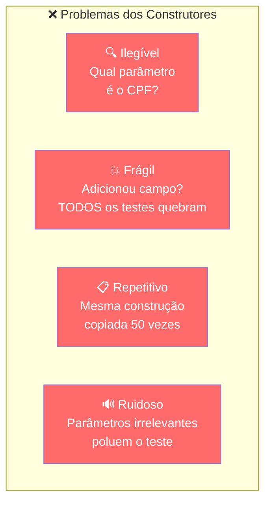
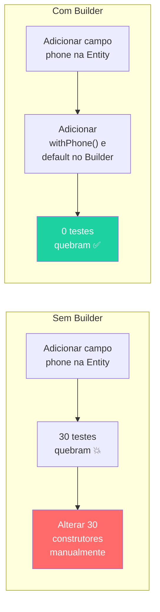
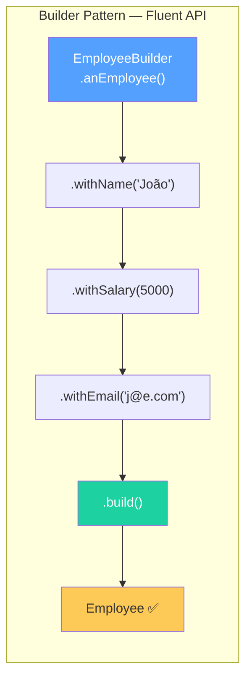
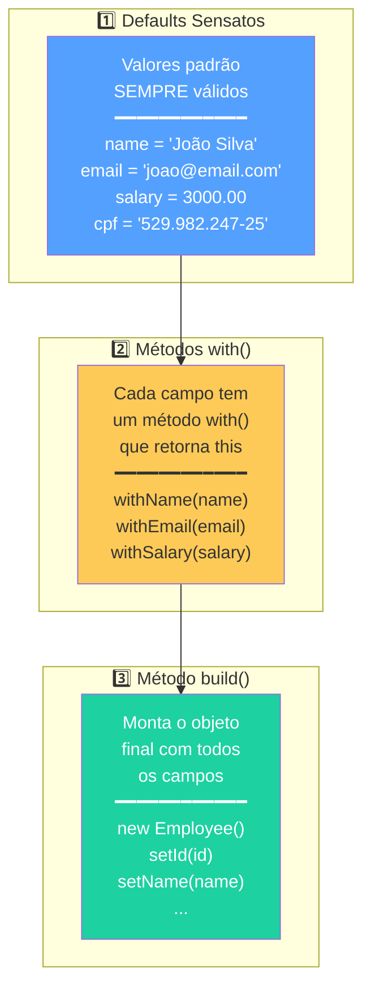
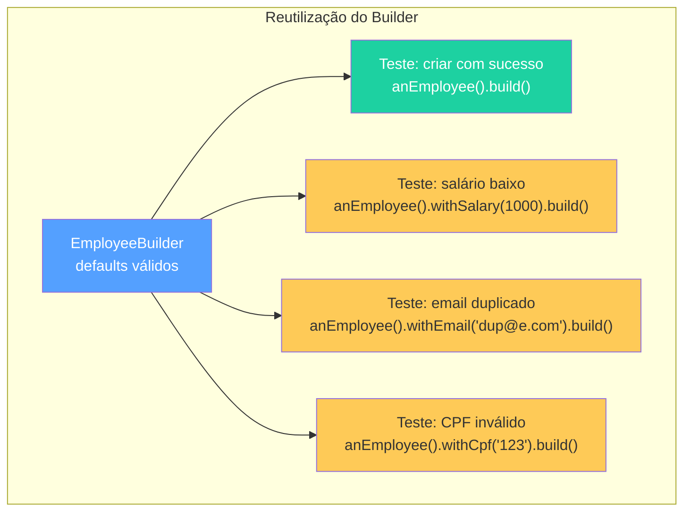
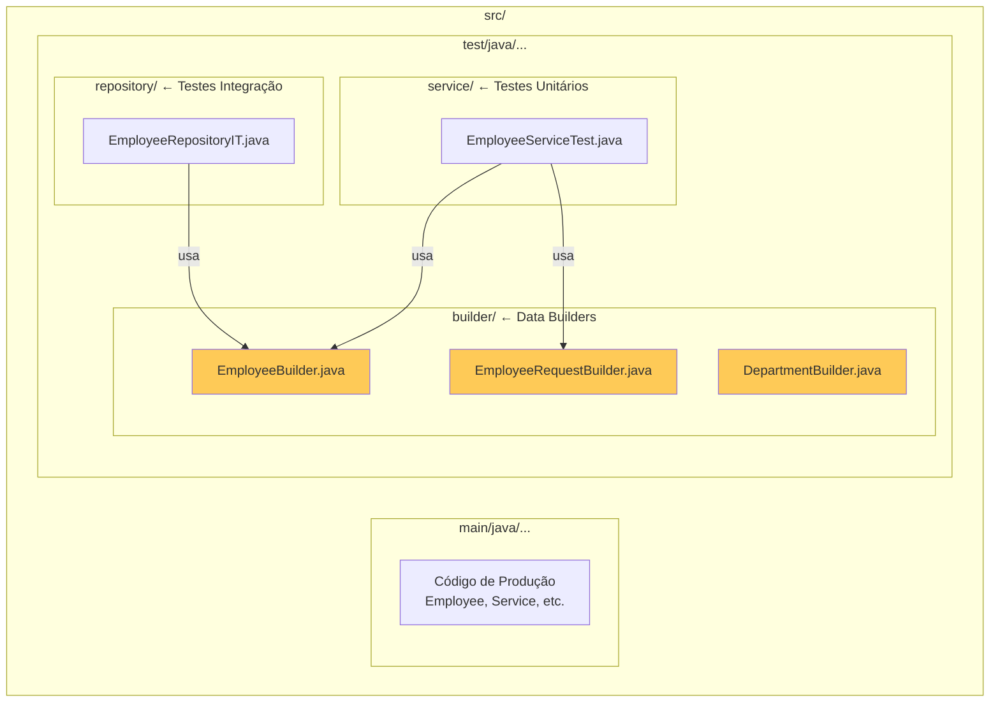
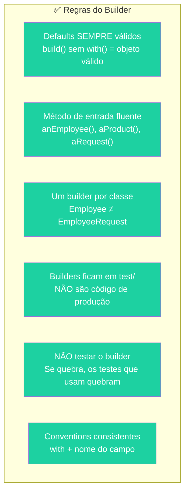

# Slide 8: Data Builders — Massa de Dados Legível

**Horário:** 13:20 - 13:40

---

## O Problema: Construtores Ilegíveis e Frágeis

### Antes — Código Doloroso

```java
// ❌ O que é cada parâmetro? Precisa olhar a classe para entender
var employee = new Employee(1L, "João Silva", "joao@email.com", "529.982.247-25",
        new BigDecimal("3000.00"), new Department(1L, "Tecnologia"),
        LocalDateTime.now(), LocalDateTime.now());

// ❌ E quando precisa de vários objetos?
var employee1 = new Employee(1L, "João", "joao@email.com", "529.982.247-25",
        new BigDecimal("3000.00"), dept, LocalDateTime.now(), LocalDateTime.now());
var employee2 = new Employee(2L, "Maria", "maria@email.com", "123.456.789-09",
        new BigDecimal("4000.00"), dept, LocalDateTime.now(), LocalDateTime.now());
var employee3 = new Employee(3L, "Carlos", "carlos@email.com", "987.654.321-00",
        new BigDecimal("5000.00"), dept, LocalDateTime.now(), LocalDateTime.now());
```



### Cenário: Adicionar campo `phone` na Entity



---

## A Solução: Builder Pattern para Testes

### Depois — Código Limpo e Expressivo

```java
// ✅ Legível — cada campo é nomeado
var employee = EmployeeBuilder.anEmployee()
        .withName("João Silva")
        .withSalary(new BigDecimal("5000.00"))
        .build();

// ✅ Foco no que importa — só altera o que é relevante para o teste
var lowSalary = EmployeeBuilder.anEmployee()
        .withSalary(new BigDecimal("1000.00"))  // só isso importa neste teste!
        .build();

// ✅ Defaults sensatos — dados válidos por padrão
var defaultEmployee = EmployeeBuilder.anEmployee().build();
// name="João Silva", email="joao@email.com", salary=3000.00, cpf="529.982.247-25"
```



---

## Anatomia do Builder

### Os 3 Pilares



### Implementação Completa — EmployeeBuilder

```java
public class EmployeeBuilder {

    // ═══════════════════════════════════════════
    // 1️⃣ DEFAULTS — valores sempre válidos
    // ═══════════════════════════════════════════
    private Long id = 1L;
    private String name = "João Silva";
    private String email = "joao@email.com";
    private String cpf = "529.982.247-25";
    private BigDecimal salary = new BigDecimal("3000.00");
    private Department department = new Department(1L, "Tecnologia");
    private LocalDateTime createdAt = LocalDateTime.now();
    private LocalDateTime updatedAt = LocalDateTime.now();

    // ═══════════════════════════════════════════
    // Método de entrada fluente (convenção: anXxx)
    // ═══════════════════════════════════════════
    public static EmployeeBuilder anEmployee() {
        return new EmployeeBuilder();
    }

    // ═══════════════════════════════════════════
    // 2️⃣ MÉTODOS WITH — retornam this (encadeamento)
    // ═══════════════════════════════════════════
    public EmployeeBuilder withId(Long id) {
        this.id = id;
        return this;
    }

    public EmployeeBuilder withName(String name) {
        this.name = name;
        return this;
    }

    public EmployeeBuilder withEmail(String email) {
        this.email = email;
        return this;
    }

    public EmployeeBuilder withCpf(String cpf) {
        this.cpf = cpf;
        return this;
    }

    public EmployeeBuilder withSalary(BigDecimal salary) {
        this.salary = salary;
        return this;
    }

    public EmployeeBuilder withDepartment(Department department) {
        this.department = department;
        return this;
    }

    // ═══════════════════════════════════════════
    // 3️⃣ BUILD — monta o objeto final
    // ═══════════════════════════════════════════
    public Employee build() {
        Employee employee = new Employee();
        employee.setId(id);
        employee.setName(name);
        employee.setEmail(email);
        employee.setCpf(cpf);
        employee.setSalary(salary);
        employee.setDepartment(department);
        employee.setCreatedAt(createdAt);
        employee.setUpdatedAt(updatedAt);
        return employee;
    }
}
```

---

## Usando Builders em Testes — Antes vs Depois

### Exemplo 1: Teste de Salário Mínimo

```java
// ❌ ANTES: construtores enormes — qual é o salário?
@Test
void shouldRejectLowSalary() {
    var dept = new Department(1L, "TI");
    var employee = new Employee(null, "João", "joao@email.com", "529.982.247-25",
            new BigDecimal("1000.00"), dept, LocalDateTime.now(), LocalDateTime.now());
    
    assertThrows(InvalidSalaryException.class, () -> service.create(employee));
}

// ✅ DEPOIS: builder fluente — foco imediato no que importa
@Test
void shouldRejectLowSalary() {
    var employee = EmployeeBuilder.anEmployee()
            .withSalary(new BigDecimal("1000.00"))  // ← ÚNICO dado relevante!
            .build();

    assertThrows(InvalidSalaryException.class, () -> service.create(employee));
}
```

### Exemplo 2: Múltiplos Cenários com Diferentes Dados

```java
class EmployeeServiceTest {

    private Employee defaultEmployee;
    private Department defaultDepartment;

    @BeforeEach
    void setUp() {
        defaultDepartment = new Department(1L, "Tecnologia");
        defaultEmployee = EmployeeBuilder.anEmployee()
                .withDepartment(defaultDepartment)
                .build();
    }

    @Test
    void shouldCreateSuccessfully() {
        // Usa o default — dados válidos, foco na lógica de criação
        when(repository.save(any())).thenReturn(defaultEmployee);
        // ...
    }

    @Test
    void shouldRejectLowSalary() {
        // Altera SOMENTE o salário — o resto vem default
        var employee = EmployeeBuilder.anEmployee()
                .withSalary(new BigDecimal("1000.00"))
                .build();
        // ...
    }

    @Test
    void shouldRejectDuplicateEmail() {
        // Altera SOMENTE o email
        var employee = EmployeeBuilder.anEmployee()
                .withEmail("duplicado@email.com")
                .build();
        // ...
    }
}
```



---

## Builder para Request DTO

Crie builders separados para cada classe que precisar:

```java
public class EmployeeRequestBuilder {

    private String name = "João Silva";
    private String email = "joao@email.com";
    private BigDecimal salary = new BigDecimal("3000.00");
    private String cpf = "529.982.247-25";
    private Long departmentId = 1L;

    public static EmployeeRequestBuilder aRequest() {
        return new EmployeeRequestBuilder();
    }

    public EmployeeRequestBuilder withName(String name) {
        this.name = name;
        return this;
    }

    public EmployeeRequestBuilder withEmail(String email) {
        this.email = email;
        return this;
    }

    public EmployeeRequestBuilder withSalary(BigDecimal salary) {
        this.salary = salary;
        return this;
    }

    public EmployeeRequestBuilder withCpf(String cpf) {
        this.cpf = cpf;
        return this;
    }

    public EmployeeRequestBuilder withDepartmentId(Long departmentId) {
        this.departmentId = departmentId;
        return this;
    }

    public EmployeeRequest build() {
        return new EmployeeRequest(name, email, salary, cpf, departmentId);
    }
}
```

### Uso:

```java
// ✅ Request com builder — expressivo e fácil de manter
var request = EmployeeRequestBuilder.aRequest()
        .withEmail("novo@email.com")
        .withSalary(new BigDecimal("5000.00"))
        .build();
```

---

## 📁 Organização dos Builders no Projeto



```
src/
├── main/java/...              ← código de produção
└── test/java/...
    ├── builder/               ← 📦 Data Builders (pasta dedicada)
    │   ├── EmployeeBuilder.java
    │   ├── EmployeeRequestBuilder.java
    │   └── DepartmentBuilder.java (se necessário)
    ├── service/               ← testes unitários
    │   └── EmployeeServiceTest.java
    └── repository/            ← testes de integração
        └── EmployeeRepositoryIT.java
```

---

## Boas Práticas — Checklist do Builder



| Prática | Justificativa |
|---------|---------------|
| Defaults **sempre válidos** | `.build()` sem `.with()` deve gerar objeto válido |
| Método de entrada `anEmployee()` | Lê como inglês: `EmployeeBuilder.anEmployee().build()` |
| Um builder por Entity/DTO | Não misturar `Employee` e `EmployeeRequest` no mesmo builder |
| Colocar na pasta `test/` | Builder é ferramenta de teste, não código de produção |
| NÃO testar o builder | É simples demais — se ele falhar, os testes que o usam falham |
| `return this` em cada `with()` | Permite encadeamento fluente |

---

## 🧠 Quick Quiz — Data Builders

| Pergunta | Resposta |
|----------|----------|
| Qual o principal problema de construtores diretos em testes? | Ilegibilidade, fragilidade e repetição |
| O que são "defaults sensatos"? | Valores padrão válidos que permitem `.build()` sem `.with()` |
| Por que `return this` nos métodos `with()`? | Para permitir encadeamento fluente (method chaining) |
| Onde ficam os Builders no projeto? | Na pasta `test/` — são ferramentas de teste |
| Quantos builders por classe? | Um builder por Entity/DTO |
| Devo testar meu builder? | Não — se ele quebrar, os testes que o usam falham |

---

## 💡 Dica do Instrutor

> Mostre ao vivo: crie um `EmployeeBuilder` com defaults, depois use em 3 testes diferentes. O aluno percebe que cada teste altera **apenas** o dado relevante — o resto vem de graça. O "clique" acontece quando ele vê que adicionar um novo campo na Entity **não quebra nenhum teste**.

> **Analogia**: "O Builder é como um formulário pré-preenchido. Você só altera os campos que importam para aquele cenário específico. Se o formulário ganhar um campo novo, ele já vem com valor padrão — ninguém precisa alterar formulários antigos."
