# Slide 9: Walkthrough — 04-testing-demo

**Horário:** 13:40 - 14:10

---

## 📖 Projeto: API de Catálogo de Produtos com Testes

Projeto **completo e funcional** demonstrando **todos os conceitos** do Dia 4 — tudo pronto e passando.

**Stack**: Spring Boot 3.2, JUnit 5, Mockito, Testcontainers, PostgreSQL, AssertJ

**Porta**: 8086

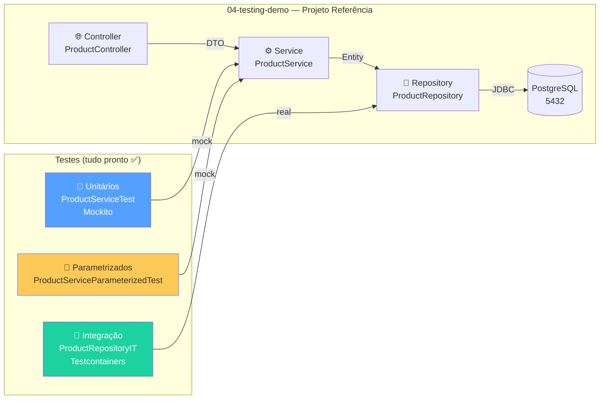

---

## 📁 Estrutura Completa do Projeto

```
04-testing-demo/
├── pom.xml                                    ← dependências (Mockito, Testcontainers)
├── api-requests.http                          ← requests para testar manualmente
├── src/
│   ├── main/java/com/example/testingdemo/
│   │   ├── TestingDemoApplication.java
│   │   ├── model/
│   │   │   └── Product.java                   ← @Entity JPA
│   │   ├── repository/
│   │   │   └── ProductRepository.java          ← JpaRepository<Product, Long>
│   │   ├── dto/
│   │   │   ├── ProductRequest.java             ← Record com @Valid
│   │   │   └── ProductResponse.java            ← Record de saída
│   │   ├── mapper/
│   │   │   └── ProductMapper.java              ← toEntity(), toResponse()
│   │   ├── service/
│   │   │   └── ProductService.java             ← regras de negócio
│   │   ├── controller/
│   │   │   └── ProductController.java          ← @RestController
│   │   └── exception/
│   │       ├── ProductNotFoundException.java
│   │       ├── DuplicateSkuException.java
│   │       └── GlobalExceptionHandler.java
│   ├── main/resources/
│   │   └── application.yml
│   └── test/java/com/example/testingdemo/      ← 👈 TUDO aqui!
│       ├── AbstractIntegrationTest.java        ← classe base Testcontainers
│       ├── builder/
│       │   └── ProductBuilder.java             ← Data Builder fluente
│       ├── service/
│       │   ├── ProductServiceTest.java         ← testes unitários com Mockito
│       │   └── ProductServiceParameterizedTest.java ← @ParameterizedTest
│       └── repository/
│           └── ProductRepositoryIT.java        ← testes de integração
```

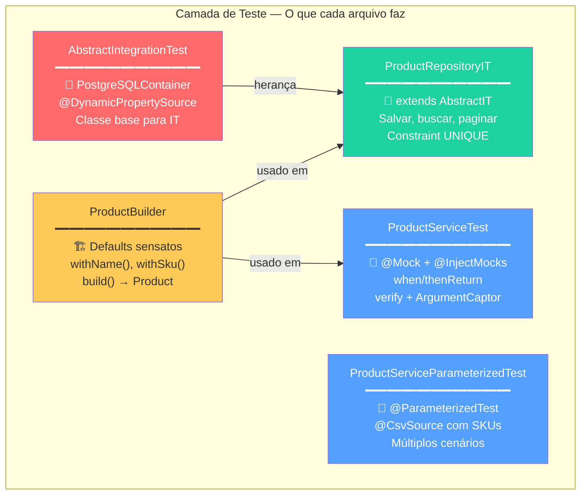

---

## 🔍 Passo a Passo do Walkthrough

### Passo 1: Rodar Todos os Testes

```bash
cd 04-testing-demo
mvn test
```

**Saída esperada:**
```
[INFO] Tests run: XX, Failures: 0, Errors: 0, Skipped: 0
[INFO] BUILD SUCCESS
```

> **Ação ao vivo**: Abra o Podman Desktop e mostre o container PostgreSQL subindo e descendo.

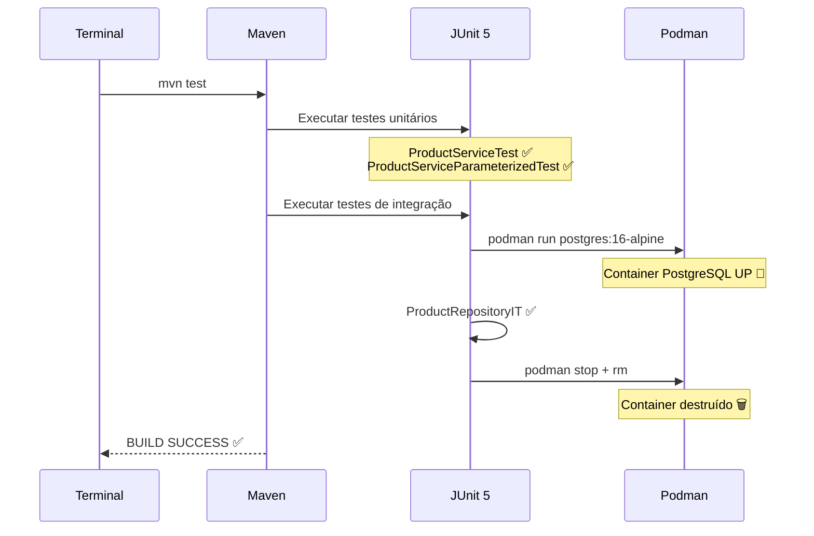

---

### Passo 2: Analisar o ProductBuilder

```java
public class ProductBuilder {

    private Long id = 1L;
    private String name = "Notebook Dell";
    private String sku = "NOT-0001";
    private BigDecimal price = new BigDecimal("2500.00");
    private String description = "Notebook Dell Inspiron 15";

    public static ProductBuilder aProduct() {
        return new ProductBuilder();
    }

    // ... métodos with() ...

    public Product build() {
        // monta e retorna Product com todos os campos
    }
}
```

> **Destacar para os alunos**:
> - Defaults sensatos — `.build()` sem `.with()` já gera um produto válido
> - Convenção `aProduct()` — lê como inglês
> - `return this` em cada `with()` — permite encadeamento

---

### Passo 3: Analisar ProductServiceTest

```java
@ExtendWith(MockitoExtension.class)
class ProductServiceTest {

    @Mock
    private ProductRepository productRepository;

    @InjectMocks
    private ProductService productService;

    @Captor
    private ArgumentCaptor<Product> productCaptor;
}
```

**Testes no arquivo — mostrar cada um:**

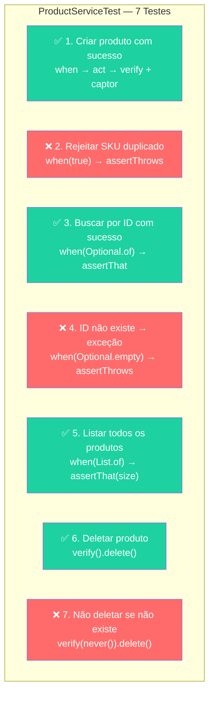

| # | Teste | Técnicas Usadas |
|---|-------|-----------------|
| 1 | Criar produto ✅ | `when().thenReturn()`, `verify()`, `ArgumentCaptor` |
| 2 | SKU duplicado ❌ | `when().thenReturn(true)`, `assertThrows()` |
| 3 | Buscar por ID ✅ | `when().thenReturn(Optional.of())` |
| 4 | ID inexistente ❌ | `assertThrows(ProductNotFoundException)` |
| 5 | Listar todos ✅ | `when().thenReturn(List.of())` |
| 6 | Deletar ✅ | `verify().delete()` |
| 7 | Deletar inexistente ❌ | `verify(never()).delete()` |

---

### Passo 4: Analisar ProductServiceParameterizedTest

```java
@ParameterizedTest
@CsvSource({
    "NOT-0001, Produto já existe com o SKU: NOT-0001",
    "ABC-1234, Produto já existe com o SKU: ABC-1234"
})
@DisplayName("Deve rejeitar SKU duplicado")
void shouldRejectDuplicateSku(String sku, String expectedMessage) {
    // ...
}
```

> **Destacar**: reuso da estrutura de teste para múltiplos cenários — 1 método, N execuções.

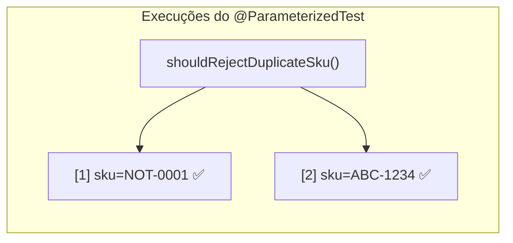

---

### Passo 5: Analisar AbstractIntegrationTest

```java
@SpringBootTest
@Testcontainers
public abstract class AbstractIntegrationTest {

    @Container
    static PostgreSQLContainer<?> postgres = new PostgreSQLContainer<>("postgres:16-alpine")
            .withDatabaseName("testdb")
            .withUsername("test")
            .withPassword("test");

    @DynamicPropertySource
    static void configureProperties(DynamicPropertyRegistry registry) {
        registry.add("spring.datasource.url", postgres::getJdbcUrl);
        registry.add("spring.datasource.username", postgres::getUsername);
        registry.add("spring.datasource.password", postgres::getPassword);
    }
}
```

> **Destacar**: UMA vez configurada, TODOS os testes de integração herdam.

---

### Passo 6: Analisar ProductRepositoryIT

```java
class ProductRepositoryIT extends AbstractIntegrationTest {

    @Autowired
    private ProductRepository productRepository;

    @BeforeEach
    void setUp() {
        productRepository.deleteAll();  // isolamento entre testes
    }
}
```

**Testes demonstrados:**

| # | Teste | O que valida |
|---|-------|-------------|
| 1 | Salvar e buscar por ID | CRUD básico com PostgreSQL real |
| 2 | Buscar por SKU | Query customizada funciona no PG |
| 3 | Constraint UNIQUE no SKU | `DataIntegrityViolationException` |
| 4 | Paginação com 15 produtos | `PageRequest.of(0, 10)` no PG real |

---

## 📊 Mapa de Cobertura — O que é testado e como

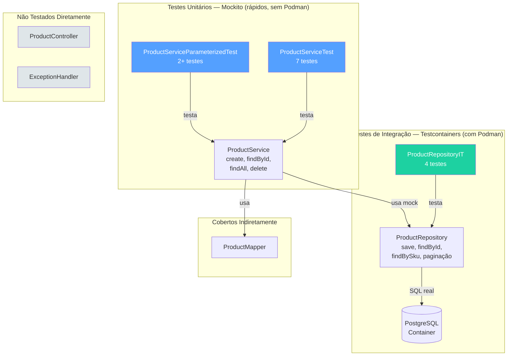

> **Nota para alunos**: Controller não é testado diretamente neste projeto. Em projetos reais, use `@WebMvcTest` se houver lógica de roteamento/validação complexa.

---

## 🧪 Rodando os Testes ao Vivo

### Comandos úteis

```bash
# Todos os testes (unitários + integração)
mvn test

# Apenas testes unitários (sem Podman)
mvn test -Dtest="*Test"

# Apenas testes de integração (precisa Podman)
mvn test -Dtest="*IT"

# Com relatório de cobertura (JaCoCo)
mvn test jacoco:report
# Abrir: target/site/jacoco/index.html
```

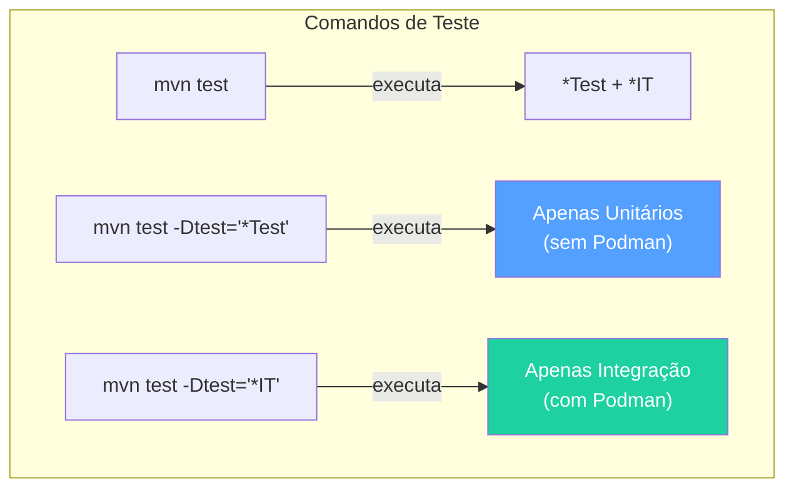

---

## � SonarQube — Qualidade de Código e Cobertura

### O que é SonarQube?

SonarQube é uma plataforma de **análise estática de código** que detecta bugs, vulnerabilidades, code smells e mede a cobertura de testes — tudo em um dashboard visual.

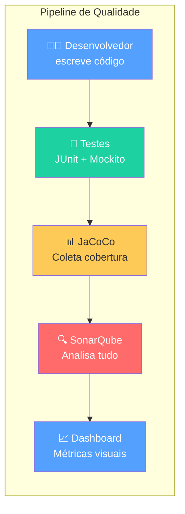

### SonarQube — O que analisa?

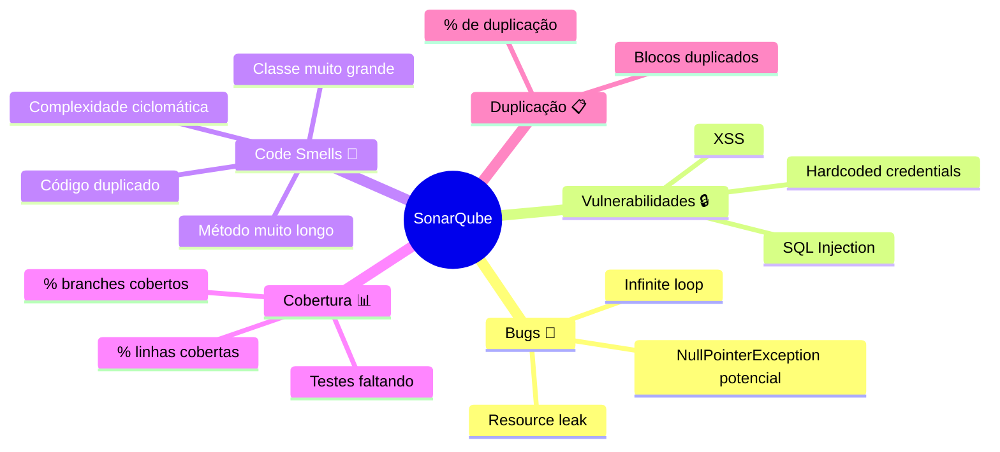

| Dimensão | O que detecta | Exemplo |
|----------|--------------|---------|
| **Bugs** | Erros que podem causar falha em runtime | `null.toString()`, resource leak |
| **Vulnerabilidades** | Falhas de segurança | SQL injection, senhas hardcoded |
| **Code Smells** | Código que funciona mas é difícil de manter | Método com 200 linhas, God class |
| **Cobertura** | % do código coberto por testes | Linhas e branches testados |
| **Duplicação** | Código copiado/colado | Blocos repetidos em classes diferentes |

### Quality Gate — Portão de Qualidade

O **Quality Gate** define critérios mínimos que o código deve atender para ser considerado **aceitável**.

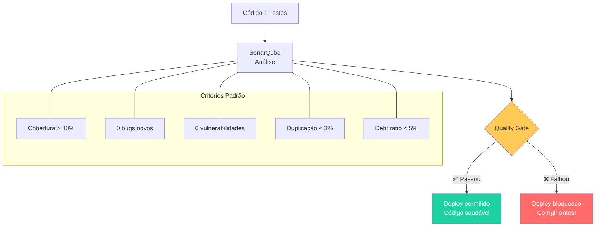

### JaCoCo — Coleta de Cobertura

O **JaCoCo** (Java Code Coverage) é o plugin Maven que coleta quais linhas e branches foram executados durante os testes. O SonarQube **lê** o relatório JaCoCo.

#### Configuração no pom.xml

```xml
<plugin>
    <groupId>org.jacoco</groupId>
    <artifactId>jacoco-maven-plugin</artifactId>
    <version>0.8.11</version>
    <executions>
        <!-- Preparar agente antes dos testes -->
        <execution>
            <id>prepare-agent</id>
            <goals>
                <goal>prepare-agent</goal>
            </goals>
        </execution>
        <!-- Gerar relatório após os testes -->
        <execution>
            <id>report</id>
            <phase>test</phase>
            <goals>
                <goal>report</goal>
            </goals>
        </execution>
    </executions>
</plugin>
```

#### Rodando e Visualizando

```bash
# Rodar testes + gerar relatório de cobertura
mvn test jacoco:report

# Abrir o relatório HTML
# Windows:
start target/site/jacoco/index.html

# Linux/Mac:
open target/site/jacoco/index.html
```

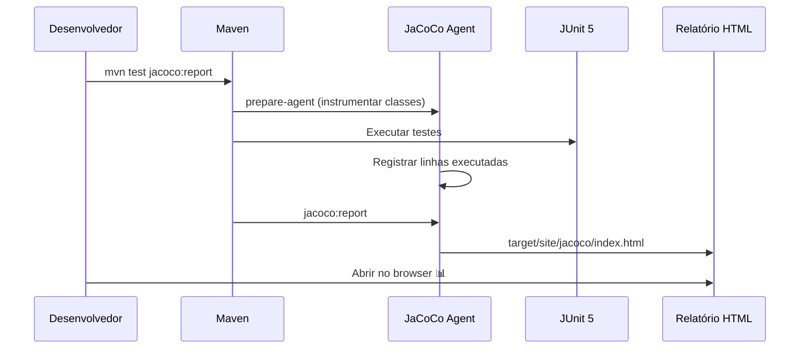

### SonarQube com Podman (Local)

Para rodar o SonarQube localmente durante o treinamento:

```bash
# Subir SonarQube com Podman
podman run -d --name sonarqube \
  -p 9000:9000 \
  sonarqube:lts-community

# Aguardar inicialização (~30s)
# Acessar: http://localhost:9000
# Login padrão: admin / admin
```

#### Analisar o projeto com Maven

```bash
# Rodar análise do SonarQube (após mvn test)
mvn sonar:sonar \
  -Dsonar.host.url=http://localhost:9000 \
  -Dsonar.login=admin \
  -Dsonar.password=admin \
  -Dsonar.projectKey=testing-demo
```

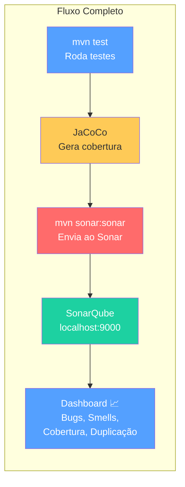

### Interpretando o Dashboard

| Métrica | Bom | Aceitável | Ruim |
|---------|-----|-----------|------|
| **Cobertura** | > 80% | 60-80% | < 60% |
| **Bugs** | 0 | 1-5 | > 5 |
| **Vulnerabilidades** | 0 | 1-2 | > 2 |
| **Code Smells** | < 10 | 10-50 | > 50 |
| **Duplicação** | < 3% | 3-5% | > 5% |
| **Technical Debt** | < 30min | 30min-2h | > 2h |

### SonarQube no VS Code (SonarLint)

O **SonarLint** é a extensão do VS Code que traz análises do SonarQube **diretamente no editor**, em tempo real.

```
VS Code → Extensions → Pesquisar "SonarLint" → Instalar
```

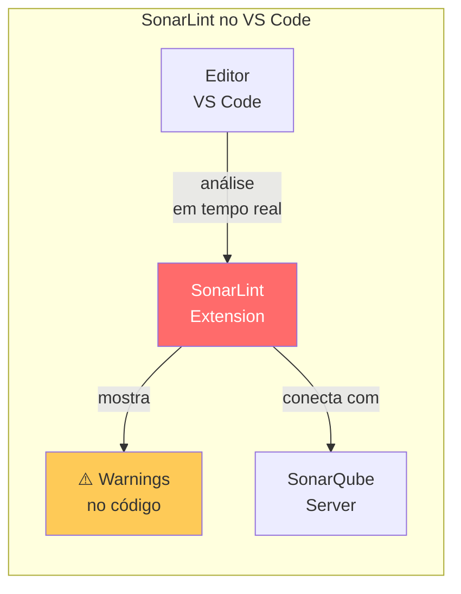

> **Dica do instrutor**: Instale o SonarLint no VS Code da turma e mostre como ele marca code smells e bugs potenciais diretamente no editor, sem precisar rodar `mvn sonar:sonar`.

---

## 📋 Checklist do Instrutor — Walkthrough

```mermaid
flowchart TD
    subgraph "Sequência da Demonstração"
        S1["1️⃣ mvn test — mostrar verde"]
        S2["2️⃣ Podman Desktop — container subindo"]
        S3["3️⃣ ProductBuilder — defaults sensatos"]
        S4["4️⃣ ProductServiceTest — AAA + Mockito"]
        S5["5️⃣ ArgumentCaptor — capturar e inspecionar"]
        S6["6️⃣ ParameterizedTest — múltiplos cenários"]
        S7["7️⃣ AbstractIntegrationTest — herança"]
        S8["8️⃣ ProductRepositoryIT — banco real"]
        S9["9️⃣ JaCoCo — relatório de cobertura"]
        S10["🔟 SonarQube — dashboard de qualidade"]
        S11["1️⃣1️⃣ Quebrar um teste — mostrar erro"]
    end

    S1 --> S2 --> S3 --> S4 --> S5 --> S6 --> S7 --> S8 --> S9 --> S10 --> S11
```

1. [ ] Rodar `mvn test` e mostrar todos passando (verde)
2. [ ] Abrir Podman Desktop e mostrar container PostgreSQL subindo
3. [ ] Mostrar `ProductBuilder` e como simplifica criação de dados
4. [ ] Mostrar `ProductServiceTest` — padrão AAA com `@Mock`, `@InjectMocks`
5. [ ] Mostrar `ArgumentCaptor` capturando o que foi salvo
6. [ ] Mostrar `ProductServiceParameterizedTest` — múltiplos cenários
7. [ ] Mostrar `AbstractIntegrationTest` — herança para configuração
8. [ ] Mostrar `ProductRepositoryIT` — testes com banco real
9. [ ] Rodar `mvn test jacoco:report` e abrir relatório HTML de cobertura
10. [ ] _(Opcional)_ Subir SonarQube local e mostrar dashboard
11. [ ] **Quebrar um teste propositalmente** e mostrar a mensagem de erro

> **Dica**: Ao quebrar o teste, mude o valor esperado no `assertThat` e rode. Mostre a mensagem de erro do AssertJ — ela é muito descritiva e ajuda os alunos a entender rapidamente o que falhou.

---

## 💡 Dica do Instrutor

> Este é o slide mais interativo do dia. Navegue pelos arquivos em tempo real no IntelliJ/VS Code. Faça pause entre cada passo para perguntar "alguma dúvida?". Os alunos absorvem melhor quando veem código real rodando.

> **Técnica**: Quebre o teste do `ArgumentCaptor` e mostre que o valor capturado era diferente do esperado. Os alunos entendem imediatamente o valor da ferramenta.

> **SonarQube**: Se o tempo permitir, suba o SonarQube com Podman e analise o projeto ao vivo. Os alunos se impressionam ao ver bugs e code smells detectados automaticamente em código que "funciona".
