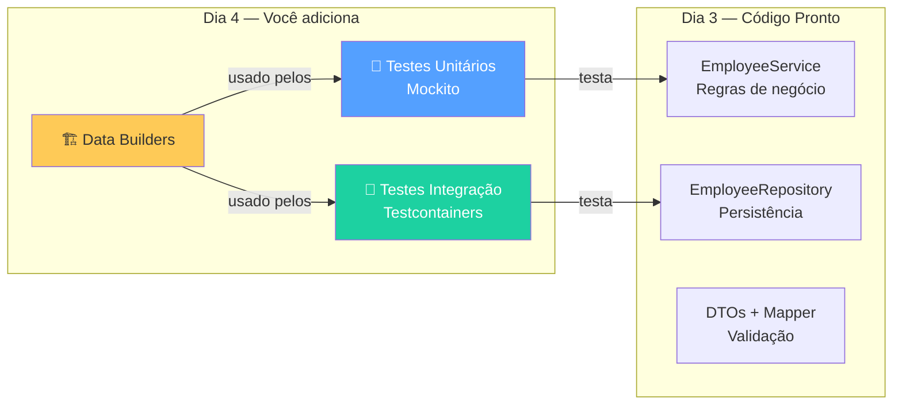
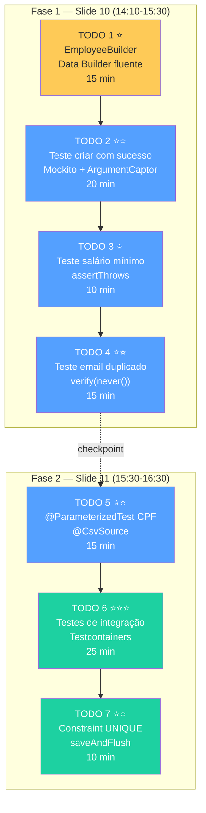
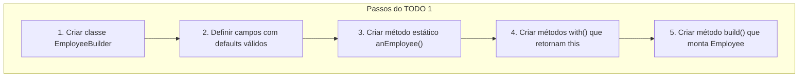
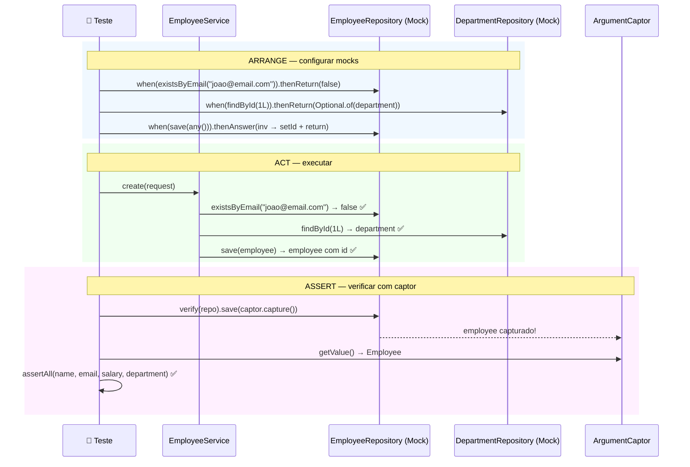
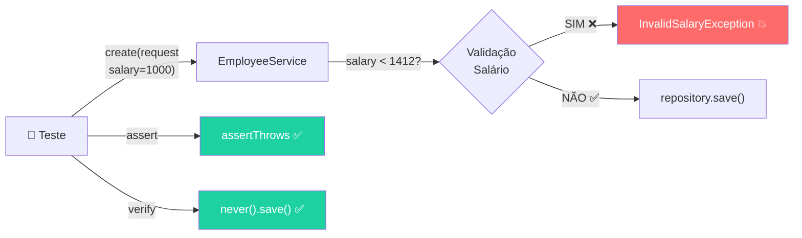
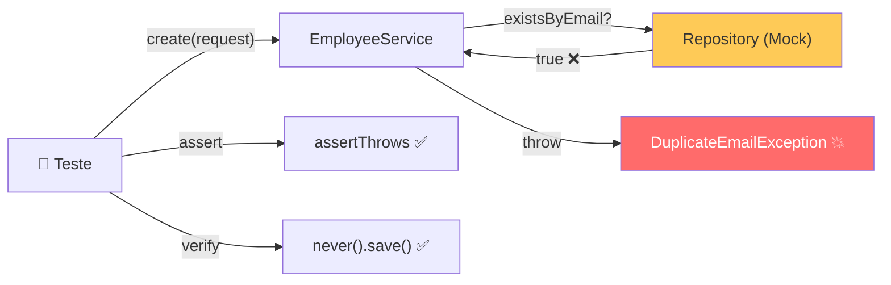
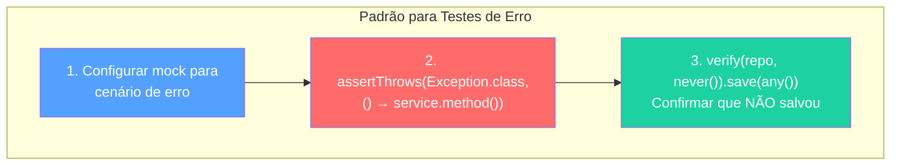
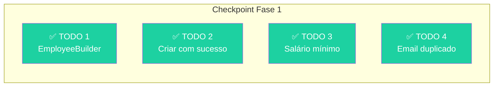

# Slide 10: Exercício — 04-employee-api-tests (TODOs 1-4)

**Horário:** 14:10 - 15:30

---

## ✏️ API de Gestão de Funcionários — Adicionando Testes

### Contexto

A API de Funcionários (`03-employee-api`) do Dia 3 está **funcionando**, mas **sem testes automatizados**. Seu objetivo é adicionar **testes unitários** e **testes de integração** para garantir que tudo funciona — e continua funcionando.



### O que já vem pronto

| Item | Status |
|------|--------|
| `EmployeeService` com regras de negócio | ✅ Pronto |
| `EmployeeRepository` e `DepartmentRepository` | ✅ Pronto |
| DTOs (`EmployeeRequest`, `EmployeeResponse`) | ✅ Pronto |
| `GlobalExceptionHandler` com Problem Details | ✅ Pronto |
| Bean Validation + `@ValidCpf` | ✅ Pronto |
| Dependências de teste no `pom.xml` | ✅ Pronto |
| `AbstractIntegrationTest` com PostgreSQL | ✅ Pronto |
| Classes de teste vazias com TODOs | ✅ Pronto |

### Mapa dos 7 TODOs



---

## TODO 1: Implementar EmployeeBuilder ⭐

**Arquivo**: `src/test/java/.../builder/EmployeeBuilder.java`

**Tempo estimado**: 15 minutos

```java
// TODO 1: Implementar EmployeeBuilder com builder fluente:
//   - Valores default: nome="João Silva", email="joao@email.com", salario=3000.00
//   - Métodos: withName(), withEmail(), withSalary(), withCpf(), build()
```

### O que fazer:



### Implementação — Gabarito

```java
public class EmployeeBuilder {

    // Defaults sensatos — TODOS válidos
    private Long id = 1L;
    private String name = "João Silva";
    private String email = "joao@email.com";
    private String cpf = "529.982.247-25";
    private BigDecimal salary = new BigDecimal("3000.00");
    private Department department = new Department(1L, "Tecnologia");
    private LocalDateTime createdAt = LocalDateTime.now();
    private LocalDateTime updatedAt = LocalDateTime.now();

    // Método de entrada fluente
    public static EmployeeBuilder anEmployee() {
        return new EmployeeBuilder();
    }

    // Métodos with — retornam this para encadeamento
    public EmployeeBuilder withId(Long id) {
        this.id = id;
        return this;
    }

    public EmployeeBuilder withName(String name) {
        this.name = name;
        return this;
    }

    public EmployeeBuilder withEmail(String email) {
        this.email = email;
        return this;
    }

    public EmployeeBuilder withCpf(String cpf) {
        this.cpf = cpf;
        return this;
    }

    public EmployeeBuilder withSalary(BigDecimal salary) {
        this.salary = salary;
        return this;
    }

    public EmployeeBuilder withDepartment(Department department) {
        this.department = department;
        return this;
    }

    // Build — monta o objeto final
    public Employee build() {
        Employee employee = new Employee();
        employee.setId(id);
        employee.setName(name);
        employee.setEmail(email);
        employee.setCpf(cpf);
        employee.setSalary(salary);
        employee.setDepartment(department);
        employee.setCreatedAt(createdAt);
        employee.setUpdatedAt(updatedAt);
        return employee;
    }
}
```

### Validação — Testar seu Builder

```java
// Deve funcionar sem erros:
Employee employee = EmployeeBuilder.anEmployee().build();
assertNotNull(employee.getName());    // "João Silva"
assertNotNull(employee.getEmail());   // "joao@email.com"

// E com customização:
Employee custom = EmployeeBuilder.anEmployee()
        .withName("Maria")
        .withSalary(new BigDecimal("5000.00"))
        .build();
assertEquals("Maria", custom.getName());
```

---

## TODO 2: Testar Criação com Sucesso ⭐⭐

**Arquivo**: `src/test/java/.../service/EmployeeServiceTest.java`

**Tempo estimado**: 20 minutos

```java
// TODO 2: Em EmployeeServiceTest — testar criação com sucesso:
//   - Arranjar: mock do repository retornando empty no findByEmail
//   - Atuar: chamar service.create(request)
//   - Verificar: capturar argumento salvo no repository com ArgumentCaptor
```

### Fluxo do Teste



### Implementação — Gabarito

```java
@Test
@DisplayName("Deve criar funcionário com sucesso quando dados são válidos")
void shouldCreateEmployeeSuccessfully() {
    // Arrange
    var request = new EmployeeRequest("João Silva", "joao@email.com",
            new BigDecimal("3000.00"), "529.982.247-25", 1L);
    var department = new Department(1L, "Tecnologia");

    when(employeeRepository.existsByEmail("joao@email.com")).thenReturn(false);
    when(departmentRepository.findById(1L)).thenReturn(Optional.of(department));
    when(employeeRepository.save(any(Employee.class))).thenAnswer(inv -> {
        Employee e = inv.getArgument(0);
        e.setId(1L);
        return e;
    });

    // Act
    EmployeeResponse response = employeeService.create(request);

    // Assert — capturar e inspecionar
    ArgumentCaptor<Employee> captor = ArgumentCaptor.forClass(Employee.class);
    verify(employeeRepository).save(captor.capture());

    Employee captured = captor.getValue();
    assertAll(
        () -> assertThat(captured.getName()).isEqualTo("João Silva"),
        () -> assertThat(captured.getEmail()).isEqualTo("joao@email.com"),
        () -> assertThat(captured.getSalary())
                .isEqualByComparingTo(new BigDecimal("3000.00")),
        () -> assertThat(captured.getDepartment().getName()).isEqualTo("Tecnologia")
    );
}
```

### Erros Comuns — Fique Atento

| Erro | Causa | Solução |
|------|-------|---------|
| `NullPointerException` no `create()` | Esqueceu de mockar `departmentRepository.findById()` | Adicione `when(departmentRepository.findById(1L))...` |
| `Unnecessary stubbings detected` | Mock configurado mas não usado | Verifique se o Service realmente chama aquele método |
| `Wanted but not invoked` | `verify()` para método não chamado | O Service pode ter caminho diferente do esperado |
| `isEqualTo` falha para `BigDecimal` | `3000.00` ≠ `3000.0` (scale diferente) | Use `isEqualByComparingTo()` do AssertJ |

---

## TODO 3: Testar Regra de Salário Mínimo ⭐

**Arquivo**: `src/test/java/.../service/EmployeeServiceTest.java`

**Tempo estimado**: 10 minutos

```java
// TODO 3: Testar regra de salário mínimo:
//   - Esperar exceção InvalidSalaryException quando salário < 1412.00
```

### Fluxo — Teste Negativo



### Implementação — Gabarito

```java
@Test
@DisplayName("Deve rejeitar salário menor que R$ 1.412,00")
void shouldRejectSalaryBelowMinimum() {
    var request = new EmployeeRequest("João Silva", "joao@email.com",
            new BigDecimal("1000.00"), "529.982.247-25", 1L);

    // Act + Assert — exceção esperada
    assertThrows(InvalidSalaryException.class,
            () -> employeeService.create(request));

    // ✅ Verificar que NÃO tentou salvar no banco
    verify(employeeRepository, never()).save(any());
}
```

> **Destaque para os alunos**: O `verify(never())` é tão importante quanto o `assertThrows`. Ele garante que o Service **parou antes** de salvar.

---

## TODO 4: Testar Email Duplicado ⭐⭐

**Arquivo**: `src/test/java/.../service/EmployeeServiceTest.java`

**Tempo estimado**: 15 minutos

```java
// TODO 4: Testar email duplicado:
//   - Mock existsByEmail retornando true
//   - Esperar DuplicateEmailException
```

### Fluxo — Teste Negativo



### Implementação — Gabarito

```java
@Test
@DisplayName("Deve rejeitar email duplicado")
void shouldRejectDuplicateEmail() {
    var request = new EmployeeRequest("João Silva", "existente@email.com",
            new BigDecimal("3000.00"), "529.982.247-25", 1L);

    // Arrange — mock retorna que email já existe
    when(employeeRepository.existsByEmail("existente@email.com")).thenReturn(true);

    // Act + Assert
    assertThrows(DuplicateEmailException.class,
            () -> employeeService.create(request));

    // ✅ Garantir que NÃO chamou save
    verify(employeeRepository, never()).save(any());
}
```

### Padrão: Testes Negativos com verify(never())



---

## ⏱️ Checkpoint — 15:30

Até este ponto você deve ter:



### Validação

```bash
mvn test -Dtest="EmployeeServiceTest"   # deve estar verde ✅
```

**Saída esperada:**
```
[INFO] Tests run: 3, Failures: 0, Errors: 0, Skipped: 0
[INFO] BUILD SUCCESS
```

---

## 💡 Dica do Instrutor

> Circule pela sala durante o exercício. Os erros mais comuns são:
> 1. Esquecer de mockar `departmentRepository.findById()` → `NullPointerException`
> 2. Usar `isEqualTo()` com `BigDecimal` → use `isEqualByComparingTo()`
> 3. Confundir a ordem do `assertThrows` → lembrar: `assertThrows(Tipo.class, () -> ...)`
> 4. Não importar os métodos estáticos do Mockito → `import static org.mockito.Mockito.*`

> **Para alunos avançados**: desafie-os a adicionar `@Nested` para organizar os testes por funcionalidade (Create, Delete, Find).
