# Slide 11: Exercício — 04-employee-api-tests (TODOs 5-7)

**Horário:** 15:30 - 16:30

---

## TODO 5: @ParameterizedTest para CPF Inválido ⭐⭐

**Arquivo**: `src/test/java/.../service/EmployeeServiceTest.java`

**Tempo estimado**: 15 minutos

```java
// TODO 5: Criar @ParameterizedTest para CPF inválido:
//   - @CsvSource com: "123", "00000000000", "1234567890", "abc"
//   - Esperar InvalidCpfException para cada valor
```

### Conceito: 1 Método, N Execuções

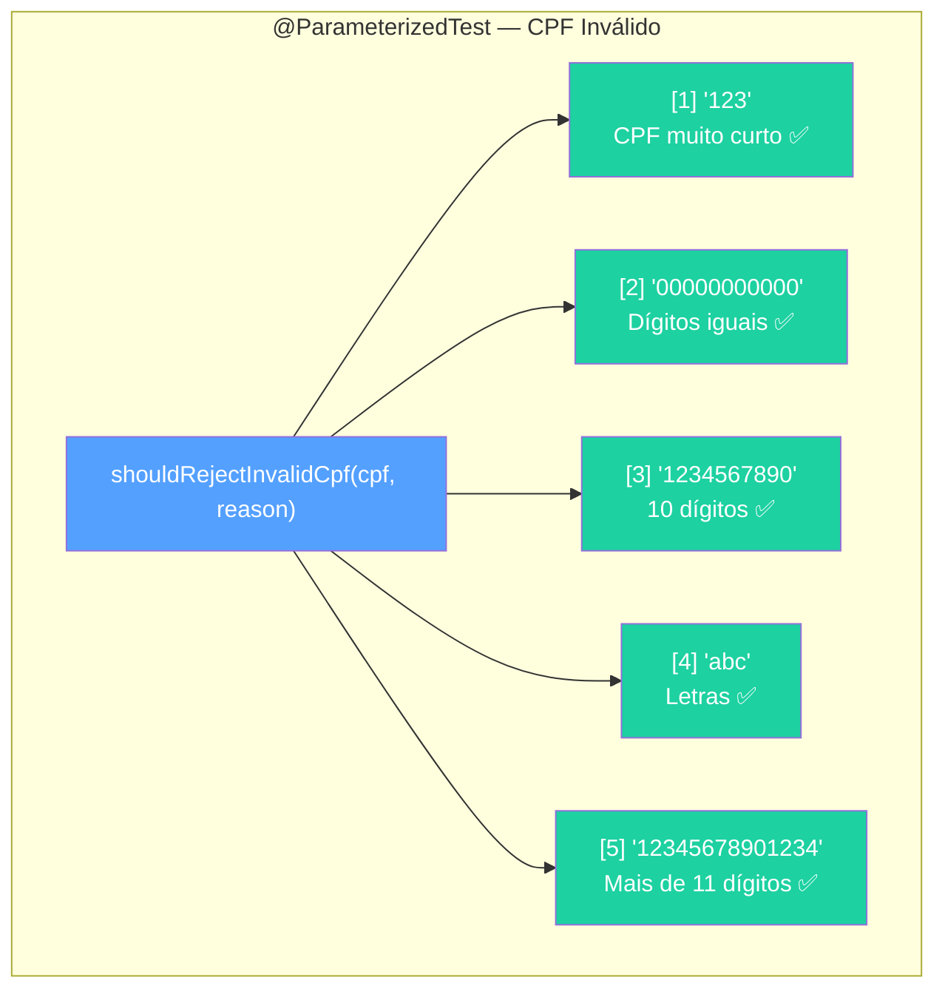

### Implementação — Gabarito

```java
@ParameterizedTest
@CsvSource({
    "123,            CPF muito curto",
    "00000000000,    Todos dígitos iguais",
    "1234567890,     CPF com 10 dígitos",
    "abc,            CPF com letras",
    "12345678901234, CPF com mais de 11 dígitos"
})
@DisplayName("Deve rejeitar CPF inválido")
void shouldRejectInvalidCpf(String cpf, String reason) {
    var request = new EmployeeRequest("João Silva", "joao@email.com",
            new BigDecimal("3000.00"), cpf, 1L);

    assertThrows(InvalidCpfException.class,
            () -> employeeService.create(request),
            "Deveria rejeitar CPF: " + reason);
}
```

### Saída Esperada no Console

```
✅ Deve rejeitar CPF inválido
   ✅ [1] 123, CPF muito curto
   ✅ [2] 00000000000, Todos dígitos iguais
   ✅ [3] 1234567890, CPF com 10 dígitos
   ✅ [4] abc, CPF com letras
   ✅ [5] 12345678901234, CPF com mais de 11 dígitos
```

### Comparação: Sem vs Com @ParameterizedTest

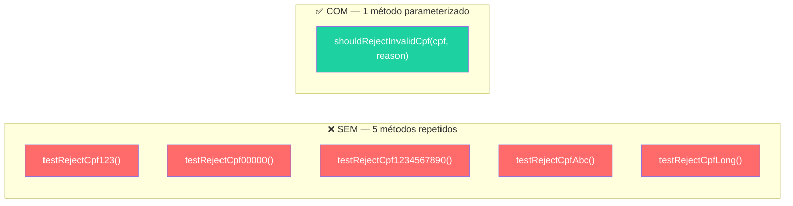

> **Regra**: Se testar a **mesma lógica** com **dados diferentes**, use `@ParameterizedTest`.

---

## TODO 6: Testes de Integração com Testcontainers ⭐⭐⭐

**Arquivo**: `src/test/java/.../repository/EmployeeRepositoryIT.java`

**Tempo estimado**: 25 minutos

```java
// TODO 6: Em EmployeeRepositoryIT — testar persistência real:
//   - Salvar Employee e buscar por ID — comparar campos
//   - Testar busca paginada (Pageable) com 15 registros
//   - Testar filtro por departamento contra banco PostgreSQL real
```

### Pré-requisito: Podman Desktop rodando!

```bash
podman --version   # deve retornar a versão
podman ps          # deve funcionar sem erros
```

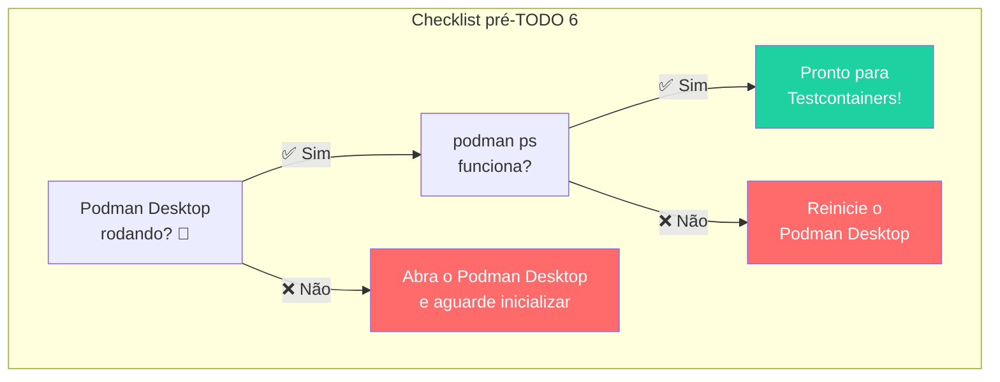

### Ciclo de Vida do Teste de Integração

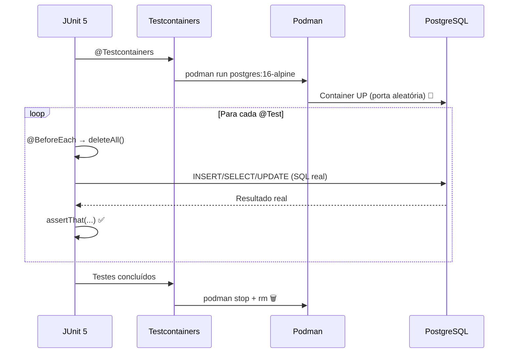

### 6.1 — Salvar e Buscar por ID

```java
@Test
@DisplayName("Deve salvar funcionário e buscar por ID")
void shouldSaveAndFindById() {
    // Arrange — criar dados reais no PostgreSQL
    var department = departmentRepository.save(new Department(null, "Tecnologia"));

    var employee = new Employee();
    employee.setName("João Silva");
    employee.setEmail("joao@email.com");
    employee.setCpf("529.982.247-25");
    employee.setSalary(new BigDecimal("3000.00"));
    employee.setDepartment(department);

    // Act — INSERT real no PostgreSQL
    Employee saved = employeeRepository.save(employee);
    Optional<Employee> found = employeeRepository.findById(saved.getId());

    // Assert — SELECT real do PostgreSQL
    assertThat(found).isPresent();
    assertAll(
        () -> assertThat(found.get().getName()).isEqualTo("João Silva"),
        () -> assertThat(found.get().getEmail()).isEqualTo("joao@email.com"),
        () -> assertThat(found.get().getSalary())
                .isEqualByComparingTo(new BigDecimal("3000.00")),
        () -> assertThat(found.get().getId()).isNotNull()
    );
}
```

### 6.2 — Busca Paginada com 15 Registros

```java
@Test
@DisplayName("Deve retornar página de funcionários com 15 registros")
void shouldReturnPageOfEmployees() {
    var department = departmentRepository.save(new Department(null, "TI"));

    // Criar 15 funcionários
    for (int i = 1; i <= 15; i++) {
        var employee = new Employee();
        employee.setName("Funcionário " + i);
        employee.setEmail("func" + i + "@email.com");
        employee.setCpf(String.format("%011d", i));
        employee.setSalary(new BigDecimal("3000.00"));
        employee.setDepartment(department);
        employeeRepository.save(employee);
    }

    // Buscar página 0 com 10 itens
    Page<Employee> page = employeeRepository.findAll(PageRequest.of(0, 10));

    assertAll(
        () -> assertThat(page.getContent()).hasSize(10),
        () -> assertThat(page.getTotalElements()).isEqualTo(15),
        () -> assertThat(page.getTotalPages()).isEqualTo(2)
    );
}
```

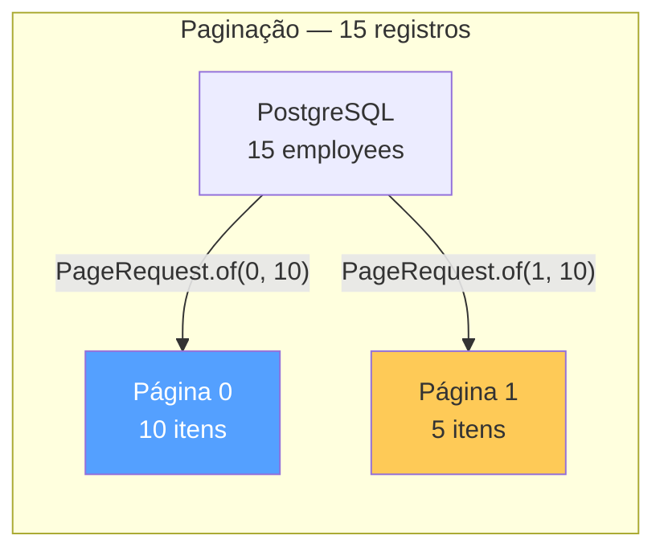

### 6.3 — Filtro por Departamento

```java
@Test
@DisplayName("Deve buscar funcionários por departamento")
void shouldFindByDepartment() {
    var ti = departmentRepository.save(new Department(null, "TI"));
    var rh = departmentRepository.save(new Department(null, "RH"));

    // 3 de TI, 2 de RH
    for (int i = 1; i <= 3; i++) {
        var employee = new Employee();
        employee.setName("TI " + i);
        employee.setEmail("ti" + i + "@email.com");
        employee.setCpf(String.format("%011d", i));
        employee.setSalary(new BigDecimal("3000.00"));
        employee.setDepartment(ti);
        employeeRepository.save(employee);
    }

    for (int i = 1; i <= 2; i++) {
        var employee = new Employee();
        employee.setName("RH " + i);
        employee.setEmail("rh" + i + "@email.com");
        employee.setCpf(String.format("%011d", i + 10));
        employee.setSalary(new BigDecimal("3000.00"));
        employee.setDepartment(rh);
        employeeRepository.save(employee);
    }

    // Filtrar apenas TI
    List<Employee> tiEmployees = employeeRepository.findByDepartmentId(ti.getId());

    assertThat(tiEmployees).hasSize(3);
    assertThat(tiEmployees).allMatch(
        e -> e.getDepartment().getId().equals(ti.getId())
    );
}
```

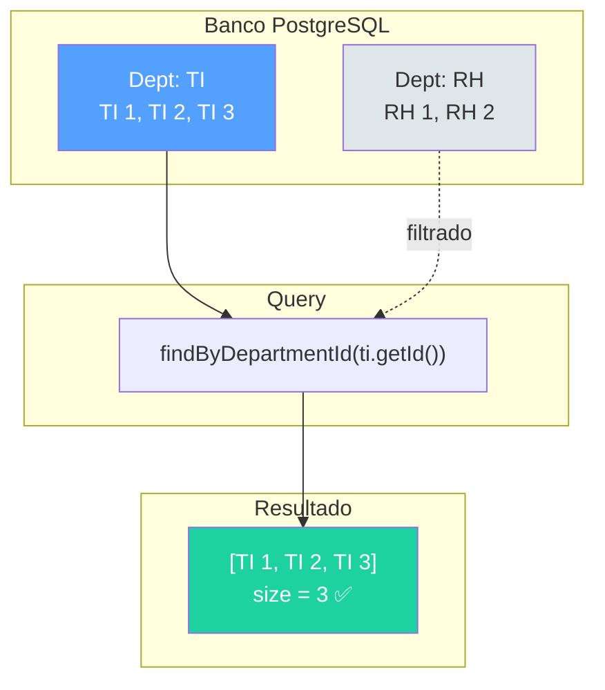

---

## TODO 7: Testar Constraint UNIQUE no Banco ⭐⭐

**Arquivo**: `src/test/java/.../repository/EmployeeRepositoryIT.java`

**Tempo estimado**: 10 minutos

```java
// TODO 7: Testar constraint de email único no banco:
//   - Salvar dois employees com mesmo email → esperar DataIntegrityViolationException
```

### Conceito: Por que este teste é diferente do TODO 4?

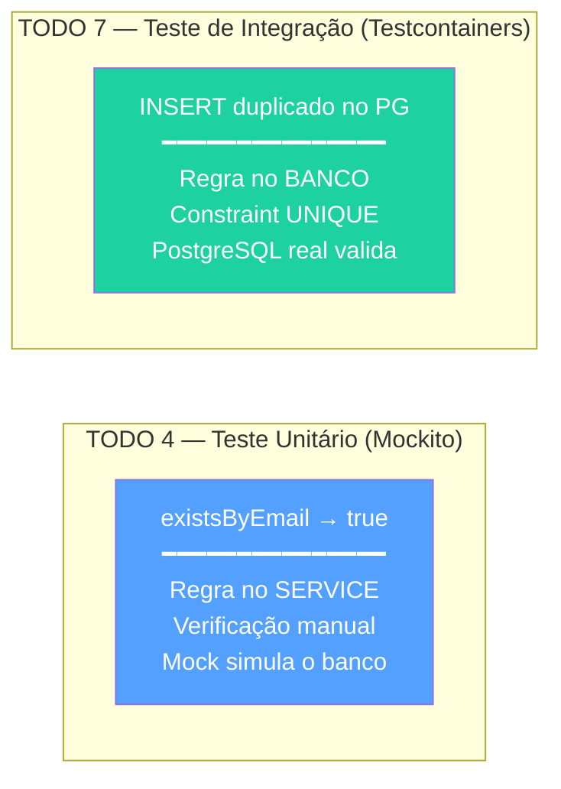

| Aspecto | TODO 4 (Unitário) | TODO 7 (Integração) |
|---------|-------------------|---------------------|
| Quem valida? | `EmployeeService` | PostgreSQL (constraint UNIQUE) |
| Mock ou real? | Mock do repository | Banco real com Testcontainers |
| Exceção | `DuplicateEmailException` | `DataIntegrityViolationException` |
| O que testa? | Lógica de negócio | Schema do banco |

### Implementação — Gabarito

```java
@Test
@DisplayName("Deve lançar exceção ao salvar email duplicado no banco")
void shouldThrowOnDuplicateEmail() {
    var department = departmentRepository.save(new Department(null, "TI"));

    // Primeiro: salvar com sucesso
    var employee1 = new Employee();
    employee1.setName("João");
    employee1.setEmail("mesmo@email.com");
    employee1.setCpf("52998224725");
    employee1.setSalary(new BigDecimal("3000.00"));
    employee1.setDepartment(department);
    employeeRepository.saveAndFlush(employee1);  // ← flush!

    // Segundo: mesmo email → deve falhar
    var employee2 = new Employee();
    employee2.setName("Maria");
    employee2.setEmail("mesmo@email.com");  // mesmo email!
    employee2.setCpf("98765432100");
    employee2.setSalary(new BigDecimal("4000.00"));
    employee2.setDepartment(department);

    // ❗ Constraint UNIQUE do PostgreSQL real
    assertThrows(DataIntegrityViolationException.class,
            () -> employeeRepository.saveAndFlush(employee2));
}
```

### ⚠️ Lembre: saveAndFlush() é obrigatório!

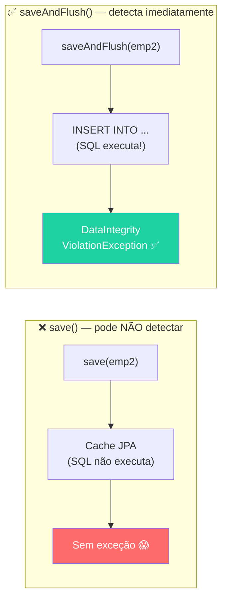

---

## ⏱️ Checkpoint Final — 16:30

### Validação Completa

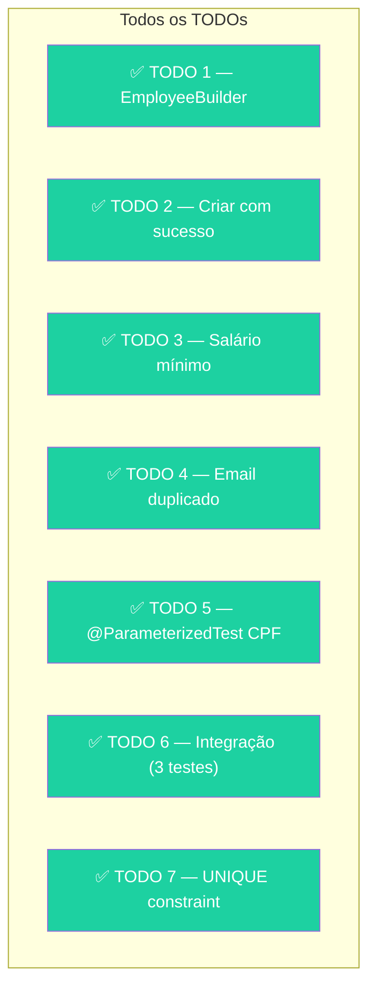

```bash
# Rodar TODOS os testes (Podman precisa estar rodando!)
mvn test

# Resultado esperado:
# Tests run: XX, Failures: 0, Errors: 0, Skipped: 0
# BUILD SUCCESS ✅
```

---

## 📊 Cobertura Esperada

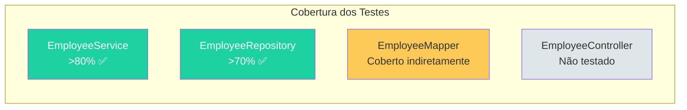

| Classe | Cobertura | Como |
|--------|-----------|------|
| `EmployeeService` | >80% ✅ | Testes unitários (TODO 2-5) |
| `EmployeeRepository` | >70% ✅ | Testes de integração (TODO 6-7) |
| `EmployeeMapper` | Indireta | Coberto pelos testes de Service |
| `EmployeeController` | Não testado | Use `@WebMvcTest` se desejar (extra) |

---

## 🏆 Desafios Extras (Opcional)

Se terminou antes do tempo:

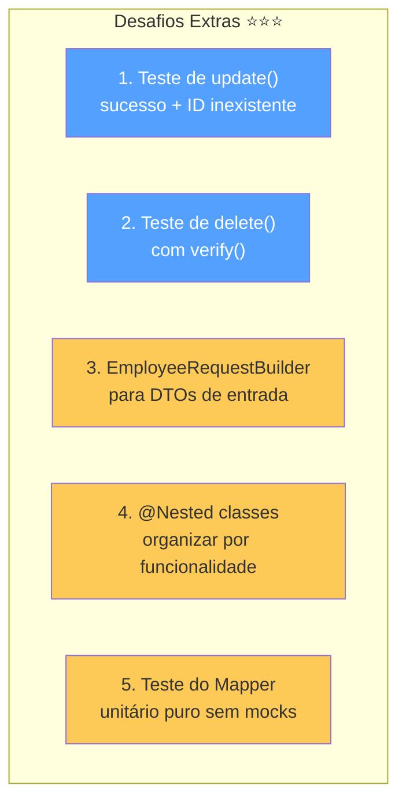

1. **Teste de `update()`** — cenário de sucesso com `ArgumentCaptor` e cenário de ID inexistente
2. **Teste de `delete()`** — verificar com `verify()` que `repository.delete()` foi chamado
3. **`EmployeeRequestBuilder`** — builder fluente para o DTO de entrada
4. **`@Nested` classes** — organizar: `CreateEmployee`, `UpdateEmployee`, `DeleteEmployee`, `FindEmployee`
5. **Teste do Mapper** — unitário puro: `EmployeeMapper.toEntity()` e `EmployeeMapper.toResponse()`

---

## 💡 Dica do Instrutor

> Os testes de integração (TODO 6-7) são os mais desafiadores. Se algum aluno travar, verifique:
> 1. Podman Desktop está rodando?
> 2. `@BeforeEach` tem `deleteAll()`?
> 3. Está usando `saveAndFlush()` para o teste de constraint?
> 4. Está salvando o `Department` antes do `Employee`? (FK)

> **Para a turma**: "A diferença entre TODO 4 e TODO 7 é fundamental — um testa a regra de negócio do Service, o outro testa a constraint do banco. Ambos são necessários porque são **camadas diferentes de proteção**."
