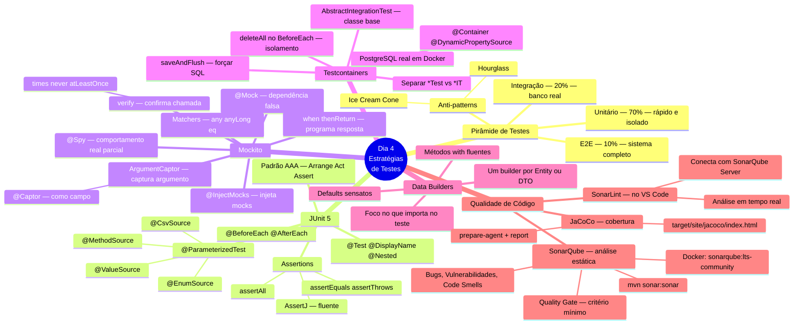
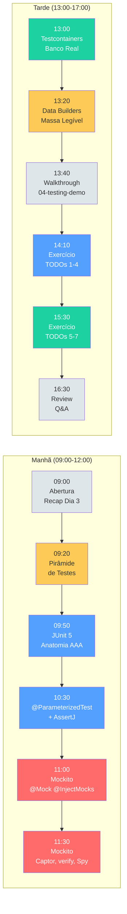
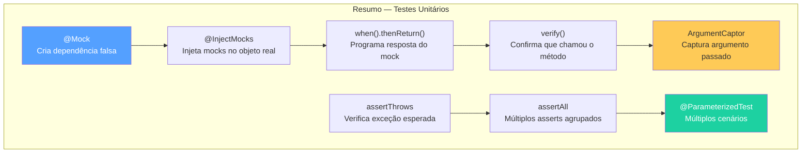
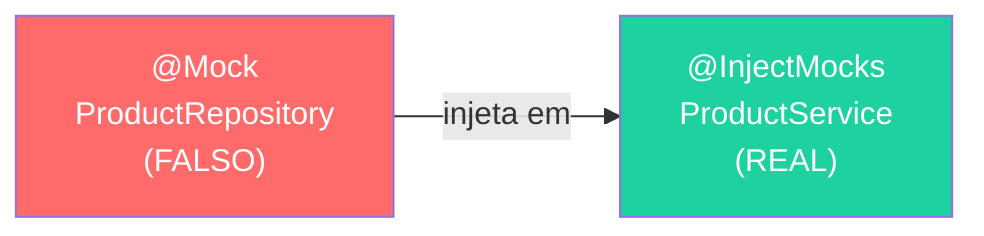
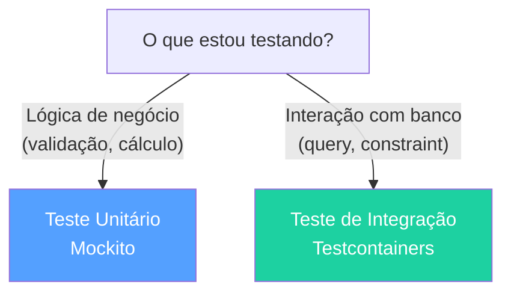
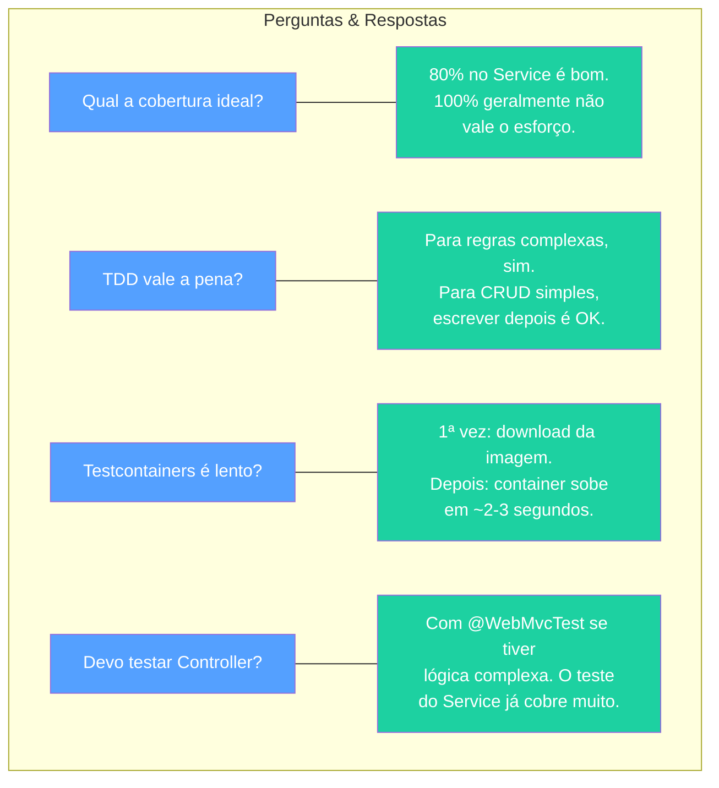
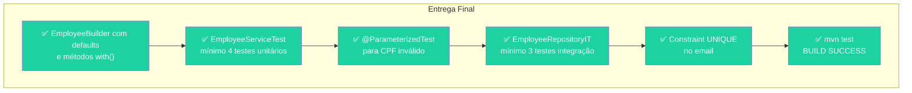
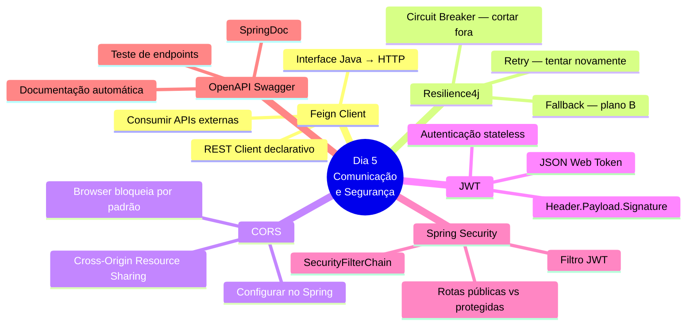
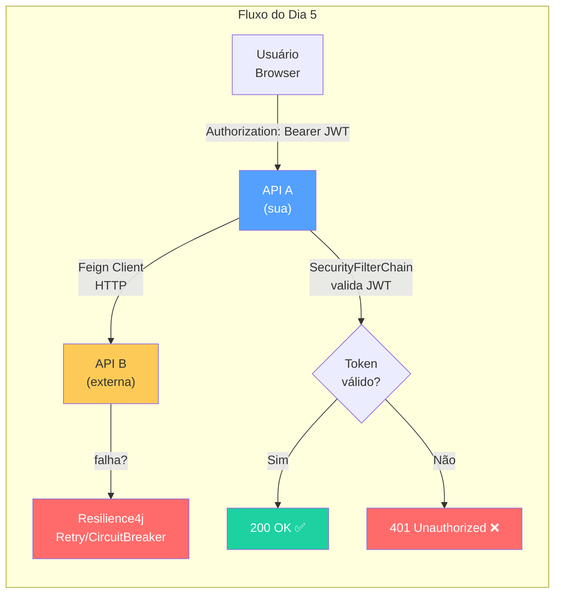

# Slide 12: Review e Q&A

**Horário:** 16:30 - 17:00

---

## 📊 Mapa Mental Completo do Dia 4



---

## 🗺️ Jornada Visual do Dia



---

## 📋 Resumo por Tema

### Testes Unitários — Mockito



| Conceito | Para que serve | Exemplo |
|----------|---------------|---------|
| `@Mock` | Criar dependência falsa | `@Mock ProductRepository` |
| `@InjectMocks` | Injetar mocks no objeto testado | `@InjectMocks ProductService` |
| `when().thenReturn()` | Programar resposta do mock | `when(repo.findById(1L)).thenReturn(...)` |
| `verify()` | Confirmar que chamou o método | `verify(repo).save(any())` |
| `verify(never())` | Confirmar que NÃO chamou | `verify(repo, never()).delete(any())` |
| `ArgumentCaptor` | Capturar argumento passado | `verify(repo).save(captor.capture())` |
| `@Captor` | Captor como campo de classe | Reutilizar em vários testes |
| `@Spy` | Manter comportamento real | Somente quando necessário (~5%) |
| `assertThrows` | Verificar exceção | `assertThrows(NotFoundException.class, ...)` |
| `assertAll` | Verificar múltiplos asserts | `assertAll(() -> ..., () -> ...)` |
| `@ParameterizedTest` | Múltiplos cenários | `@CsvSource({"a,b", "c,d"})` |
| `AssertJ` | Assertions fluentes | `assertThat(x).isEqualTo(y)` |

### Testes de Integração — Testcontainers

| Conceito | Para que serve | Exemplo |
|----------|---------------|---------|
| `@SpringBootTest` | Subir contexto Spring | Classe de teste |
| `@Testcontainers` | Gerenciar containers | Classe de teste |
| `@Container` | Declarar container | `PostgreSQLContainer` |
| `@DynamicPropertySource` | Injetar config do container | `registry.add("url", ...)` |
| `AbstractIntegrationTest` | Reutilizar config | Classe base abstrata |
| `deleteAll()` no `@BeforeEach` | Isolamento entre testes | Limpar dados |
| `saveAndFlush()` | Forçar SQL imediato | Testar constraints UNIQUE |
| Sufixo `IT` | Convenção Maven | `EmployeeRepositoryIT` |

### Data Builders

| Conceito | Para que serve | Exemplo |
|----------|---------------|---------|
| Defaults sensatos | `.build()` gera objeto válido | `name="João"`, `salary=3000` |
| Métodos `with()` | Alterar apenas o relevante | `.withSalary(1000)` |
| `return this` | Encadeamento fluente | `.withName("X").withEmail("Y")` |
| `anEmployee()` | Entrada fluente | `EmployeeBuilder.anEmployee()` |
| Pasta `test/builder/` | Organização | Não é código de produção |

---

## 🧠 Quiz Final

### Pergunta 1: @Mock vs @InjectMocks
**Qual a diferença entre `@Mock` e `@InjectMocks`?**

<details>
<summary>Resposta</summary>

- `@Mock` cria uma implementação **falsa** de uma dependência (retorna null/0/false por padrão)
- `@InjectMocks` cria uma instância **real** da classe testada e injeta os mocks nela


</details>

### Pergunta 2: Unitário vs Integração
**Quando usar teste unitário vs teste de integração?**

<details>
<summary>Resposta</summary>

- **Unitário**: para lógica de negócio pura (Service, Mapper, Validator) — isolado com mocks, sem Docker
- **Integração**: quando depende de recurso externo (banco, API, fila) — teste com o recurso real via Testcontainers


</details>

### Pergunta 3: saveAndFlush()
**Por que `saveAndFlush()` em vez de `save()` ao testar constraints?**

<details>
<summary>Resposta</summary>

`save()` pode apenas armazenar em cache (1st level cache do Hibernate) sem executar o SQL.

`saveAndFlush()` força a execução imediata do `INSERT`, fazendo o PostgreSQL validar a constraint UNIQUE naquele momento.
</details>

### Pergunta 4: ArgumentCaptor
**Para que serve o `ArgumentCaptor`?**

<details>
<summary>Resposta</summary>

Para capturar o argumento que foi passado a um método mockado. Útil quando o Service cria um objeto internamente e passa ao Repository — o captor permite inspecionar **exatamente** o que foi salvo.

```java
verify(repo).save(captor.capture());
Employee captured = captor.getValue();
assertThat(captured.getName()).isEqualTo("João");
```
</details>

### Pergunta 5: Data Builders
**O que são Data Builders e por que usá-los?**

<details>
<summary>Resposta</summary>

São classes que implementam o Builder Pattern para criar objetos de teste com **defaults sensatos**. Benefícios:
1. **Legibilidade** — cada campo é nomeado
2. **Foco** — só altera o dado relevante para aquele teste
3. **Menos repetição** — defaults cobrem dados comuns
4. **Menos fragilidade** — novo campo na Entity não quebra testes existentes
</details>

### Pergunta 6: TODO 4 vs TODO 7
**Qual a diferença entre testar email duplicado no Service (TODO 4) vs no Banco (TODO 7)?**

<details>
<summary>Resposta</summary>

| Aspecto | TODO 4 (Service) | TODO 7 (Banco) |
|---------|-------------------|----------------|
| Quem valida? | Lógica Java (`if existsByEmail`) | Constraint PostgreSQL (`UNIQUE`) |
| Tipo | Teste unitário (Mockito) | Teste de integração (Testcontainers) |
| Exceção | `DuplicateEmailException` | `DataIntegrityViolationException` |
| Proteção | Primeira camada | Segunda camada (rede de segurança) |

**Ambos são necessários** — camadas diferentes de proteção!
</details>

---

## 📝 Reflexões — Perguntas Frequentes



| Pergunta | Resposta |
|----------|----------|
| **Qual a cobertura ideal?** | 80% no Service é um bom alvo. 100% geralmente não vale o esforço de manter. |
| **TDD vale a pena?** | Para regras de negócio complexas, sim. Para CRUD simples, escrever depois é OK. |
| **Quando Testcontainers é lento?** | Na primeira execução (download da imagem Docker). Depois, o container sobe em ~2-3s. |
| **Devo testar Controller?** | Com `@WebMvcTest` (teste de integração leve) se tiver lógica de roteamento/validação complexa. |
| **AssertJ ou JUnit assertions?** | AssertJ é mais expressivo e legível. Prefira sempre que possível. |
| **Quantos testes por método?** | Pelo menos 1 para o caminho feliz + 1 para cada cenário de erro. |

---

## ✅ Checklist de Entrega — 04-employee-api-tests



- [ ] `EmployeeBuilder` com defaults sensatos e métodos `with()`
- [ ] `EmployeeServiceTest` com mínimo **4 testes unitários** passando
- [ ] `@ParameterizedTest` para CPF inválido
- [ ] `EmployeeRepositoryIT` com mínimo **3 testes de integração** passando
- [ ] Teste de constraint UNIQUE no email
- [ ] `mvn test` → **BUILD SUCCESS** ✅

---

## 📅 Preparação para o Dia 5

### Temas do Dia 5: Comunicação entre Sistemas e Segurança



### O que preparar para amanhã

- [ ] Docker rodando (`docker run hello-world`)
- [ ] Projeto `04-employee-api-tests` com todos os testes passando
- [ ] Revisar conceito de **HTTP Headers** (`Authorization`, `Content-Type`)
- [ ] Entender o que é uma **API REST** que consome outra API
- [ ] _(Opcional)_ Ler sobre JWT em jwt.io



---

## 📚 Referências para Estudo

| Recurso | Link |
|---------|------|
| JUnit 5 User Guide | https://junit.org/junit5/docs/current/user-guide/ |
| Mockito — Getting Started | https://javadoc.io/doc/org.mockito/mockito-core/latest/ |
| Testcontainers — Quick Start | https://java.testcontainers.org/quickstart/junit_5_quickstart/ |
| AssertJ — Core Features | https://assertj.github.io/doc/ |
| Baeldung — Mockito Tutorial | https://www.baeldung.com/mockito-series |
| Baeldung — Testcontainers | https://www.baeldung.com/spring-boot-testcontainers |
| Baeldung — JUnit 5 Parameterized | https://www.baeldung.com/parameterized-tests-junit-5 |
| Baeldung — ArgumentCaptor | https://www.baeldung.com/mockito-argumentcaptor |
| Baeldung — Builder Pattern | https://www.baeldung.com/creational-design-patterns |
| JaCoCo — Java Code Coverage | https://www.jacoco.org/jacoco/ |
| SonarQube — Documentação Oficial | https://docs.sonarsource.com/sonarqube/latest/ |
| SonarLint — VS Code Extension | https://marketplace.visualstudio.com/items?itemName=SonarSource.sonarlint-vscode |
| Baeldung — SonarQube + Maven | https://www.baeldung.com/sonar-qube |

---

## 💡 Dica do Instrutor

> Encerre o dia pedindo para cada aluno compartilhar **uma coisa que aprendeu** que vai mudar a forma como escreve testes. Isso reforça o aprendizado e cria sensação de progresso.

> **Mensagem final**: "Testes não são documentação do que o código faz — são **garantias** do que o código **continua** fazendo. Quando você muda algo e os testes passam, você tem confiança. Quando não tem testes, você tem medo."
