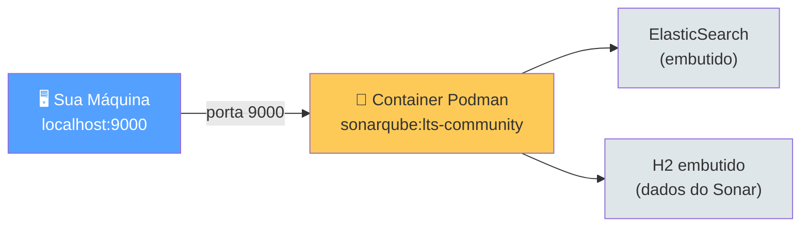
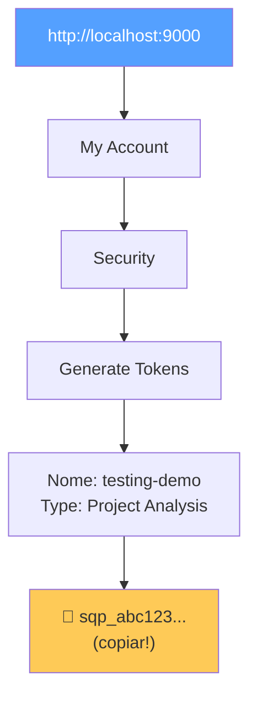
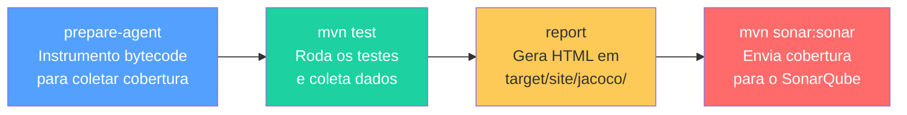
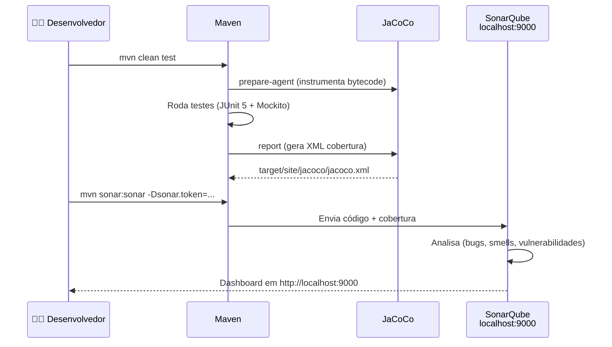
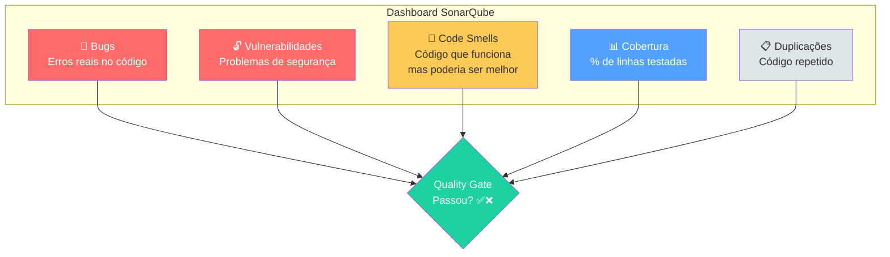
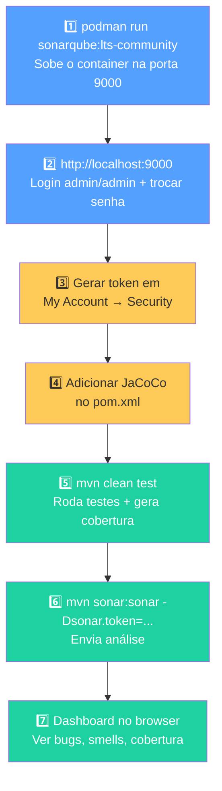

# Slide 13: SonarQube com Podman — Hands-on

**Horário:** Bônus / Pós-aula

---

## 🎯 Objetivo

Subir o **SonarQube** localmente via **Podman** e analisar o projeto `04-testing-demo` com `mvn sonar:sonar`.

---

## 1️⃣ Subir o SonarQube no Podman

### Pré-requisito: Podman Desktop rodando

```bash
# Verificar que o Podman está funcionando
podman --version
podman run docker.io/library/hello-world
```

### Subir o container SonarQube

```bash
podman run -d \
  --name sonarqube \
  -p 9000:9000 \
  -e SONAR_ES_BOOTSTRAP_CHECKS_DISABLE=true \
  docker.io/library/sonarqube:lts-community
```

> **Windows PowerShell** — use backtick `` ` `` em vez de `\` para quebrar linha:

```powershell
podman run -d `
  --name sonarqube `
  -p 9000:9000 `
  -e SONAR_ES_BOOTSTRAP_CHECKS_DISABLE=true `
  docker.io/library/sonarqube:lts-community
```

### Diagrama do que acontece



---

## 2️⃣ Acessar o SonarQube

1. Aguarde ~1-2 minutos para o container iniciar
2. Acesse: **http://localhost:9000**
3. Login padrão:
   - **Usuário:** `admin`
   - **Senha:** `admin`
4. O SonarQube vai pedir para trocar a senha no primeiro acesso

### Verificar se o container está rodando

```bash
podman ps
# Deve mostrar o container "sonarqube" com status "Up"

# Ver logs em tempo real (espere aparecer "SonarQube is operational")
podman logs -f sonarqube
```

---

## 3️⃣ Gerar Token de Acesso

1. Acesse **http://localhost:9000** → **My Account** (canto superior direito)
2. Aba **Security** → **Generate Tokens**
3. Preencha:
   - **Name:** `testing-demo`
   - **Type:** `Project Analysis Token`
   - **Project:** (selecione ou deixe Global)
   - **Expires in:** `30 days`
4. Clique em **Generate**
5. **Copie o token** (ex: `sqp_abc123...`) — ele só aparece **uma vez**!



---

## 4️⃣ Adicionar JaCoCo ao pom.xml do 04-testing-demo

Para que o SonarQube exiba a **cobertura de código**, é necessário gerar o relatório JaCoCo.

Adicione o plugin no `<build><plugins>` do `pom.xml`:

```xml
<!-- JaCoCo — Cobertura de código -->
<plugin>
    <groupId>org.jacoco</groupId>
    <artifactId>jacoco-maven-plugin</artifactId>
    <version>0.8.11</version>
    <executions>
        <execution>
            <id>prepare-agent</id>
            <goals>
                <goal>prepare-agent</goal>
            </goals>
        </execution>
        <execution>
            <id>report</id>
            <phase>test</phase>
            <goals>
                <goal>report</goal>
            </goals>
        </execution>
    </executions>
</plugin>
```

### O que cada parte faz



---

## 5️⃣ Rodar a Análise do SonarQube via Maven

### No diretório do 04-testing-demo

```bash
cd 04-testing-demo

# Passo 1: Rodar testes + gerar cobertura JaCoCo
mvn clean test

# Passo 2: Enviar análise para o SonarQube
mvn sonar:sonar "-Dsonar.projectKey=testing-demo" "-Dsonar.projectName=Testing Demo" "-Dsonar.host.url=http://localhost:9000" "-Dsonar.login=sqp_SEU_TOKEN_AQUI"
 
```

> **Windows PowerShell:**

```powershell
cd 04-testing-demo

# Passo 1: Rodar testes + gerar cobertura JaCoCo
mvn clean test

# Passo 2: Enviar análise para o SonarQube
mvn sonar:sonar "-Dsonar.projectKey=testing-demo" "-Dsonar.projectName=Testing Demo" "-Dsonar.host.url=http://localhost:9000" "-Dsonar.login=sqp_SEU_TOKEN_AQUI"
 

```

### Fluxo completo



---

## 6️⃣ Ver Resultados no Dashboard

Após a análise, acesse **http://localhost:9000** → **Projects** → **Testing Demo**

### O que o SonarQube mostra



| Métrica | O que significa | Meta |
|---------|----------------|------|
| **Bugs** | Erros que causam comportamento incorreto | 0 |
| **Vulnerabilities** | Falhas de segurança exploráveis | 0 |
| **Code Smells** | Código confuso/desnecessário | Quanto menos, melhor |
| **Coverage** | % de linhas cobertas por testes | ≥ 80% |
| **Duplications** | % de código copiado/colado | < 3% |
| **Quality Gate** | Critério geral de aprovação | ✅ Passed |

---

## 7️⃣ Comandos Úteis do Podman

```bash
# Ver se o container está rodando
podman ps

# Parar o SonarQube
podman stop sonarqube

# Iniciar novamente (mantém dados)
podman start sonarqube

# Ver logs
podman logs -f sonarqube

# Remover completamente (perde dados)
podman rm -f sonarqube
```

---

## 🧩 Resumo Rápido — Passo a Passo Completo



---

## ⚠️ Troubleshooting

| Problema | Solução |
|----------|---------|
| Container não sobe | Verificar Podman Desktop está rodando: `podman machine start` |
| Porta 9000 ocupada | Usar outra porta: `-p 9001:9000` e ajustar `sonar.host.url` |
| "SonarQube is starting" | Aguardar ~2 min; verificar com `podman logs -f sonarqube` |
| Erro de memória | Podman precisa de pelo menos **2GB RAM** alocados para o container |
| Token inválido | Gerar novo token em My Account → Security |
| Cobertura aparece 0% | Verificar que JaCoCo está no `pom.xml` e rodou `mvn test` antes |
| `mvn sonar:sonar` não encontra plugin | Funciona sem declarar no pom — Maven baixa automaticamente |

---

## 📚 Referências

| Recurso | Link |
|---------|------|
| SonarQube Docker/Podman Setup | https://docs.sonarsource.com/sonarqube/latest/setup-and-upgrade/install-the-server/installing-sonarqube-from-docker/ |
| SonarScanner for Maven | https://docs.sonarsource.com/sonarqube/latest/analyzing-source-code/scanners/sonarscanner-for-maven/ |
| JaCoCo Maven Plugin | https://www.eclemma.org/jacoco/trunk/doc/maven.html |
| Baeldung — SonarQube + Maven | https://www.baeldung.com/sonar-qube |
