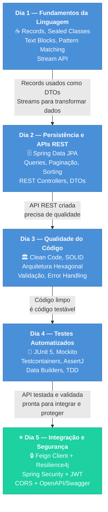
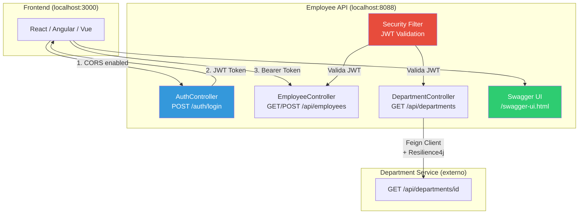

# Slide 1: Abertura e Recap do Dia 4

**Horário:** 09:00 - 09:15

---

## 📝 Recapitulando o Dia 4

No Dia 4 aprendemos a **garantir qualidade com testes automatizados**:

- ✓ **Pirâmide de Testes** — Unitários (70%) + Integração (20%) + E2E (10%)
- ✓ **JUnit 5** — Padrão AAA, @Test, @DisplayName, @ParameterizedTest
- ✓ **Mockito** — @Mock, @InjectMocks, when/thenReturn, verify, ArgumentCaptor
- ✓ **Testcontainers** — PostgreSQL real em Docker, @DynamicPropertySource
- ✓ **Data Builders** — EmployeeBuilder fluente com defaults sensatos
- ✓ **Cobertura** — >80% na camada Service

> **Hoje vamos aprender a conectar serviços, proteger APIs e documentar tudo!**

### 🧠 Revisão Rápida — Associe os Conceitos

| Dia | Tema Central | Resultado |
|-----|-------------|-----------|
| **Dia 1** | Fundamentos Java Moderno | Records, Sealed Classes, Streams — linguagem expressiva |
| **Dia 2** | Persistência e REST | Spring Data JPA, APIs REST — dados acessíveis |
| **Dia 3** | Qualidade do Código | Clean Code, Arquitetura limpa — código sustentável |
| **Dia 4** | Testes Automatizados | JUnit 5, Mockito, Testcontainers — confiança para evoluir |
| **Dia 5** | **Integração e Segurança** | Feign, JWT, Swagger — **API de produção** |

---

## 🔗 Conexão entre os Dias — A Jornada do Desenvolvedor

### Por que Integração e Segurança são o próximo passo?

| O que fizemos nos dias anteriores | A lacuna | O que aprendemos hoje |
|-----------------------------------|----------|----------------------|
| Criamos APIs REST completas | A API vive sozinha, isolada | **Feign Client** — consumir outras APIs |
| Testes garantem que funciona | O serviço externo pode cair | **Resilience4j** — retry, fallback, circuit breaker |
| Validação e error handling | Qualquer um acessa tudo | **Spring Security + JWT** — autenticação |
| Código limpo e arquitetura | Ninguém sabe usar a API | **OpenAPI/Swagger** — documentação interativa |

---

## 🎯 Objetivos do Dia 5

Ao final deste dia, o aluno será capaz de:

1. **Feign Client** — Consumir APIs externas de forma declarativa, sem boilerplate HTTP
2. **Resilience4j** — Proteger a aplicação com Retry, Circuit Breaker e Fallback
3. **CORS** — Configurar permissões para frontends em domínios diferentes
4. **Spring Security + JWT** — Implementar autenticação/autorização stateless completa
5. **OpenAPI/Swagger** — Documentar e testar endpoints interativamente no browser

---

## 🏗️ O que vamos construir

### Dois projetos, um padrão

| Projeto | Porta | Papel | Objetivo |
|---------|-------|-------|----------|
| `05-integration-security-demo` | 8088 | **Demonstração** (professor) | Referência completa com todos os conceitos |
| `05-employee-api-secure` | 8089 | **Exercício** (aluno) | 8 TODOs para implementar passo a passo |

---

## 📎 Agenda Detalhada

| # | Horário | Slide | Conteúdo |
|---|---------|-------|----------|
| 1 | 09:00 | Este slide | Recap + Introdução |
| 2 | 09:15 | Slide 2 | Feign Client |
| 3 | 09:45 | Slide 3 | Resilience4j |
| 4 | 10:15 | Slide 4 | CORS |
| - | 10:45 | ☕ | Coffee Break |
| 5 | 11:00 | Slide 5 | Security + JWT (Parte 1) |
| 6 | 11:30 | Slide 6 | Security + JWT (Parte 2) |
| - | 12:00 | 🍽️ | Almoço |
| 7 | 13:00 | Slide 7 | OpenAPI / Swagger |
| 8 | 13:20 | Slide 8 | Walkthrough Demo |
| 9 | 13:50 | Slide 9 | Exercício (TODOs 1-4) |
| 10 | 15:30 | Slide 10 | Exercício (TODOs 5-8) |
| 11 | 16:30 | Slide 11 | Review + Q&A |
