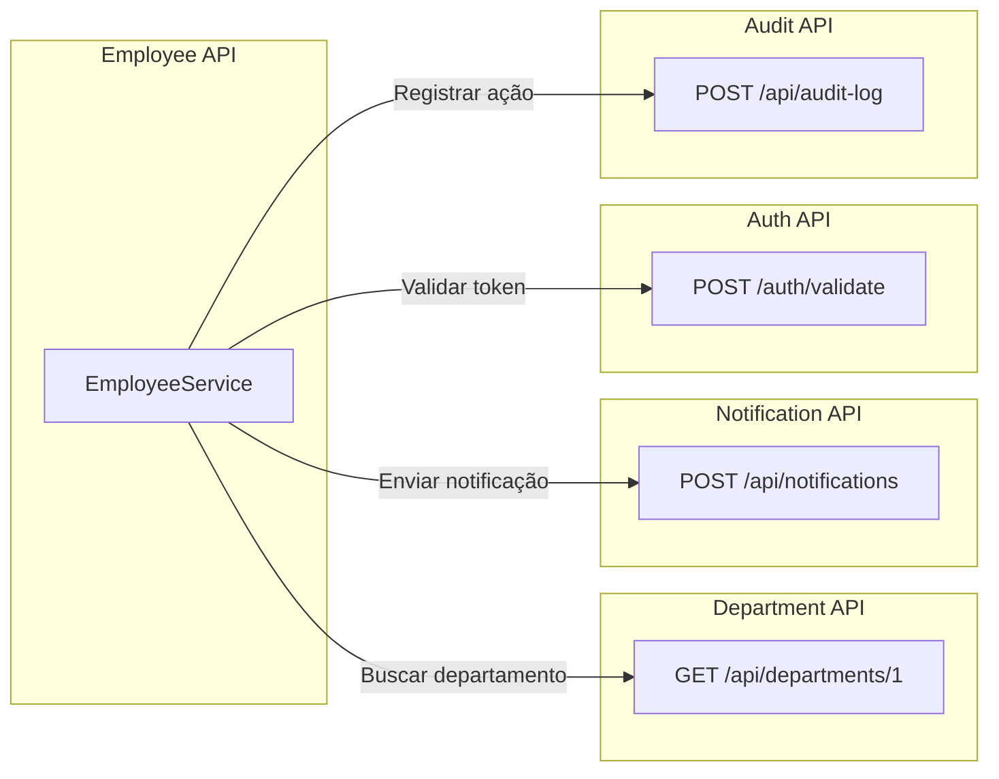
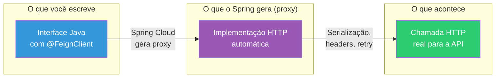
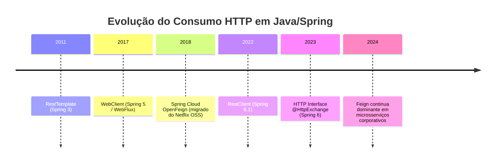
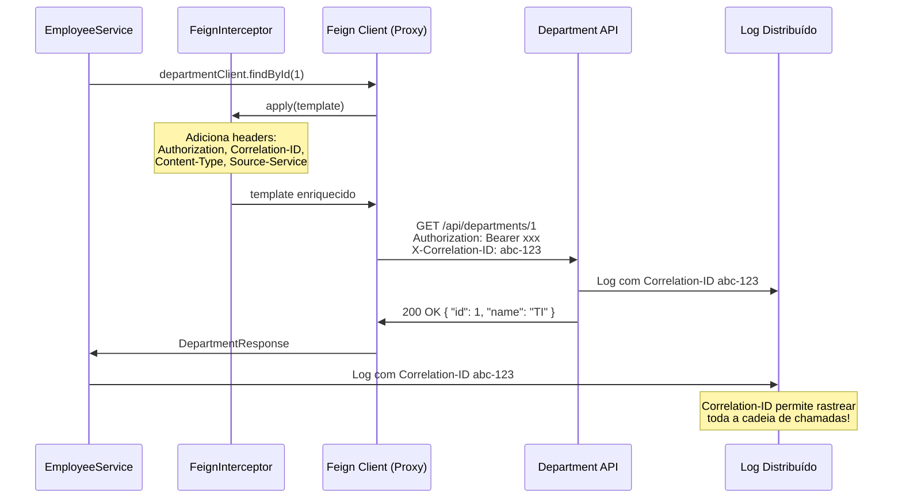
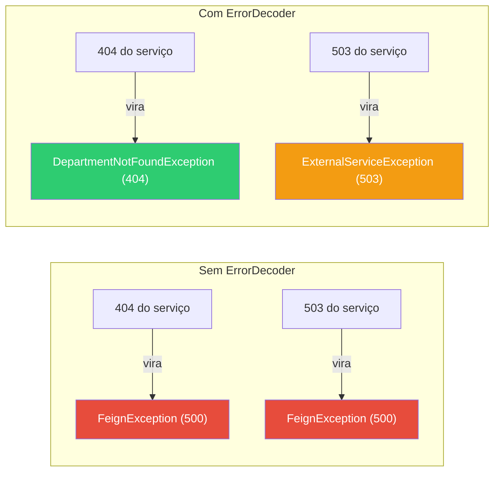
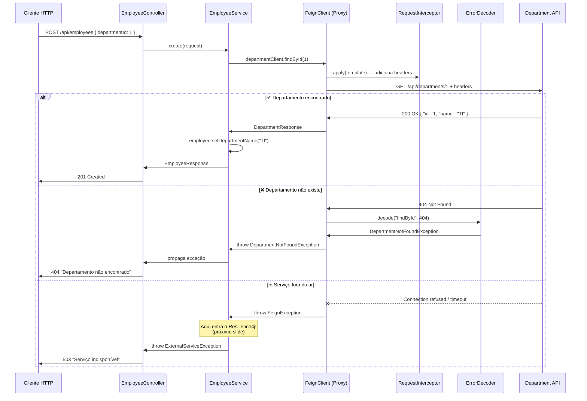

# Slide 2: Consumo de APIs com Feign Client

**Horário:** 09:15 - 09:45

---

## O Problema: Comunicação entre Microsserviços

No mundo real, **nenhuma API opera sozinha**. Uma arquitetura de microsserviços envolve dezenas de serviços se comunicando:



> **Netflix, Uber e Nubank** operam com centenas de microsserviços se chamando mutuamente. O Netflix foi pioneiro em criar o Feign Client para resolver esse problema.

**Pergunta**: Como fazer chamadas HTTP de um serviço para outro em Java **sem reescrever boilerplate**?

---

## O que é o Feign Client?

**Feign** (pronuncia-se "fein") é um **cliente HTTP declarativo** criado pela Netflix e integrado ao Spring Cloud. Em vez de escrever código HTTP imperativo, você define uma **interface Java com anotações** e o framework gera a implementação em tempo de execução.



### Conceitos-Chave

| Conceito | Descrição |
|----------|-----------|
| **Declarativo** | Você descreve "o quê" (interface), não "como" (implementação HTTP) |
| **Proxy dinâmico** | Spring cria implementação real via JDK Proxy em runtime |
| **Integração Spring** | Usa `@GetMapping`, `@PostMapping`, `@PathVariable` — mesmas anotações do Controller |
| **Configurável** | URL, timeout, retry, headers — tudo no `application.yml` |

---

## Abordagens de Consumo de APIs no Ecossistema Java

| Abordagem | Ferramenta | Estilo | Verbosidade | Quando usar |
|-----------|-----------|--------|-------------|-------------|
| JDK puro | `HttpURLConnection` | Manual total | 🔴 Muito alta | Sem frameworks, situações especiais |
| Imperativa clássica | `RestTemplate` | Manual — monta URL, headers, body | 🟠 Alta | Legado, Spring < 5 |
| Imperativa moderna | `RestClient` (Spring 6.1+) | Fluente, síncrona | 🟡 Média | Spring Boot 3.2+ sem WebFlux |
| Reativa | `WebClient` | Non-blocking, reativa | 🟡 Média | Apps reativas (WebFlux) |
| **Declarativa** | **Feign Client** | **Interface Java + anotações** | 🟢 **Baixa** | **Microsserviços Spring Cloud** |
| Declarativa HTTP | `@HttpExchange` (Spring 6+) | Interface sem Spring Cloud | 🟢 Baixa | Spring nativo sem Cloud |

> **Feign Client é o padrão nas grandes consultorias e fintechs**: menos código, mais legibilidade, integração com Resilience4j e Service Discovery.

### Evolução Histórica



---

## RestTemplate vs. Feign Client — Comparação Prática

### ❌ Com RestTemplate (imperativo) — 18 linhas

```java
@Service
public class DepartmentService {

    private final RestTemplate restTemplate;

    public DepartmentResponse findById(Long id) {
        String url = "http://department-service:8081/api/departments/" + id;

        HttpHeaders headers = new HttpHeaders();
        headers.set("Authorization", "Bearer " + getToken());
        headers.set("X-Correlation-ID", UUID.randomUUID().toString());

        HttpEntity<Void> entity = new HttpEntity<>(headers);

        ResponseEntity<DepartmentResponse> response = restTemplate.exchange(
            url, HttpMethod.GET, entity, DepartmentResponse.class
        );

        if (response.getStatusCode() == HttpStatus.NOT_FOUND) {
            throw new DepartmentNotFoundException("Departamento " + id + " não encontrado");
        }

        return response.getBody();
    }
}
```

> **18 linhas de boilerplate** para uma chamada GET simples! Imagine 20 endpoints...

### ✅ Com Feign Client (declarativo) — 3 linhas

```java
@FeignClient(name = "department-service", url = "${department.api.url}")
public interface DepartmentClient {

    @GetMapping("/api/departments/{id}")
    DepartmentResponse findById(@PathVariable Long id);
}
```

> **3 linhas**. O framework cuida de HTTP, serialização, headers, retry, timeout, error decoding...

### Análise de Custo

| Aspecto | RestTemplate | Feign Client |
|---------|-------------|-------------|
| Linhas por endpoint | ~15-20 | ~2-3 |
| Headers manuais | ✅ Sim, todo request | ❌ RequestInterceptor |
| Error handling manual | ✅ if/switch em cada chamada | ❌ ErrorDecoder centralizado |
| Testes unitários | Difícil (muitos mocks) | Fácil (mock da interface) |
| Manutenção em 20 endpoints | 😱 300+ linhas | 😊 ~60 linhas |

---

## Anatomia do @FeignClient — Todos os Atributos

```java
@FeignClient(
    name = "department-service",        // Nome lógico (obrigatório) — usado no logging e metrics
    url = "${department.api.url}",      // URL base (configurável via properties)
    path = "/api",                      // Path prefix comum a todos os métodos
    configuration = FeignConfig.class,  // Configurações customizadas (ErrorDecoder, Interceptor)
    fallback = DepartmentFallback.class // Fallback em caso de erro (Resilience4j)
)
public interface DepartmentClient {

    @GetMapping("/departments/{id}")
    DepartmentResponse findById(@PathVariable Long id);

    @GetMapping("/departments")
    List<DepartmentResponse> findAll();

    @GetMapping("/departments/search")
    List<DepartmentResponse> search(@RequestParam("name") String name);

    @PostMapping("/departments")
    DepartmentResponse create(@RequestBody DepartmentRequest request);

    @PutMapping("/departments/{id}")
    DepartmentResponse update(@PathVariable Long id, @RequestBody DepartmentRequest request);

    @DeleteMapping("/departments/{id}")
    void delete(@PathVariable Long id);
}
```

### O que cada anotação/atributo significa

| Atributo | Obrigatório | Descrição |
|----------|-------------|-----------|
| `name` | ✅ | Nome lógico do serviço. Se usar Service Discovery (Eureka), é o nome registrado |
| `url` | ❌ | URL base do serviço. Se omitido, usa Service Discovery para resolver |
| `path` | ❌ | Path prefix aplicado a todos os métodos (evita repetição) |
| `configuration` | ❌ | Classe `@Configuration` com beans de customização (ErrorDecoder, Interceptors) |
| `fallback` | ❌ | Classe que implementa a interface com respostas default em caso de falha |
| `fallbackFactory` | ❌ | Similar ao fallback, mas recebe a exceção como parâmetro |
| `qualifier` | ❌ | Bean qualifier para quando existem múltiplos Feign Clients |

### Configuração no `application.yml`

```yaml
department:
  api:
    url: http://localhost:8081

# Configuração avançada do Feign
spring:
  cloud:
    openfeign:
      client:
        config:
          department-service:         # Nome do @FeignClient
            connect-timeout: 5000     # Timeout de conexão (ms)
            read-timeout: 10000       # Timeout de leitura (ms)
            logger-level: full        # NONE | BASIC | HEADERS | FULL
```

### Habilitando Feign na Aplicação

```java
@SpringBootApplication
@EnableFeignClients  // Scanneia e registra todas as interfaces @FeignClient como beans
public class EmployeeApiApplication {
    public static void main(String[] args) {
        SpringApplication.run(EmployeeApiApplication.class, args);
    }
}
```

> Sem `@EnableFeignClients`, o Spring **não reconhece** as interfaces e você terá `NoSuchBeanDefinitionException`.

---

## Interceptors — Headers Automáticos e Rastreabilidade

Todo request Feign pode ter headers adicionados automaticamente via `RequestInterceptor`:

```java
@Component
public class FeignAuthInterceptor implements RequestInterceptor {

    @Override
    public void apply(RequestTemplate template) {
        // 1. Token de autenticação serviço-a-serviço
        template.header("Authorization", "Bearer " + getServiceToken());

        // 2. Correlation ID para rastreabilidade distribuída
        String correlationId = MDC.get("correlationId");  // ou gera novo
        if (correlationId == null) {
            correlationId = UUID.randomUUID().toString();
        }
        template.header("X-Correlation-ID", correlationId);

        // 3. Content-Type
        template.header("Content-Type", "application/json");

        // 4. Identificação do serviço chamador
        template.header("X-Source-Service", "employee-api");
    }
}
```

### Por que Interceptors são importantes?



> **Correlation ID** é essencial em microsserviços. Sem ele, é impossível rastrear um request que passa por 5 serviços diferentes. Ferramentas como **Jaeger**, **Zipkin** e **AWS X-Ray** usam esse padrão.

---

## Error Decoder — Tratando Erros do Serviço Remoto

Sem `ErrorDecoder`, **qualquer erro do serviço externo vira uma `FeignException` genérica**. Isso é ruim para o consumidor da sua API:



### Implementação do ErrorDecoder

```java
public class CustomErrorDecoder implements ErrorDecoder {

    private final ErrorDecoder defaultDecoder = new Default();

    @Override
    public Exception decode(String methodKey, Response response) {
        // methodKey = "DepartmentClient#findById(Long)" — identifica o método chamado
        return switch (response.status()) {
            case 400 -> new BadRequestException(
                "Requisição inválida ao serviço externo"
            );
            case 404 -> new DepartmentNotFoundException(
                "Departamento não encontrado no serviço remoto"
            );
            case 429 -> new ExternalServiceException(
                "Rate limit excedido no serviço de departamentos"
            );
            case 503 -> new ExternalServiceException(
                "Serviço de departamentos temporariamente indisponível"
            );
            default -> defaultDecoder.decode(methodKey, response);
        };
    }
}
```

### Registrando o Error Decoder

```java
@Configuration
public class FeignConfig {

    @Bean
    public ErrorDecoder errorDecoder() {
        return new CustomErrorDecoder();
    }

    // Opcional: timeout customizado
    @Bean
    public Request.Options requestOptions() {
        return new Request.Options(
            5, TimeUnit.SECONDS,    // Connect timeout
            10, TimeUnit.SECONDS,   // Read timeout
            true                    // Follow redirects
        );
    }
}
```

### Tabela de Cenários de Erro

| Status HTTP recebido | Sem ErrorDecoder | Com ErrorDecoder | Resultado para o cliente |
|---------------------|-----------------|-----------------|------------------------|
| 400 Bad Request | FeignException (500) | BadRequestException (400) | Mensagem clara do erro |
| 404 Not Found | FeignException (500) | NotFoundException (404) | "Recurso não encontrado" |
| 429 Too Many Requests | FeignException (500) | ServiceException (429) | "Tente novamente depois" |
| 500 Internal Error | FeignException (500) | ServiceException (500) | "Serviço indisponível" |
| 503 Service Unavailable | FeignException (500) | ServiceException (503) | "Tente novamente" |

---

## Logging e Debugging do Feign

Para depurar chamadas Feign, configure o nível de log:

```yaml
# application.yml
logging:
  level:
    com.example.demo.client: DEBUG

spring:
  cloud:
    openfeign:
      client:
        config:
          department-service:
            logger-level: full  # NONE | BASIC | HEADERS | FULL
```

| Nível | O que exibe |
|-------|------------|
| `NONE` | Nada (produção) |
| `BASIC` | Método, URL, status, tempo |
| `HEADERS` | BASIC + headers do request/response |
| `FULL` | HEADERS + body do request/response (⚠️ cuidado com dados sensíveis!) |

**Output em modo FULL:**
```
[DepartmentClient#findById] ---> GET http://localhost:8081/api/departments/1
[DepartmentClient#findById] Authorization: Bearer eyJhbGci...
[DepartmentClient#findById] ---> END HTTP (0-byte body)
[DepartmentClient#findById] <--- HTTP/1.1 200 (45ms)
[DepartmentClient#findById] {"id":1,"name":"Tecnologia","code":"TI-001"}
[DepartmentClient#findById] <--- END HTTP (52-byte body)
```

---

## 🧪 Na Prática — Fluxo Completo com Cenários



---

## Dependência Maven

```xml
<!-- Spring Cloud OpenFeign -->
<dependency>
    <groupId>org.springframework.cloud</groupId>
    <artifactId>spring-cloud-starter-openfeign</artifactId>
</dependency>

<!-- Requer Spring Cloud BOM -->
<dependencyManagement>
    <dependencies>
        <dependency>
            <groupId>org.springframework.cloud</groupId>
            <artifactId>spring-cloud-dependencies</artifactId>
            <version>2023.0.0</version>
            <type>pom</type>
            <scope>import</scope>
        </dependency>
    </dependencies>
</dependencyManagement>
```

---

## ⚠️ Armadilhas Comuns

| Problema | Causa | Solução |
|----------|-------|---------|
| `NoSuchBeanDefinitionException` | Esqueceu `@EnableFeignClients` | Adicionar na classe `@SpringBootApplication` |
| `FeignException: 404` genérico | Sem `ErrorDecoder` customizado | Criar `CustomErrorDecoder` e registrar no `FeignConfig` |
| Timeout em chamadas longas | Default de 10s/60s | Configurar `connect-timeout` e `read-timeout` |
| `Could not extract response` | Tipo de retorno incompatível | Verificar se o DTO bate com o JSON retornado |
| Interceptor não é chamado | Bean não registrado | `@Component` ou registrar no `FeignConfig` |
| URL com `/` dupla | `path = "/api/"` + `@GetMapping("/departments")` | Cuidado com barras extras |

---

## 📌 Pontos-Chave — Resumo

| Conceito | Resumo |
|----------|--------|
| `@FeignClient` | Interface declarativa para consumir APIs — proxy gerado pelo Spring |
| `@EnableFeignClients` | Habilita o scan de interfaces `@FeignClient` na aplicação |
| `RequestInterceptor` | Adiciona headers automaticamente — auth, correlation-id, source |
| `ErrorDecoder` | Converte erros HTTP em exceções Java específicas da sua aplicação |
| URL configurável | `url = "${prop}"` — externalizar no `application.yml` para cada ambiente |
| `path` | Path prefix comum — evita repetição em todos os métodos |
| Logger Level | NONE/BASIC/HEADERS/FULL — debug de chamadas HTTP |
| `fallback` / `fallbackFactory` | Respostas default quando o serviço externo falha |

> 💡 **Dica profissional**: Em projetos grandes, crie um **módulo compartilhado** (ex: `common-clients`) com todas as interfaces `@FeignClient` para reuso entre microsserviços.

> **Próximo slide**: E se o serviço externo estiver fora do ar? Como proteger nossa aplicação?
