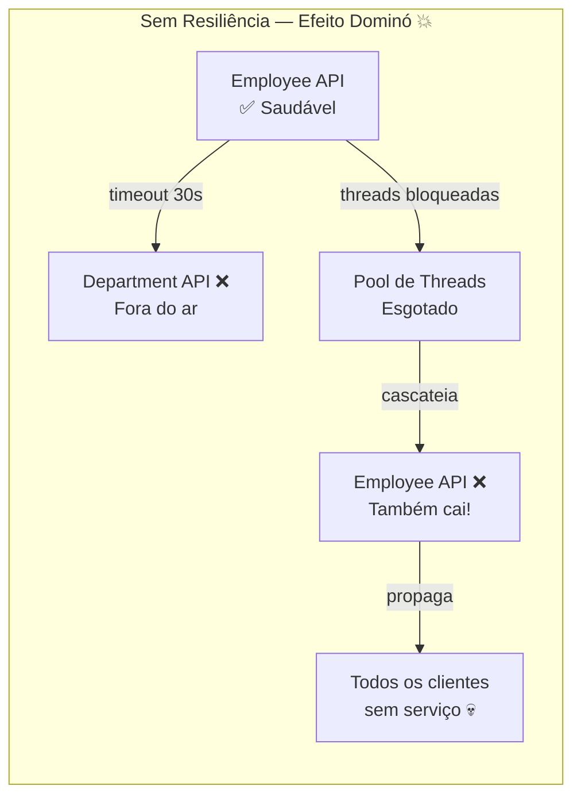
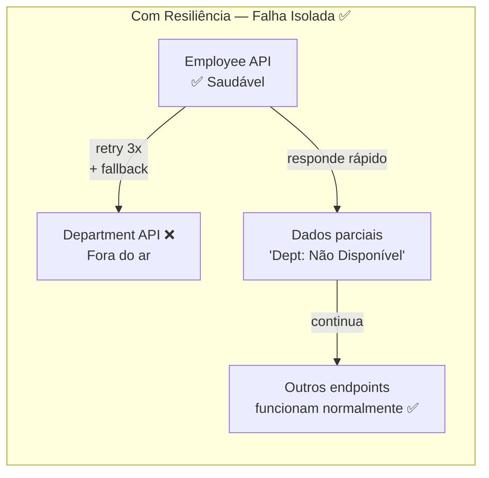
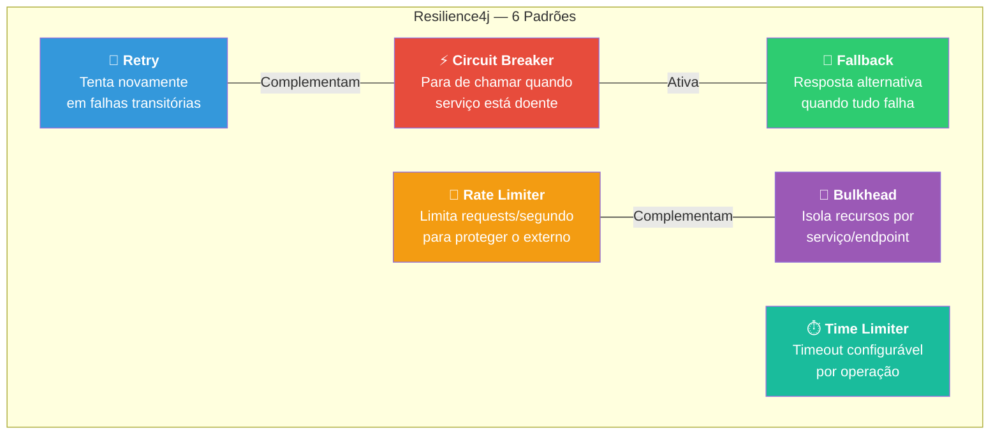
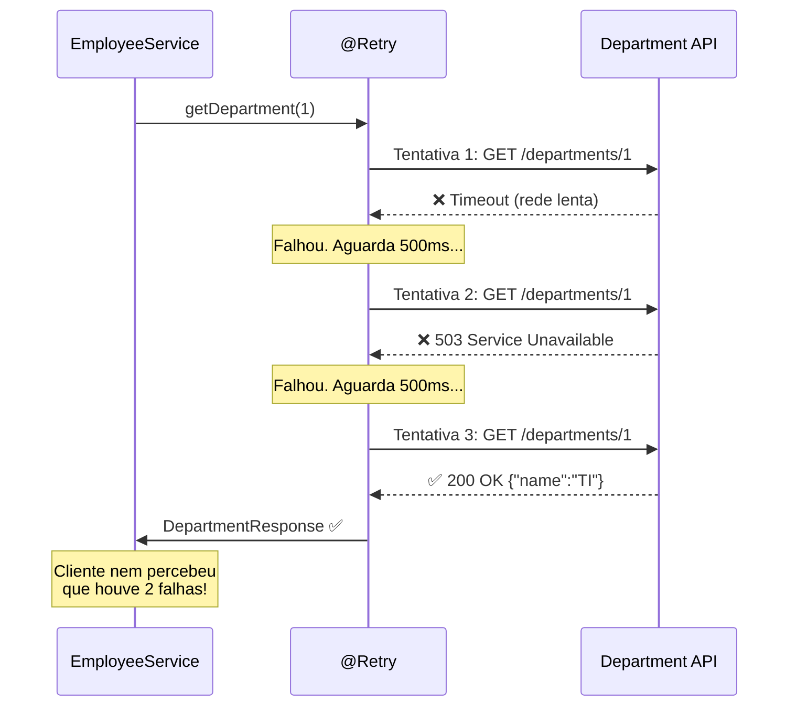
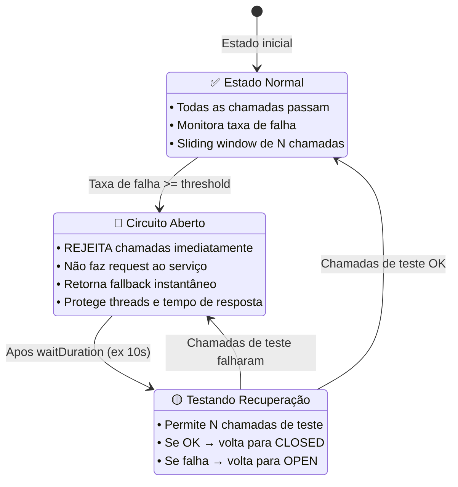
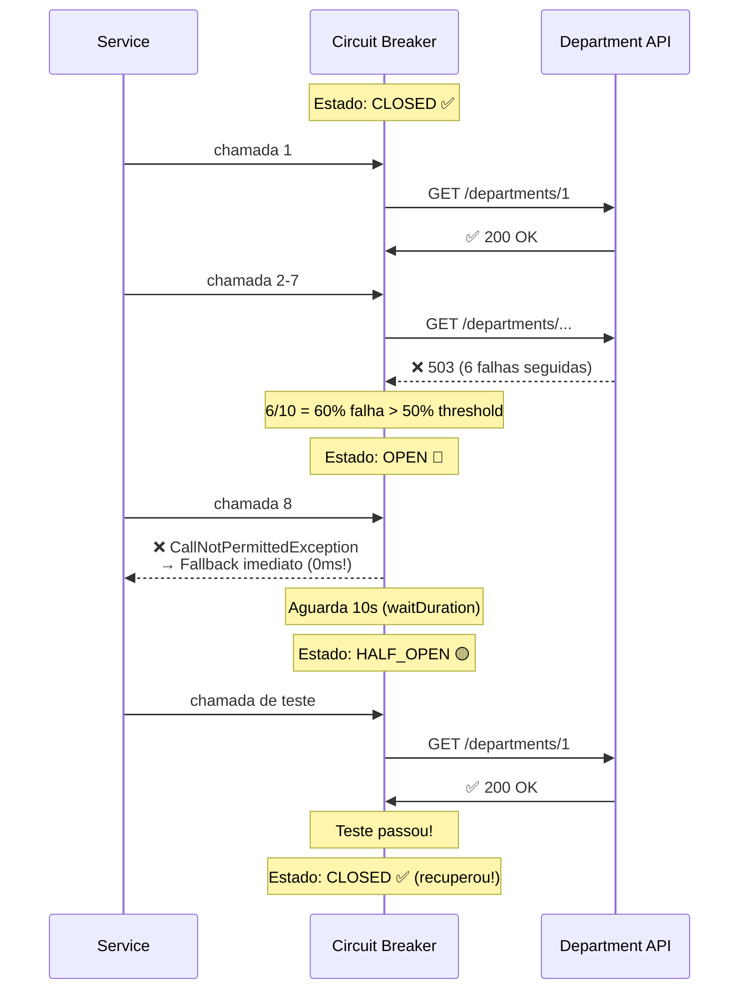
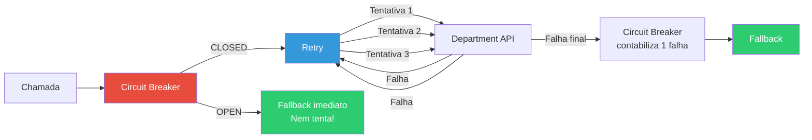
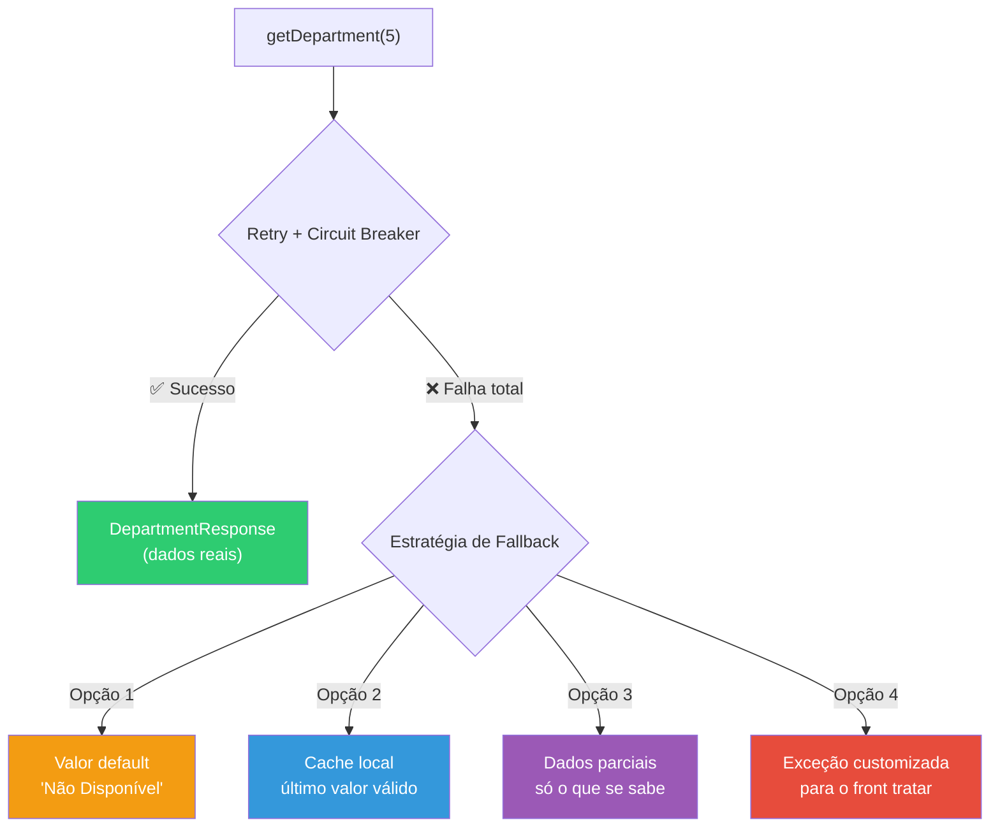
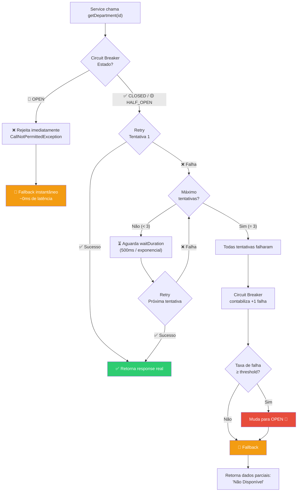

# Slide 3: Resiliência com Resilience4j

**Horário:** 09:45 - 10:15

---

## O Problema: Falhas em Cascata (Cascade Failure)

Em 2015, a Amazon perdeu **$66.240 por segundo** durante uma indisponibilidade causada por falha em cascata. Quando um serviço A depende de B que depende de C, e C cai, **tudo cai junto**:





> **Princípio fundamental**: Em microsserviços, **falha é inevitável**. O que importa é como lidamos com ela.

### Cenários Reais de Falha

| Cenário | Causa | Sem resiliência | Com resiliência |
|---------|-------|----------------|-----------------|
| API de departamentos fora | Deploy, crash | Timeout 30s, thread bloqueada | Retry 3x, depois fallback |
| API de notificações lenta | Carga alta | Todas as requests ficam lentas | Circuit breaker abre, retorna rápido |
| Falha intermitente de rede | Infraestrutura | Erro 500 para o cliente | Retry automático, cliente nem percebe |
| DNS failure | Cloud instável | Connection refused | Fallback com cache local |
| Rate limiting no externo | Muitas chamadas | 429 transformado em 500 | Backoff exponencial + fallback |

---

## Resilience4j — A Biblioteca Padrão de Resiliência em Java

**Resilience4j** substituiu o **Netflix Hystrix** (descontinuado em 2018) como biblioteca padrão para resiliência em aplicações Java.

### Hystrix vs Resilience4j

| Aspecto | Hystrix (❌ descontinuado) | Resilience4j (✅ atual) |
|---------|--------------------------|----------------------|
| Status | Modo manutenção desde 2018 | Ativamente mantido |
| Java mínimo | Java 6 | Java 17+ |
| Paradigma | Thread pool isolation | Functional, lightweight |
| Configuração | Annotations complexas | YAML simples |
| Dependências | Pesado (~5MB) | Leve (~200KB por módulo) |
| Integração Spring | Básica | Spring Boot Starter oficial |

### Todos os Padrões de Resiliência



> **Hoje focaremos nos 3 mais importantes**: **Retry**, **Circuit Breaker** e **Fallback**. Os outros 3 são usados em cenários avançados de produção.

### Breve Resumo dos 3 Padrões Avançados

| Padrão | O que faz | Quando usar |
|--------|----------|-------------|
| **Rate Limiter** | Limita a N chamadas por período de tempo | Proteger API externa com rate limit |
| **Bulkhead** | Isola pools de thread por serviço | Evitar que um serviço lento consuma todas as threads |
| **Time Limiter** | Define timeout para operações assíncronas | Chamadas reativas com `CompletableFuture` |

---

## 1. Retry — Recuperação Automática de Falhas Transitórias

Falhas transitórias (timeout de rede, 503, DNS temporário) podem se resolver sozinhas em milissegundos. O Retry **tenta novamente automaticamente** sem que o cliente perceba.



### Configuração no application.yml

```yaml
resilience4j:
  retry:
    instances:
      departmentService:            # Nome da instância (referenciado no @Retry)
        maxAttempts: 3              # Máximo de tentativas (incluindo a primeira)
        waitDuration: 500ms         # Intervalo fixo entre tentativas
        enableExponentialBackoff: true  # Backoff exponencial (opcional)
        exponentialBackoffMultiplier: 2 # 500ms → 1s → 2s (opcional)
        retryExceptions:            # Quais exceções causam retry
          - java.io.IOException
          - java.net.SocketTimeoutException
          - feign.RetryableException
        ignoreExceptions:           # Quais NÃO causam retry (erro de negócio)
          - com.example.exception.DepartmentNotFoundException
          - com.example.exception.BadRequestException
```

### Conceitos do Retry

| Propriedade | Default | Descrição |
|------------|---------|-----------|
| `maxAttempts` | 3 | Total de tentativas (1 original + 2 retries) |
| `waitDuration` | 500ms | Tempo entre tentativas |
| `enableExponentialBackoff` | false | Aumenta o wait a cada tentativa |
| `exponentialBackoffMultiplier` | 2 | Multiplicador (500ms→1s→2s→4s) |
| `retryExceptions` | todas | Exceções que devem causar retry |
| `ignoreExceptions` | nenhuma | Exceções que NÃO devem causar retry |

> ⚠️ **Nunca faça retry em erros de negócio** (404, 400). Retry é para erros **transitórios** (timeout, 503).

### Backoff Linear vs Exponencial

```mermaid
gantt
    title Estratégias de Retry — Tempo Total
    dateFormat X
    axisFormat %Lms

    section Linear (500ms fixo)
    Tentativa 1           :t1, 0, 100
    Espera 500ms          :w1, 100, 600
    Tentativa 2           :t2, 600, 700
    Espera 500ms          :w2, 700, 1200
    Tentativa 3           :t3, 1200, 1300

    section Exponencial (x2)
    Tentativa 1           :t4, 0, 100
    Espera 500ms          :w3, 100, 600
    Tentativa 2           :t5, 600, 700
    Espera 1000ms         :w4, 700, 1700
    Tentativa 3           :t6, 1700, 1800
```



### Uso no Código

```java
@Service
@Slf4j
public class DepartmentIntegrationService {

    private final DepartmentClient departmentClient;

    @Retry(name = "departmentService", fallbackMethod = "departmentFallback")
    public DepartmentResponse getDepartment(Long id) {
        log.info("Buscando departamento {} no serviço externo", id);
        return departmentClient.findById(id);
    }

    // Fallback — chamado quando TODAS as tentativas falham
    private DepartmentResponse departmentFallback(Long id, Exception ex) {
        log.warn("⚠️ Todas as {} tentativas falharam para departamento {}: {}",
                3, id, ex.getMessage());
        return new DepartmentResponse(id, "Não Disponível", "N/A");
    }
}
```

---

## 2. Circuit Breaker — O Disjuntor do Software

O Circuit Breaker é inspirado em disjuntores elétricos: quando detecta muitas falhas, **desliga o circuito** para proteger o sistema.

> **Analogia**: Quando há curto-circuito em casa, o disjuntor desarma para proteger a fiação. No software, o Circuit Breaker "desarma" para proteger suas threads e seu tempo de resposta.

### Os 3 Estados do Circuit Breaker



### Comportamento Detalhado



### Configuração no application.yml

```yaml
resilience4j:
  circuitbreaker:
    instances:
      departmentService:
        failureRateThreshold: 50               # Abre quando ≥50% das chamadas falham
        slidingWindowSize: 10                   # Janela de monitoramento: últimas 10 chamadas
        slidingWindowType: COUNT_BASED          # COUNT_BASED ou TIME_BASED
        waitDurationInOpenState: 10s            # Tempo que fica OPEN antes de testar (HALF_OPEN)
        permittedNumberOfCallsInHalfOpenState: 3  # Quantas chamadas de teste em HALF_OPEN
        minimumNumberOfCalls: 5                 # Mínimo de chamadas antes de calcular taxa
        automaticTransitionFromOpenToHalfOpenEnabled: true  # Transição automática
```

### Conceitos do Circuit Breaker

| Propriedade | Default | Descrição |
|------------|---------|-----------|
| `failureRateThreshold` | 50 | Percentual de falhas para abrir o circuito |
| `slidingWindowSize` | 100 | Quantas chamadas compõem a janela de análise |
| `slidingWindowType` | COUNT_BASED | COUNT_BASED (contagem) ou TIME_BASED (tempo) |
| `waitDurationInOpenState` | 60s | Quanto tempo fica OPEN antes de HALF_OPEN |
| `permittedNumberOfCallsInHalfOpenState` | 10 | Chamadas de teste em HALF_OPEN |
| `minimumNumberOfCalls` | 100 | Mínimo de chamadas antes de calcular a taxa |

> **Sliding Window COUNT_BASED vs TIME_BASED**: COUNT_BASED analisa as últimas N chamadas; TIME_BASED analisa chamadas dos últimos N segundos. COUNT_BASED é mais previsível e mais comum.

### Uso no Código

```java
@CircuitBreaker(name = "departmentService", fallbackMethod = "departmentFallback")
@Retry(name = "departmentService", fallbackMethod = "departmentFallback")
public DepartmentResponse getDepartment(Long id) {
    return departmentClient.findById(id);
}
```

### Ordem de Execução: Retry DENTRO do Circuit Breaker



> **Ordem**: Retry é executado DENTRO do Circuit Breaker. Se o retry esgotar as tentativas, conta como **1 falha** para o Circuit Breaker. Quando o Circuit Breaker está OPEN, nem o Retry é executado — vai direto para o fallback.

---

## 3. Fallback — Degradação Graciosa (Graceful Degradation)

O Fallback fornece uma **resposta degradada** quando o serviço externo está indisponível. O princípio é: **melhor retornar dados parciais do que derrubar tudo**.



### Implementação

```java
// O método fallback DEVE ter:
// 1. Mesmo tipo de retorno
// 2. Mesmos parâmetros + Exception como último parâmetro
// 3. Estar na mesma classe ou ser acessível

private DepartmentResponse departmentFallback(Long id, Exception ex) {
    log.warn("⚠️ Fallback para departamento {}: {}", id, ex.getMessage());

    // Estratégia 1: Valor default
    return new DepartmentResponse(id, "Não Disponível", "N/A");
}

// Para listas:
private List<DepartmentResponse> allDepartmentsFallback(Exception ex) {
    log.warn("⚠️ Fallback para lista de departamentos: {}", ex.getMessage());
    return Collections.emptyList();  // Lista vazia, não null!
}
```

### Regras do Fallback

| Regra | Detalhe | Consequência se violar |
|-------|---------|----------------------|
| Mesma assinatura | Mesmo tipo de retorno + mesmos parâmetros + `Exception` extra | `NoSuchMethodException` em runtime |
| Nome referenciado | `fallbackMethod = "departmentFallback"` | `IllegalArgumentException` |
| **Não lance exceção** | O propósito é retornar algo, não propagar erro | Derrota o propósito do fallback |
| **Sempre logue** | Log de WARNING para monitoramento | Problemas invisíveis em produção |
| **Nunca retorne null** | Retorne default, empty, ou throw controlado | `NullPointerException` no consumidor |

---

## Exemplo Completo Integrado — Código de Produção

```java
@Service
@Slf4j
@RequiredArgsConstructor
public class DepartmentIntegrationService {

    private final DepartmentClient departmentClient;

    @CircuitBreaker(name = "departmentService", fallbackMethod = "getDepartmentFallback")
    @Retry(name = "departmentService", fallbackMethod = "getDepartmentFallback")
    public DepartmentResponse getDepartment(Long id) {
        log.info("🔵 Buscando departamento {} no serviço externo", id);
        return departmentClient.findById(id);
    }

    @CircuitBreaker(name = "departmentService", fallbackMethod = "getAllDepartmentsFallback")
    @Retry(name = "departmentService", fallbackMethod = "getAllDepartmentsFallback")
    public List<DepartmentResponse> getAllDepartments() {
        log.info("🔵 Buscando todos os departamentos no serviço externo");
        return departmentClient.findAll();
    }

    // Fallback para busca individual
    private DepartmentResponse getDepartmentFallback(Long id, Exception ex) {
        log.warn("⚠️ Fallback para departamento {}: {} ({})",
                id, ex.getMessage(), ex.getClass().getSimpleName());
        return new DepartmentResponse(id, "Não Disponível", "N/A");
    }

    // Fallback para listagem
    private List<DepartmentResponse> getAllDepartmentsFallback(Exception ex) {
        log.warn("⚠️ Fallback para lista de departamentos: {}", ex.getMessage());
        return Collections.emptyList();
    }
}
```

```yaml
# application.yml — Configuração completa
resilience4j:
  retry:
    instances:
      departmentService:
        maxAttempts: 3
        waitDuration: 500ms
        retryExceptions:
          - java.io.IOException
          - feign.RetryableException
        ignoreExceptions:
          - com.example.exception.DepartmentNotFoundException
  circuitbreaker:
    instances:
      departmentService:
        failureRateThreshold: 50
        slidingWindowSize: 10
        waitDurationInOpenState: 10s
        permittedNumberOfCallsInHalfOpenState: 3
        minimumNumberOfCalls: 5
```

---

## Visualizando o Fluxo Completo de Decisão



---

## Monitoramento em Produção — Actuator + Métricas

O Resilience4j publica métricas automaticamente via Spring Boot Actuator:

```yaml
# application.yml
management:
  endpoints:
    web:
      exposure:
        include: health, circuitbreakers, retries
  health:
    circuitbreakers:
      enabled: true
```

### Endpoints de monitoramento

```
GET /actuator/health       → Estado geral + circuit breakers
GET /actuator/circuitbreakers  → Estado de todos os circuit breakers
GET /actuator/retries      → Métricas de retry
```

### Exemplo de resposta do health check

```json
{
  "status": "UP",
  "components": {
    "circuitBreakers": {
      "status": "UP",
      "details": {
        "departmentService": {
          "status": "CLOSED",
          "failureRate": "20.0%",
          "failureRateThreshold": "50.0%",
          "bufferedCalls": 10,
          "failedCalls": 2
        }
      }
    }
  }
}
```

---

## Dependência Maven

```xml
<!-- Resilience4j Spring Boot Starter -->
<dependency>
    <groupId>io.github.resilience4j</groupId>
    <artifactId>resilience4j-spring-boot3</artifactId>
    <version>2.2.0</version>
</dependency>

<!-- Para integração com Spring AOP (necessário para @Retry, @CircuitBreaker) -->
<dependency>
    <groupId>org.springframework.boot</groupId>
    <artifactId>spring-boot-starter-aop</artifactId>
</dependency>
```

---

## ⚠️ Armadilhas Comuns

| Problema | Causa | Solução |
|----------|-------|---------|
| `NoSuchMethodException` no fallback | Assinatura diferente (tipo de retorno ou parâmetros) | Mesmo retorno + mesmos params + `Exception` |
| Retry em erro de negócio (404, 400) | `ignoreExceptions` não configurado | Adicionar exceções de negócio em `ignoreExceptions` |
| Circuit Breaker nunca abre | `minimumNumberOfCalls` muito alto | Reduzir para 5-10 em dev |
| Fallback não é chamado | Exceção não é capturada pela AOP | Verificar se o método é `public` e chamado externamente |
| Retry + Circuit Breaker conflitam | Ordem errada de annotations | `@CircuitBreaker` antes de `@Retry` |

---

## 📌 Pontos-Chave — Resumo

| Padrão | Quando usar | Configuração chave | Analogia |
|--------|-------------|-------------------|----------|
| **Retry** | Falhas transitórias (timeout, 503) | `maxAttempts`, `waitDuration` | "Tá ocupado? Ligo de novo" |
| **Circuit Breaker** | Serviço consistentemente falhando | `failureRateThreshold`, `slidingWindowSize` | "Disjuntor elétrico" |
| **Fallback** | Resposta degradada aceitável | Método com mesma assinatura + Exception | "Plano B" |

> **Princípio de ouro**: É melhor retornar **dados parciais** do que **derrubar todo o sistema**.

> **Para entrevistas**: "Como você lida com falhas em microsserviços?" → Cite Retry + Circuit Breaker + Fallback + monitoramento.

> **Próximo slide**: CORS — quando o browser bloqueia sua API.
