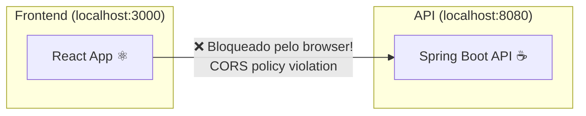
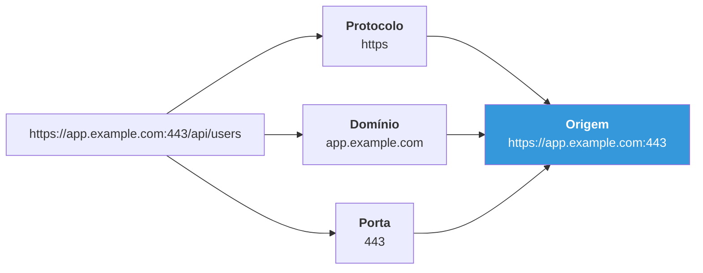
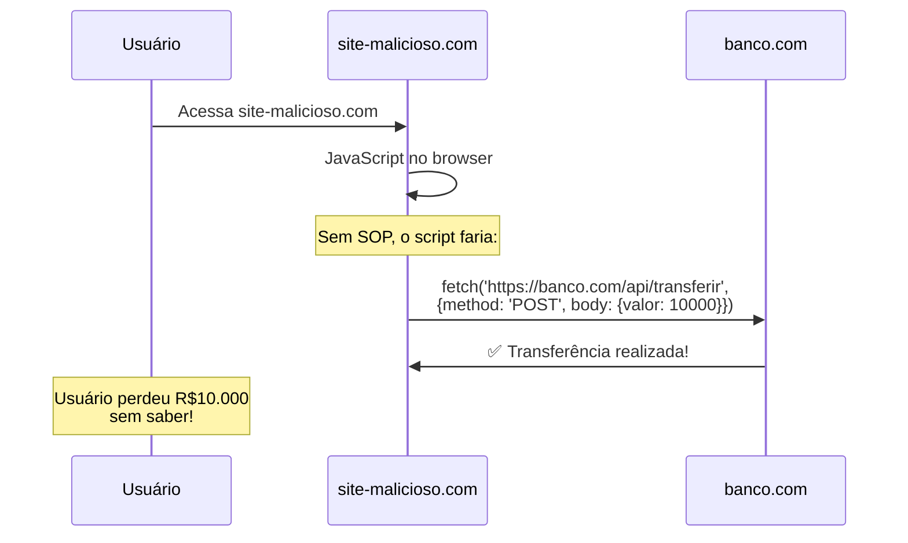
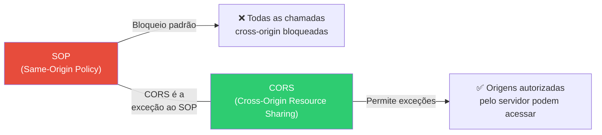
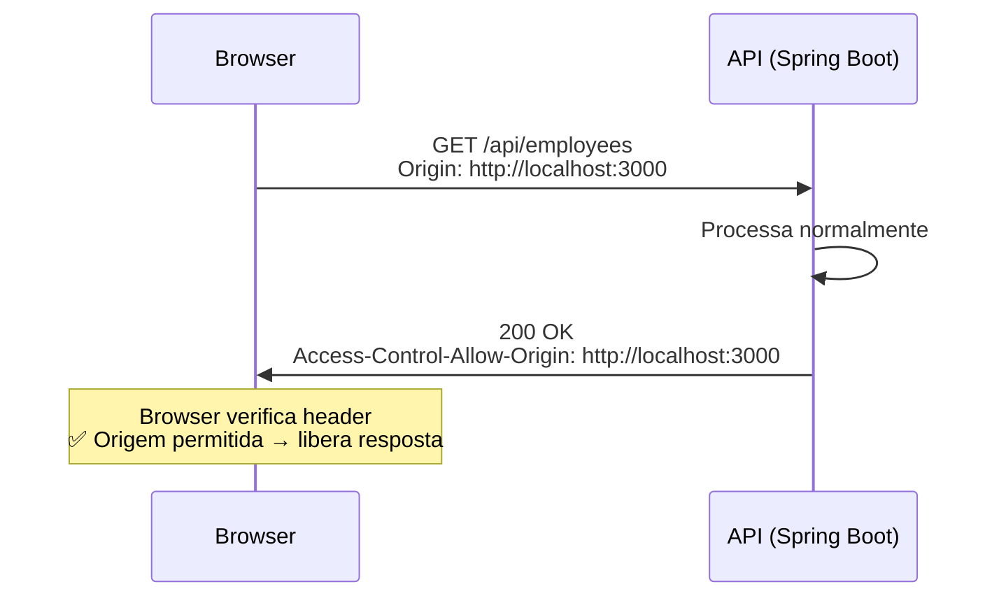
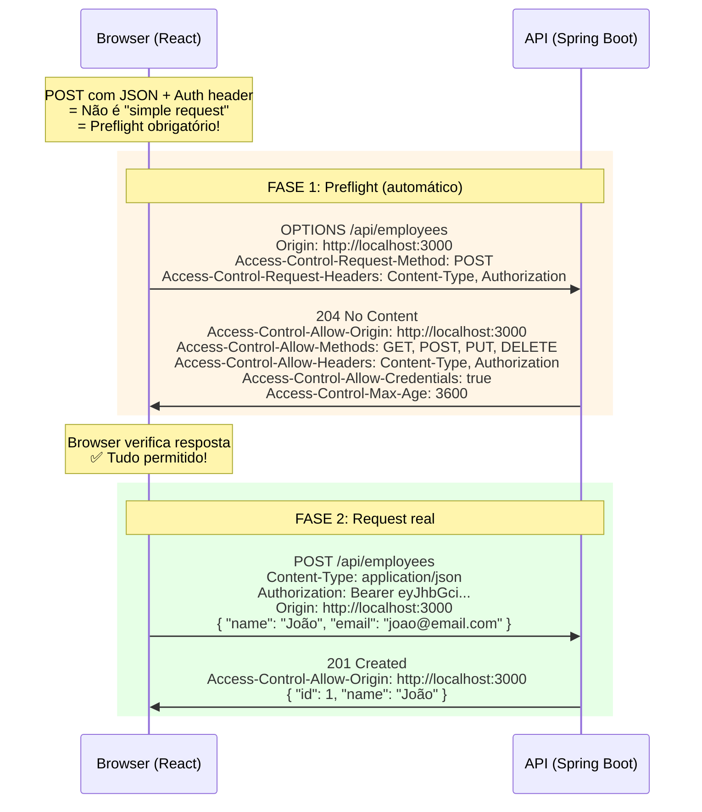
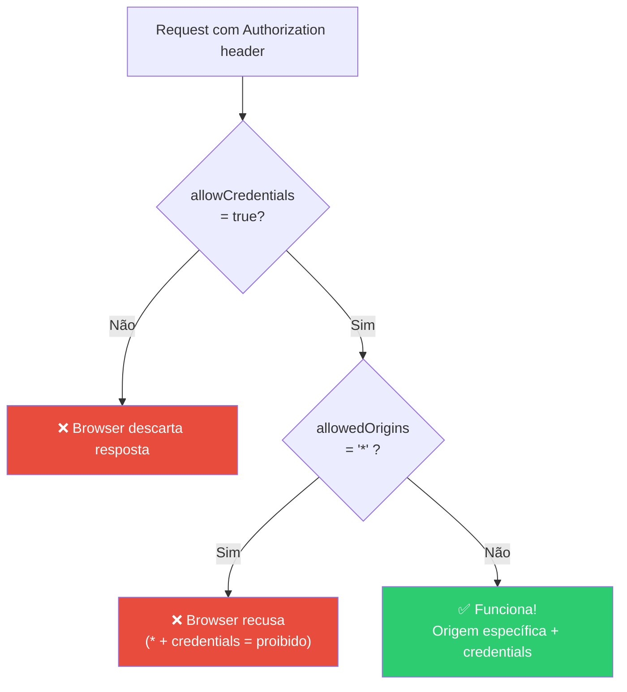
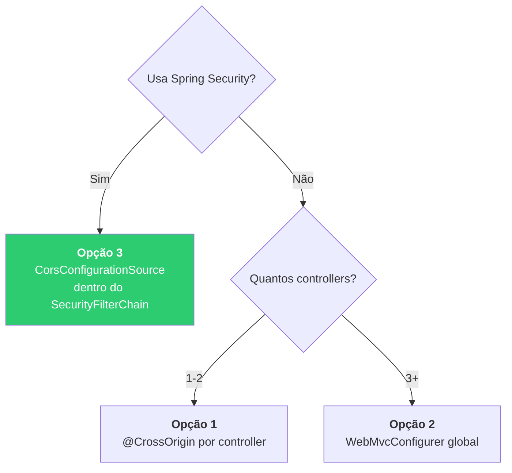
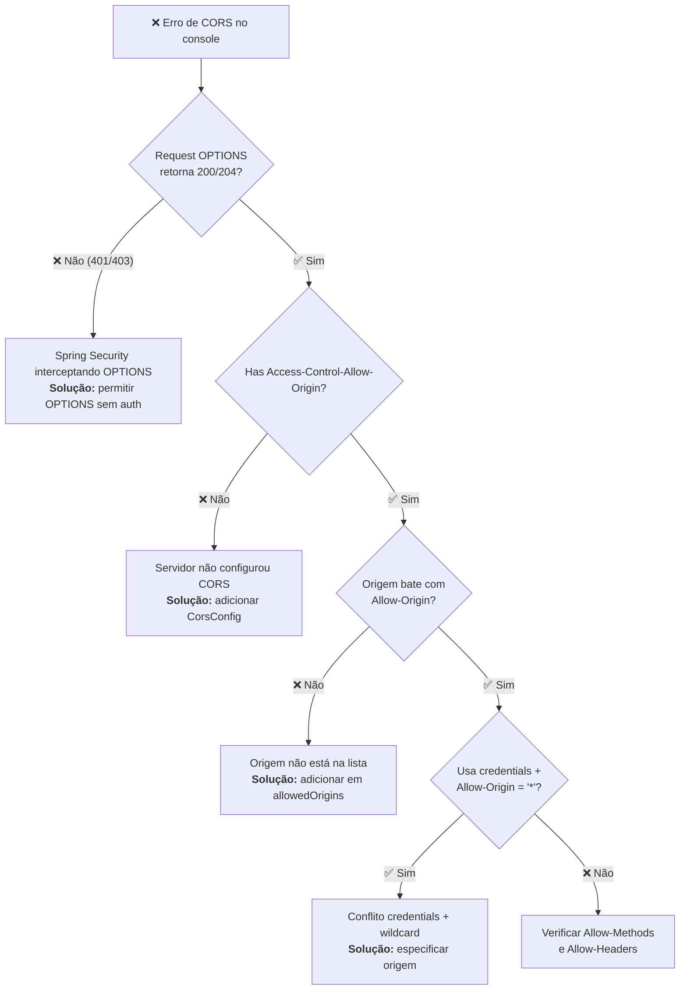

# Slide 4: CORS — Cross-Origin Resource Sharing

**Horário:** 10:15 - 10:45

---

## O Problema: Browser Bloqueia Chamadas Cross-Origin

Todo desenvolvedor frontend já viu este erro no console:

```
❌ Access to XMLHttpRequest at 'http://localhost:8080/api/employees'
from origin 'http://localhost:3000' has been blocked by CORS policy:
No 'Access-Control-Allow-Origin' header is present on the requested resource.
```



> **Importante**: O browser bloqueia a **resposta**, não o envio. A API **recebe** o request, **processa** e **responde** — mas o **browser descarta** a resposta se os headers CORS não estiverem corretos.

---

## SOP — Same-Origin Policy (a raiz do problema)

Antes de entender CORS, é preciso entender **SOP (Same-Origin Policy)** — a política de segurança fundamental dos browsers.

### O que é SOP?

A Same-Origin Policy é uma regra de segurança **implementada pelos browsers desde 1995** que impede que scripts de uma origem acessem recursos de outra origem.

### O que é uma "Origem"?

Uma origem é composta por **3 partes**: protocolo + domínio + porta.



### Quando duas origens são iguais?

| Origem A | Origem B | Mesma Origem? | Motivo |
|----------|----------|:---:|--------|
| `http://localhost:3000` | `http://localhost:8080` | ❌ | Porta diferente |
| `http://app.com` | `https://app.com` | ❌ | Protocolo diferente |
| `https://app.com` | `https://api.app.com` | ❌ | Subdomínio diferente |
| `http://localhost:3000` | `http://localhost:3000` | ✅ | Tudo igual |
| `https://app.com/users` | `https://app.com/products` | ✅ | Paths são ignorados |

### Por que SOP existe?

Sem SOP, um site malicioso poderia:



> **SOP impede esse ataque**. Mas... e quando **queremos** que o frontend acesse a API? Aí entra o CORS.

---

## O que é CORS?

**CORS (Cross-Origin Resource Sharing)** é um mecanismo que permite ao **servidor** informar ao browser quais origens **diferentes** podem acessar seus recursos.



> **CORS não é um ataque ou um bug** — é um mecanismo de segurança que o **servidor** configura para **relaxar** o SOP de forma controlada.

### Quem aplica o CORS?

| Componente | Aplica CORS? | Detalhes |
|-----------|:---:|---------|
| **Browser** (Chrome, Firefox) | ✅ | Verifica headers e bloqueia se inválido |
| **Postman** | ❌ | Não é browser, não aplica SOP/CORS |
| **curl** | ❌ | Linha de comando, sem SOP |
| **Server-to-server** (Feign) | ❌ | Microserviço para microserviço, sem browser |
| **App Mobile** | ❌ | Apps nativos não aplicam SOP |

> **Postman funciona mas o browser não?** Agora você sabe por quê!

---

## Como o CORS Funciona — Tipos de Requisição

### 1. Requisições Simples (Simple Requests)

Para requests que atendem TODOS estes critérios, o browser NÃO faz preflight:
- Método: `GET`, `HEAD`, ou `POST`
- Headers: apenas os "simples" (`Accept`, `Content-Language`, `Content-Type`)
- Content-Type: apenas `text/plain`, `multipart/form-data`, ou `application/x-www-form-urlencoded`



### 2. Requisições com Preflight (Preflighted Requests)

Quando o request **não é simples** (POST com JSON, PUT, DELETE, headers custom como `Authorization`), o browser envia uma requisição **OPTIONS** antes:



> O **preflight** é uma requisição `OPTIONS` que o browser envia **automaticamente** — o desenvolvedor frontend **não precisa fazer nada**. Se falhar, o request real nem é enviado.

### 3. Requisições com Credenciais

Quando a API usa cookies ou o header `Authorization`:



---

## Headers CORS Detalhados

### Headers de Resposta (servidor → browser)

| Header | Tipo | Valor exemplo | Significado |
|--------|------|--------------|-------------|
| `Access-Control-Allow-Origin` | Obrigatório | `http://localhost:3000` ou `*` | Quais origens podem acessar |
| `Access-Control-Allow-Methods` | Preflight | `GET, POST, PUT, DELETE` | Quais métodos HTTP são permitidos |
| `Access-Control-Allow-Headers` | Preflight | `Content-Type, Authorization` | Quais headers o request pode ter |
| `Access-Control-Allow-Credentials` | Opcional | `true` | Permitir cookies/auth headers |
| `Access-Control-Max-Age` | Opcional | `3600` | Cache do preflight em segundos |
| `Access-Control-Expose-Headers` | Opcional | `X-Total-Count` | Headers custom visíveis ao JS |

### Headers de Request (browser → servidor)

| Header | Tipo | Enviado por | Significado |
|--------|------|-----------|-------------|
| `Origin` | Automático | Browser | De onde a requisição veio |
| `Access-Control-Request-Method` | Preflight | Browser | Qual método será usado |
| `Access-Control-Request-Headers` | Preflight | Browser | Quais headers serão enviados |

---

## Configuração no Spring Boot — 3 Opções

### Opção 1: `@CrossOrigin` (Pontual — um Controller)

```java
@CrossOrigin(
    origins = "http://localhost:3000",
    methods = {RequestMethod.GET, RequestMethod.POST},
    maxAge = 3600
)
@RestController
@RequestMapping("/api/employees")
public class EmployeeController {
    // Todos os endpoints DESTE controller permitem localhost:3000
}
```

| Prós | Contras |
|------|---------|
| Simples, rápido | Repetitivo em múltiplos controllers |
| Granular por controller | Fácil esquecer em um controller novo |

### Opção 2: `WebMvcConfigurer` (Global — Recomendado para APIs sem Security)

```java
@Configuration
public class CorsConfig implements WebMvcConfigurer {

    @Override
    public void addCorsMappings(CorsRegistry registry) {
        registry.addMapping("/api/**")                              // Quais paths
                .allowedOrigins(
                    "http://localhost:3000",                         // React dev
                    "http://localhost:5173"                          // Vite dev
                )
                .allowedMethods("GET", "POST", "PUT", "DELETE", "OPTIONS") // Métodos
                .allowedHeaders("*")                                // Todos os headers
                .exposedHeaders("X-Total-Count", "X-Page-Size")    // Headers custom
                .allowCredentials(true)                             // Cookies/auth
                .maxAge(3600);                                      // Cache 1h
    }
}
```

| Prós | Contras |
|------|---------|
| Centralizado, um lugar só | Pode conflitar com Spring Security |
| Configuração por path pattern | Sem acesso ao request para lógica dinâmica |

### Opção 3: `CorsConfigurationSource` (Com Spring Security — Recomendado)

```java
@Bean
public SecurityFilterChain securityFilterChain(HttpSecurity http) throws Exception {
    return http
        .cors(cors -> cors.configurationSource(corsConfigurationSource()))
        .csrf(csrf -> csrf.disable())
        // ... restante da config
        .build();
}

@Bean
public CorsConfigurationSource corsConfigurationSource() {
    CorsConfiguration configuration = new CorsConfiguration();
    configuration.setAllowedOrigins(List.of(
        "http://localhost:3000",
        "http://localhost:5173"
    ));
    configuration.setAllowedMethods(List.of("GET", "POST", "PUT", "DELETE", "OPTIONS"));
    configuration.setAllowedHeaders(List.of("*"));
    configuration.setExposedHeaders(List.of("X-Total-Count"));
    configuration.setAllowCredentials(true);
    configuration.setMaxAge(3600L);

    UrlBasedCorsConfigurationSource source = new UrlBasedCorsConfigurationSource();
    source.registerCorsConfiguration("/api/**", configuration);
    return source;
}
```

| Prós | Contras |
|------|---------|
| **Necessário com Spring Security** | Mais verboso |
| Funciona com Security Filter Chain | Precisa registrar o bean |
| Acesso a lógica dinâmica | |

### Qual opção usar?



> **No nosso projeto**: Usamos Spring Security, então **Opção 3** é a correta. Mas mantemos a Opção 2 (`CorsConfig`) como exercício no TODO 4.

---

## DevTools — Diagnosticando Problemas de CORS

### Como verificar no Chrome DevTools

1. Abrir DevTools (F12)
2. Aba **Network**
3. Filtrar por **XHR/Fetch**
4. Procurar requisição **OPTIONS** (preflight)
5. Verificar **Response Headers** (`Access-Control-Allow-*`)

### Checklist de Diagnóstico



---

## CORS vs CSRF — Não Confundir!

| Aspecto | CORS | CSRF |
|---------|------|------|
| **O que é** | Política de acesso cross-origin | Ataque que forja requisições |
| **Quem implementa** | Browser | Atacante |
| **Proteção** | `Access-Control-*` headers | CSRF tokens, SameSite cookies |
| **Quando desabilitar** | Nunca (configurar corretamente) | APIs stateless com JWT (**sim**) |
| **Spring Security** | `.cors(cors -> ...)` | `.csrf(csrf -> csrf.disable())` |

> **Para APIs stateless com JWT**, desabilitamos CSRF porque não usamos cookies de sessão. CORS é sempre configurado.

---

## Configuração por Ambiente (Boas Práticas)

```yaml
# application-dev.yml
cors:
  allowed-origins: http://localhost:3000,http://localhost:5173

# application-staging.yml
cors:
  allowed-origins: https://staging.myapp.com

# application-prod.yml
cors:
  allowed-origins: https://myapp.com,https://www.myapp.com
```

```java
@Configuration
public class CorsConfig implements WebMvcConfigurer {

    @Value("${cors.allowed-origins}")
    private String[] allowedOrigins;

    @Override
    public void addCorsMappings(CorsRegistry registry) {
        registry.addMapping("/api/**")
                .allowedOrigins(allowedOrigins)  // Vem do application.yml
                .allowedMethods("GET", "POST", "PUT", "DELETE")
                .allowedHeaders("*")
                .allowCredentials(true)
                .maxAge(3600);
    }
}
```

> ⚠️ **NUNCA use `*` em produção com credentials**. Sempre especifique origens. Wildcard é aceitável apenas para APIs públicas sem autenticação.

---

## ⚠️ Armadilhas Comuns — Detalhado

| # | Erro | Causa | Solução | Severity |
|---|------|-------|---------|----------|
| 1 | `* with credentials` | `allowedOrigins("*")` + `allowCredentials(true)` | Especificar origens | 🔴 Crítico |
| 2 | CORS funciona no Postman | Postman não é browser | Configurar CORS no backend | 🟡 Confusão |
| 3 | Preflight 401 Unauthorized | Spring Security intercepta OPTIONS | `.requestMatchers(HttpMethod.OPTIONS).permitAll()` | 🔴 Crítico |
| 4 | CORS ok local, falha em prod | Origem de produção diferente | Configurar por profile/ambiente | 🟠 Importante |
| 5 | Duplo header Allow-Origin | CorsConfig + @CrossOrigin | Usar apenas uma abordagem | 🟠 Importante |
| 6 | PUT/DELETE bloqueados | Não listou no allowedMethods | Adicionar todos os métodos usados | 🟡 Médio |

---

## 📌 Pontos-Chave — Resumo

| Conceito | Resumo |
|----------|--------|
| **SOP** | Same-Origin Policy — browser bloqueia cross-origin por padrão |
| **CORS** | Mecanismo para o servidor **relaxar** o SOP de forma controlada |
| **Preflight** | Requisição `OPTIONS` antes de POST/PUT/DELETE com JSON ou custom headers |
| **`@CrossOrigin`** | Pontual — um controller (simples mas repetitivo) |
| **`WebMvcConfigurer`** | Global — recomendado para APIs sem Security |
| **`CorsConfigurationSource`** | **Necessário quando usa Spring Security** |
| **Credentials** | `allowCredentials(true)` requer origens explícitas, nunca `*` |
| **Diagnóstico** | Chrome DevTools → Network → OPTIONS → Response Headers |

> **Dica de entrevista**: "Por que CORS funciona no Postman mas não no browser?" → Porque CORS é uma política do **browser**, não do servidor. O servidor processa o request normalmente; é o browser que bloqueia a resposta se os headers não batem.

> **Próximo slide**: Spring Security + JWT — protegendo as rotas da API.
