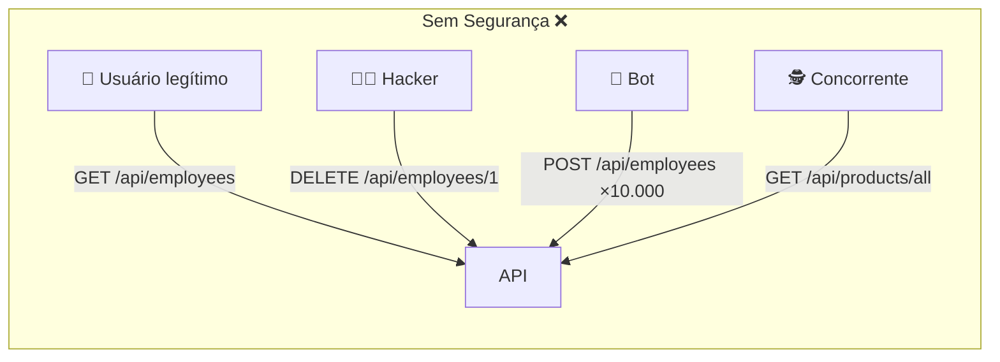
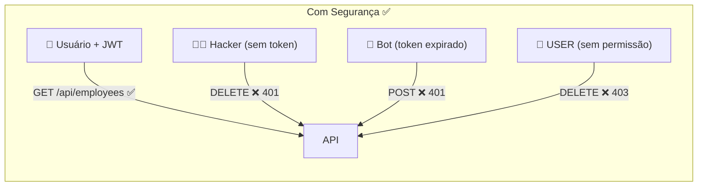
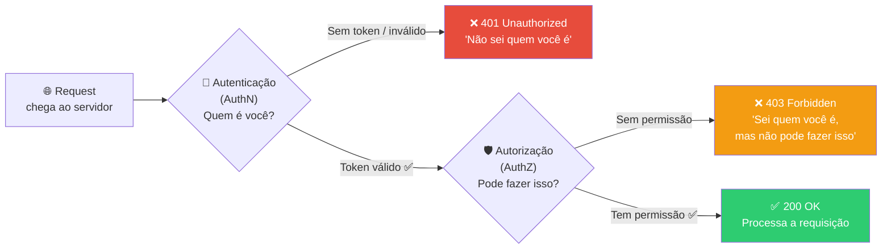
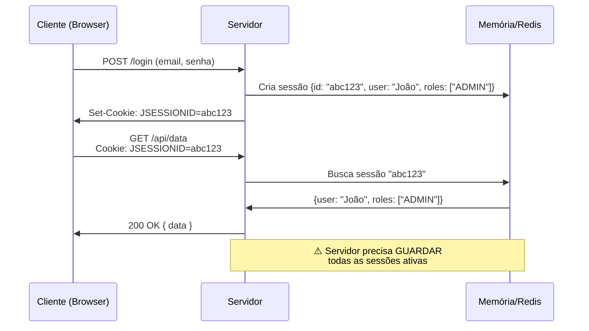
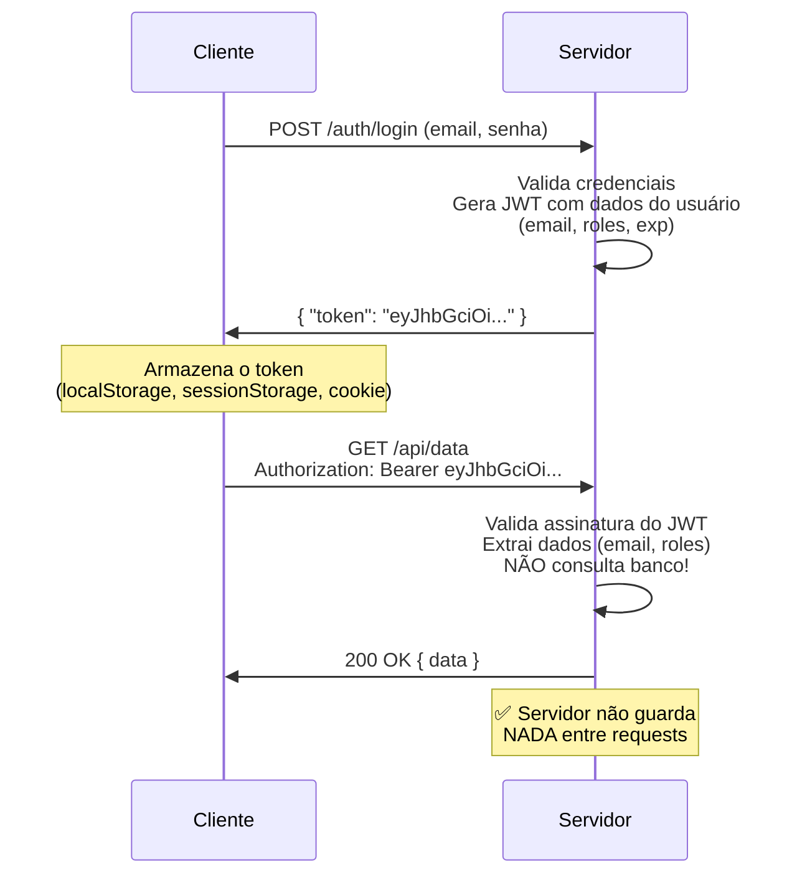
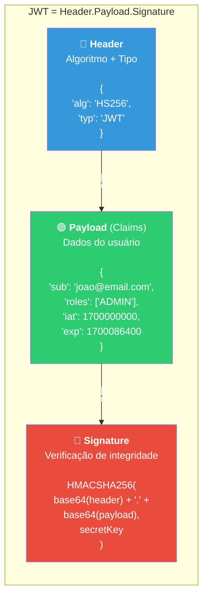
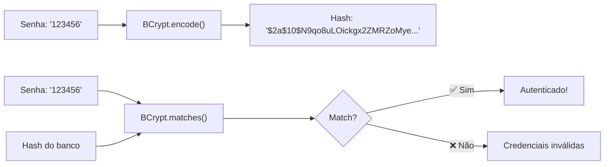
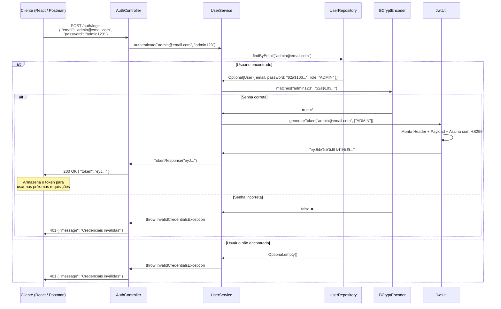

# Slide 5: Spring Security + JWT — Autenticação Stateless (Parte 1)

**Horário:** 11:00 - 11:30

---

## O Problema: Quem Está Acessando Minha API?

Em 2023, o custo médio de uma violação de dados foi **$4.45 milhões** (IBM). Sem autenticação, **qualquer pessoa pode acessar qualquer endpoint**:





> **Precisamos saber QUEM está acessando (autenticação) e SE PODE acessar (autorização).**

---

## Autenticação vs. Autorização — Conceitos Fundamentais

| Conceito | Abreviação | Pergunta | Quando ocorre | Resposta HTTP se falhar |
|----------|-----------|----------|---------------|----------------------|
| **Autenticação** | AuthN | **Quem é você?** | Primeiro — na entrada | **401 Unauthorized** |
| **Autorização** | AuthZ | **O que você pode fazer?** | Depois — já autenticado | **403 Forbidden** |



### Analogia do Mundo Real

| Conceito | Analogia | Exemplo |
|----------|---------|---------|
| **Autenticação** | Crachá na portaria | "Mostre seu crachá para entrar no prédio" |
| **Autorização** | Acesso por andar | "Seu crachá dá acesso ao 3º andar, mas não ao lab" |
| **401** | Portaria recusa | "Você não tem crachá — volte com identificação" |
| **403** | Catraca do andar trava | "Seu crachá é válido, mas não para este andar" |

---

## Sessão vs. Token — Dois Paradigmas de Autenticação

### Abordagem Tradicional: Sessão (Stateful)



### Abordagem Moderna: JWT (Stateless)



### Comparação Detalhada

| Aspecto | Sessão (Stateful) | JWT (Stateless) |
|---------|-------------------|-----------------|
| Estado no servidor | ✅ Sim (memória/Redis) | ❌ Não |
| Escalabilidade | 🟠 Difícil (sticky sessions, Redis compartilhado) | 🟢 Fácil (qualquer instância) |
| Microsserviços | 🟠 Complicado (sessão compartilhada) | 🟢 Natural (token é self-contained) |
| Logout | 🟢 Fácil (deletar sessão) | 🟠 Complexo (token válido até expirar) |
| Tamanho | 🟢 Cookie pequeno (session ID) | 🟠 Token pode ser grande (~1KB) |
| Segurança CSRF | 🟠 Vulnerável (cookie automático) | 🟢 Imune (header manual) |
| Mobile/SPA | 🟠 Cookies são problemáticos | 🟢 Header Authorization funciona sempre |
| Uso típico | Apps MVC tradicionais (JSP, Thymeleaf) | **APIs REST, SPAs, mobile, microsserviços** |

> **No mundo moderno de microsserviços e SPAs, JWT é o padrão dominante.**

---

## O que é JWT (JSON Web Token)?

JWT é um **padrão aberto (RFC 7519)** que define uma forma compacta e autocontida de transmitir informações entre partes como um objeto JSON assinado digitalmente.

### Estrutura do JWT — 3 Partes separadas por `.`

```
eyJhbGciOiJIUzI1NiIsInR5cCI6IkpXVCJ9.
eyJzdWIiOiJqb2FvQGVtYWlsLmNvbSIsInJvbGVzIjpbIkFETUlOIl0sImlhdCI6MTcwMCwiZXhwIjoxNzAxfQ.
SflKxwRJSMeKKF2QT4fwpMeJf36POk6yJV_adQssw5c
```



### Claims Padrão do JWT (Registered Claims)

| Claim | Nome completo | Tipo | Descrição | Exemplo |
|-------|-------------|------|-----------|---------|
| `sub` | Subject | Obrigatório* | Identifica o usuário | `"joao@email.com"` |
| `iat` | Issued At | Recomendado | Quando foi gerado (Unix timestamp) | `1700000000` |
| `exp` | Expiration | Recomendado | Quando expira (Unix timestamp) | `1700086400` |
| `iss` | Issuer | Opcional | Quem emitiu o token | `"employee-api"` |
| `aud` | Audience | Opcional | Para quem o token é destinado | `"api.myapp.com"` |
| `jti` | JWT ID | Opcional | Identificador único do token | `"abc-123-def"` |
| `roles` | (Custom) | Custom | Papéis/permissões do usuário | `["ADMIN", "USER"]` |

> **Claims customizados** (como `roles`) podem ser adicionados livremente ao payload. O JWT é um **container de dados assinado**.

### Algoritmos de Assinatura

| Algoritmo | Tipo | Chave | Quando usar |
|-----------|------|-------|-------------|
| **HS256** | Simétrico | Uma chave secreta compartilhada | APIs simples, **nosso caso** |
| HS384/HS512 | Simétrico | Uma chave mais longa | Segurança extra |
| **RS256** | Assimétrico | Par de chaves (pública + privada) | Microsserviços (servidor assina, outros validam) |
| ES256 | Assimétrico | Curva elíptica | Performance + segurança |

> **HS256** é suficiente quando o mesmo serviço gera e valida o token. Para arquiteturas onde um **Auth Server** gera e **múltiplos serviços** validam, use **RS256**.

### Depurando um JWT com jwt.io

Acesse [jwt.io](https://jwt.io) e cole seu token para ver o conteúdo decodificado:

```
Header: { "alg": "HS256", "typ": "JWT" }
Payload: { "sub": "joao@email.com", "roles": ["ADMIN"], "iat": 1700000000, "exp": 1700086400 }
Signature: VERIFIED ✅ (se colocar o secret)
```

> ⚠️ O **payload NÃO é criptografado** — apenas codificado em Base64. Qualquer um pode ler! **Nunca coloque dados sensíveis** (senhas, CPFs, números de cartão) no payload.

---

## JwtUtil — Classe Utilitária Completa

```java
@Component
@Slf4j
public class JwtUtil {

    @Value("${jwt.secret}")
    private String secret;

    @Value("${jwt.expiration}")
    private long expiration; // em milissegundos (ex: 86400000 = 24h)

    /**
     * Gera um JWT com email e roles do usuário.
     * O token expira após o tempo configurado em jwt.expiration.
     */
    public String generateToken(String email, List<String> roles) {
        Date now = new Date();
        Date expiryDate = new Date(now.getTime() + expiration);

        log.info("Gerando JWT para {} com roles {} (expira em {})", email, roles, expiryDate);

        return Jwts.builder()
                .setSubject(email)                        // sub = email
                .claim("roles", roles)                    // roles = ["ADMIN", "USER"]
                .setIssuedAt(now)                         // iat = agora
                .setExpiration(expiryDate)                // exp = agora + 24h
                .signWith(getSigningKey(), SignatureAlgorithm.HS256)  // Assinatura
                .compact();
    }

    /** Extrai o email (subject) do token */
    public String extractEmail(String token) {
        return getClaims(token).getSubject();
    }

    /** Extrai a lista de roles do token */
    @SuppressWarnings("unchecked")
    public List<String> extractRoles(String token) {
        return getClaims(token).get("roles", List.class);
    }

    /** Verifica se o token é válido (assinatura + expiração) */
    public boolean isTokenValid(String token) {
        try {
            getClaims(token); // Se não lançar exceção, é válido
            return true;
        } catch (ExpiredJwtException e) {
            log.warn("Token expirado: {}", e.getMessage());
            return false;
        } catch (MalformedJwtException e) {
            log.warn("Token malformado: {}", e.getMessage());
            return false;
        } catch (SignatureException e) {
            log.warn("Assinatura inválida: {}", e.getMessage());
            return false;
        } catch (JwtException | IllegalArgumentException e) {
            log.warn("Token inválido: {}", e.getMessage());
            return false;
        }
    }

    private Claims getClaims(String token) {
        return Jwts.parserBuilder()
                .setSigningKey(getSigningKey())
                .build()
                .parseClaimsJws(token)
                .getBody();
    }

    private Key getSigningKey() {
        byte[] keyBytes = Decoders.BASE64.decode(secret);
        return Keys.hmacShaKeyFor(keyBytes);
    }
}
```

### Configuração no application.yml

```yaml
jwt:
  # Chave secreta codificada em Base64 (mínimo 256 bits para HS256)
  secret: dGhpcy1pcy1hLXZlcnktc2VjdXJlLXNlY3JldC1rZXktZm9yLWp3dC10b2tlbi1nZW5lcmF0aW9u
  # Tempo de expiração: 24 horas = 86.400.000 milissegundos
  expiration: 86400000
```

### Dependência Maven (JJWT)

```xml
<!-- JSON Web Token (JWT) library -->
<dependency>
    <groupId>io.jsonwebtoken</groupId>
    <artifactId>jjwt-api</artifactId>
    <version>0.11.5</version>
</dependency>
<dependency>
    <groupId>io.jsonwebtoken</groupId>
    <artifactId>jjwt-impl</artifactId>
    <version>0.11.5</version>
    <scope>runtime</scope>
</dependency>
<dependency>
    <groupId>io.jsonwebtoken</groupId>
    <artifactId>jjwt-jackson</artifactId>
    <version>0.11.5</version>
    <scope>runtime</scope>
</dependency>
```

> ⚠️ Em produção, **nunca coloque o secret no código ou no application.yml**. Use variáveis de ambiente (`JWT_SECRET`) ou vault (HashiCorp Vault, AWS Secrets Manager).

---

## UserService — Autenticação com BCrypt

```java
@Service
@RequiredArgsConstructor
public class UserService {

    private final UserRepository userRepository;
    private final PasswordEncoder passwordEncoder;  // BCrypt
    private final JwtUtil jwtUtil;

    public TokenResponse authenticate(String email, String password) {
        // 1. Buscar usuário pelo email
        User user = userRepository.findByEmail(email)
                .orElseThrow(() -> new InvalidCredentialsException("Credenciais inválidas"));

        // 2. Verificar senha com BCrypt
        if (!passwordEncoder.matches(password, user.getPassword())) {
            throw new InvalidCredentialsException("Credenciais inválidas");
        }

        // 3. Gerar JWT
        String token = jwtUtil.generateToken(user.getEmail(), List.of(user.getRole()));

        return new TokenResponse(token);
    }
}
```

> ⚠️ **Nunca** diga "email não encontrado" ou "senha incorreta" separadamente — isso ajuda attackers a enumerar emails. Sempre retorne **"Credenciais inválidas"** (mensagem genérica).

### BCrypt — Hashing de Senhas



| Conceito | Descrição |
|----------|-----------|
| **Hashing** | Transformação irreversível (não dá para "reverter" o hash) |
| **Salt** | Valor aleatório adicionado antes de hashear (previne rainbow tables) |
| **BCrypt** | Algoritmo de hashing com salt embutido + custo configurável |
| **`$2a$10$`** | Prefixo BCrypt: `$2a$` = versão, `$10$` = custo (10 rounds) |

---

## AuthController — Endpoint de Login

```java
@RestController
@RequestMapping("/auth")
@RequiredArgsConstructor
@Tag(name = "Autenticação", description = "Endpoints de autenticação")
public class AuthController {

    private final UserService userService;

    @PostMapping("/login")
    @Operation(summary = "Realizar login", description = "Retorna um JWT válido por 24h")
    @ApiResponse(responseCode = "200", description = "Login realizado com sucesso")
    @ApiResponse(responseCode = "401", description = "Credenciais inválidas")
    public ResponseEntity<TokenResponse> login(@RequestBody @Valid LoginRequest request) {
        TokenResponse response = userService.authenticate(
            request.email(), request.password()
        );
        return ResponseEntity.ok(response);
    }
}
```

```java
// DTOs como Records (Java 21)
public record LoginRequest(
    @NotBlank(message = "Email é obrigatório")
    @Email(message = "Email deve ser válido")
    String email,

    @NotBlank(message = "Senha é obrigatória")
    String password
) {}

public record TokenResponse(String token) {}
```

---

## Fluxo Completo de Autenticação



---

## Onde Armazenar o JWT no Frontend?

| Local | Segurança | Acessibilidade | Recomendação |
|-------|-----------|---------------|-------------|
| `localStorage` | 🟠 Vulnerável a XSS | Persiste entre abas/refreshes | Ok para SPAs com boa sanitização |
| `sessionStorage` | 🟡 Vulnerável a XSS, mas por sessão | Perde ao fechar aba | Mais seguro que localStorage |
| `httpOnly Cookie` | 🟢 Imune a XSS (JS não acessa) | Enviado automaticamente | **Mais seguro**, mas requer CSRF token |
| `Memory (estado)` | 🟢 Mais seguro (não persiste) | Perde ao navegar/refresh | Ideal se aceitar re-login |

> Para nosso curso, usamos o header `Authorization: Bearer <token>` que funciona com qualquer estratégia de armazenamento.

---

## ⚠️ Segurança do JWT — O que NÃO fazer

| Prática | Risco | Correção |
|---------|-------|---------|
| Secret no código fonte | Exposto no Git | Variável de ambiente / Vault |
| Secret fraco ("123") | Ataque de força bruta | Mínimo 256 bits, aleatório |
| Dados sensíveis no payload | Qualquer um lê (Base64) | Apenas IDs e roles |
| Expiração muito longa (30 dias) | Janela de ataque grande | 15min–24h, com refresh token |
| Não validar expiração | Token usado para sempre | Verificar `exp` claim |
| Ignorar algoritmo | Ataque "alg: none" | Forçar algoritmo na validação |

---

## 📌 Pontos-Chave

| Conceito | Resumo |
|----------|--------|
| **Autenticação (AuthN)** | "Quem é você?" → 401 se falhar |
| **Autorização (AuthZ)** | "O que você pode fazer?" → 403 se falhar |
| **JWT** | Token stateless autocontido com Header.Payload.Signature |
| **HS256** | Algoritmo simétrico — mesma chave gera e valida |
| **BCrypt** | Hashing de senhas com salt — irreversível |
| **JwtUtil** | Classe utilitária: generateToken, extractEmail, isTokenValid |
| **Claims** | sub (email), roles, exp, iat — dados no payload |
| **Stateless** | Servidor não guarda estado — escala horizontalmente |

> **Próximo slide**: Como o Spring Security intercepta requests e valida o JWT automaticamente.
