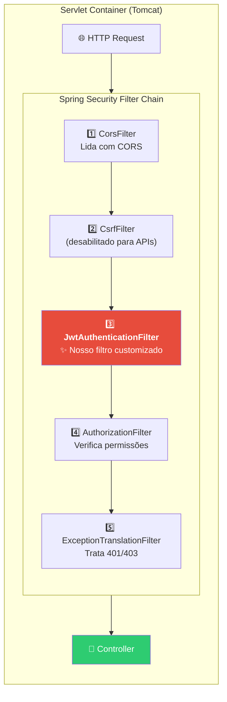
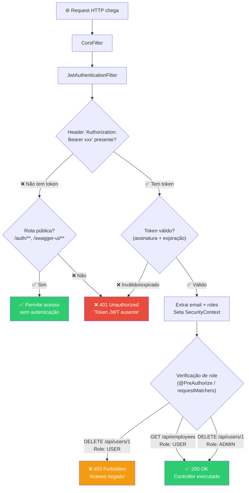
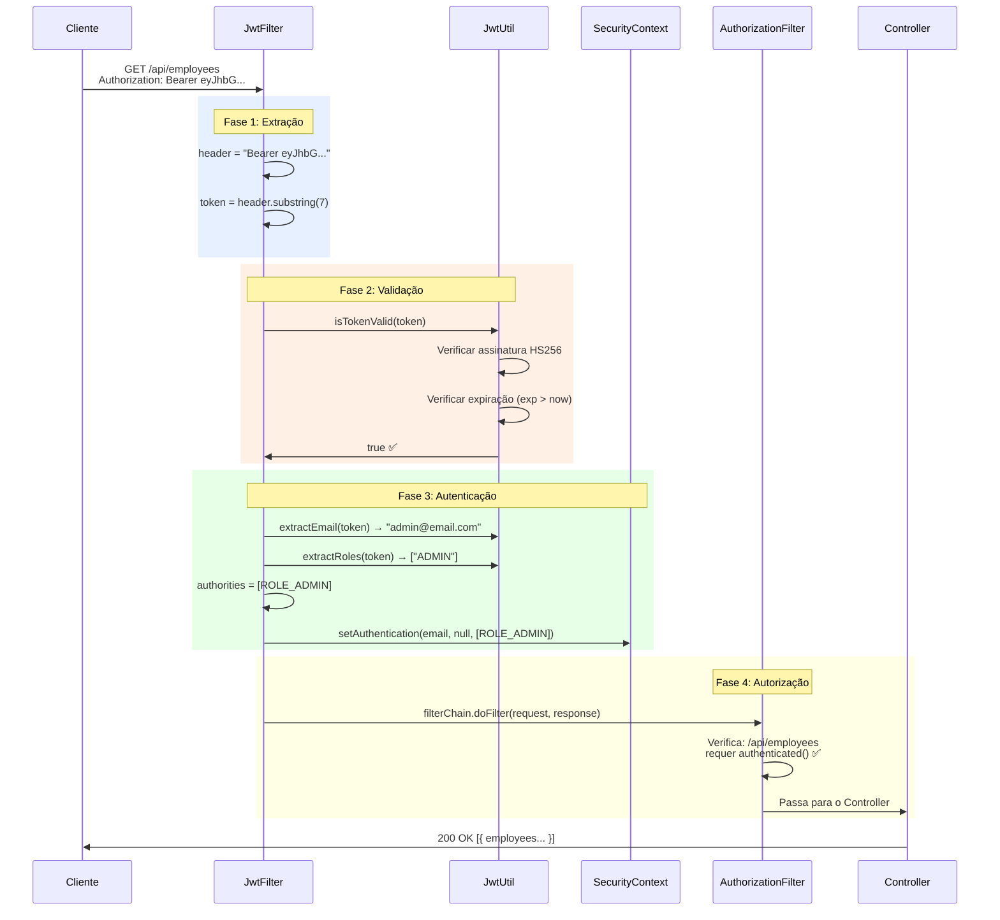
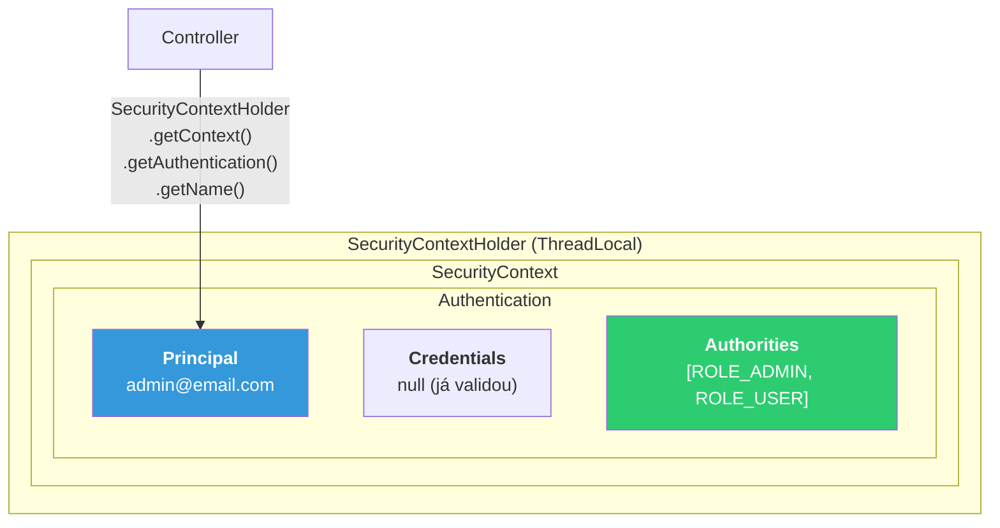
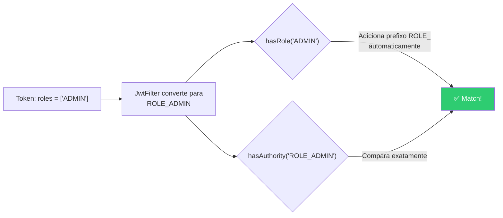
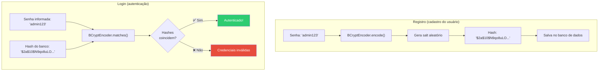

# Slide 6: Spring Security + JWT — Filter Chain e Autorização (Parte 2)

**Horário:** 11:30 - 12:00

---

## Arquitetura do Spring Security — Visão Geral

O Spring Security funciona como uma **cadeia de filtros (Filter Chain)** que intercepta TODOS os requests HTTP antes de chegarem aos Controllers:



> O Spring Security registra **~15 filtros** por default. Nós adicionamos o `JwtAuthenticationFilter` na posição correta da cadeia usando `addFilterBefore`.

### Como os Filtros se Encaixam

| Ordem | Filtro | Responsabilidade | Nosso uso |
|:---:|--------|-----------------|-----------|
| 1 | `CorsFilter` | Trata preflight OPTIONS | Configurado no SecurityFilterChain |
| 2 | `CsrfFilter` | Proteção contra CSRF | **Desabilitado** (API stateless) |
| 3 | **`JwtAuthenticationFilter`** | **Valida JWT e seta SecurityContext** | **Nosso filtro customizado** |
| 4 | `UsernamePasswordAuthenticationFilter` | Login form HTML (não usado) | Substituído pelo JwtFilter |
| 5 | `AuthorizationFilter` | Verifica `.authorizeHttpRequests()` | Protege rotas |
| 6 | `ExceptionTranslationFilter` | Converte exceções em 401/403 | Automático |

---

## SecurityFilterChain — Configurando a Segurança

O `SecurityFilterChain` é o **ponto central de configuração** do Spring Security. Define quais rotas são públicas, quais exigem autenticação e quais exigem roles específicas.

```java
@Configuration
@EnableWebSecurity          // Ativa Spring Security
@EnableMethodSecurity       // Habilita @PreAuthorize nos métodos
@RequiredArgsConstructor
public class SecurityConfig {

    private final JwtAuthenticationFilter jwtFilter;

    @Bean
    public SecurityFilterChain securityFilterChain(HttpSecurity http) throws Exception {
        return http
            // 1. CSRF: desabilitar para APIs stateless (sem cookies de sessão)
            .csrf(csrf -> csrf.disable())

            // 2. Sessão: STATELESS — Spring Security NÃO cria sessão
            .sessionManagement(session ->
                session.sessionCreationPolicy(SessionCreationPolicy.STATELESS))

            // 3. CORS: configurar origens permitidas
            .cors(cors -> cors.configurationSource(corsConfigurationSource()))

            // 4. Definir rotas públicas e protegidas
            .authorizeHttpRequests(auth -> auth
                // Rotas públicas (sem autenticação)
                .requestMatchers("/auth/**").permitAll()            // Login
                .requestMatchers("/swagger-ui/**").permitAll()      // Swagger UI
                .requestMatchers("/v3/api-docs/**").permitAll()     // OpenAPI spec
                .requestMatchers("/h2-console/**").permitAll()      // H2 Console (dev)
                .requestMatchers(HttpMethod.OPTIONS, "/**").permitAll()  // CORS preflight

                // Rotas por role
                .requestMatchers("/api/admin/**").hasRole("ADMIN")  // Só ADMIN

                // Qualquer outra rota: precisa estar autenticado
                .anyRequest().authenticated()
            )

            // 5. Adicionar filtro JWT ANTES do UsernamePasswordAuthenticationFilter
            .addFilterBefore(jwtFilter, UsernamePasswordAuthenticationFilter.class)

            // 6. H2 Console: permitir frames (dev only)
            .headers(headers -> headers.frameOptions(frame -> frame.sameOrigin()))

            .build();
    }

    @Bean
    public PasswordEncoder passwordEncoder() {
        return new BCryptPasswordEncoder();    // Algoritmo de hash para senhas
    }
}
```

### Linha por Linha — O que cada configuração faz

| Configuração | O que faz | Por quê |
|-------------|----------|---------|
| `.csrf(csrf.disable())` | Desabilita proteção CSRF | APIs REST com JWT não usam cookies de sessão |
| `.sessionManagement(STATELESS)` | Não cria `HttpSession` | JWT é stateless — estado está no token |
| `.cors(...)` | Configura CORS | Frontend em outro domínio precisa acessar |
| `.requestMatchers("/auth/**").permitAll()` | Login público | Precisa ser acessível sem token |
| `.requestMatchers("/swagger-ui/**").permitAll()` | Swagger público | Documentação deve ser acessível |
| `.requestMatchers(OPTIONS).permitAll()` | Preflight CORS | Browser envia OPTIONS sem token |
| `.hasRole("ADMIN")` | Exige role ADMIN | Rotas administrativas |
| `.authenticated()` | Exige qualquer token válido | Proteção padrão |
| `.addFilterBefore(jwtFilter, ...)` | Insere JWT filter na cadeia | Este filter valida tokens antes do Spring |

### Fluxo de uma Requisição — Árvore de Decisão



---

## JwtAuthenticationFilter — O Coração da Segurança JWT

O `JwtAuthenticationFilter` estende `OncePerRequestFilter` — garante que executa **exatamente uma vez por request** (mesmo com forwards/redirects internos).

```java
@Component
@RequiredArgsConstructor
@Slf4j
public class JwtAuthenticationFilter extends OncePerRequestFilter {

    private final JwtUtil jwtUtil;

    @Override
    protected void doFilterInternal(HttpServletRequest request,
                                     HttpServletResponse response,
                                     FilterChain filterChain)
            throws ServletException, IOException {

        // 1. Extrair o header Authorization
        String header = request.getHeader("Authorization");

        // 2. Verificar se é um Bearer token
        if (header != null && header.startsWith("Bearer ")) {
            String token = header.substring(7); // Remove "Bearer " (7 caracteres)

            // 3. Validar o token (assinatura + expiração)
            if (jwtUtil.isTokenValid(token)) {
                // 4. Extrair dados do token
                String email = jwtUtil.extractEmail(token);
                List<String> roles = jwtUtil.extractRoles(token);

                log.debug("JWT válido para: {} com roles: {}", email, roles);

                // 5. Converter roles para GrantedAuthority
                // Spring Security EXIGE o prefixo "ROLE_" para hasRole() funcionar
                var authorities = roles.stream()
                    .map(role -> new SimpleGrantedAuthority("ROLE_" + role))
                    .toList();

                // 6. Criar objeto de autenticação
                var authentication = new UsernamePasswordAuthenticationToken(
                    email,       // principal — quem é o usuário
                    null,        // credentials — não precisa, já validou o token
                    authorities  // authorities — o que pode fazer (ROLE_ADMIN, ROLE_USER)
                );

                // 7. Setar no SecurityContext — a partir daqui, o usuário está "logado"
                SecurityContextHolder.getContext().setAuthentication(authentication);
            } else {
                log.warn("JWT inválido recebido: {}", token.substring(0, Math.min(20, token.length())));
            }
        }

        // 8. SEMPRE continuar a cadeia de filtros (mesmo sem token)
        // Se não setar authentication, o AuthorizationFilter vai rejeitar depois
        filterChain.doFilter(request, response);
    }
}
```

### Diagrama de Sequência Detalhado



### O Conceito de SecurityContext



> `SecurityContextHolder` usa **ThreadLocal** — cada thread (request) tem seu próprio contexto. Por isso funciona em modo stateless: settamos no JwtFilter e lemos no Controller, tudo dentro do mesmo request.

---

## Autorização — Controle Fino por Método

### @PreAuthorize — Anotação Spring Security

`@PreAuthorize` avalia uma **expressão SpEL (Spring Expression Language)** ANTES de executar o método:

```java
@RestController
@RequestMapping("/api/employees")
@RequiredArgsConstructor
@Tag(name = "Employees", description = "CRUD de funcionários")
public class EmployeeController {

    @GetMapping                                         // Qualquer autenticado
    public List<EmployeeResponse> findAll() { ... }

    @GetMapping("/{id}")                                // Qualquer autenticado
    public EmployeeResponse findById(@PathVariable Long id) { ... }

    @PostMapping
    @PreAuthorize("hasRole('ADMIN')")                   // ✅ Só ADMIN pode criar
    public ResponseEntity<EmployeeResponse> create(...) { ... }

    @PutMapping("/{id}")
    @PreAuthorize("hasRole('ADMIN')")                   // ✅ Só ADMIN pode atualizar
    public EmployeeResponse update(...) { ... }

    @DeleteMapping("/{id}")
    @PreAuthorize("hasRole('ADMIN')")                   // ✅ Só ADMIN pode deletar
    public ResponseEntity<Void> delete(@PathVariable Long id) { ... }
}
```

### Tabela de Expressões SpEL para Autorização

| Expressão | Significado | Exemplo de Uso |
|-----------|-------------|---------------|
| `hasRole('ADMIN')` | Tem a role ADMIN | Operações administrativas |
| `hasAnyRole('ADMIN', 'MANAGER')` | Tem ADMIN OU MANAGER | Gestão com múltiplos papéis |
| `isAuthenticated()` | Está autenticado (qualquer role) | Rotas que qualquer logado acessa |
| `permitAll()` | Acesso público | Rotas sem autenticação |
| `hasAuthority('ROLE_ADMIN')` | Tem a authority exata | Quando quer especificar com prefixo |
| `#id == authentication.name` | ID do path = email logado | Editar próprio perfil |
| `@myService.canAccess(#id)` | Chama método de serviço | Lógica de autorização complexa |

### hasRole vs hasAuthority



> **`hasRole('ADMIN')`** adiciona `ROLE_` automaticamente. **`hasAuthority('ROLE_ADMIN')`** compara exatamente. Ambas funcionam se o filter setar `ROLE_ADMIN`.

### Matriz de Permissões Visual

| Endpoint | USER | ADMIN | Sem Token |
|----------|:----:|:-----:|:---------:|
| `POST /auth/login` | ✅ | ✅ | ✅ |
| `GET /swagger-ui/**` | ✅ | ✅ | ✅ |
| `GET /api/employees` | ✅ | ✅ | ❌ 401 |
| `GET /api/employees/{id}` | ✅ | ✅ | ❌ 401 |
| `POST /api/employees` | ❌ 403 | ✅ | ❌ 401 |
| `PUT /api/employees/{id}` | ❌ 403 | ✅ | ❌ 401 |
| `DELETE /api/employees/{id}` | ❌ 403 | ✅ | ❌ 401 |

---

## PasswordEncoder — BCrypt no Spring Security

**Regra de ouro: NUNCA armazene senhas em texto plano!**

```java
@Bean
public PasswordEncoder passwordEncoder() {
    return new BCryptPasswordEncoder();  // Custo default: 10 (2^10 = 1024 rounds)
}
```

### Como BCrypt funciona



### Anatomia de um Hash BCrypt

```
$2a$10$N9qo8uLOickgx2ZMRZoMyeIjZAgcfl7p92ldGxad68LJZdL17lhWy
│  │  │                                                        │
│  │  └── Salt (22 caracteres Base64) ──────────────────────────┘
│  └── Cost factor (2^10 = 1024 rounds)
└── Versão do BCrypt
```

| Componente | Exemplo | Descrição |
|-----------|---------|-----------|
| Versão | `$2a$` | Versão do algoritmo BCrypt |
| Custo | `$10$` | 2^10 = 1024 iterações (mais alto = mais seguro e lento) |
| Salt | `N9qo8uLOickgx2ZM...` | Valor aleatório único por senha |
| Hash | `...RZoMye...lhWy` | Resultado final (60 caracteres total) |

### Exemplo de data.sql com senhas hasheadas

```sql
-- Senha "admin123" hasheada com BCrypt
INSERT INTO users (email, password, role) VALUES
  ('admin@email.com', '$2a$10$N9qo8uLOickgx2ZMRZoMyeIjZAgcfl7p92ldGxad68LJZdL17lhWy', 'ADMIN'),
  ('user@email.com', '$2a$10$N9qo8uLOickgx2ZMRZoMyeIjZAgcfl7p92ldGxad68LJZdL17lhWy', 'USER');
```

---

## Resposta para Erros de Segurança — Customização

Por padrão, Spring Security retorna HTML para erros 401/403. Para APIs REST, precisamos de JSON:

```java
@Component
public class CustomAuthenticationEntryPoint implements AuthenticationEntryPoint {

    @Override
    public void commence(HttpServletRequest request,
                         HttpServletResponse response,
                         AuthenticationException authException) throws IOException {
        response.setContentType("application/json");
        response.setCharacterEncoding("UTF-8");
        response.setStatus(HttpServletResponse.SC_UNAUTHORIZED);
        response.getWriter().write("""
            {
                "type": "about:blank",
                "title": "Unauthorized",
                "status": 401,
                "detail": "Token JWT ausente ou inválido",
                "instance": "%s"
            }
            """.formatted(request.getRequestURI()));
    }
}

@Component
public class CustomAccessDeniedHandler implements AccessDeniedHandler {

    @Override
    public void handle(HttpServletRequest request,
                       HttpServletResponse response,
                       AccessDeniedException accessDeniedException) throws IOException {
        response.setContentType("application/json");
        response.setCharacterEncoding("UTF-8");
        response.setStatus(HttpServletResponse.SC_FORBIDDEN);
        response.getWriter().write("""
            {
                "type": "about:blank",
                "title": "Forbidden",
                "status": 403,
                "detail": "Você não tem permissão para acessar este recurso",
                "instance": "%s"
            }
            """.formatted(request.getRequestURI()));
    }
}
```

Registrar no SecurityFilterChain:
```java
.exceptionHandling(exceptions -> exceptions
    .authenticationEntryPoint(customAuthEntryPoint)    // 401
    .accessDeniedHandler(customAccessDeniedHandler)    // 403
)
```

---

## Dependências Maven

```xml
<!-- Spring Security -->
<dependency>
    <groupId>org.springframework.boot</groupId>
    <artifactId>spring-boot-starter-security</artifactId>
</dependency>

<!-- JJWT (Java JWT) -->
<dependency>
    <groupId>io.jsonwebtoken</groupId>
    <artifactId>jjwt-api</artifactId>
    <version>0.11.5</version>
</dependency>
<dependency>
    <groupId>io.jsonwebtoken</groupId>
    <artifactId>jjwt-impl</artifactId>
    <version>0.11.5</version>
    <scope>runtime</scope>
</dependency>
<dependency>
    <groupId>io.jsonwebtoken</groupId>
    <artifactId>jjwt-jackson</artifactId>
    <version>0.11.5</version>
    <scope>runtime</scope>
</dependency>
```

---

## ⚠️ Armadilhas Comuns

| Problema | Causa | Solução |
|----------|-------|---------|
| `ROLE_` prefix errado | hasRole busca `ROLE_ADMIN` mas token tem `ADMIN` sem prefixo | No filter: `new SimpleGrantedAuthority("ROLE_" + role)` |
| Swagger retorna 401 | `/swagger-ui/**` não está em `permitAll()` | Adicionar na lista de rotas públicas |
| Preflight CORS 403 | `OPTIONS` não está liberado | `.requestMatchers(HttpMethod.OPTIONS).permitAll()` |
| `@PreAuthorize` não funciona | Esqueceu `@EnableMethodSecurity` | Adicionar na classe `SecurityConfig` |
| Token expirado vira 500 | Exceção não tratada no filter | Capturar `ExpiredJwtException` no JwtFilter |
| H2 Console não abre | Frame bloqueado pelo Security | `.headers(h -> h.frameOptions(f -> f.sameOrigin()))` |
| `filterChain.doFilter` não chamado | Esqueceu de chamar no final do doFilterInternal | **SEMPRE** chamar, mesmo sem token |

---

## 📌 Pontos-Chave — Resumo

| Conceito | Resumo |
|----------|--------|
| `SecurityFilterChain` | Configura rotas (public/protected), CORS, CSRF, sessão, filtros |
| `JwtAuthenticationFilter` | Extende `OncePerRequestFilter`, valida JWT, seta `SecurityContext` |
| `SecurityContext` | ThreadLocal que guarda a `Authentication` do request atual |
| `@PreAuthorize` | SpEL expressions para controle fino: `hasRole`, `hasAuthority` |
| `@EnableMethodSecurity` | Obrigatório para `@PreAuthorize` funcionar |
| `PasswordEncoder` | BCrypt com salt automático — nunca texto plano |
| `ROLE_` prefix | Spring Security exige `ROLE_` para `hasRole()` |
| `filterChain.doFilter()` | **Sempre chamar** no final do filter — senão a cadeia para |
| `OncePerRequestFilter` | Garante execução única por request (mesmo com forwards) |

> **Próximo slide**: Documentando a API com OpenAPI/Swagger.
