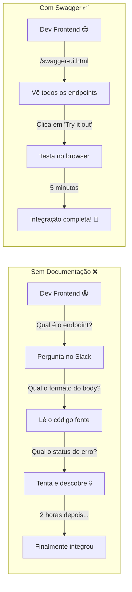
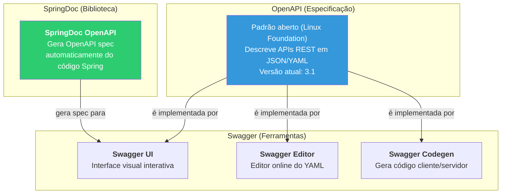
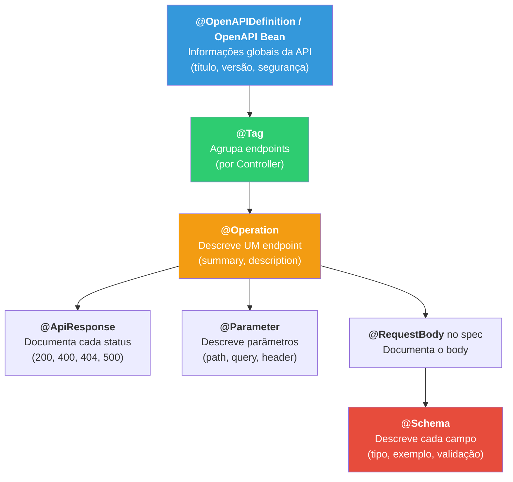
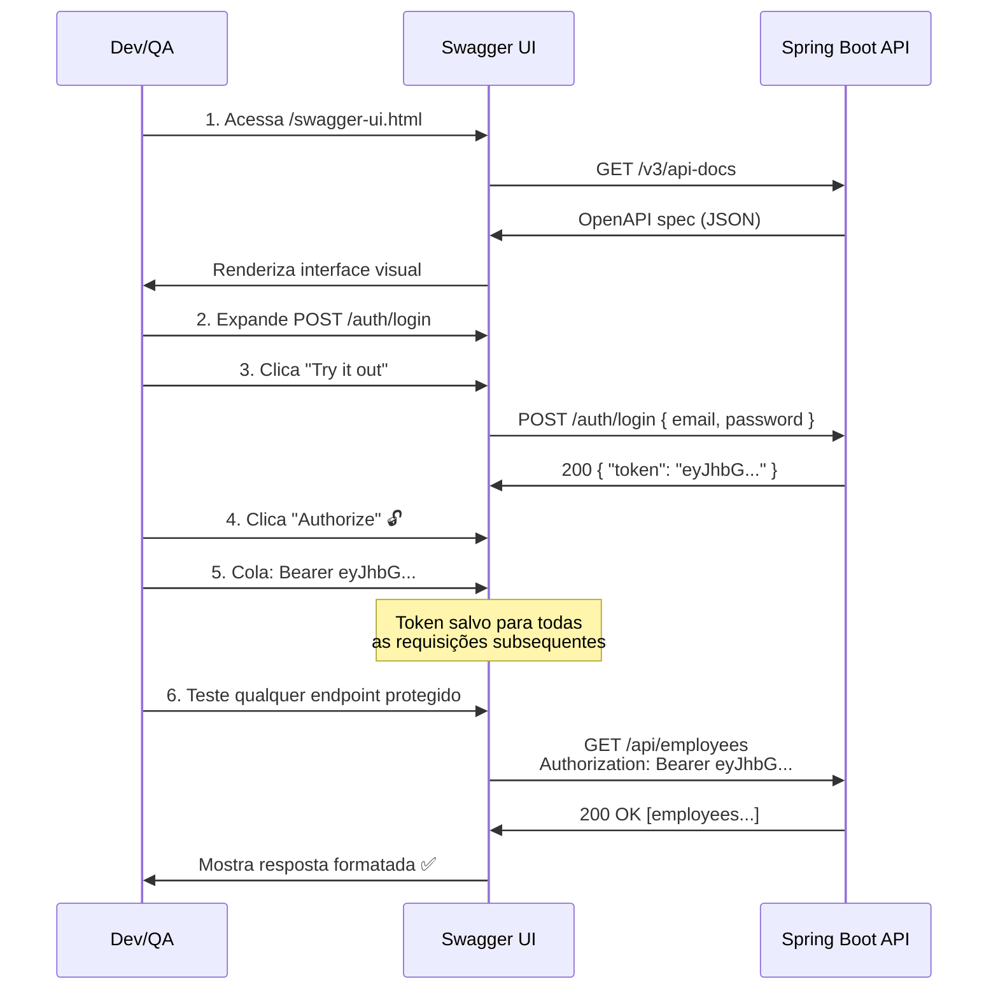

# Slide 7: Documentação com OpenAPI / Swagger

**Horário:** 13:00 - 13:20

---

## O Problema: API sem Documentação

> **"API sem documentação é API que ninguém usa — ou usa errado."**  
> — Praticamente todo tech lead que já existiu



### Custo de uma API sem documentação

| Situação | Tempo perdido | Quem sofre |
|----------|:---:|-----------|
| Frontend pergunta qual endpoint usar | ~30min/pergunta | Todo o time |
| Novo dev tenta entender a API | ~2-4h | Cada novo membro |
| QA testa endpoint com body errado | ~1h/bug | QA + Backend |
| Cliente externo integra sem docs | ~2-3 dias | Cliente + Suporte |
| **Com Swagger**: tudo self-service | **~0** | **Ninguém** |

---

## OpenAPI vs. Swagger — Não Confundir!



| Termo | O que é | Analogia |
|-------|---------|---------|
| **OpenAPI** | **Especificação** (padrão) para descrever APIs REST | A "planta" do prédio |
| **Swagger** | **Ferramentas** que implementam a especificação | As "ferramentas" de construção |
| **Swagger UI** | Interface visual interativa para testar no browser | O "showroom" do prédio |
| **SpringDoc** | Biblioteca que gera OpenAPI a partir do código Spring | O "arquiteto automatizado" |
| **springfox** | ❌ Biblioteca antiga (descontinuada) | Não usar! |

> **Importante**: Muita gente diz "Swagger" quando quer dizer "OpenAPI". Tecnicamente, OpenAPI é a especificação e Swagger são as ferramentas. Mas na prática, todo mundo entende.

### SpringDoc vs SpringFox

| Aspecto | SpringFox (❌ descontinuado) | SpringDoc (✅ atual) |
|---------|---------------------------|---------------------|
| Último update | 2020 | 2024 |
| Spring Boot 3 | ❌ Não suporta | ✅ Suporte completo |
| OpenAPI version | 2.0 (Swagger spec) | **3.x** (OpenAPI spec) |
| Jakarta EE | ❌ Não | ✅ Sim |
| Configuração | Docket bean complexo | Zero-config ou YAML |

---

## Configuração com SpringDoc

### 1. Adicionar Dependência

```xml
<dependency>
    <groupId>org.springdoc</groupId>
    <artifactId>springdoc-openapi-starter-webmvc-ui</artifactId>
    <version>2.3.0</version>
</dependency>
```

### 2. Acessar Swagger UI

```
http://localhost:8088/swagger-ui.html
```

> **Pronto!** Sem NENHUMA configuração adicional, o SpringDoc já gera documentação automática de todos os endpoints `@RestController`.

### 3. URLs importantes

| URL | O que retorna |
|-----|-------------|
| `/swagger-ui.html` | Interface visual interativa (HTML) |
| `/v3/api-docs` | Especificação OpenAPI em JSON |
| `/v3/api-docs.yaml` | Especificação OpenAPI em YAML |

### 4. Configuração no application.yml (opcional)

```yaml
springdoc:
  api-docs:
    path: /v3/api-docs           # Path da spec JSON
    enabled: true                 # Habilitar/desabilitar
  swagger-ui:
    path: /swagger-ui.html        # Path do Swagger UI
    operationsSorter: method      # Ordenar por método HTTP
    tagsSorter: alpha             # Ordenar tags alfabeticamente
    tryItOutEnabled: true         # "Try it out" habilitado por default
    filter: true                  # Barra de busca
```

---

## Anotações de Documentação — Completo

### Hierarquia das Anotações



### @Tag — Agrupando Endpoints

```java
@Tag(name = "Employees", description = "CRUD completo de Funcionários")
@RestController
@RequestMapping("/api/employees")
public class EmployeeController { ... }

@Tag(name = "Auth", description = "Autenticação e geração de JWT")
@RestController
@RequestMapping("/auth")
public class AuthController { ... }

@Tag(name = "Departments", description = "Integração com serviço externo de Departamentos")
@RestController
@RequestMapping("/api/departments")
public class DepartmentController { ... }
```

### @Operation + @ApiResponse — Descrevendo Endpoints

```java
@Operation(
    summary = "Criar novo funcionário",
    description = "Cria um funcionário validando email único, salário mínimo e departamento existente. Requer role ADMIN."
)
@ApiResponses({
    @ApiResponse(
        responseCode = "201",
        description = "Funcionário criado com sucesso",
        content = @Content(schema = @Schema(implementation = EmployeeResponse.class))
    ),
    @ApiResponse(
        responseCode = "400",
        description = "Dados inválidos (validação falhou)",
        content = @Content(schema = @Schema(implementation = ErrorResponse.class))
    ),
    @ApiResponse(
        responseCode = "401",
        description = "Token JWT ausente ou inválido"
    ),
    @ApiResponse(
        responseCode = "403",
        description = "Usuário não tem role ADMIN"
    ),
    @ApiResponse(
        responseCode = "409",
        description = "Email já cadastrado"
    )
})
@PostMapping
@PreAuthorize("hasRole('ADMIN')")
public ResponseEntity<EmployeeResponse> create(
    @RequestBody @Valid EmployeeRequest request) { ... }
```

### @Parameter — Documentando Path/Query Params

```java
@Operation(summary = "Buscar funcionário por ID")
@GetMapping("/{id}")
public EmployeeResponse findById(
    @Parameter(
        description = "ID do funcionário",
        example = "1",
        required = true
    )
    @PathVariable Long id
) { ... }

@Operation(summary = "Buscar funcionários com filtro e paginação")
@GetMapping("/search")
public Page<EmployeeResponse> search(
    @Parameter(description = "Nome para filtro parcial", example = "João")
    @RequestParam(required = false) String name,

    @Parameter(description = "Número da página (0-based)", example = "0")
    @RequestParam(defaultValue = "0") int page,

    @Parameter(description = "Tamanho da página", example = "20")
    @RequestParam(defaultValue = "20") int size
) { ... }
```

### @Schema — Customizando DTOs

```java
@Schema(description = "Dados para criação de um funcionário")
public record EmployeeRequest(

    @Schema(
        description = "Nome completo do funcionário",
        example = "João Silva Santos",
        minLength = 3,
        maxLength = 100,
        requiredMode = Schema.RequiredMode.REQUIRED
    )
    @NotBlank String name,

    @Schema(
        description = "Email corporativo (deve ser único no sistema)",
        example = "joao.silva@empresa.com",
        format = "email"
    )
    @Email String email,

    @Schema(
        description = "Salário mensal bruto (mínimo R$ 1.412,00)",
        example = "3500.00",
        minimum = "1412.00"
    )
    @Positive BigDecimal salary,

    @Schema(
        description = "ID do departamento (validado no serviço externo)",
        example = "1"
    )
    Long departmentId
) {}

@Schema(description = "Dados de retorno do funcionário")
public record EmployeeResponse(

    @Schema(description = "ID único", example = "1")
    Long id,

    @Schema(description = "Nome completo", example = "João Silva Santos")
    String name,

    @Schema(description = "Email corporativo", example = "joao.silva@empresa.com")
    String email,

    @Schema(description = "Salário mensal bruto", example = "3500.00")
    BigDecimal salary,

    @Schema(description = "Nome do departamento", example = "Tecnologia")
    String departmentName
) {}
```

---

## Swagger UI com Autenticação JWT

### Configuração do OpenAPI Bean

```java
@Configuration
public class SwaggerConfig {

    @Bean
    public OpenAPI customOpenAPI() {
        return new OpenAPI()
            .info(new Info()
                .title("Employee API")
                .version("1.0.0")
                .description("API de Gestão de Funcionários com JWT e Integração com Serviços Externos")
                .contact(new Contact()
                    .name("Time de Desenvolvimento")
                    .email("dev@empresa.com"))
                .license(new License()
                    .name("MIT")
                    .url("https://opensource.org/licenses/MIT")))
            // Exige autenticação global (Bearer Token)
            .addSecurityItem(new SecurityRequirement().addList("Bearer Token"))
            // Define o esquema de segurança
            .components(new Components()
                .addSecuritySchemes("Bearer Token",
                    new SecurityScheme()
                        .type(SecurityScheme.Type.HTTP)
                        .scheme("bearer")
                        .bearerFormat("JWT")
                        .description("Insira o token JWT obtido via POST /auth/login")));
    }
}
```

### Fluxo de Uso no Swagger UI



### Passo a Passo Visual

```
┌──────────────────────────────────────────────────────────┐
│  🔒 Employee API v1.0.0                    [Authorize 🔓]│
│  API de Gestão de Funcionários com JWT                    │
│  Contact: dev@empresa.com | License: MIT                  │
├──────────────────────────────────────────────────────────┤
│                                                            │
│  🏷️ Auth — Autenticação e geração de JWT                 │
│  ├── POST /auth/login         Realizar login               │
│                                                            │
│  🏷️ Employees — CRUD de Funcionários                     │
│  ├── GET    /api/employees      Listar todos               │
│  ├── GET    /api/employees/{id} Buscar por ID              │
│  ├── POST   /api/employees      Criar novo  🔒 ADMIN      │
│  ├── PUT    /api/employees/{id} Atualizar   🔒 ADMIN      │
│  └── DELETE /api/employees/{id} Deletar     🔒 ADMIN      │
│                                                            │
│  🏷️ Departments — Integração Serviço Externo             │
│  ├── GET    /api/departments      Listar todos              │
│  └── GET    /api/departments/{id} Buscar por ID             │
│                                                            │
│  📋 Schemas                                                │
│  ├── EmployeeRequest  (name, email, salary, departmentId)  │
│  ├── EmployeeResponse (id, name, email, salary, dept)      │
│  ├── LoginRequest     (email, password)                     │
│  └── TokenResponse    (token)                               │
└──────────────────────────────────────────────────────────┘
```

---

## Gerando Spec OpenAPI para Uso Externo

A especificação gerada pelo SpringDoc pode ser usada para:

| Uso | Ferramenta | Descrição |
|-----|-----------|-----------|
| Gerar SDK cliente | Swagger Codegen / OpenAPI Generator | TypeScript, Python, Java, etc. |
| Importar no Postman | Postman Import | Cria collection automaticamente |
| Mock server | Prism (Stoplight) | Simula a API sem backend |
| Documentação estática | Redoc / Slate | Página HTML bonita |
| Testes de contrato | Pact / Spring Cloud Contract | Validar spec vs implementação |

### Exemplo de uso com curl

```bash
# Baixar a spec em JSON
curl http://localhost:8088/v3/api-docs > openapi.json

# Baixar em YAML
curl http://localhost:8088/v3/api-docs.yaml > openapi.yaml
```

---

## Boas Práticas de Documentação

| Prática | Por quê | Exemplo |
|---------|---------|---------|
| Todo endpoint com `@Operation` | Dev sabe o que faz | `summary = "Criar funcionário"` |
| Todo status com `@ApiResponse` | Dev sabe o que esperar | 201, 400, 401, 403, 409 |
| DTOs com `@Schema` + `example` | "Try it out" funciona | `example = "joao@email.com"` |
| Agrupar por `@Tag` | Organização visual | Auth, Employees, Departments |
| Descrever autenticação | Dev sabe como autenticar | Bearer Token + descrição |
| Manter atualizado | Spec gerada do código = sempre atualizada | SpringDoc faz isso automaticamente |

---

## ⚠️ Armadilhas Comuns

| Problema | Causa | Solução |
|----------|-------|---------|
| Swagger retorna 401 | Rotas `/swagger-ui/**` não estão em `permitAll()` | Adicionar no `SecurityFilterChain` |
| Spec não aparece | SpringDoc não está no classpath | Verificar dependência Maven |
| Schemas não mostram `@Schema` | Usando SpringFox ao invés de SpringDoc | Migrar para `springdoc-openapi` |
| "Try it out" falha com CORS | Swagger UI faz request cross-origin | Configurar CORS corretamente |
| Token não é enviado | Esqueceu de clicar "Authorize" | Instruir o dev no README |
| Endpoint desaparece do Swagger | Controller sem `@RestController` | Verificar anotações |

---

## 📌 Pontos-Chave — Resumo

| Conceito | Resumo |
|----------|--------|
| **OpenAPI** | Especificação padrão para descrever APIs REST (JSON/YAML) |
| **Swagger UI** | Interface interativa em `/swagger-ui.html` |
| **SpringDoc** | Gera spec automaticamente dos controllers Spring |
| `@Tag` | Agrupa endpoints por categoria |
| `@Operation` | Descreve summary/description de um endpoint |
| `@ApiResponse` | Documenta cada código de status possível |
| `@Schema` | Customiza campos dos DTOs (exemplo, descrição, tipo) |
| `@Parameter` | Documenta path/query/header params |
| **Bearer Token config** | `SecurityScheme(type: HTTP, scheme: bearer, bearerFormat: JWT)` |
| **Spec URL** | `/v3/api-docs` (JSON) ou `/v3/api-docs.yaml` (YAML) |

> **Dica profissional**: A spec gerada pelo SpringDoc é **sempre sincronizada com o código**. Diferente de documentação manual, nunca fica desatualizada!

> **Próximo slide**: Walkthrough do projeto `05-integration-security-demo`.
