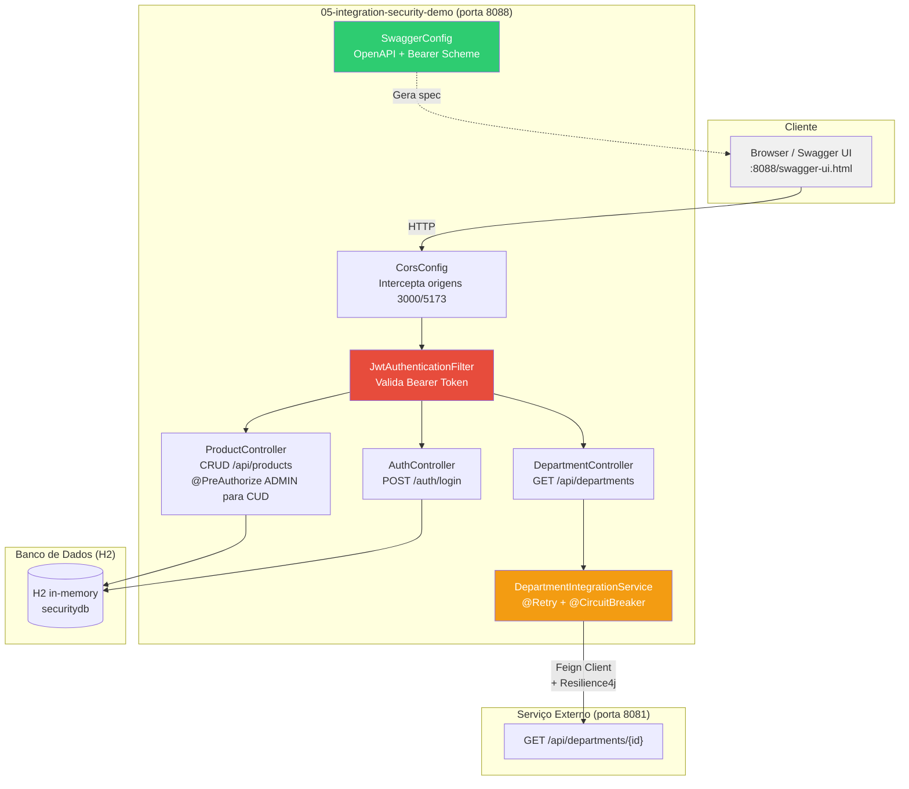
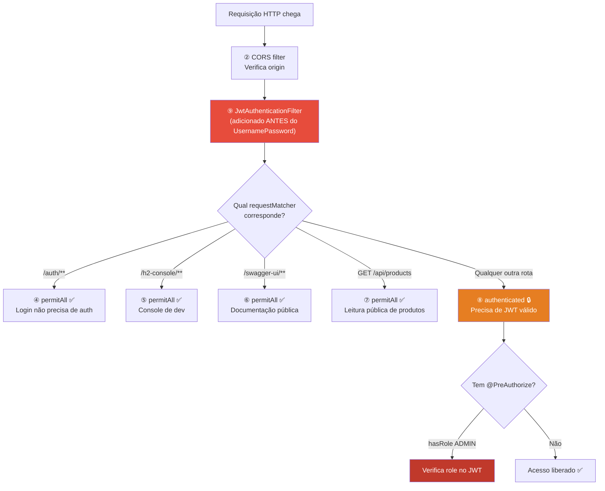
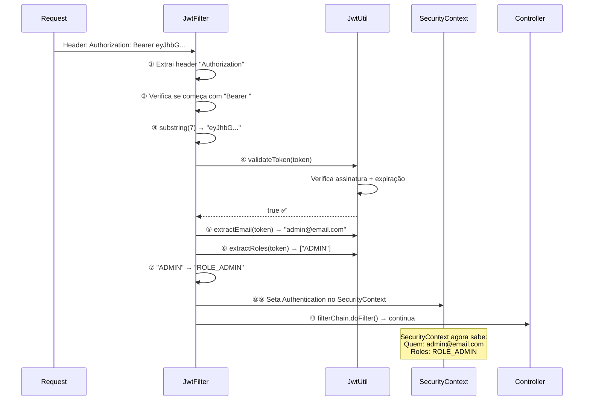
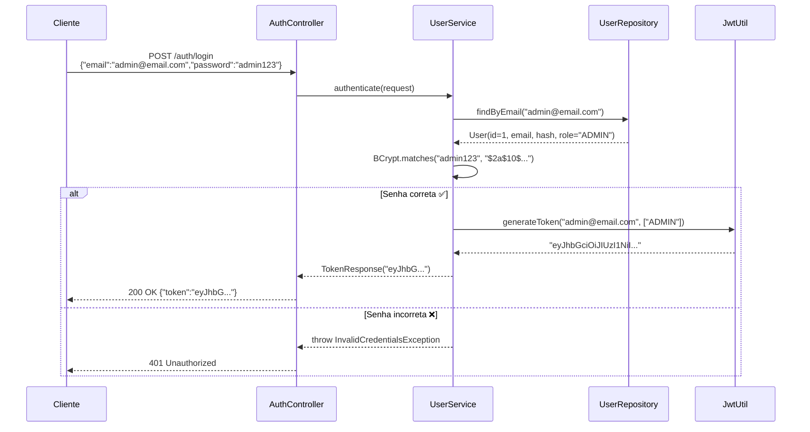
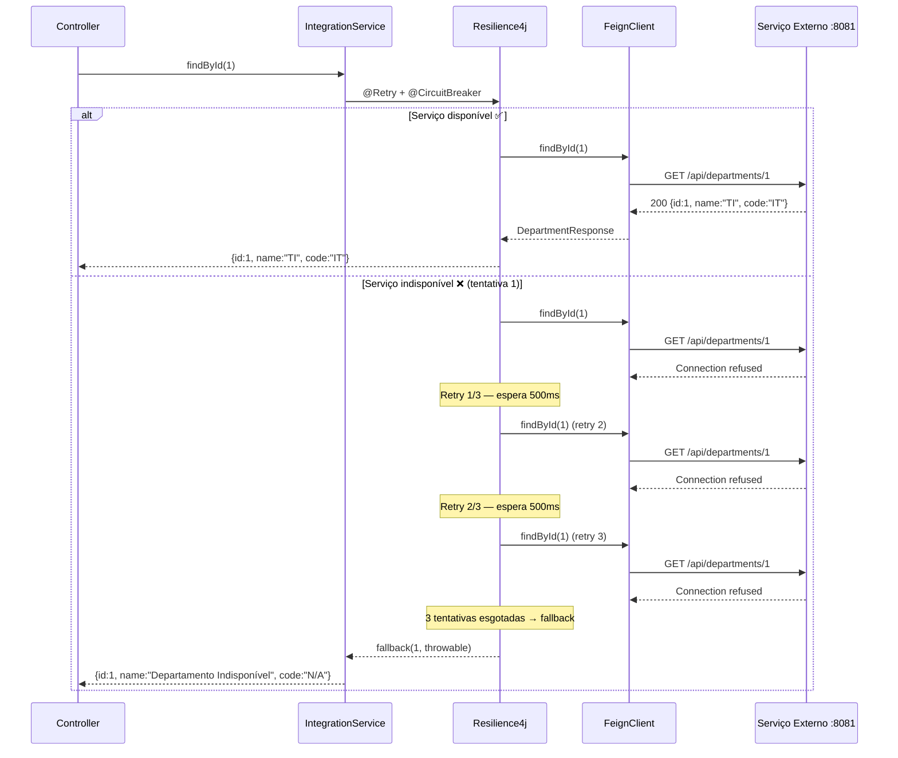

# Slide 8: Walkthrough — 05-integration-security-demo

**Horário:** 13:20 - 13:50

---

## Objetivo do Walkthrough

> **"Mostrar código era o que faltava."**  
> — Kent Beck

Projeto completo demonstrando **todos os conceitos do Dia 5** integrados em uma única aplicação. Vamos percorrer cada camada juntos, entendendo como as peças se encaixam.

### Visão Geral da Arquitetura



---

## Estrutura Completa do Projeto

```text
com.example.demo
├── IntegrationSecurityDemoApplication.java      ← @SpringBootApplication + @EnableFeignClients
│
├── config/
│   ├── CorsConfig.java                          ← CORS para /api/** (localhost:3000, 5173)
│   ├── FeignConfig.java                         ← Registra CustomErrorDecoder bean
│   ├── SecurityConfig.java                      ← SecurityFilterChain + BCryptPasswordEncoder
│   └── SwaggerConfig.java                       ← OpenAPI 3 + Bearer JWT scheme
│
├── controller/
│   ├── AuthController.java                      ← POST /auth/login (público)
│   ├── DepartmentController.java                ← GET /api/departments (autenticado)
│   └── ProductController.java                   ← CRUD /api/products (ADMIN para CUD)
│
├── client/
│   ├── DepartmentClient.java                    ← @FeignClient → department-service
│   └── CustomErrorDecoder.java                  ← switch 404/503/default
│
├── dto/
│   ├── DepartmentResponse.java                  ← record(id, name, code)
│   ├── LoginRequest.java                        ← record(email, password) + @Valid
│   ├── ProductRequest.java                      ← record(name, sku, price, description)
│   ├── ProductResponse.java                     ← record(id, name, sku, price, description, createdAt)
│   └── TokenResponse.java                       ← record(token)
│
├── exception/
│   ├── DepartmentNotFoundException.java
│   ├── DuplicateSkuException.java
│   ├── ExternalServiceException.java
│   ├── GlobalExceptionHandler.java              ← @RestControllerAdvice + ProblemDetail (RFC 7807)
│   ├── InvalidCredentialsException.java
│   └── ProductNotFoundException.java
│
├── mapper/
│   └── ProductMapper.java                       ← toEntity, toResponse, updateEntity (static)
│
├── model/
│   ├── Product.java                             ← @Entity (id, name, sku, price, description, timestamps)
│   └── User.java                                ← @Entity (id, email, password, role) + getRoles()
│
├── repository/
│   ├── ProductRepository.java                   ← findBySku, existsBySku
│   └── UserRepository.java                      ← findByEmail
│
├── security/
│   ├── JwtAuthenticationFilter.java             ← OncePerRequestFilter → SecurityContext
│   └── JwtUtil.java                             ← Gerar/validar JWT (HS256, jjwt 0.11.5)
│
└── service/
    ├── DepartmentIntegrationService.java        ← @Retry + @CircuitBreaker + fallback
    ├── ProductService.java                      ← CRUD + validação SKU duplicado
    └── UserService.java                         ← authenticate() → BCrypt → JWT
```

---

## Passo 1 — Subir a Aplicação

```bash
cd dia-05/05-integration-security-demo
mvn spring-boot:run
```

### O que observar na saída

```text
  .   ____          _
 /\\ / ___'_ __ _ _(_)_ __  __ _
( ( )\___ | '_ | '_| | '_ \/ _` |
 \\/  ___)| |_)| | | | | || (_| |
  '  |____| .__|_| |_|_| |_\__, |  :: Spring Boot :: (v3.2.2)
                             |___/

INFO  --- HikariPool: Starting...
INFO  --- H2 console available at '/h2-console'    ← 🔍 Console H2
INFO  --- Hibernate: create table product...        ← 🔍 DDL automático
INFO  --- Hibernate: insert into users...           ← 🔍 data.sql executado
INFO  --- Tomcat started on port 8088               ← ✅ Porta 8088
```

### Dados pré-carregados (data.sql)

| Email | Senha | Role | Permissões |
|-------|-------|------|-----------|
| `admin@email.com` | `admin123` | `ADMIN` | Ler + Criar + Atualizar + Deletar |
| `user@email.com` | `user123` | `USER` | Apenas Ler |

| ID | Produto | SKU | Preço |
|:--:|---------|-----|------:|
| 1 | Notebook Dell | NOT-0001 | R$ 4.500,00 |
| 2 | Mouse Logitech | MOU-0001 | R$ 150,00 |
| 3 | Teclado Mecânico | TEC-0001 | R$ 350,00 |
| 4 | Monitor 27" | MON-0001 | R$ 1.800,00 |
| 5 | Headset Gamer | HEA-0001 | R$ 280,00 |

---

## Passo 2 — Analisando SecurityConfig.java

```java
@Bean
public SecurityFilterChain filterChain(HttpSecurity http) throws Exception {
    return http
        .csrf(csrf -> csrf.disable())                               // 1
        .cors(Customizer.withDefaults())                            // 2
        .sessionManagement(session ->
            session.sessionCreationPolicy(SessionCreationPolicy.STATELESS))  // 3
        .authorizeHttpRequests(auth -> auth
            .requestMatchers("/auth/**").permitAll()                 // 4
            .requestMatchers("/h2-console/**").permitAll()           // 5
            .requestMatchers("/swagger-ui/**", "/v3/api-docs/**").permitAll() // 6
            .requestMatchers(HttpMethod.GET, "/api/products/**").permitAll()  // 7
            .anyRequest().authenticated())                           // 8
        .addFilterBefore(jwtFilter, UsernamePasswordAuthenticationFilter.class) // 9
        .build();
}
```

### Análise linha a linha



| # | Linha | Por quê? |
|:-:|-------|----------|
| 1 | `csrf.disable()` | API stateless não usa cookies → CSRF irrelevante |
| 2 | `cors(withDefaults())` | Delega para o bean `CorsConfigurationSource` em CorsConfig |
| 3 | `STATELESS` | Proíbe criação de `JSESSIONID` → cada request deve ter JWT |
| 4-6 | `permitAll()` | Rotas públicas: login, console H2, Swagger UI |
| 7 | `GET products permitAll` | Leitura de catálogo não requer autenticação |
| 8 | `anyRequest().authenticated()` | **Tudo que não está acima** precisa de token |
| 9 | `addFilterBefore` | Nosso `JwtAuthenticationFilter` roda ANTES do filtro padrão do Spring |

> **Pergunta para a turma**: O que acontece se invertermos a ordem e colocar `anyRequest().authenticated()` antes de `permitAll()`?
> → Resposta: dá erro! O Spring exige que `anyRequest()` seja o ÚLTIMO matcher.

---

## Passo 3 — Analisando JwtAuthenticationFilter

```java
@Override
protected void doFilterInternal(HttpServletRequest request,
                                HttpServletResponse response,
                                FilterChain filterChain) throws ... {

    String authHeader = request.getHeader("Authorization");          // 1

    if (authHeader != null && authHeader.startsWith("Bearer ")) {    // 2
        String token = authHeader.substring(7);                      // 3

        if (jwtUtil.validateToken(token)) {                          // 4
            String email = jwtUtil.extractEmail(token);              // 5
            List<String> roles = jwtUtil.extractRoles(token);        // 6

            var authorities = roles.stream()                         // 7
                .map(role -> new SimpleGrantedAuthority("ROLE_" + role))
                .toList();

            var authentication = new UsernamePasswordAuthenticationToken(
                email, null, authorities);                           // 8
            SecurityContextHolder.getContext()
                .setAuthentication(authentication);                  // 9
        }
    }

    filterChain.doFilter(request, response);                         // 10
}
```

### Fluxo do Filtro



> **Ponto crucial**: O prefixo `"ROLE_"` é adicionado pelo filtro. Por isso no `@PreAuthorize` usamos `hasRole('ADMIN')` (sem prefixo) — o Spring adiciona `ROLE_` automaticamente!

---

## Passo 4 — Analisando AuthController + UserService

### Fluxo Completo de Login



### O token JWT contém

```json
{
  "sub": "admin@email.com",     // Subject = email do usuário
  "roles": ["ADMIN"],           // Claim customizado com roles
  "iat": 1700000000,            // Issued at (timestamp)
  "exp": 1700086400             // Expiration (24h depois)
}
```

---

## Passo 5 — Analisando Feign + Resilience4j

### DepartmentClient — Interface Declarativa

```java
@FeignClient(
    name = "department-service",
    url = "${department.api.url}",          // → http://localhost:8081
    configuration = FeignConfig.class        // → registra ErrorDecoder
)
public interface DepartmentClient {

    @GetMapping("/api/departments/{id}")
    DepartmentResponse findById(@PathVariable Long id);
}
```

### DepartmentIntegrationService — Resiliência

```java
@Retry(name = "departmentService", fallbackMethod = "findByIdFallback")
@CircuitBreaker(name = "departmentService", fallbackMethod = "findByIdFallback")
public DepartmentResponse findById(Long id) {
    return departmentClient.findById(id);    // Chama via Feign
}

private DepartmentResponse findByIdFallback(Long id, Throwable t) {
    // Retorna resposta degradada (não lança exceção!)
    return new DepartmentResponse(id, "Departamento Indisponível", "N/A");
}
```

### CustomErrorDecoder — Pattern Matching (Java 21)

```java
public Exception decode(String methodKey, Response response) {
    return switch (response.status()) {
        case 404 -> new DepartmentNotFoundException(
                        "Departamento não encontrado no serviço externo");
        case 503 -> new ExternalServiceException(
                        "Serviço de departamentos indisponível");
        default  -> new ExternalServiceException(
                        "Erro ao comunicar com serviço externo: HTTP " + response.status());
    };
}
```

### Fluxo Completo: Retry → Circuit Breaker → Fallback



### Configuração Resilience4j (application.yml)

```yaml
resilience4j:
  retry:
    instances:
      departmentService:
        maxAttempts: 3              # 3 tentativas total
        waitDuration: 500ms          # Espera entre tentativas
  circuitbreaker:
    instances:
      departmentService:
        failureRateThreshold: 50     # Abre se 50% falham
        slidingWindowSize: 10        # Janela de 10 requisições
        waitDurationInOpenState: 10s # Espera 10s no estado OPEN
```

---

## Passo 6 — Testando no Swagger UI

### Teste Completo — Demonstração ao Vivo

```
1. Abrir http://localhost:8088/swagger-ui.html

2. LISTAR PRODUTOS (público — sem token):
   → GET /api/products → 200 OK ✅ (5 produtos)

3. CRIAR PRODUTO (sem token):
   → POST /api/products → 401 Unauthorized ❌

4. FAZER LOGIN como admin:
   → POST /auth/login → { email: "admin@email.com", password: "admin123" }
   → 200 OK → Copiar token

5. CLICAR "Authorize" → Colar "Bearer eyJhbG..."

6. CRIAR PRODUTO (com token ADMIN):
   → POST /api/products → 201 Created ✅

7. FAZER LOGIN como user:
   → POST /auth/login → { email: "user@email.com", password: "user123" }
   → Autorizar com novo token

8. CRIAR PRODUTO (com token USER):
   → POST /api/products → 403 Forbidden ❌ (não tem ROLE_ADMIN)
```

### Tabela de testes esperados

| Endpoint | Sem token | USER | ADMIN |
|----------|:---------:|:----:|:-----:|
| `GET /api/products` | ✅ 200 | ✅ 200 | ✅ 200 |
| `POST /api/products` | ❌ 401 | ❌ 403 | ✅ 201 |
| `PUT /api/products/{id}` | ❌ 401 | ❌ 403 | ✅ 200 |
| `DELETE /api/products/{id}` | ❌ 401 | ❌ 403 | ✅ 204 |
| `GET /api/departments` | ❌ 401 | ✅ 200 | ✅ 200 |
| `POST /auth/login` | ✅ 200 | ✅ 200 | ✅ 200 |

---

## Passo 7 — GlobalExceptionHandler com ProblemDetail

```java
@ExceptionHandler(ProductNotFoundException.class)
public ProblemDetail handleProductNotFound(ProductNotFoundException ex) {
    ProblemDetail problem = ProblemDetail.forStatusAndDetail(
        HttpStatus.NOT_FOUND, ex.getMessage());
    problem.setTitle("Produto não encontrado");
    problem.setType(URI.create("https://api.example.com/errors/not-found"));
    return problem;
}
```

**Resposta RFC 7807**:
```json
{
    "type": "https://api.example.com/errors/not-found",
    "title": "Produto não encontrado",
    "status": 404,
    "detail": "Produto com id 99 não encontrado",
    "instance": "/api/products/99"
}
```

> **Conceito**: `ProblemDetail` é padrão do Spring Boot 3 e segue a RFC 7807. Muito melhor que retornar strings genéricas!

---

## Arquivos-Chave para Revisar com a Turma

| Arquivo | Conceito Central | O que destacar |
|---------|:----------------:|----------------|
| `SecurityConfig.java` | Security Filter Chain | Ordem dos matchers, `addFilterBefore` |
| `JwtAuthenticationFilter.java` | Filtro JWT | Extração do header, `"ROLE_"` prefix, SecurityContext |
| `JwtUtil.java` | Token JWT | Geração com claims, validação, extração de roles |
| `AuthController.java` | Login | Fluxo BCrypt → JWT → Response |
| `UserService.java` | Autenticação | `BCrypt.matches()`, geração do token |
| `DepartmentClient.java` | Feign Client | Interface declarativa, `@FeignClient` params |
| `DepartmentIntegrationService.java` | Resilience4j | `@Retry` + `@CircuitBreaker`, fallback |
| `CustomErrorDecoder.java` | Error Decoder | `switch` com pattern matching Java 21 |
| `CorsConfig.java` | CORS | Origins, methods, headers |
| `SwaggerConfig.java` | OpenAPI | Bearer Token scheme no Swagger UI |
| `GlobalExceptionHandler.java` | Erros | `ProblemDetail` (RFC 7807) |

---

## Pontos de Discussão com a Turma

| # | Pergunta | Resposta |
|:-:|----------|---------|
| 1 | Por que desabilitamos CSRF? | API stateless não usa cookies → CSRF irrelevante |
| 2 | O que acontece se o JWT expirar? | `JwtUtil.validateToken()` retorna false → 401 |
| 3 | Por que `"ROLE_"` + role no filtro? | Convenção do Spring Security: `hasRole('X')` = `hasAuthority('ROLE_X')` |
| 4 | Por que GET products é público? | Catálogo pode ser navegado sem login (como e-commerce) |
| 5 | Feign vs RestTemplate? | Declarativo vs imperativo — menos código, mais legível |
| 6 | E se o fallback falhar? | O fallback NÃO deve lançar exception → retorna dado degradado |
| 7 | ProblemDetail vs String? | RFC 7807 = padrão de mercado, facilita debug do frontend |

> **Próximo slide**: Hora de praticar! Exercício `05-employee-api-secure`.
