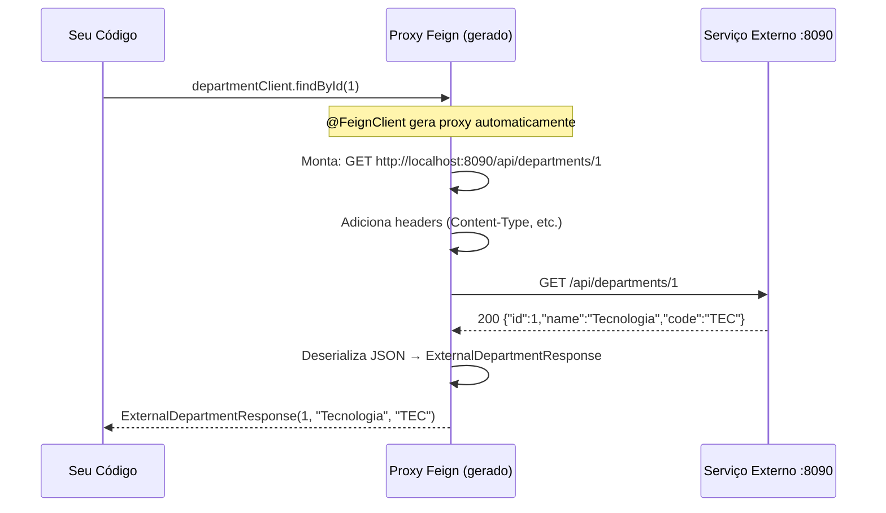
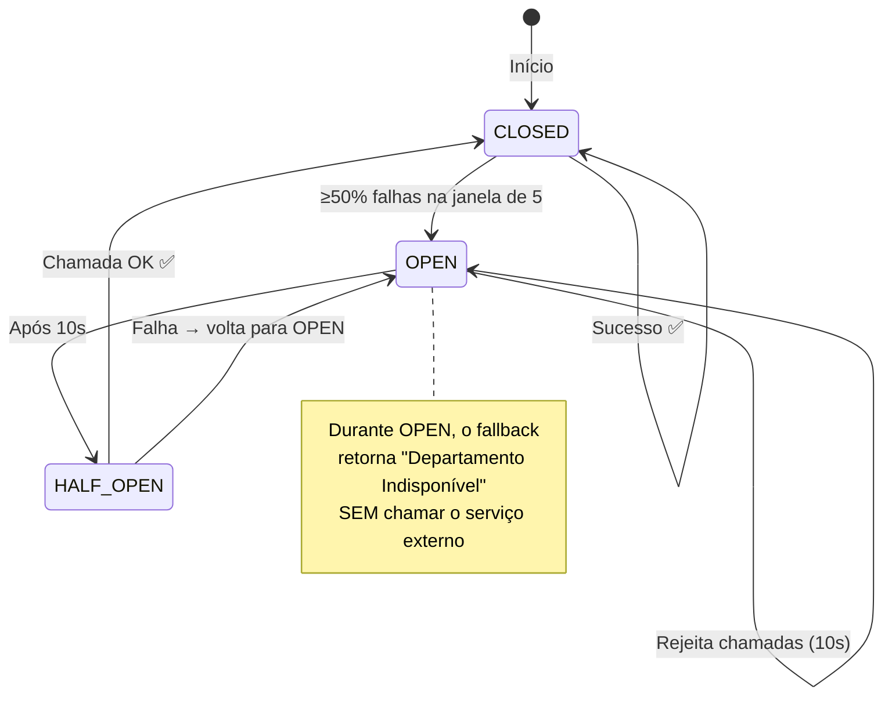

# Slide 9: Exercício — 05-employee-api-secure (TODOs 1-4)

**Horário:** 13:50 - 15:30

---

## Visão Geral do Exercício

Adicionar **integração com serviço externo**, **resiliência**, **segurança JWT** e **documentação Swagger** à API de Funcionários, seguindo **8 TODOs** progressivos.

### Mapa dos 8 TODOs

| Slide 9 — Integração (este slide) | Slide 10 — Segurança |
|:--|:--|
| TODO 1 — Feign Client | TODO 5 — AuthController |
| TODO 2 — Error Decoder | TODO 6 — SecurityFilterChain |
| TODO 3 — Resilience4j | TODO 7 — JWT Filter |
| TODO 4 — CORS | TODO 8 — Swagger Docs |

> TODOs 1→2→3 devem ser feitos **em ordem** (cada um depende do anterior). TODO 4 é **independente**.

### O que JÁ vem pronto vs. o que você vai implementar

| JÁ PRONTO — Não modifique! | VOCÊ IMPLEMENTA |
|:--|:--|
| `pom.xml` — todas as dependências | TODO 1: `ExternalDepartmentClient` (Feign) |
| `JwtUtil` — gera/valida JWT (HS256) | TODO 2: `CustomErrorDecoder` (erros Feign) |
| `Employee`, `Department`, `User` (models) | TODO 3: `DepartmentIntegrationService` + YAML |
| DTOs — records com validação | TODO 4: `CorsConfig` (CORS global) |
| `EmployeeService` — CRUD completo | TODO 5: `AuthController` (login) |
| `UserService` — authenticate() | TODO 6: `SecurityConfig` (filter chain) |
| `EmployeeMapper` — toEntity/toResponse | TODO 7: `JwtAuthenticationFilter` (filtro JWT) |
| `GlobalExceptionHandler` — ProblemDetail | TODO 8: Swagger annotations nos controllers |
| Repositories JPA + `data.sql` | |

**Dependências-chave:** `JwtUtil` → usado no TODO 7 · `UserService` → usado no TODO 5 · `pom.xml` → habilita TODO 1

---

## Setup e Verificação

```bash
cd dia-05/05-employee-api-secure
mvn spring-boot:run    # Deve subir na porta 8089
```

### Verificar dados pré-carregados

| Tipo | Dados |
|------|-------|
| **Usuários** | `admin@email.com` / `admin123` (ADMIN), `user@email.com` / `user123` (USER) |
| **Departamentos** | Tecnologia (TEC), Recursos Humanos (RH), Financeiro (FIN) |
| **Funcionários** | Ana Silva, Bruno Costa, Carla Mendes, Daniel Oliveira |

### Portas do exercício

| Serviço | Porta |
|---------|:-----:|
| **05-employee-api-secure** (seu exercício) | `8089` |
| Serviço externo de departamentos (simulado) | `8090` |

---

## TODO 1: Criar ExternalDepartmentClient (Feign)

### Objetivo

Criar uma interface Feign para consumir a API externa de departamentos em `http://localhost:8090`.

### Arquivo: `client/ExternalDepartmentClient.java`

```java
// TODO 1: Criar o Feign Client para o serviço externo de departamentos.
// Anotar a interface com @FeignClient apontando para department.api.url
// Descomentar os métodos findById e findAll
```

### O que fazer

1. Anotar a interface com `@FeignClient`
2. Descomentar os métodos `findById` e `findAll`

### Solução Esperada

```java
@FeignClient(
    name = "department-service",
    url = "${department.api.url}",               // → http://localhost:8090
    configuration = FeignConfig.class
)
public interface ExternalDepartmentClient {

    @GetMapping("/api/departments/{id}")
    ExternalDepartmentResponse findById(@PathVariable Long id);

    @GetMapping("/api/departments")
    List<ExternalDepartmentResponse> findAll();
}
```

### Diagrama: O que o Feign gera por baixo



### ⚠️ Erros comuns

| Erro | Causa | Solução |
|------|-------|---------|
| `No qualifying bean` | Faltou `@EnableFeignClients` | Já está na Application ✅ |
| `Connection refused` | Serviço externo não está rodando | Normal nesse exercício — o fallback vai tratar |
| `FeignClient not found` | Faltou `@FeignClient` na interface | Adicionar a anotação |

---

## TODO 2: Criar CustomErrorDecoder

### Objetivo

Tratar erros HTTP do serviço externo, convertendo status codes em exceções Java específicas.

### Arquivo: `client/CustomErrorDecoder.java`

```java
// TODO 2: Implementar o ErrorDecoder customizado para o Feign Client.
// Usar switch expression para tratar 404 e 503
// Descomentar o bloco switch
```

### O que fazer

1. Implementar o método `decode` da interface `ErrorDecoder`
2. Descomentar o `switch` com pattern matching
3. Registrar no `FeignConfig` (já está feito!)

### Solução Esperada

```java
public class CustomErrorDecoder implements ErrorDecoder {

    @Override
    public Exception decode(String methodKey, Response response) {
        return switch (response.status()) {
            case 404 -> new DepartmentNotFoundException(
                            "Departamento não encontrado no serviço externo");
            case 503 -> new ExternalServiceException(
                            "Serviço de departamentos temporariamente indisponível");
            default  -> new ExternalServiceException(
                            "Erro ao comunicar com serviço externo: HTTP " + response.status());
        };
    }
}
```

### Comparação: com vs. sem ErrorDecoder

| Cenário | O que acontece | Resultado no cliente |
|:--|:--|:--|
| **SEM** ErrorDecoder | `FeignException.NotFound` (mensagem crua) | `500 Internal Server Error` |
| **COM** ErrorDecoder | `CustomErrorDecoder.decode()` → `DepartmentNotFoundException` | `404 Not Found` com ProblemDetail |

---

## TODO 3: Configurar Resilience4j

### Objetivo

Adicionar retry, circuit breaker e fallback para as chamadas ao serviço de departamentos.

### Neste TODO existem MÚLTIPLAS alterações

| # | Arquivo | O que fazer |
|:-:|---------|-------------|
| 3a | `application.yml` | Descomentar a configuração Resilience4j |
| 3b | `DepartmentIntegrationService.java` | Injetar o `ExternalDepartmentClient` |
| 3c | `DepartmentIntegrationService.java` | Adicionar `@Retry` + `@CircuitBreaker` |
| 3d | `DepartmentIntegrationService.java` | Implementar chamadas via Feign |
| 3e | `DepartmentIntegrationService.java` | Descomentar métodos de fallback |

### 3a — Descomentar application.yml

```yaml
resilience4j:
  retry:
    instances:
      departmentService:
        maxAttempts: 3
        waitDuration: 1s
  circuitbreaker:
    instances:
      departmentService:
        failureRateThreshold: 50
        slidingWindowSize: 5
        waitDurationInOpenState: 10s
```

### 3b-3e — DepartmentIntegrationService.java

```java
@Service
public class DepartmentIntegrationService {

    private final ExternalDepartmentClient departmentClient;  // 3b: Injetar

    // 3c + 3d: Anotar com @Retry/@CircuitBreaker e chamar Feign
    @Retry(name = "departmentService", fallbackMethod = "findByIdFallback")
    @CircuitBreaker(name = "departmentService", fallbackMethod = "findByIdFallback")
    public ExternalDepartmentResponse findById(Long id) {
        return departmentClient.findById(id);  // 3d
    }

    @Retry(name = "departmentService", fallbackMethod = "findAllFallback")
    @CircuitBreaker(name = "departmentService", fallbackMethod = "findAllFallback")
    public List<ExternalDepartmentResponse> findAll() {
        return departmentClient.findAll();  // 3d
    }

    // 3e: Descomentar fallbacks
    private ExternalDepartmentResponse findByIdFallback(Long id, Throwable t) {
        return new ExternalDepartmentResponse(id, "Departamento Indisponível", "N/A");
    }

    private List<ExternalDepartmentResponse> findAllFallback(Throwable t) {
        return List.of(new ExternalDepartmentResponse(0L, "Serviço Indisponível", "N/A"));
    }
}
```

### Fluxo do Resilience4j



### ⚠️ Erros comuns

| Erro | Causa | Solução |
|------|-------|---------|
| `@Retry` não funciona | Faltou `spring-boot-starter-aop` | Já está no pom.xml ✅ |
| Fallback não é chamado | Assinatura diferente do método original | Mesmos params + `Throwable` no final |
| `NoSuchBeanDefinitionException` | `ExternalDepartmentClient` não anotado | Completar TODO 1 primeiro |
| Fallback lança exceção | Fallback NÃO deve lançar exception | Retornar dado degradado |

---

## TODO 4: Configurar CORS Global

### Objetivo

Permitir que frontends (React/Angular em `localhost:3000` e `localhost:5173`) acessem a API.

### Arquivo: `config/CorsConfig.java`

```java
// TODO 4: Configurar CORS para a API.
// Implementar WebMvcConfigurer.addCorsMappings
// Descomentar o bloco de configuração
```

### Solução Esperada

```java
@Configuration
public class CorsConfig implements WebMvcConfigurer {

    @Override
    public void addCorsMappings(CorsRegistry registry) {
        registry.addMapping("/api/**")
                .allowedOrigins(
                    "http://localhost:3000",     // React dev server
                    "http://localhost:5173"      // Vite dev server
                )
                .allowedMethods("GET", "POST", "PUT", "DELETE", "OPTIONS")
                .allowedHeaders("*")
                .allowCredentials(true)
                .maxAge(3600);                  // Cache preflight por 1h
    }
}
```

### O que cada configuração faz

| Configuração | Valor | Significado |
|:--|:--|:--|
| `addMapping` | `/api/**` | Aplica CORS para todas as rotas da API |
| `allowedOrigins` | `localhost:3000`, `localhost:5173` | Frontends React e Vite |
| `allowedMethods` | GET, POST, PUT, DELETE, OPTIONS | Métodos HTTP permitidos |
| `allowedHeaders` | `*` | Aceita qualquer header (inclusive Authorization) |
| `allowCredentials` | `true` | Permite envio de cookies/tokens |
| `maxAge` | `3600` | Browser cacheia preflight por 1h |

---

## ✅ Checkpoint — TODOs 1-4

Após implementar os TODOs 1-4, verifique:

| Verificação | Como testar | Resultado esperado |
|-------------|------------|-------------------|
| Aplicação sobe | `mvn spring-boot:run` | Porta 8089 sem erros |
| Feign funciona | Ver logs ao acessar departamentos | Log de tentativa de conexão |
| Fallback ativado | Serviço externo offline → GET /api/departments | `"Departamento Indisponível"` |
| CORS | Requisição de `localhost:3000` | Header `Access-Control-Allow-Origin` |

> **Dica**: TODO 4 (CORS) é independente — pode ser feito a qualquer momento. TODOs 1→2→3 devem seguir a ordem.

> **Próximo slide**: TODOs 5-8 — Security, JWT Filter e Swagger.
