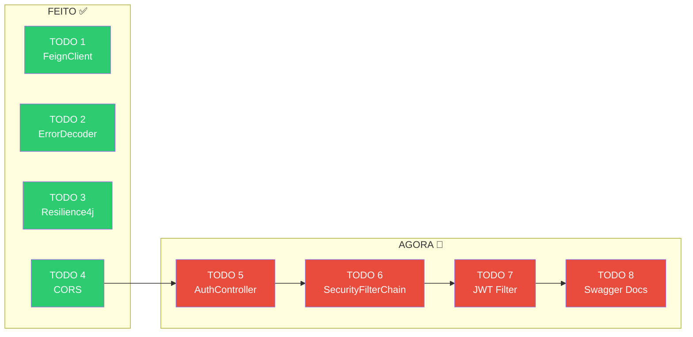
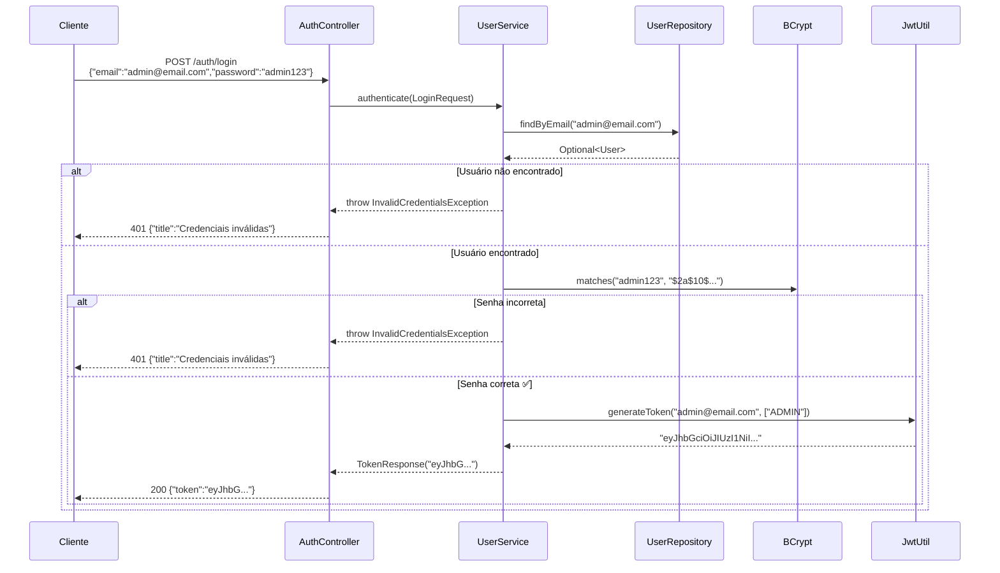
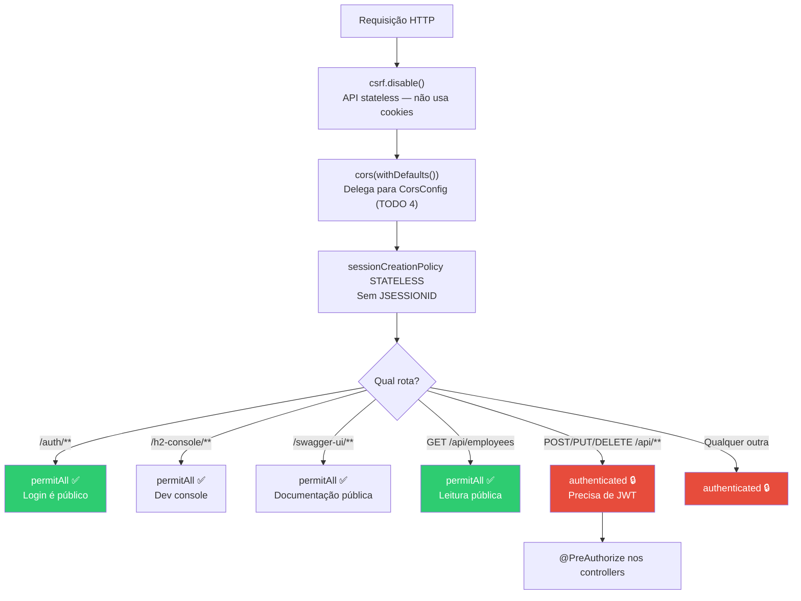
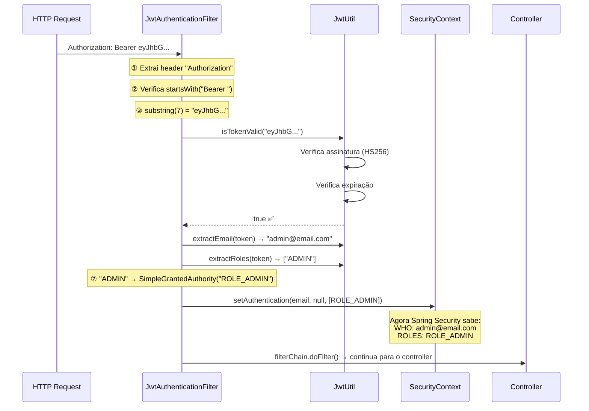

# Slide 10: Exercício — 05-employee-api-secure (TODOs 5-8)

**Horário:** 15:30 - 16:30

---

## Onde estamos no exercício



> TODOs 5-8 tratam de **segurança**: autenticação, autorização, filtro JWT e documentação. São os mais importantes do dia!

---

## TODO 5: Implementar AuthController

### Objetivo

Criar o endpoint de login que valida credenciais e retorna um JWT.

### Arquivo: `controller/AuthController.java`

```java
// TODO 5: Implementar o AuthController.
// Descomentar e implementar o endpoint de login
// POST /auth/login → recebe LoginRequest → retorna TokenResponse
```

### O que fazer

1. Descomentar o método `login()`
2. Chamar `userService.authenticate()` (já implementado!)
3. Retornar o `TokenResponse` com status 200

### Solução Esperada

```java
@RestController
@RequestMapping("/auth")
public class AuthController {

    private final UserService userService;

    public AuthController(UserService userService) {
        this.userService = userService;
    }

    @PostMapping("/login")
    public ResponseEntity<TokenResponse> login(@RequestBody @Valid LoginRequest request) {
        TokenResponse token = userService.authenticate(request);
        return ResponseEntity.ok(token);
    }
}
```

### Fluxo interno do authenticate()



> **Observe**: O `UserService.authenticate()` já está implementado! Você só precisa chamá-lo do controller.

### Teste rápido

```bash
# Deve retornar 200 com token JWT
curl -s -X POST http://localhost:8089/auth/login \
  -H "Content-Type: application/json" \
  -d '{"email":"admin@email.com","password":"admin123"}'

# Deve retornar 401
curl -s -X POST http://localhost:8089/auth/login \
  -H "Content-Type: application/json" \
  -d '{"email":"admin@email.com","password":"senhaerrada"}'
```

---

## TODO 6: Completar SecurityFilterChain

### Objetivo

Definir quais rotas são públicas e quais exigem autenticação JWT. Adicionar o filtro JWT na cadeia de segurança.

### Arquivo: `config/SecurityConfig.java`

```java
// TODO 6: Configurar o SecurityFilterChain.
// Implementar a configuração: csrf, cors, sessionManagement, authorizeHttpRequests
// Adicionar JwtAuthenticationFilter antes do UsernamePasswordAuthenticationFilter
```

### O que fazer

1. Substituir o `permitAll()` genérico por regras específicas
2. Desabilitar CSRF e configurar sessão STATELESS
3. Adicionar o `JwtAuthenticationFilter` na cadeia

### Solução Esperada

```java
@Bean
public SecurityFilterChain securityFilterChain(HttpSecurity http) throws Exception {
    return http
        .csrf(csrf -> csrf.disable())
        .cors(Customizer.withDefaults())
        .sessionManagement(session ->
            session.sessionCreationPolicy(SessionCreationPolicy.STATELESS))
        .authorizeHttpRequests(auth -> auth
            .requestMatchers("/auth/**").permitAll()
            .requestMatchers("/h2-console/**").permitAll()
            .requestMatchers("/swagger-ui/**", "/v3/api-docs/**").permitAll()
            .requestMatchers(HttpMethod.GET, "/api/employees/**").permitAll()
            .anyRequest().authenticated()
        )
        .addFilterBefore(jwtFilter, UsernamePasswordAuthenticationFilter.class)
        .build();
}
```

### Análise das regras de acesso



### Não esqueça: `@PreAuthorize` nos Controllers!

Depois de completar o SecurityFilterChain, descomente as anotações `@PreAuthorize` nos controllers:

```java
// EmployeeController.java
@PostMapping
@PreAuthorize("hasRole('ADMIN')")              // ← Descomentar
public ResponseEntity<EmployeeResponse> create(...) { ... }

@PutMapping("/{id}")
@PreAuthorize("hasRole('ADMIN')")              // ← Descomentar
public ResponseEntity<EmployeeResponse> update(...) { ... }

@DeleteMapping("/{id}")
@PreAuthorize("hasRole('ADMIN')")              // ← Descomentar
public ResponseEntity<Void> delete(...) { ... }

// ExternalDepartmentController.java
@GetMapping
@PreAuthorize("hasAnyRole('ADMIN', 'USER')")   // ← Descomentar
public List<ExternalDepartmentResponse> findAll() { ... }
```

### ⚠️ Erros comuns

| Erro | Causa | Solução |
|------|-------|---------|
| Swagger retorna 401 | `/swagger-ui/**` não está em `permitAll()` | Adicionar ao matcher |
| `anyRequest()` não é o último | Matchers fora de ordem | `anyRequest()` DEVE ser o último |
| CORS não funciona | Faltou `cors(Customizer.withDefaults())` | Adicionar na chain |
| H2 Console não abre | Faltou permitir `/h2-console/**` | Adicionar ao matcher |

---

## TODO 7: Implementar JwtAuthenticationFilter

### Objetivo

Criar o filtro que intercepta TODA requisição, extrai o JWT do header `Authorization`, valida e seta as credenciais no `SecurityContext`.

### Arquivo: `security/JwtAuthenticationFilter.java`

```java
// TODO 7: Implementar o filtro JWT.
// Descomentar a lógica de extração do token, validação e setup do SecurityContext
```

### O que fazer

1. Descomentar o bloco dentro do `doFilterInternal`
2. Extrair o token do header `Authorization`
3. Validar com `jwtUtil.isTokenValid()`
4. Setar as authorities no `SecurityContext`
5. **SEMPRE** chamar `filterChain.doFilter()` no final

### Solução Esperada

```java
@Component
public class JwtAuthenticationFilter extends OncePerRequestFilter {

    private final JwtUtil jwtUtil;

    public JwtAuthenticationFilter(JwtUtil jwtUtil) {
        this.jwtUtil = jwtUtil;
    }

    @Override
    protected void doFilterInternal(HttpServletRequest request,
                                     HttpServletResponse response,
                                     FilterChain filterChain)
            throws ServletException, IOException {

        String authHeader = request.getHeader("Authorization");

        if (authHeader != null && authHeader.startsWith("Bearer ")) {
            String token = authHeader.substring(7);

            if (jwtUtil.isTokenValid(token)) {
                String email = jwtUtil.extractEmail(token);
                List<String> roles = jwtUtil.extractRoles(token);

                var authorities = roles.stream()
                    .map(role -> new SimpleGrantedAuthority("ROLE_" + role))
                    .toList();

                var authentication = new UsernamePasswordAuthenticationToken(
                    email, null, authorities);

                SecurityContextHolder.getContext()
                    .setAuthentication(authentication);
            }
        }

        filterChain.doFilter(request, response);  // SEMPRE executar!
    }
}
```

### Passo a passo com diagrama



### ⚠️ CUIDADO — Erros Críticos

| Erro | Consequência | Solução |
|------|-------------|---------|
| Não chamar `filterChain.doFilter()` | **TODA requisição fica presa** — app congela | SEMPRE chamar no final |
| Prefixo `"ROLE_"` esquecido | `hasRole('ADMIN')` nunca funciona → 403 em tudo | `"ROLE_" + role` |
| `substring(6)` ao invés de `substring(7)` | Token com espaço no início → inválido | `"Bearer ".length() == 7` |
| Não verificar `startsWith("Bearer ")` | NullPointerException em requisições sem token | Sempre verificar |

---

## TODO 8: Documentar Endpoints com SpringDoc

### Objetivo

Adicionar anotações de documentação nos controllers e DTOs para que o Swagger UI mostre informações úteis.

### Arquivos que precisam de alteração

| Arquivo | O que adicionar |
|---------|----------------|
| `AuthController.java` | `@Tag`, `@Operation`, `@ApiResponse` |
| `EmployeeController.java` | `@Tag`, `@Operation`, `@ApiResponses` em cada método |
| `ExternalDepartmentController.java` | `@Tag`, `@Operation`, `@ApiResponse` |
| `EmployeeRequest.java` | `@Schema` nos campos do record |
| `EmployeeResponse.java` | `@Schema` nos campos do record |

### Exemplo: EmployeeController

```java
@Tag(name = "Employees", description = "Gerenciamento de Funcionários")
@RestController
@RequestMapping("/api/employees")
public class EmployeeController {

    @Operation(summary = "Listar todos os funcionários")
    @ApiResponse(responseCode = "200", description = "Lista retornada com sucesso")
    @GetMapping
    public List<EmployeeResponse> findAll() { ... }

    @Operation(summary = "Buscar funcionário por ID")
    @ApiResponses({
        @ApiResponse(responseCode = "200", description = "Funcionário encontrado"),
        @ApiResponse(responseCode = "404", description = "Funcionário não encontrado")
    })
    @GetMapping("/{id}")
    public EmployeeResponse findById(@PathVariable Long id) { ... }

    @Operation(summary = "Criar novo funcionário")
    @ApiResponses({
        @ApiResponse(responseCode = "201", description = "Funcionário criado com sucesso"),
        @ApiResponse(responseCode = "400", description = "Dados inválidos"),
        @ApiResponse(responseCode = "409", description = "Email já cadastrado")
    })
    @PostMapping
    @PreAuthorize("hasRole('ADMIN')")
    public ResponseEntity<EmployeeResponse> create(
        @RequestBody @Valid EmployeeRequest request) { ... }

    @Operation(summary = "Atualizar funcionário")
    @ApiResponses({
        @ApiResponse(responseCode = "200", description = "Funcionário atualizado"),
        @ApiResponse(responseCode = "404", description = "Funcionário não encontrado"),
        @ApiResponse(responseCode = "400", description = "Dados inválidos")
    })
    @PutMapping("/{id}")
    @PreAuthorize("hasRole('ADMIN')")
    public ResponseEntity<EmployeeResponse> update(
        @PathVariable Long id, @RequestBody @Valid EmployeeRequest request) { ... }

    @Operation(summary = "Deletar funcionário")
    @ApiResponses({
        @ApiResponse(responseCode = "204", description = "Funcionário deletado"),
        @ApiResponse(responseCode = "404", description = "Funcionário não encontrado")
    })
    @DeleteMapping("/{id}")
    @PreAuthorize("hasRole('ADMIN')")
    public ResponseEntity<Void> delete(@PathVariable Long id) { ... }
}
```

### Exemplo: DTOs com @Schema

```java
@Schema(description = "Dados para criação/atualização de funcionário")
public record EmployeeRequest(

    @Schema(description = "Nome completo do funcionário",
            example = "João Silva Santos",
            minLength = 3, maxLength = 100)
    @NotBlank String name,

    @Schema(description = "Email corporativo (deve ser único)",
            example = "joao.silva@empresa.com",
            format = "email")
    @Email String email,

    @Schema(description = "CPF do funcionário (11 dígitos)",
            example = "12345678901")
    String cpf,

    @Schema(description = "Salário mensal bruto",
            example = "5500.00",
            minimum = "1412.00")
    @Positive BigDecimal salary,

    @Schema(description = "ID do departamento associado",
            example = "1")
    Long departmentId
) {}
```

### Exemplo: AuthController

```java
@Tag(name = "Authentication", description = "Autenticação e geração de JWT")
@RestController
@RequestMapping("/auth")
public class AuthController {

    @Operation(summary = "Autenticar usuário e obter token JWT",
               description = "Valida email e senha, retorna token JWT válido por 1 hora")
    @ApiResponses({
        @ApiResponse(responseCode = "200", description = "Login realizado com sucesso"),
        @ApiResponse(responseCode = "401", description = "Credenciais inválidas")
    })
    @PostMapping("/login")
    public ResponseEntity<TokenResponse> login(
        @RequestBody @Valid LoginRequest request) { ... }
}
```

### Resultado Visual no Swagger UI

```
┌──────────────────────────────────────────────────────────┐
│  📋 Employee API Secure v1.0.0             [Authorize 🔓]│
│  API de Gestão de Funcionários com Segurança JWT          │
├──────────────────────────────────────────────────────────┤
│  🏷️ Authentication — Autenticação e geração de JWT      │
│  ├── POST /auth/login           Autenticar e obter JWT    │
│                                                            │
│  🏷️ Employees — Gerenciamento de Funcionários           │
│  ├── GET    /api/employees        Listar todos             │
│  ├── GET    /api/employees/{id}   Buscar por ID            │
│  ├── POST   /api/employees        Criar novo      🔒ADMIN │
│  ├── PUT    /api/employees/{id}   Atualizar        🔒ADMIN│
│  └── DELETE /api/employees/{id}   Deletar          🔒ADMIN│
│                                                            │
│  🏷️ External Departments — Departamentos do Serviço Ext  │
│  ├── GET    /api/departments        Listar todos   🔒AUTH  │
│  └── GET    /api/departments/{id}   Buscar por ID  🔒AUTH  │
└──────────────────────────────────────────────────────────┘
```

---

## ✅ Checkpoint Final — Teste Integrado Completo

### Tabela de permissões por endpoint

| Endpoint | Sem token | USER | ADMIN |
|----------|:---------:|:----:|:-----:|
| `POST /auth/login` | ✅ 200 | ✅ 200 | ✅ 200 |
| `GET /api/employees` | ✅ 200 | ✅ 200 | ✅ 200 |
| `GET /api/employees/{id}` | ✅ 200 | ✅ 200 | ✅ 200 |
| `POST /api/employees` | ❌ 401 | ❌ 403 | ✅ 201 |
| `PUT /api/employees/{id}` | ❌ 401 | ❌ 403 | ✅ 200 |
| `DELETE /api/employees/{id}` | ❌ 401 | ❌ 403 | ✅ 204 |
| `GET /api/departments` | ❌ 401 | ✅ 200 | ✅ 200 |
| `GET /swagger-ui.html` | ✅ 200 | ✅ 200 | ✅ 200 |

### Script de teste completo

```bash
# ════════════════════════════════════════
# Teste 1: Login como ADMIN
# ════════════════════════════════════════
echo "=== Login ADMIN ==="
TOKEN_ADMIN=$(curl -s -X POST http://localhost:8089/auth/login \
  -H "Content-Type: application/json" \
  -d '{"email":"admin@email.com","password":"admin123"}' | jq -r '.token')
echo "Token: ${TOKEN_ADMIN:0:30}..."

# ════════════════════════════════════════
# Teste 2: Listar funcionários (público)
# ════════════════════════════════════════
echo "=== GET /api/employees (sem token) ==="
curl -s http://localhost:8089/api/employees | jq '.[0].name'

# ════════════════════════════════════════
# Teste 3: Criar funcionário como ADMIN
# ════════════════════════════════════════
echo "=== POST /api/employees (ADMIN) ==="
curl -s -X POST http://localhost:8089/api/employees \
  -H "Content-Type: application/json" \
  -H "Authorization: Bearer $TOKEN_ADMIN" \
  -d '{"name":"Teste Silva","email":"teste@email.com","cpf":"98765432100","salary":5000,"departmentId":1}' | jq '.id'

# ════════════════════════════════════════
# Teste 4: Login como USER
# ════════════════════════════════════════
echo "=== Login USER ==="
TOKEN_USER=$(curl -s -X POST http://localhost:8089/auth/login \
  -H "Content-Type: application/json" \
  -d '{"email":"user@email.com","password":"user123"}' | jq -r '.token')

# ════════════════════════════════════════
# Teste 5: Criar funcionário como USER → 403
# ════════════════════════════════════════
echo "=== POST /api/employees (USER) → deve dar 403 ==="
curl -s -o /dev/null -w "%{http_code}" -X POST http://localhost:8089/api/employees \
  -H "Content-Type: application/json" \
  -H "Authorization: Bearer $TOKEN_USER" \
  -d '{"name":"Teste","email":"t@t.com","cpf":"11111111111","salary":3000,"departmentId":1}'

# ════════════════════════════════════════
# Teste 6: Acessar departamentos com token
# ════════════════════════════════════════
echo "=== GET /api/departments (com fallback) ==="
curl -s -H "Authorization: Bearer $TOKEN_USER" \
  http://localhost:8089/api/departments | jq '.'
```

### Checklist final

- [ ] `POST /auth/login` retorna JWT válido
- [ ] `GET /api/employees` funciona sem token (público)
- [ ] `POST /api/employees` sem token → 401
- [ ] `POST /api/employees` com USER → 403
- [ ] `POST /api/employees` com ADMIN → 201
- [ ] `DELETE /api/employees/{id}` com ADMIN → 204
- [ ] `GET /api/departments` retorna fallback (serviço externo offline)
- [ ] Swagger UI acessível em `/swagger-ui.html`
- [ ] Botão "Authorize" funciona no Swagger UI
- [ ] Tags (Authentication, Employees, External Departments) aparecem

> **Próximo slide**: Review e Q&A.
