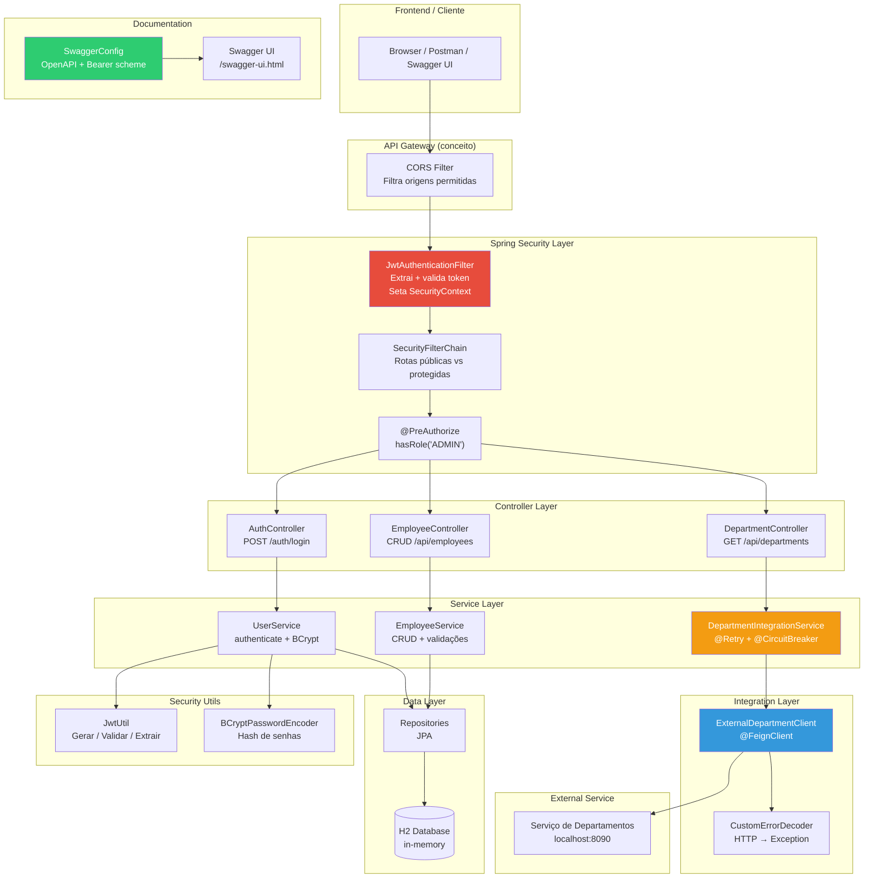
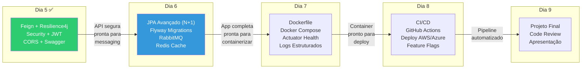

# Slide 11: Review, Q&A e Encerramento

**Horário:** 16:30 - 17:00

---

## Itens vistos no Dia 5

### 1. Feign Client — Comunicação Declarativa

| Conceito | Detalhe |
|:--|:--|
| `@FeignClient` | Interface declarativa — Spring gera o proxy HTTP |
| `@EnableFeignClients` | Habilita scan de interfaces Feign |
| `url` | Propriedade de configuração (`${department.api.url}`) |
| `RequestInterceptor` | Headers automáticos em toda chamada |
| `ErrorDecoder` | Converte HTTP errors em exceções Java |
| `FeignConfig` | Registra beans (ErrorDecoder, Interceptor) |
| vs RestTemplate | Menos boilerplate, mais declarativo |
| vs WebClient | WebClient é reativo; Feign é bloqueante |

### 2. Resilience4j — Tolerância a Falhas

| Pattern | Configurações-chave |
|:--|:--|
| **Retry** | `maxAttempts` (tentativas), `waitDuration` (intervalo), exponential backoff |
| **Circuit Breaker** | CLOSED → OPEN → HALF_OPEN · `failureRateThreshold` · `slidingWindowSize` · `waitDurationInOpenState` |
| **Fallback** | Mesma assinatura + `Throwable` · Retorna resposta degradada, nunca lança exception |

### 3. CORS — Cross-Origin Resource Sharing

| Conceito | Detalhe |
|:--|:--|
| Same-Origin Policy | Browser bloqueia chamadas a origens diferentes |
| Preflight OPTIONS | Browser verifica permissão antes da chamada real |
| `WebMvcConfigurer` | Forma mais simples de configurar |
| `CorsConfigurationSource` | Integrado com Spring Security |
| Configurações | `allowedOrigins`, `allowedMethods`, `allowedHeaders`, `allowCredentials` |

### 4. Spring Security — Autenticação e Autorização

| Componente | Responsabilidade |
|:--|:--|
| `SecurityFilterChain` | `csrf.disable()`, `sessionManagement(STATELESS)`, `authorizeHttpRequests`, `addFilterBefore` |
| `JwtAuthenticationFilter` | `OncePerRequestFilter` → lê `Authorization` → extrai Bearer → valida com `JwtUtil` → seta `SecurityContextHolder` |
| JWT | Header.Payload.Signature · Claims: `sub`, `roles`, `exp`, `iat` · HS256 · `jjwt 0.11.5` |
| `AuthController` | `POST /auth/login` → `LoginRequest` → `TokenResponse` |
| BCrypt | Hash one-way com salt · `PasswordEncoder.matches()` · Não reversível |
| `@PreAuthorize` | `hasRole('ADMIN')`, `hasAnyRole(...)`, expressões SpEL |

### 5. OpenAPI / Swagger — Documentação Interativa

| Conceito | Detalhe |
|:--|:--|
| SpringDoc | Geração automática de spec OpenAPI |
| Anotações | `@Tag` (agrupar), `@Operation` (descrever), `@ApiResponse` (status), `@Schema` (DTOs), `@Parameter` (params) |
| Swagger UI | `/swagger-ui.html` · Authorize com Bearer Token · Try it out |
| OpenAPI spec | `/v3/api-docs` (JSON) · `/v3/api-docs.yaml` · Importável no Postman |

---

## Arquitetura Completa — Tudo que Construímos



---

## O que aprendemos hoje — Resumo Executivo

| # | Conceito | O que resolve | Classe/Anotação chave |
|:-:|----------|--------------|----------------------|
| 1 | **Feign Client** | Comunicação entre microsserviços | `@FeignClient`, `ErrorDecoder` |
| 2 | **Resilience4j** | Tolerância a falhas | `@Retry`, `@CircuitBreaker`, fallback |
| 3 | **CORS** | Acesso cross-origin do browser | `CorsConfigurationSource`, `WebMvcConfigurer` |
| 4 | **Spring Security** | Autenticação e autorização | `SecurityFilterChain`, `@PreAuthorize` |
| 5 | **JWT** | Sessão stateless | `JwtUtil`, `JwtAuthenticationFilter` |
| 6 | **BCrypt** | Hashing seguro de senhas | `PasswordEncoder`, `matches()` |
| 7 | **SpringDoc/Swagger** | Documentação interativa | `@Tag`, `@Operation`, `@Schema` |

---

## Conexão com os Próximos Dias



### Como cada dia constrói sobre o anterior

| Dia | Conceito de Hoje que será usado | Exemplo |
|:---:|-------------------------------|---------|
| 6 | Feign Client + JWT | Propagar token JWT entre microsserviços via `RequestInterceptor` |
| 6 | Resilience4j | Cache com Redis como alternativa ao fallback |
| 7 | SecurityFilterChain | Actuator protegido com role `ACTUATOR` |
| 7 | Swagger/OpenAPI | Documentação no Docker Compose |
| 8 | Tudo junto | Pipeline CI/CD: build → test → deploy da API segura |

---

## Checklist do Dia

### Conceitos Teóricos

- [ ] Entendo a diferença entre OpenAPI (spec) e Swagger (tools)
- [ ] Sei explicar o que é REST declarativo com Feign
- [ ] Entendo os 3 estados do Circuit Breaker
- [ ] Sei a diferença entre CORS e CSRF
- [ ] Entendo AuthN (quem é) vs AuthZ (o que pode)
- [ ] Sei como funciona JWT (Header.Payload.Signature)
- [ ] Entendo por que BCrypt é one-way e usa salt

### Habilidades Práticas

- [ ] Criar um `@FeignClient` com `ErrorDecoder`
- [ ] Configurar `@Retry` + `@CircuitBreaker` + fallback
- [ ] Configurar CORS para permitir origens específicas
- [ ] Implementar `SecurityFilterChain` com rotas públicas/protegidas
- [ ] Criar `JwtAuthenticationFilter` que valida token
- [ ] Usar `@PreAuthorize` para controle de acesso por role
- [ ] Documentar API com `@Tag`, `@Operation`, `@Schema`

---

## Perguntas Frequentes

| # | Pergunta | Resposta |
|:-:|----------|---------|
| 1 | O JWT pode ser invalidado antes de expirar? | Sim, mas precisa de **blacklist** (geralmente em Redis). JWT puro NÃO tem invalidação server-side |
| 2 | Posso ter múltiplos Feign Clients? | Sim, **um por serviço externo**. Cada um com seu `name`, `url` e opcionalmente sua `configuration` |
| 3 | CORS é segurança real? | **Não**. É proteção do **browser**. Postman e curl ignoram CORS. O servidor deve validar tudo separadamente |
| 4 | JWT é criptografado? | **Não**! JWT é **assinado** (verifica integridade), mas o payload é Base64 (qualquer um pode ler). Nunca coloque dados sensíveis |
| 5 | E se o Circuit Breaker ficar OPEN para sempre? | Não fica. Após `waitDurationInOpenState` (10s), vai para HALF_OPEN e testa novamente |
| 6 | Fallback pode fazer chamada a banco? | Sim, mas **não deveria fazer chamada ao mesmo serviço que falhou**. Pode retornar dado de cache ou valor default |
| 7 | `hasRole('ADMIN')` vs `hasAuthority('ROLE_ADMIN')`? | São **equivalentes**. `hasRole` adiciona "ROLE_" automaticamente |
| 8 | Por que `ROLE_` como prefixo? | Convenção do Spring Security desde as primeiras versões. Diferencia roles de outras authorities |
| 9 | Posso usar `@Secured` ao invés de `@PreAuthorize`? | Sim, mas `@PreAuthorize` é mais poderoso (aceita SpEL). O Spring recomenda `@PreAuthorize` |
| 10 | E se o token expirar no meio de uma ação? | 401 Unauthorized. O frontend deve interceptar, fazer refresh ou redirecionar para login |

---

## Perguntas de Entrevista — Spring Security + JWT

| Pergunta | O que procuram |
|----------|--------------|
| "Qual a diferença entre autenticação e autorização?" | Conceitos fundamentais de segurança |
| "Como você implementaria logout com JWT?" | Blacklist em Redis, token rotation |
| "Stateful vs Stateless — quando usar cada?" | Entendimento de trade-offs (escalabilidade vs controle) |
| "O que é o Spring Security Filter Chain?" | Conhecimento da arquitetura interna |
| "Como proteger contra CSRF em uma SPA?" | SameSite cookies, CSRF tokens, ou "não precisa se JWT" |
| "Como você faria rate limiting na API?" | Resilience4j `RateLimiter`, API Gateway, Redis |
| "Explique o fluxo completo de uma requisição autenticada" | Headers → Filter → SecurityContext → Controller → Response |

---

## Referências e Leitura Complementar

| Recurso | URL | Para quê |
|---------|-----|---------|
| Spring Security Reference | docs.spring.io/spring-security | Documentação oficial completa |
| Spring Cloud OpenFeign | spring.io/projects/spring-cloud-openfeign | Feign Client oficial |
| Resilience4j Docs | resilience4j.readme.io | Todos os patterns de resiliência |
| SpringDoc OpenAPI | springdoc.org | Swagger/OpenAPI no Spring Boot 3 |
| JWT.io | jwt.io | Debugger + libraries em 30+ linguagens |
| CORS MDN | developer.mozilla.org/docs/Web/HTTP/CORS | Explicação completa do browser |
| RFC 7519 (JWT) | tools.ietf.org/html/rfc7519 | Especificação oficial JWT |
| RFC 7807 (ProblemDetail) | tools.ietf.org/html/rfc7807 | Padrão de erro HTTP |
| OWASP JWT Cheat Sheet | cheatsheetseries.owasp.org | Boas práticas de segurança JWT |

---

## Encerramento

> **"Segurança não é um recurso — é um requisito."**  
> — Todo arquiteto de software responsável

### O que construímos hoje:

```
✅ API REST que se comunica com serviços externos (Feign)
✅ Resiliência contra falhas de rede (Retry + Circuit Breaker)
✅ Proteção contra acesso cross-origin indevido (CORS)
✅ Autenticação stateless com JWT (login → token → acesso)
✅ Autorização por roles (ADMIN vs USER)
✅ Documentação interativa com Swagger UI
✅ Tratamento de erros com ProblemDetail (RFC 7807)
```

### Próximo dia: **Dia 6 — Persistência Avançada e Mensageria**

```
📌 JPA: problema N+1 e soluções (JOIN FETCH, @EntityGraph)
📌 Flyway: migrations SQL versionadas (sem mais DDL automático!)
📌 RabbitMQ: comunicação assíncrona (Producer/Consumer)
📌 Redis: cache com @Cacheable e TTL

⚠️ Pré-requisito: Docker Desktop funcionando!
   → PostgreSQL, RabbitMQ e Redis serão executados em containers
```

> **Obrigado! Até amanhã!** 🎯
