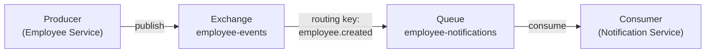

# Dia 6 - Persistência Avançada e Mensageria

**Duração**: 5 horas  
**Objetivo**: Performance e desacoplamento — resolvendo o problema N+1, versionando banco com Flyway, desacoplando processos com RabbitMQ e acelerando consultas com Redis

> **Pré-requisito**: Docker Compose básico para subir PostgreSQL + RabbitMQ + Redis (ver [guia-docker.md](../dia-00/guia-docker.md)). Docker será aprofundado no Dia 7.

---

## 🎯 Agenda do Dia

| Horário | Duração | Tópico | Tipo |
|---------|---------|--------|------|
| 09:00 - 09:15 | 15min | Recap Dia 5 e Introdução ao Dia 6 | Discussão |
| 09:15 - 09:45 | 30min | `docker compose up` — Setup PostgreSQL + RabbitMQ + Redis | Setup |
| 09:45 - 10:15 | 30min | JPA Avançado — Problema N+1, JOIN FETCH, @EntityGraph | Teórico |
| 10:15 - 10:45 | 30min | JPA Avançado — Projeções DTO e Paginação | Teórico |
| 10:45 - 11:00 | 15min | ☕ Coffee Break | - |
| 11:00 - 11:30 | 30min | Migrations com Flyway | Teórico |
| 11:30 - 12:00 | 30min | Mensageria com RabbitMQ (Producer/Consumer) | Teórico |
| 12:00 - 13:00 | 1h | 🍽️ Almoço | - |
| 13:00 - 13:20 | 20min | Cache com Redis (@Cacheable, TTL, Invalidação) | Teórico |
| 13:20 - 13:50 | 30min | Walkthrough `06-persistence-messaging-demo` | Demo |
| 13:50 - 15:30 | 1h40 | Exercício `06-employee-api-advanced` (TODOs 1-4) | Hands-on |
| 15:30 - 16:30 | 1h | Exercício `06-employee-api-advanced` (TODOs 5-8) | Hands-on |
| 16:30 - 17:00 | 30min | Review: N+1 corrigido, fila funcionando, cache hit/miss | Discussão |

---

## 📦 Material Necessário (Checklist Instrutor)

### Software
- [ ] JDK 21 instalado
- [ ] Maven 3.8+
- [ ] IDE com suporte a Java (IntelliJ ou VS Code)
- [ ] Docker Desktop rodando (PostgreSQL + RabbitMQ + Redis)
- [ ] _(Opcional)_ Postman ou extensão REST Client no VS Code

### Preparação
- [ ] Executar `docker compose up` no projeto `06-persistence-messaging-demo` e verificar:
  - [ ] PostgreSQL acessível na porta 5432
  - [ ] RabbitMQ Management UI em http://localhost:15672 (guest/guest)
  - [ ] Redis acessível na porta 6379
- [ ] Projeto `06-persistence-messaging-demo` rodando com dados de exemplo
- [ ] Projeto `06-employee-api-advanced` com TODOs prontos e dependências configuradas

---

## 📋 Conteúdo Programático

---

### 1. JPA Avançado — Performance de Verdade

O JPA facilita o acesso a dados, mas esconde armadilhas de performance. A mais famosa: o **problema N+1**.

#### O Problema N+1

Quando você faz `findAll()` em uma entidade com `@ManyToOne` ou `@OneToMany`, o JPA pode gerar **centenas de queries escondidas**:

```java
// Employee tem @ManyToOne Department
List<Employee> employees = employeeRepository.findAll(); // 1 query

for (Employee emp : employees) {
    emp.getDepartment().getName(); // +1 query POR funcionário!
}
// Total: 1 + N queries (se N = 100 funcionários → 101 queries!)
```

```sql
-- Query 1: buscar todos os funcionários
SELECT * FROM employees;

-- Query 2: buscar departamento do funcionário 1
SELECT * FROM departments WHERE id = 1;

-- Query 3: buscar departamento do funcionário 2
SELECT * FROM departments WHERE id = 2;

-- ... mais 98 queries!
```

> **Na prática**: Uma API que deveria responder em 50ms leva 2 segundos porque gera 100+ queries ao banco.

#### Solução 1: JOIN FETCH na JPQL

```java
public interface EmployeeRepository extends JpaRepository<Employee, Long> {

    @Query("SELECT e FROM Employee e JOIN FETCH e.department")
    List<Employee> findAllWithDepartment();
}
```

```sql
-- UMA ÚNICA query com JOIN
SELECT e.*, d.* FROM employees e
INNER JOIN departments d ON e.department_id = d.id;
```

#### Solução 2: @EntityGraph

```java
public interface EmployeeRepository extends JpaRepository<Employee, Long> {

    @EntityGraph(attributePaths = {"department"})
    List<Employee> findAll();
}
```

> **@EntityGraph** é mais declarativo — não há query JPQL, apenas a anotação indicando quais relacionamentos carregar junto.

#### Projeções DTO — Carregando apenas o necessário

```java
public record EmployeeSummary(Long id, String name, String departmentName) {}

public interface EmployeeRepository extends JpaRepository<Employee, Long> {

    @Query("SELECT new com.example.dto.EmployeeSummary(e.id, e.name, d.name) " +
           "FROM Employee e JOIN e.department d")
    Page<EmployeeSummary> findAllSummaries(Pageable pageable);
}
```

> **Projeções** evitam carregar colunas desnecessárias. Se a listagem só precisa de `id`, `name` e `departmentName`, por que carregar `email`, `cpf`, `salary`, `createdAt`...?

#### Paginação com Pageable

```java
@GetMapping
public Page<EmployeeSummary> findAll(Pageable pageable) {
    return employeeRepository.findAllSummaries(pageable);
}
```

```
GET /api/employees?page=0&size=10&sort=name,asc
```

```json
{
  "content": [...],
  "totalElements": 150,
  "totalPages": 15,
  "number": 0,
  "size": 10
}
```

> **Nunca retorne listas sem limite** — `Page<T>` fornece metadata de paginação automaticamente.

---

### 2. Migrations com Flyway

#### Por que `ddl-auto: update` é proibido em produção?

```yaml
# ❌ Nunca em produção!
spring:
  jpa:
    hibernate:
      ddl-auto: update  # Pode alterar/deletar colunas sem controle
```

Riscos:
- Renomear uma coluna pode **deletar dados** (Hibernate dropa e recria)
- Não há histórico de alterações — impossível saber o que mudou e quando
- Ambiente de dev pode ficar diferente de produção

#### Flyway — Versionamento de Esquema

O **Flyway** aplica scripts SQL **versionados e incrementais** — como "Git para o banco de dados".

```
src/main/resources/db/migration/
├── V1__create_departments.sql
├── V2__create_employees.sql
├── V3__add_status_column.sql
└── V4__insert_initial_data.sql
```

#### Convenção de Nomes

```
V{versão}__{descrição}.sql

V1__create_departments.sql     ✅
V2__create_employees.sql       ✅
V3__add_status_column.sql      ✅
create_departments.sql         ❌ (sem versão)
V1_create_departments.sql      ❌ (um underscore só)
```

#### Exemplo de Migrations

```sql
-- V1__create_departments.sql
CREATE TABLE departments (
    id BIGSERIAL PRIMARY KEY,
    name VARCHAR(100) NOT NULL,
    code VARCHAR(10) NOT NULL UNIQUE
);

-- V2__create_employees.sql
CREATE TABLE employees (
    id BIGSERIAL PRIMARY KEY,
    name VARCHAR(150) NOT NULL,
    email VARCHAR(200) NOT NULL UNIQUE,
    cpf VARCHAR(11) NOT NULL UNIQUE,
    salary DECIMAL(10,2) NOT NULL,
    department_id BIGINT NOT NULL,
    created_at TIMESTAMP DEFAULT CURRENT_TIMESTAMP,
    CONSTRAINT fk_department FOREIGN KEY (department_id) REFERENCES departments(id)
);
```

#### Configuração no Spring Boot

```yaml
spring:
  flyway:
    enabled: true
    locations: classpath:db/migration
    baseline-on-migrate: true
  jpa:
    hibernate:
      ddl-auto: validate  # Apenas valida, não altera o schema
```

> **Flyway executa automaticamente** ao subir a aplicação. As migrations já aplicadas ficam registradas na tabela `flyway_schema_history`.

---

### 3. Mensageria com RabbitMQ

#### O que é um Message Broker?

Um **message broker** é um intermediário que recebe mensagens de **producers** e as entrega a **consumers**, permitindo comunicação **assíncrona** entre serviços.



#### Quando usar filas?

| Cenário | Sem fila | Com fila |
|---------|----------|----------|
| Enviar email de boas-vindas | Bloqueia a resposta da API | API responde rápido, email vai na fila |
| Processar relatório pesado | Timeout na requisição HTTP | API aceita, processamento assíncrono |
| Notificar múltiplos serviços | Chamada HTTP para cada um | Publish uma vez, todos consomem |
| Serviço destino fora do ar | Requisição falha | Mensagem fica na fila até o serviço voltar |

#### RabbitMQ vs. Kafka

| Aspecto | RabbitMQ | Kafka |
|---------|----------|-------|
| Modelo | Filas (ponto-a-ponto ou pub/sub) | Streaming pub/sub com retenção |
| Caso de uso | Mensageria entre serviços | Event streaming, big data, logs |
| Ordem | Por fila | Por partição |
| Retenção | Remove após consumo (padrão) | Retém por tempo configurado |
| Complexidade | Mais simples | Mais complexo, mais escalável |

> **Para nosso cenário** (notificações, processamento assíncrono): **RabbitMQ** é a escolha ideal.

#### Configuração no Spring Boot

```yaml
spring:
  rabbitmq:
    host: localhost
    port: 5672
    username: guest
    password: guest
```

```java
@Configuration
public class RabbitMQConfig {

    @Bean
    public Queue employeeNotificationsQueue() {
        return new Queue("employee-notifications", true); // durable
    }

    @Bean
    public DirectExchange employeeExchange() {
        return new DirectExchange("employee-events");
    }

    @Bean
    public Binding binding(Queue queue, DirectExchange exchange) {
        return BindingBuilder.bind(queue)
                .to(exchange)
                .with("employee.created");
    }
}
```

#### Producer — Publicando Mensagens

```java
@Service
public class EmployeeEventPublisher {

    private final RabbitTemplate rabbitTemplate;
    private final ObjectMapper objectMapper;

    public void publishEmployeeCreated(EmployeeCreatedEvent event) {
        rabbitTemplate.convertAndSend(
            "employee-events",        // exchange
            "employee.created",       // routing key
            event                     // mensagem (serializada para JSON)
        );
    }
}
```

#### Consumer — Consumindo Mensagens

```java
@Component
@Slf4j
public class EmployeeNotificationConsumer {

    @RabbitListener(queues = "employee-notifications")
    public void handleEmployeeCreated(EmployeeCreatedEvent event) {
        log.info("📧 Enviando email de boas-vindas para {} ({})",
                event.name(), event.email());
        // Simula envio de email, notificação, etc.
    }
}
```

---

### 4. Cache com Redis

#### Por que cachear?

Dados consultados **frequentemente** e que **mudam pouco** (categorias, configurações, listagens) podem ser cacheados para evitar idas desnecessárias ao banco.

```
Sem cache:   Cliente → API → Banco → API → Cliente (50ms)
Com cache:   Cliente → API → Redis → API → Cliente (5ms)   ← 10x mais rápido!
```

#### Spring Cache + Redis

```yaml
spring:
  data:
    redis:
      host: localhost
      port: 6379
  cache:
    type: redis
    redis:
      time-to-live: 600000  # 10 minutos em milissegundos
```

```java
@Configuration
@EnableCaching
public class CacheConfig {
    // Spring Boot auto-configura o RedisCacheManager
}
```

#### Anotações de Cache

```java
@Service
public class DepartmentService {

    // Cacheia resultado — só vai ao banco na primeira chamada (ou após expiração)
    @Cacheable(value = "departments", key = "'all'")
    public List<DepartmentResponse> findAll() {
        log.info("🔍 Buscando departamentos no banco...");
        return departmentRepository.findAll()
                .stream()
                .map(DepartmentMapper::toResponse)
                .toList();
    }

    // Atualiza o cache após a operação
    @CachePut(value = "departments", key = "#id")
    public DepartmentResponse update(Long id, DepartmentRequest request) { ... }

    // Invalida (limpa) o cache
    @CacheEvict(value = "departments", allEntries = true)
    public DepartmentResponse create(DepartmentRequest request) { ... }
}
```

| Anotação | Quando usar | O que faz |
|----------|-------------|-----------|
| `@Cacheable` | Leituras frequentes | Retorna do cache se existir, senão executa e cacheia |
| `@CachePut` | Atualizações | Sempre executa e atualiza o cache |
| `@CacheEvict` | Criações/Exclusões | Limpa o cache (dados mudaram) |

#### TTL (Time-to-Live)

O TTL define **quanto tempo um dado fica no cache** antes de expirar automaticamente:

```yaml
spring:
  cache:
    redis:
      time-to-live: 600000  # 10 minutos
```

> **Sem TTL**: dados obsoletos podem ser servidos indefinidamente.  
> **Com TTL curto demais**: cache é pouco efetivo.  
> **Com TTL ideal**: dados frescos com performance alta.

#### Armadilhas do Cache

| Problema | O que é | Solução |
|----------|---------|---------|
| **Cache Stampede** | Cache expira e 1000 requests vão ao banco simultaneamente | Lock distribuído ou regeneração antecipada |
| **Dados inconsistentes** | Cache tem dado antigo, banco tem novo | `@CacheEvict` ao alterar dados |
| **Cache de null** | Cacheia "não encontrado" e nunca mais busca | Configurar para não cachear null |

---

## 📦 Projetos do Dia

### `06-persistence-messaging-demo` (Projeto Completo — Demonstração)

> API de Pedidos com JPA otimizado, Flyway, RabbitMQ e Redis — tudo rodando via Docker Compose.

Projeto completo demonstrando todos os conceitos:
- Queries propositalmente com N+1 + versão corrigida com `JOIN FETCH` e `@EntityGraph`
- Projeção DTO: `OrderSummary` direto na JPQL (sem carregar entidade completa)
- Paginação: `GET /orders?page=0&size=10&sort=createdAt,desc`
- Migrations Flyway: `V1__create_orders.sql`, `V2__create_order_items.sql`, `V3__add_status_column.sql`
- Producer: publica `OrderCreatedEvent` no RabbitMQ ao criar pedido
- Consumer: escuta o evento e atualiza estoque (simulado com log)
- Cache Redis: `@Cacheable` na listagem de categorias com TTL de 10 minutos
- `docker-compose.yml` com PostgreSQL + RabbitMQ + Redis

**Porta**: `8090`

### `06-employee-api-advanced` (Exercício — TODOs 1-8)

> Otimizar persistência, adicionar migrations, mensageria e cache à API de Funcionários.

**TODOs**: 8 tarefas cobrindo N+1, JOIN FETCH, @EntityGraph, Projeções DTO, Paginação, Flyway, RabbitMQ e Redis.

**Porta**: `8091`

---

## 📎 Slides

| Slide | Tópico |
|-------|--------|
| [slide-01](slide-01.md) | Abertura e Recap do Dia 5 |
| [slide-02](slide-02.md) | Docker Compose — Setup do Ambiente |
| [slide-03](slide-03.md) | JPA N+1 — O Problema e Diagnóstico |
| [slide-04](slide-04.md) | JPA N+1 — Soluções (JOIN FETCH, @EntityGraph) |
| [slide-05](slide-05.md) | Projeções DTO e Paginação |
| [slide-06](slide-06.md) | Migrations com Flyway |
| [slide-07](slide-07.md) | Mensageria com RabbitMQ — Conceitos |
| [slide-08](slide-08.md) | Mensageria com RabbitMQ — Producer e Consumer |
| [slide-09](slide-09.md) | Cache com Redis |
| [slide-10](slide-10.md) | Walkthrough — 06-persistence-messaging-demo |
| [slide-11](slide-11.md) | Exercício — TODOs 1-2 (N+1) |
| [slide-12](slide-12.md) | Exercício — TODOs 3-4 (Projeção e Paginação) |
| [slide-13](slide-13.md) | Exercício — TODO 5 (Flyway) |
| [slide-14](slide-14.md) | Exercício — TODOs 6-7 (RabbitMQ) |
| [slide-15](slide-15.md) | Exercício — TODO 8 (Redis) |
| [slide-16](slide-16.md) | Review e Q&A |
