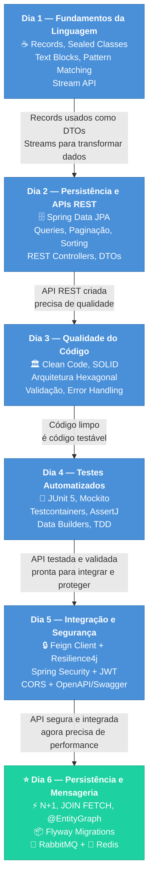
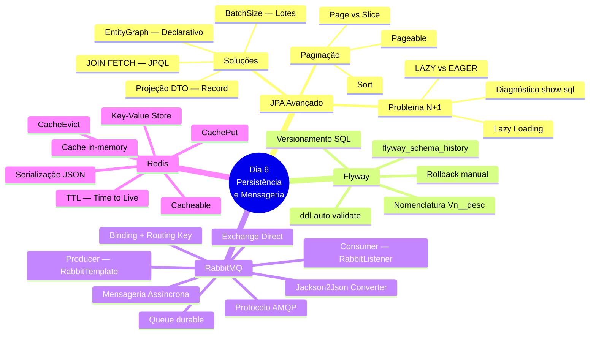
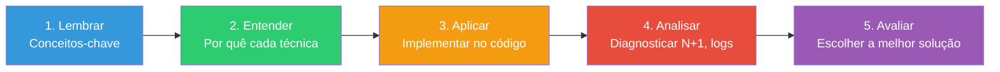
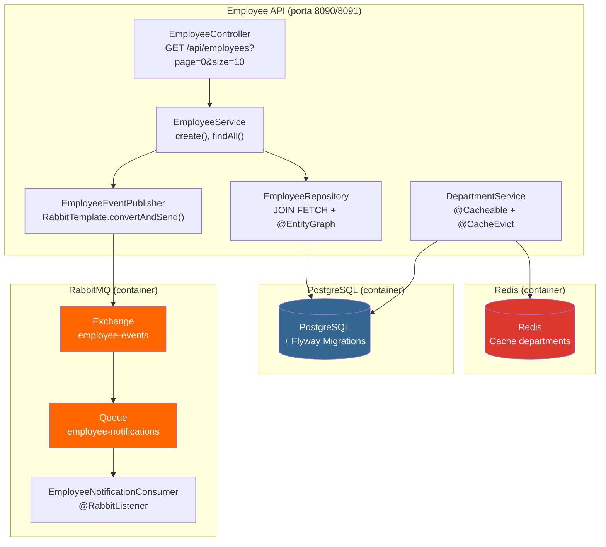
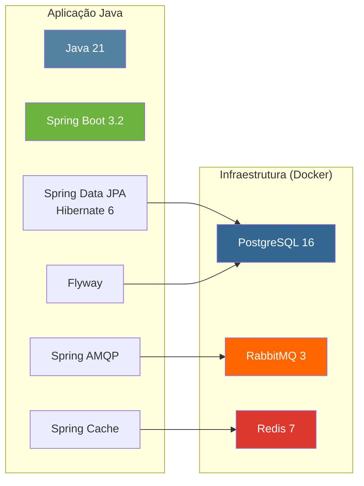

# Slide 1: Abertura e Recap do Dia 5

**Horário:** 09:00 - 09:15

---

## 📝 Recapitulando o Dia 5

No Dia 5 aprendemos a **conectar serviços e proteger APIs**:

- ✓ **Feign Client** — Consumo declarativo de APIs externas (interface + anotações)
- ✓ **Resilience4j** — Retry, Circuit Breaker e Fallback (tolerância a falhas)
- ✓ **CORS** — Permitindo acesso de frontends em domínios diferentes
- ✓ **Spring Security + JWT** — Autenticação stateless com token
- ✓ **OpenAPI/Swagger** — Documentação interativa e testável no browser

> **Hoje vamos otimizar performance, versionar banco, desacoplar processos e cachear dados!**

### 🧠 Revisão Rápida — Associe os Conceitos

| Dia | Tema Central | Resultado |
|-----|-------------|-----------|
| **Dia 1** | Fundamentos Java Moderno | Records, Sealed Classes, Streams — linguagem expressiva |
| **Dia 2** | Persistência e REST | Spring Data JPA, APIs REST — dados acessíveis |
| **Dia 3** | Qualidade do Código | Clean Code, Arquitetura limpa — código sustentável |
| **Dia 4** | Testes Automatizados | JUnit 5, Mockito, Testcontainers — confiança para evoluir |
| **Dia 5** | Integração e Segurança | Feign, JWT, Swagger — API de produção |
| **Dia 6** | **Persistência e Mensageria** | N+1, Flyway, RabbitMQ, Redis — **performance e desacoplamento** |

---

## 🔗 Conexão entre os Dias — A Jornada do Desenvolvedor

---

## 🧩 Mapa Mental do Dia 6 — Todos os Conceitos

### Por que Persistência Avançada e Mensageria são o próximo passo?

| O que fizemos nos dias anteriores | A lacuna | O que aprendemos hoje |
|-----------------------------------|----------|----------------------|
| Spring Data JPA com queries | findAll() esconde N+1 queries | **JOIN FETCH** e **@EntityGraph** |
| `ddl-auto: update` no H2 | Sem controle de schema em produção | **Flyway Migrations** |
| API síncrona bloqueante | Processos demorados travam a resposta | **RabbitMQ** — mensageria assíncrona |
| Toda consulta bate no banco | Dados frequentes consultados toda hora | **Redis** — cache em memória |

---

## 🎯 Objetivos do Dia 6

Ao final deste dia, o aluno será capaz de:

1. **N+1** — Identificar e resolver o problema de performance N+1 no JPA
2. **JOIN FETCH / @EntityGraph** — Carregar relacionamentos de forma eficiente
3. **Projeções DTO** — Retornar apenas os campos necessários direto do banco
4. **Flyway** — Versionar o schema do banco com migrations SQL incrementais
5. **RabbitMQ** — Publicar e consumir mensagens assíncronas entre serviços
6. **Redis** — Cachear dados frequentes com TTL e invalidação automática

### 📊 Taxonomia de Bloom — Nível de Aprendizagem

> Hoje vamos do **nível 1 ao 5** — vocês vão entender os conceitos, implementar no código, diagnosticar problemas e decidir quando usar cada ferramenta.

---

## 🏗️ O que vamos construir

### 🔌 Stack Tecnológica do Dia

### Dois projetos, um padrão

| Projeto | Porta | Papel | Objetivo |
|---------|-------|-------|----------|
| `06-persistence-messaging-demo` | 8090 | **Demonstração** (professor) | Referência completa com todos os conceitos |
| `06-employee-api-advanced` | 8091 | **Exercício** (aluno) | 8 TODOs para implementar passo a passo |

---

## 📎 Agenda Detalhada

| # | Horário | Slide | Conteúdo |
|---|---------|-------|----------|
| 1 | 09:00 | Este slide | Recap + Introdução |
| 2 | 09:15 | Slide 2 | Docker Compose — Setup do Ambiente |
| 3 | 09:45 | Slide 3 | JPA N+1 — O Problema e Diagnóstico |
| 4 | 10:15 | Slide 4 | JPA N+1 — Soluções (JOIN FETCH, @EntityGraph) |
| - | 10:45 | ☕ | Coffee Break |
| 5 | 11:00 | Slide 5 | Projeções DTO e Paginação |
| 6 | 11:30 | Slide 6 | Migrations com Flyway |
| 7 | 12:00 | 🍽️ | Almoço |
| 8 | 13:00 | Slide 7 | Mensageria — Conceitos |
| 9 | 13:10 | Slide 8 | RabbitMQ — Producer e Consumer |
| 10 | 13:20 | Slide 9 | Cache com Redis |
| 11 | 13:40 | Slide 10 | Walkthrough Demo |
| 12 | 13:50 | Slide 11 | Exercício (TODOs 1-2) |
| 13 | 14:30 | Slide 12 | Exercício (TODOs 3-4) |
| 14 | 15:10 | Slide 13 | Exercício (TODO 5) |
| 15 | 15:30 | Slide 14 | Exercício (TODOs 6-7) |
| 16 | 16:10 | Slide 15 | Exercício (TODO 8) |
| 17 | 16:30 | Slide 16 | Review + Q&A |
