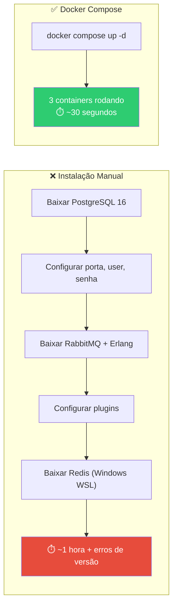
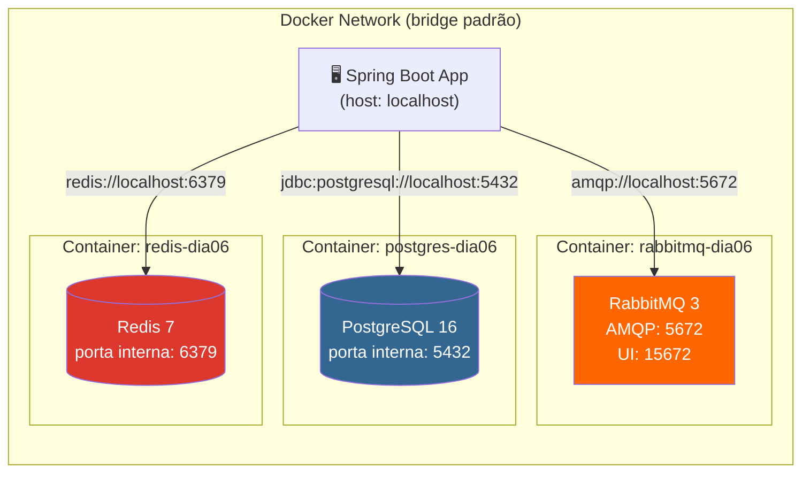
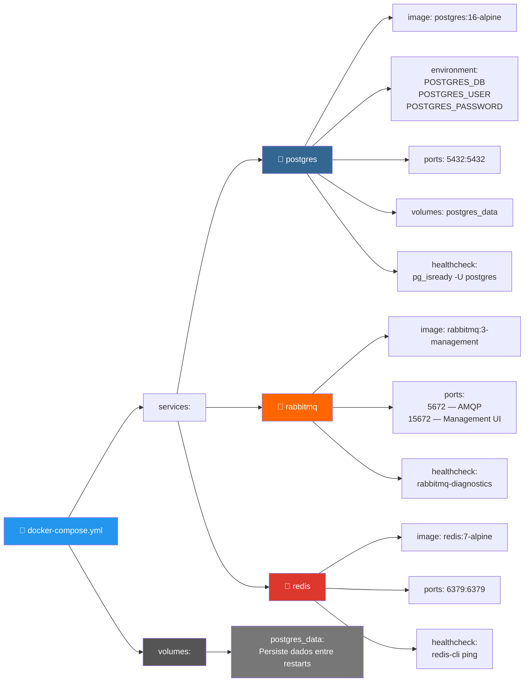
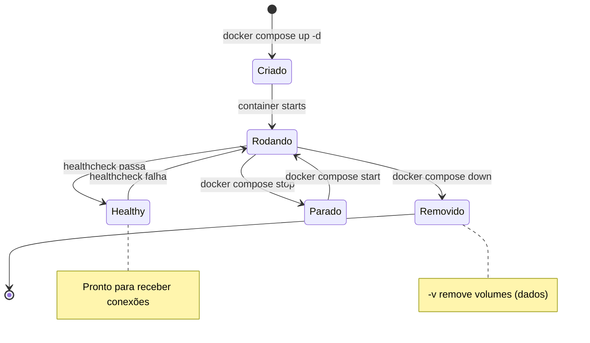
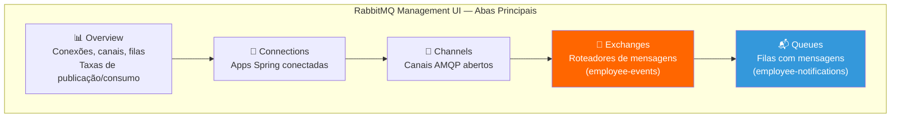
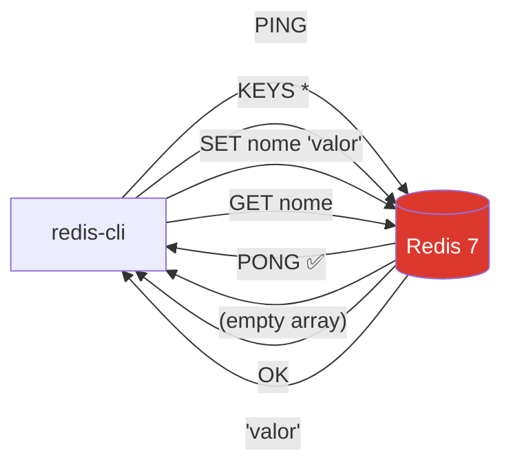
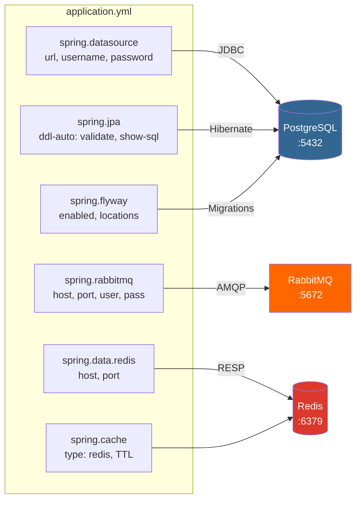

# Slide 2: Docker Compose — Setup do Ambiente

**Horário:** 09:15 - 09:45

---

## 🐳 Por que Docker Compose neste dia?

Hoje trabalhamos com **3 serviços de infraestrutura** que precisam rodar localmente:

| Serviço | Porta | Finalidade | Protocolo |
|---------|-------|-----------|-----------|
| **PostgreSQL** | 5432 | Banco de dados relacional (substituindo H2) | TCP/SQL |
| **RabbitMQ** | 5672 / 15672 | Message broker (filas assíncronas) | AMQP / HTTP |
| **Redis** | 6379 | Cache em memória (key-value) | RESP |

> Instalar tudo manualmente? **Não.** Um `docker compose up -d` e tudo sobe em 30 segundos.

### 🏗️ Container vs. Instalação Local



### 🌐 Rede dos Containers — Como se comunicam



> **Nota**: A aplicação Spring Boot roda no host (sua máquina) e se conecta aos containers via portas mapeadas (`ports:`). Dentro da rede Docker, containers se comunicam pelo nome do serviço.

---

## docker-compose.yml — Os 3 Serviços

```yaml
version: '3.8'

services:
  postgres:
    image: postgres:16-alpine
    container_name: postgres-dia06
    environment:
      POSTGRES_DB: employeedb
      POSTGRES_USER: postgres
      POSTGRES_PASSWORD: postgres
    ports:
      - "5432:5432"        # host:container
    volumes:
      - postgres_data:/var/lib/postgresql/data   # dados persistem entre restarts
    healthcheck:
      test: ["CMD-SHELL", "pg_isready -U postgres"]
      interval: 5s
      timeout: 5s
      retries: 5

  rabbitmq:
    image: rabbitmq:3-management-alpine
    container_name: rabbitmq-dia06
    environment:
      RABBITMQ_DEFAULT_USER: guest
      RABBITMQ_DEFAULT_PASS: guest
    ports:
      - "5672:5672"    # AMQP (protocolo de mensageria)
      - "15672:15672"  # Management UI (interface web)
    healthcheck:
      test: ["CMD", "rabbitmq-diagnostics", "check_running"]
      interval: 10s
      timeout: 10s
      retries: 5

  redis:
    image: redis:7-alpine
    container_name: redis-dia06
    ports:
      - "6379:6379"
    healthcheck:
      test: ["CMD", "redis-cli", "ping"]
      interval: 5s
      timeout: 5s
      retries: 5

volumes:
  postgres_data:      # Volume nomeado — dados sobrevivem a docker compose down
```

### Anatomia do docker-compose.yml



| Propriedade | O que faz | Exemplo |
|-------------|----------|---------|
| `image` | Imagem Docker Hub a usar | `postgres:16-alpine` (leve, ~80MB) |
| `container_name` | Nome do container (para `docker exec`) | `postgres-dia06` |
| `environment` | Variáveis de ambiente | `POSTGRES_DB=employeedb` |
| `ports` | Mapeamento host:container | `"5432:5432"` |
| `volumes` | Persistência de dados | `postgres_data:/var/lib/postgresql/data` |
| `healthcheck` | Verificação de saúde | Comando que retorna 0 se saudável |

---

## 🚀 Hands-on: Subindo os Containers

### Ciclo de Vida dos Containers



### Comandos Docker Compose Essenciais

| Comando | O que faz | Quando usar |
|---------|----------|-------------|
| `docker compose up -d` | Cria e inicia containers em background | Início do dia |
| `docker compose ps` | Lista containers e status | Verificar se tudo está up |
| `docker compose logs -f` | Mostra logs em tempo real | Debugar problemas |
| `docker compose stop` | Para containers (mantém dados) | Pausa rápida |
| `docker compose start` | Reinicia containers parados | Retomar trabalho |
| `docker compose down` | Remove containers (mantém volumes) | Fim do dia |
| `docker compose down -v` | Remove tudo, incluindo dados | Recomeçar do zero |
| `docker compose restart` | Para e inicia containers | Aplicar mudanças |

### Passo 1: Subir tudo

```bash
cd 06-persistence-messaging-demo
docker compose up -d
```

### Passo 2: Verificar status

```bash
docker compose ps
```

Saída esperada:
```
NAME               IMAGE                         STATUS
postgres-dia06     postgres:16-alpine            Up (healthy)
rabbitmq-dia06     rabbitmq:3-management-alpine  Up (healthy)
redis-dia06        redis:7-alpine                Up (healthy)
```

### Passo 3: Testar cada serviço

```bash
# PostgreSQL
docker exec -it postgres-dia06 psql -U postgres -d employeedb -c "SELECT 1"

# RabbitMQ — acessar http://localhost:15672 (guest/guest)

# Redis
docker exec -it redis-dia06 redis-cli ping
# Resposta: PONG
```

---

## 🔍 RabbitMQ Management UI

Acesse **http://localhost:15672** com `guest/guest`:



| Aba | O que mostra | O que observar |
|-----|-------------|----------------|
| **Overview** | Taxas de publicação/consumo, total de mensagens | Gráficos de Message rates |
| **Connections** | Aplicações Spring conectadas ao broker | Nome da app, IP, estado |
| **Channels** | Canais abertos por conexão | Prefetch count, consumers |
| **Exchanges** | Exchanges criados (employee-events, order-events) | Type: direct, bindings |
| **Queues** | Filas com contagem de mensagens pendentes | Ready, Unacked, Total |

> **Durante o exercício**: vocês verão as mensagens aparecendo na aba **Queues** em tempo real.

---

## Verificando o Redis via CLI

```bash
# Conectar ao Redis CLI dentro do container
docker exec -it redis-dia06 redis-cli

# Testar conexão
PING
# Resposta: PONG

# Listar todas as chaves (vazio no início)
KEYS *
# (empty array)

# Ver informações do servidor
INFO server
# redis_version:7.x.x
# os: Linux ...
```



---

## Configuração do application.yml

### Mapa de Conexões — Cada property conecta a um serviço



```yaml
spring:
  datasource:
    url: jdbc:postgresql://localhost:5432/employeedb
    username: postgres
    password: postgres
    driver-class-name: org.postgresql.Driver

  jpa:
    hibernate:
      ddl-auto: validate  # Flyway cuida do schema!
    show-sql: true
    properties:
      hibernate:
        format_sql: true

  rabbitmq:
    host: localhost
    port: 5672
    username: guest
    password: guest

  data:
    redis:
      host: localhost
      port: 6379

  cache:
    type: redis
    redis:
      time-to-live: 600000  # 10 minutos

  flyway:
    enabled: true
    locations: classpath:db/migration
```

---

## ⚠️ Troubleshooting

| Problema | Causa provável | Solução |
|----------|---------------|---------|
| `Connection refused` no PostgreSQL | Container não está rodando | `docker compose up -d` |
| Porta 5432 ocupada | Outro PostgreSQL rodando | `docker ps` e parar o outro container |
| RabbitMQ UI não abre | Porta 15672 não mapeada | Verificar `docker-compose.yml` |
| Redis `PONG` não responde | Container parado | `docker compose restart redis` |

```bash
# Comando útil: reiniciar tudo do zero
docker compose down -v && docker compose up -d
```

---

## ✅ Checklist de Verificação

Antes de prosseguir, confirme que todos os 3 serviços estão **healthy**:

- [ ] `docker compose ps` mostra 3 containers "Up (healthy)"
- [ ] PostgreSQL responde: `docker exec -it postgres-dia06 psql -U postgres -c "SELECT 1"`
- [ ] RabbitMQ UI acessível: http://localhost:15672
- [ ] Redis responde: `docker exec -it redis-dia06 redis-cli ping`

> **Tudo OK? Vamos para o conteúdo principal: o problema N+1!** 🚀
