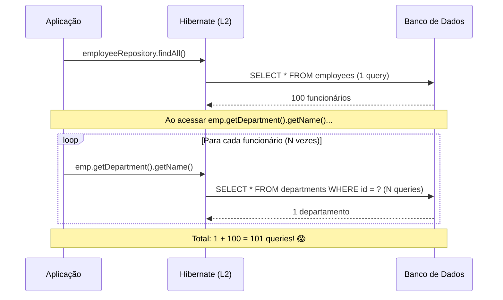
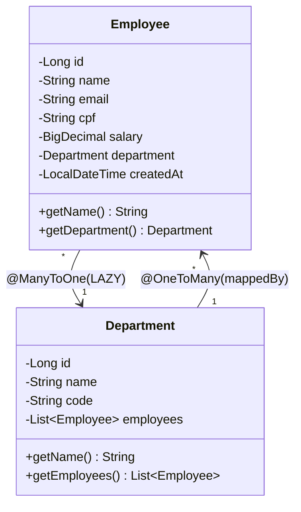
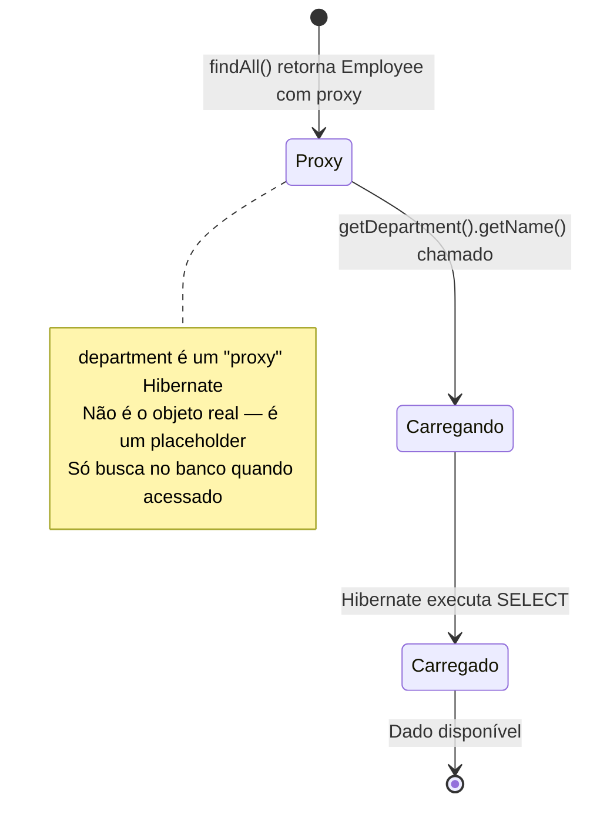
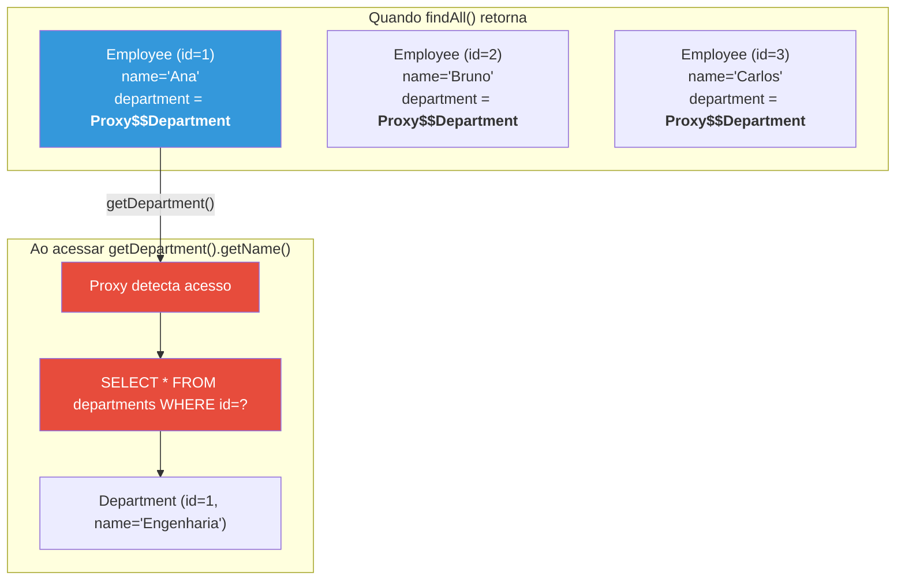
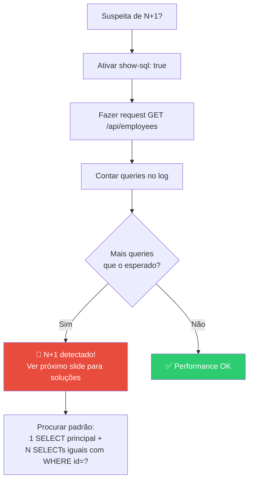
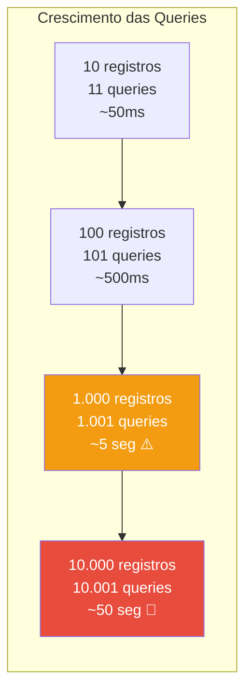
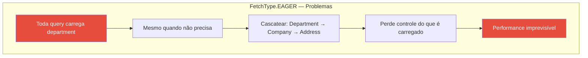
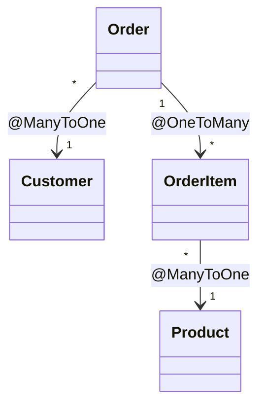
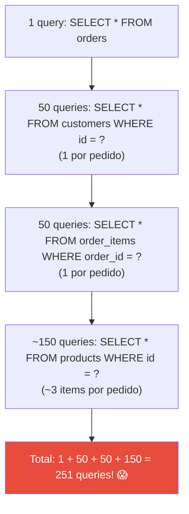

# Slide 3: JPA N+1 — O Problema e Diagnóstico

**Horário:** 09:45 - 10:15

---

## O que é o Problema N+1?

O problema N+1 é a **armadilha de performance mais comum do JPA/Hibernate**. Acontece quando uma query inicial gera N queries adicionais para carregar relacionamentos.



---

## 🧩 Modelo de Dados — Relacionamento Employee ↔ Department



> **@ManyToOne**: Vários funcionários pertencem a um departamento. O JPA cria a coluna `department_id` na tabela `employees`.

---

## Por que acontece? — Lazy Loading Explicado

O JPA usa **Lazy Loading** por padrão para `@ManyToOne` e `@OneToMany`. Isso significa que o relacionamento **só é carregado quando acessado**:



```java
@Entity
public class Employee {

    @Id
    @GeneratedValue(strategy = GenerationType.IDENTITY)
    private Long id;

    private String name;

    @ManyToOne(fetch = FetchType.LAZY)  // ← Padrão para @ManyToOne
    @JoinColumn(name = "department_id")
    private Department department;     // ← É um PROXY, não o objeto real!
}
```

### O que é um Proxy Hibernate?



> **Proxy**: O Hibernate cria uma subclasse da entity em tempo de execução. Quando você chama qualquer método nesse proxy, ele intercepta e faz o SELECT no banco. **Isso é transparente** — você não percebe que é um proxy até olhar os logs SQL.

### O código que causa N+1

```java
@GetMapping
public List<EmployeeResponse> findAll() {
    List<Employee> employees = employeeRepository.findAll(); // 1 query

    return employees.stream()
        .map(emp -> new EmployeeResponse(
            emp.getId(),
            emp.getName(),
            emp.getDepartment().getName()  // ← Cada chamada dispara 1 query!
        ))
        .toList();
}
```

---

## 🔍 Diagnosticando o N+1

### Como ver na prática

Ative os logs SQL no `application.yml`:

```yaml
spring:
  jpa:
    show-sql: true
    properties:
      hibernate:
        format_sql: true

# Opcional: ver parâmetros das queries (valores dos ?)
logging:
  level:
    org.hibernate.SQL: DEBUG
    org.hibernate.type.descriptor.sql.BasicBinder: TRACE
```

### Fluxo de diagnóstico



### O que aparece no log

```sql
-- Query 1: buscar todos os funcionários
Hibernate:
    select e1_0.id, e1_0.name, e1_0.email, e1_0.department_id
    from employees e1_0

-- Query 2: buscar departamento do funcionário 1
Hibernate:
    select d1_0.id, d1_0.name, d1_0.code
    from departments d1_0
    where d1_0.id = ?

-- Query 3: buscar departamento do funcionário 2
Hibernate:
    select d1_0.id, d1_0.name, d1_0.code
    from departments d1_0
    where d1_0.id = ?

-- ... repete para CADA funcionário!
```

---

## 📊 Impacto na Performance



| Funcionários | Queries sem N+1 | Queries com N+1 | Tempo estimado | Impacto |
|:---:|:---:|:---:|:---:|:---|
| 10 | 1 | 11 | ~50ms | Imperceptível |
| 100 | 1 | 101 | ~500ms | Lento para o usuário |
| 1.000 | 1 | 1.001 | ~5 segundos | API timeout, UX ruim |
| 10.000 | 1 | 10.001 | ~50 segundos | Indisponibilidade total |

> **Em produção**: uma API que deveria responder em 50ms pode levar 5 segundos com N+1 em tabelas grandes. Já vi isso causar **incidentes em produção** em empresas grandes.

---

## Quando o N+1 acontece?

| Cenário | Acontece N+1? | Por quê |
|---------|:---:|---------|
| `findAll()` + acesso ao relacionamento | ✅ | Lazy loading dispara query por registro |
| `findById()` + acesso ao relacionamento | ⚠️ | Apenas 1 query extra (1+1), menos grave |
| `findAll()` sem acessar relacionamento | ❌ | Lazy loading nunca é disparado |
| `findAll()` com `FetchType.EAGER` | ⚠️ | Carrega sempre, pode ser pior que lazy |
| JPQL com `JOIN FETCH` | ❌ | Relacionamento vem no JOIN |
| `@EntityGraph` | ❌ | Hibernate faz LEFT JOIN |

### A "solução" errada: `FetchType.EAGER`

```java
// ❌ NÃO faça isso!
@ManyToOne(fetch = FetchType.EAGER)
private Department department;
```



**Problemas do EAGER global**:
- Carrega o relacionamento **em todas as queries**, mesmo quando desnecessário
- Pode cascatear: Department → Company → Address → Country...
- Perde o controle de quais dados são carregados
- **N+1 continua existindo** (apenas muda de lazy para eager, mas as queries extras persistem em coleções)

> **Best practice**: Mantenha `LAZY` e use `JOIN FETCH` ou `@EntityGraph` **onde precisa**.

---

## 🧪 Exercício Mental

Dado o modelo:

```java
@Entity
public class Order {
    @ManyToOne private Customer customer;
    @OneToMany private List<OrderItem> items;
}

@Entity
public class OrderItem {
    @ManyToOne private Product product;
}
```



**Pergunta**: Quantas queries são geradas para listar 50 pedidos com customer, items e product?

<details>
<summary>🤔 Clique para ver a resposta</summary>



- 1 query para buscar 50 pedidos
- 50 queries para buscar o customer de cada pedido
- 50 queries para buscar items de cada pedido
- Para cada pedido com ~3 items: 150 queries para buscar products

**Total: 1 + 50 + 50 + 150 = 251 queries!** 😱

**Com JOIN FETCH**: apenas **1 query** com JOINs aninhados.

</details>

> **No próximo slide**: como resolver isso com JOIN FETCH e @EntityGraph.
