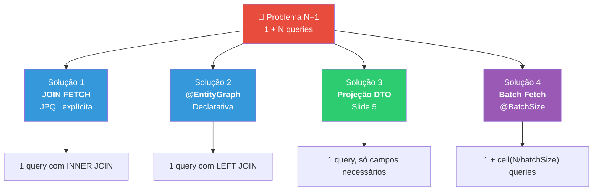
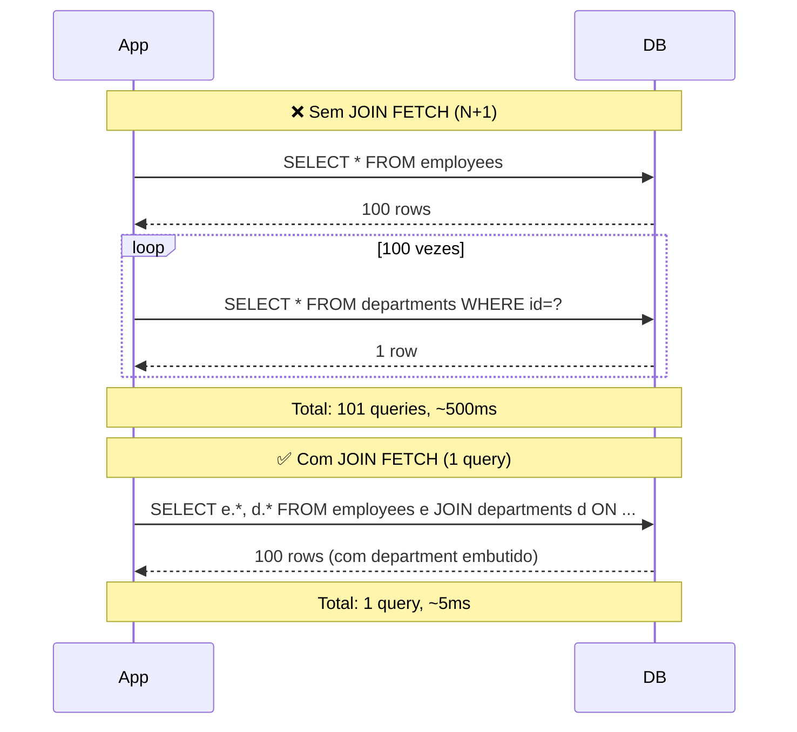
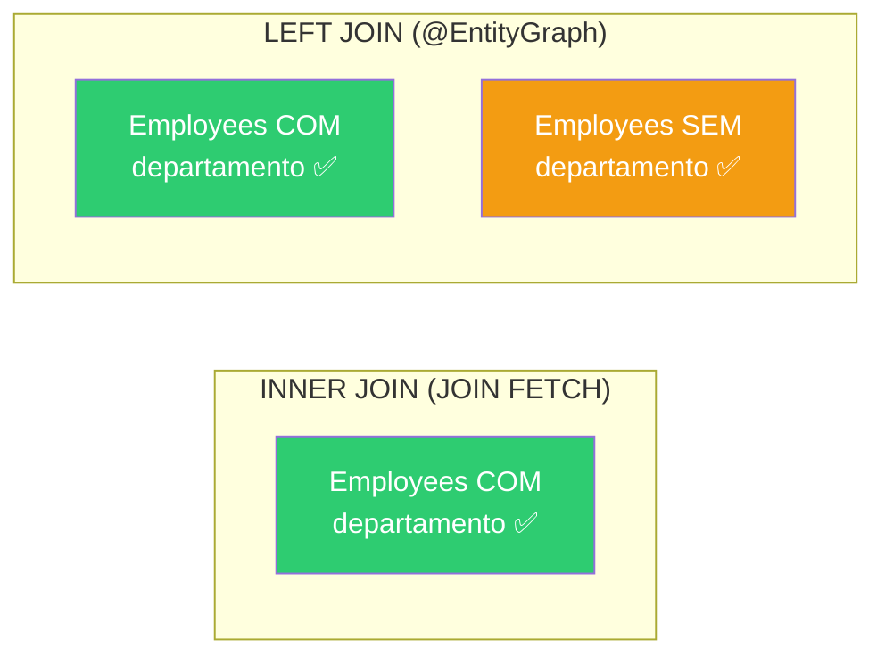
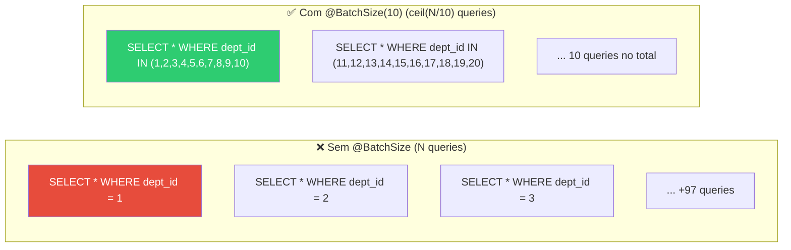
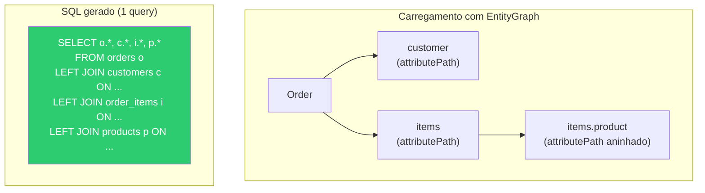
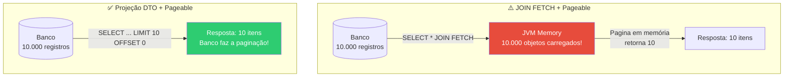
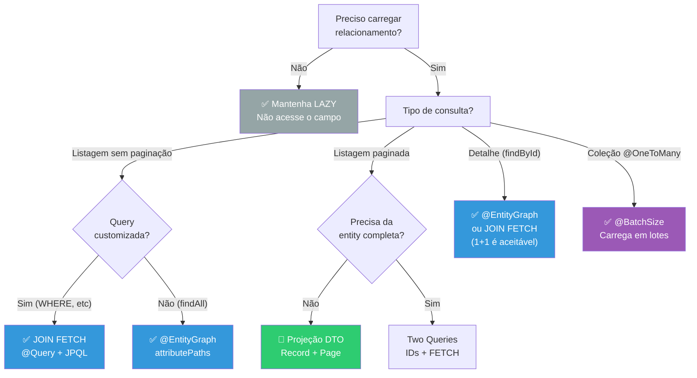

# Slide 4: JPA N+1 — Soluções (JOIN FETCH, @EntityGraph)

**Horário:** 10:15 - 10:45

---

## Visão Geral das Soluções



---

## Solução 1: JOIN FETCH na JPQL

O `JOIN FETCH` instrui o Hibernate a buscar o relacionamento **na mesma query**, usando um JOIN SQL.

```java
public interface EmployeeRepository extends JpaRepository<Employee, Long> {

    // ✅ Uma única query com JOIN
    @Query("SELECT e FROM Employee e JOIN FETCH e.department")
    List<Employee> findAllWithDepartment();
}
```

### SQL Gerado

```sql
-- UMA ÚNICA query com JOIN
SELECT e.id, e.name, e.email, e.salary,
       d.id, d.name, d.code
FROM employees e
INNER JOIN departments d ON e.department_id = d.id;
```

### Comparação Visual



---

## Solução 2: @EntityGraph

O `@EntityGraph` é uma forma **declarativa** de indicar quais relacionamentos carregar — sem escrever JPQL:

```java
public interface EmployeeRepository extends JpaRepository<Employee, Long> {

    // ✅ Mesmo resultado, sem JPQL
    @EntityGraph(attributePaths = {"department"})
    List<Employee> findAll();
}
```

### SQL Gerado (idêntico ao JOIN FETCH)

```sql
SELECT e.id, e.name, e.email, e.salary,
       d.id, d.name, d.code
FROM employees e
LEFT JOIN departments d ON e.department_id = d.id;
```

> **Diferença sutil**: `@EntityGraph` gera `LEFT JOIN` (inclui funcionários sem departamento), `JOIN FETCH` gera `INNER JOIN` por padrão.

### JOIN FETCH vs @EntityGraph — Tipo de JOIN



| Tipo de JOIN | Comportamento | Funcionários sem departamento |
|:---:|:---|:---:|
| `INNER JOIN` | Retorna apenas registros com match | ❌ Excluídos |
| `LEFT JOIN` | Retorna todos, com ou sem match | ✅ Incluídos (department = null) |

---

## Solução 3: @BatchSize (Batch Fetching)

Quando não pode usar JOIN FETCH (ex: coleções), o `@BatchSize` agrupa as queries lazy em lotes:

```java
@Entity
public class Department {

    @OneToMany(mappedBy = "department")
    @BatchSize(size = 10)   // ← Carrega 10 departamentos por vez
    private List<Employee> employees;
}
```



> **@BatchSize** não elimina todas as queries extras, mas reduz drasticamente de N para N/batch. Útil para `@OneToMany` em coleções.

---

## JOIN FETCH vs. @EntityGraph — Quando usar cada um?

| Aspecto | `JOIN FETCH` (JPQL) | `@EntityGraph` | `@BatchSize` |
|---------|:---:|:---:|:---:|
| Precisa de JPQL? | Sim | Não | Não |
| Tipo de JOIN | INNER (padrão) | LEFT (padrão) | N/A (lazy em lote) |
| Condições extras na query | ✅ Sim (WHERE, ORDER BY) | ⚠️ Limitado | ❌ Não |
| Múltiplos relacionamentos | ✅ `JOIN FETCH a JOIN FETCH b` | ✅ `{"a", "b"}` | ✅ Separado por entidade |
| Combinável com query methods | ❌ | ✅ `findByNameContaining` | ✅ Na entidade |
| Legibilidade | JPQL pode ficar longo | Mais limpo | Mais simples |
| Melhor para | Queries customizadas | Queries derivadas | Coleções @OneToMany |

### Exemplo com múltiplos relacionamentos

```java
// JOIN FETCH — múltiplos
@Query("SELECT o FROM Order o " +
       "JOIN FETCH o.customer " +
       "JOIN FETCH o.items i " +
       "JOIN FETCH i.product")
List<Order> findAllWithDetails();

// @EntityGraph — múltiplos
@EntityGraph(attributePaths = {"customer", "items", "items.product"})
List<Order> findAll();
```



---

## ⚠️ Cuidado: JOIN FETCH com Paginação

**JOIN FETCH + Pageable NÃO funciona bem** — o Hibernate carrega tudo em memória para paginar:

```java
// ⚠️ Alerta! Hibernate carrega TUDO e pagina em memória
@Query("SELECT e FROM Employee e JOIN FETCH e.department")
Page<Employee> findAllWithDepartment(Pageable pageable);
```

Log de aviso:
```
HHH90003004: firstResult/maxResults specified with collection fetch; applying in memory
```



### Soluções para paginação + relacionamento

**Opção 1**: Usar `@EntityGraph` com query method (funciona com Pageable)

```java
@EntityGraph(attributePaths = {"department"})
Page<Employee> findAll(Pageable pageable);
```

**Opção 2**: Usar **Projeção DTO** (próximo slide) — a melhor opção para listagens

```java
@Query("SELECT new com.example.dto.EmployeeSummary(e.id, e.name, d.name) " +
       "FROM Employee e JOIN e.department d")
Page<EmployeeSummary> findAllSummaries(Pageable pageable);
```

**Opção 3**: Duas queries (IDs paginados + fetch pelos IDs)

```java
// Query 1: buscar IDs paginados (leve, paginação no banco)
@Query("SELECT e.id FROM Employee e")
Page<Long> findAllIds(Pageable pageable);

// Query 2: buscar entidades completas pelos IDs (JOIN FETCH ok com lista)
@Query("SELECT e FROM Employee e JOIN FETCH e.department WHERE e.id IN :ids")
List<Employee> findAllByIdIn(@Param("ids") List<Long> ids);
```

---

## 🎯 Árvore de Decisão — Qual Solução Usar?



### Checklist de Performance JPA

- [ ] `spring.jpa.show-sql=true` ativado em dev (para detectar N+1)
- [ ] Todos os `@ManyToOne` e `@OneToMany` com `FetchType.LAZY`
- [ ] Listagens usam `JOIN FETCH` ou `@EntityGraph`
- [ ] Paginação usa `Pageable` + Projeção DTO
- [ ] Nenhuma query desnecessária nos logs
- [ ] `@BatchSize` configurado para coleções grandes

### Resumo em uma frase

| Solução | Quando | SQL |
|---------|--------|-----|
| **JOIN FETCH** | Query customizada sem paginação | `INNER JOIN` |
| **@EntityGraph** | Query derivada (findAll, findBy...) | `LEFT JOIN` |
| **Projeção DTO** | Listagem paginada (melhor prática) | `SELECT campos` |
| **@BatchSize** | Coleções @OneToMany | `WHERE id IN (...)` |
| **Two Queries** | Paginação + entity completa | 2 queries separadas |

> **Próximo**: Projeções DTO e Paginação — carregando apenas o necessário!
